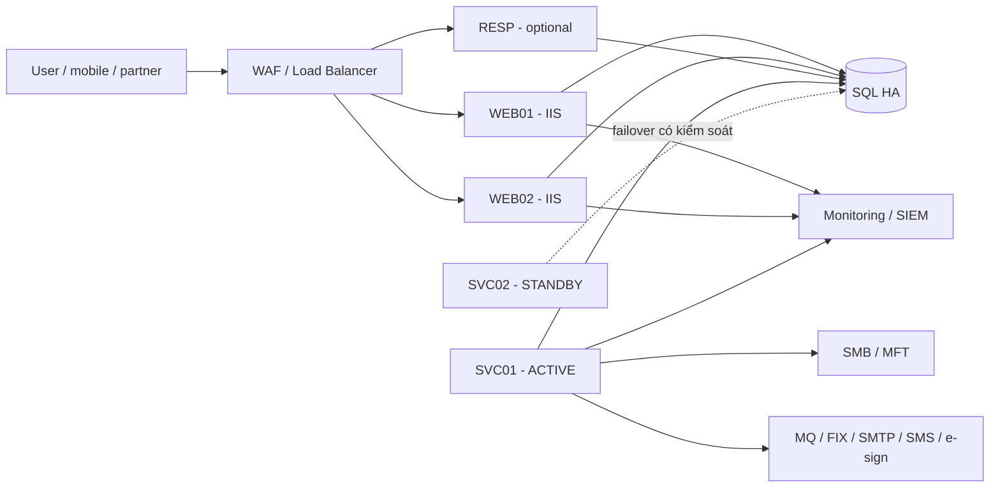

# Hướng dẫn triển khai Production VieFUND — Runbook từng bước

> **Mục tiêu:** giúp Release, Infrastructure, DBA, Integration và Operations triển khai toàn bộ VieFUND theo một trình tự duy nhất, từ tiếp nhận release đến mở traffic và bàn giao.
>
> **Cách thực hiện:** chạy lần lượt **P0 → P8**. Cuối mỗi phase có checkpoint `PASS` hoặc `STOP`. Không bỏ qua checkpoint và không chuyển phase khi còn mục `BLOCKED` thuộc phạm vi release.
>
> **Ranh giới:** build/package được thực hiện trên build agent theo [Phụ lục A](#appendix-a), không build trên Production. Luồng Production bắt đầu từ một release package đã được ký và kiểm tra.

## 1. Quy tắc vận hành

1. Mọi hostname, port, path, account, certificate, artifact và config ID phải lấy từ change ticket, CMDB hoặc signed manifest. Không tự đoán giá trị.
2. Không ghi password, token, private key hoặc connection string vào tài liệu, Git, transcript hay ticket. Chỉ ghi vault reference/version và kết quả `PASS/FAIL`.
3. Chỉ triển khai artifact nằm trong signed release manifest. Thiếu artifact, thừa file hoặc sai hash đều phải `STOP`.
4. WEB01 được triển khai và kiểm tra trước WEB02. SVC ACTIVE được kích hoạt từng service; SVC STANDBY luôn `Stopped + Disabled`.
5. Không bật SQL Agent job, poller, MQ, FIX, Fundserv hoặc external producer trước phase P6.
6. Không blind retry, replay, purge queue, xóa QuickFIX FileStore hoặc reset sequence khi chưa đối soát.
7. Mỗi phase phải lưu evidence ID; không lưu secret value trong evidence.

## 2. Kết quả cuối cùng

| Nhóm | Kết quả bắt buộc |
|---|---|
| Database | `VieFUND`, `VieFUNDTMP`, `VieFUNDDoc` online, đúng schema release và có backup/restore evidence. |
| Web quản trị | WebApp hoạt động qua HTTPS, login và phân quyền đúng. |
| Portal | MyPortfolio SPA tải được, login được và gọi MyPortfolio API thành công. |
| API/SSO | API health/smoke pass; SSO login, callback, expiry và logout pass. |
| Web services | Chỉ endpoint còn hợp đồng được publish; auth, verb và request limit đúng manifest. |
| Windows services | Đúng 11 service; account, EXE, mode và ACTIVE/STANDBY đúng. |
| Tích hợp | Fundserv, MQ, FIX, SMTP, SMS, e-sign và Fundata có canary được đối soát đúng một lần. |
| RESP/mobile | Chỉ triển khai khi blocker đã đóng và component được đánh dấu `IN_SCOPE`. |
| Vận hành | Monitoring, alert, backup, rollback set, evidence và on-call handover đầy đủ. |

## 3. Topology tham chiếu



Nếu Production thực tế khác sơ đồ này, cập nhật component manifest và topology trong change ticket trước P0. Không tự suy ra topology từ source code.

---

# P0 — Khóa phạm vi và quyết định Go/No-Go

**Owner:** Release Manager.  
**Mục tiêu:** xác định chính xác release gồm những gì, chạy ở đâu và ai chịu trách nhiệm.

## P0.1. Điền phiếu triển khai

Không tiếp tục nếu một giá trị thuộc scope còn trống.

| Giá trị | Giá trị/ID đã duyệt |
|---|---|
| Change/release | `<CHANGE_ID>`, `<RELEASE_VERSION>`, `<COMMIT_SHA>` |
| Release package | `<RELEASE_ROOT>`, `<RELEASE_MANIFEST_ID>` |
| Config/toolchain | `<CONFIG_MANIFEST_ID>`, `<TOOLCHAIN_MANIFEST_ID>` |
| Trusted release verifier | absolute path, version/hash và trust policy ID; nằm ngoài release đang được verify |
| Deployment automation | relative path + SHA-256 + interface/exit-code contract cho config applier/validator và IIS planner/applier |
| Validation automation | relative path + SHA-256 + synthetic dataset ID cho E2E runner |
| Database package | exact baseline, migration, permissions và assertion paths/hashes |
| Component runbooks | signed RESP/mobile rollout + rollback runbook IDs khi component `IN_SCOPE` |
| Recovery | `<RECOVERY_SET_ID>`, `<SCHEMA_COMPATIBILITY_ID>` |
| Nodes | `<WEB01>`, `<WEB02>`, `<SVC_ACTIVE>`, `<SVC_STANDBY>` |
| Public names | `<ADMIN_FQDN>`, `<PORTAL_FQDN>`, `<SSO_FQDN>`, `<SERVICES_FQDN>` |
| SQL | `<SQL_FQDN>`, `<SQL_PORT>`, 3 database mappings |
| Paths | `<APP_INSTALL_ROOT>`, `<SERVICE_INSTALL_ROOT>`, `<VIEFUND_SHARE_ROOT>` |
| Runtime identities | `<GMSA_WEB>`, `<GMSA_API>`, `<GMSA_SSO>`, `<GMSA_WEBSERVICES>`, `<GMSA_SVC>` |
| Certificates | thumbprint cho Admin, Portal, SSO và Services |
| Integrations | Fundserv, MQ, FIX và external integration config IDs |
| Rollout | stage, abort threshold, observation window |
| Approvers | Release, Infrastructure, DBA, Security, Integration, Business, Operations |

## P0.2. Khóa component matrix

Không xóa dòng. Ghi một trong ba trạng thái: `IN_SCOPE`, `OUT_OF_SCOPE`, `BLOCKED`.

| Component | Trạng thái | Artifact hoặc package |
|---|---|---|
| VieFUND databases | `IN_SCOPE` | approved baseline + normalized migration + permissions |
| WebApp back-office | `IN_SCOPE` | `legacy-web/WebApp.zip` |
| MyPortfolio SPA/API | `IN_SCOPE` | `platform/VieFUND-<version>.zip` |
| SSOLoginPortal | `IN_SCOPE` | `legacy-web/SSOLoginPortal.zip` |
| WebClient legacy | `<DECIDE>` | `legacy-web/WebClient.zip` |
| FirmKit/brand bundle | `<DECIDE>` | signed FirmKit artifact |
| VMobile | `<DECIDE>` | `web-services/VMobile.zip` |
| VieFUNDExport WS | `<DECIDE>` | `web-services/VieFUNDExportWS.zip` |
| VieDOCS | `<DECIDE>` | `web-services/VieDOCS.zip` |
| VExport | `<DECIDE>` | `web-services/VExport.zip` |
| V3PartySOO | `<DECIDE>` | `web-services/V3PartySOO.zip` |
| OnBoarding | `<DECIDE>` | `web-services/OnBoarding.zip` |
| Root WebServices endpoints | `<DECIDE>` | trusted `RootWebServices.zip` |
| VClient/VCApp | `<DECIDE>` | trusted `VClient-VCApp.zip` |
| 11 Windows services | `IN_SCOPE` | 11 folders dưới `services/` |
| RESP | `BLOCKED` cho tới khi remediation pass | signed immutable image digest + `<RESP_ROLLOUT_ROLLBACK_RUNBOOK_ID>` |
| Mobile flavors | `BLOCKED` cho tới khi SDK/flavor gate pass | signed AAB/IPA + `<MOBILE_ROLLOUT_ROLLBACK_RUNBOOK_ID>` |

`BLOCKED` chỉ được chuyển thành `IN_SCOPE` khi có artifact, owner, config contract và smoke test được duyệt. Nếu component không triển khai trong release này, phải ghi `OUT_OF_SCOPE` kèm approval ID.

## P0.3. Xác nhận RecoverySet

RecoverySet phải liên kết cùng một cutoff/version cho:

- artifact N và N-1;
- schema/backup của cả ba database;
- file-share snapshot;
- Registry/config và vault secret versions;
- MQ queue baseline và QuickFIX FileStore/sequence state;
- IIS/service state trước change.

DBA phải xác nhận N-1 binary tương thích schema mới hoặc có restore/down-migration plan đã rehearsal.

## P0.4. Mở change bridge và freeze

1. Ghi giờ bắt đầu và người điều phối.
2. Freeze deployment khác trên WEB/SVC/SQL nodes.
3. Xác nhận backup gần nhất và quyền truy cập rollback artifact.
4. Xác nhận partner window cho MQ, FIX, Fundserv và MFT.
5. Xác nhận runtime identities không phải LocalSystem.

### Checkpoint P0

`PASS` khi component matrix không còn `<DECIDE>`, mọi component `IN_SCOPE` có artifact owner/smoke test/runbook, mọi tool có exact path/version/digest/interface, RecoverySet hợp lệ và đủ approver.  
`STOP` nếu thiếu scope decision, trusted verifier, deployment/validation automation, DB package, rollback plan, production value hoặc owner.

---

# P1 — Tiếp nhận và kiểm tra release

**Owner:** Release Engineering + Security.  
**Mục tiêu:** chứng minh release staging chỉ chứa artifact đã ký, đúng version và đủ toàn bộ component trong scope.

## P1.1. Kiểm tra cấu trúc staging

```text
<RELEASE_ROOT>\
  manifests\
    RELEASE-MANIFEST.json
    RELEASE-MANIFEST.sig
    TOOLCHAIN-MANIFEST.json
    TOOLCHAIN-MANIFEST.sig
    SHA256SUMS.csv
    config\...
    recovery\...
  tools\
    config\Apply-ProductionConfig.ps1
    iis\Plan-ProductionIis.ps1
    iis\Apply-ProductionIis.ps1
    validation\Invoke-VieFundE2E.ps1
  platform\VieFUND-<version>.zip
  legacy-web\WebApp.zip
  legacy-web\SSOLoginPortal.zip
  legacy-web\WebClient.zip                  # khi IN_SCOPE
  web-services\*.zip                       # chỉ component IN_SCOPE
  services\                                # đúng 11 bundle
  database\
    baseline\BASELINE-MANIFEST.json
    migrations\Apply-VieFundRelease.sql
    migrations\MIGRATION-MANIFEST.json
    permissions\Apply-VieFundPermissions.sql
    assertions\Assert-VieFundRelease.sql
  resp\image-digest.txt                    # khi IN_SCOPE
  mobile\...                               # khi IN_SCOPE
```

Không dùng EXE/DLL/ZIP lấy trực tiếp từ committed `bin`, máy developer hoặc thư mục Production cũ.

## P1.2. Xác minh release

1. Xác minh chữ ký `RELEASE-MANIFEST.json` bằng trust policy độc lập.
2. Xác minh chữ ký `TOOLCHAIN-MANIFEST.json`.
3. So hash toolchain manifest và `SHA256SUMS.csv` với signed release manifest.
4. So SHA-256 của từng artifact.
5. So file set với allowlist: không thiếu và không có file ngoài manifest.
6. So release version/commit với P0.

Trusted verifier phải được cài từ enterprise trust store **trước** khi nhận release, không lấy executable verifier từ chính release đang kiểm tra. P0 phải ghi exact path, version/hash, trust policy và interface dưới đây:

```powershell
$ErrorActionPreference = 'Stop'
$ReleaseRoot = '<RELEASE_ROOT>'
$Verifier = '<TRUSTED_RELEASE_VERIFIER_PATH>'
$ExpectedVerifierHash = '<TRUSTED_RELEASE_VERIFIER_SHA256>'
if (-not (Test-Path -LiteralPath $Verifier -PathType Leaf)) { throw 'Missing trusted release verifier' }
if ((Get-FileHash -LiteralPath $Verifier -Algorithm SHA256).Hash -ne $ExpectedVerifierHash) {
    throw 'Trusted release verifier hash mismatch'
}
& $Verifier `
    -ReleaseRoot $ReleaseRoot `
    -TrustPolicy '<RELEASE_SIGNING_POLICY_ID>' `
    -ExpectedVersion '<RELEASE_VERSION>' `
    -ExpectedCommit '<COMMIT_SHA>' `
    -FailOnMissing `
    -FailOnExtra
if ($LASTEXITCODE -ne 0) { throw 'Release verification FAILED' }
'Release verification: PASS'
```

Không có trusted verifier/interface nêu tại P0 hoặc verifier không trả non-zero khi sai → `STOP`; không kiểm thủ công rồi bỏ qua.

## P1.3. Kiểm tra release evidence

Release manifest phải dẫn tới evidence `PASS` cho:

- clean build trên pinned toolchain;
- unit/integration test theo release policy;
- secret scan trên checkout, reachable history và extracted artifacts;
- SCA/SBOM và security exceptions;
- artifact signing;
- credential incident closure và rotation nếu có;
- DB migration rehearsal;
- compatibility matrix cho API/VCApp/mobile còn được hỗ trợ;
- exact relative path, SHA-256, command interface và expected exit codes cho config applier/validator, IIS planner/applier và E2E runner;
- signed RESP/mobile rollout + rollback runbook khi component tương ứng `IN_SCOPE`.

Sau khi release signature đã pass, resolve từng tool **chỉ** theo exact relative path dưới `tools\...` trong signed release manifest và canonical tree P1.1, so hash rồi chạy `-Help`/contract check ở chế độ không thay đổi. Không chấp nhận duplicate copy dưới `manifests\tools` hoặc path khác. Tool thiếu, sai hash hoặc không hỗ trợ fail-fast interface → `STOP`.

## P1.4. Kiểm tra đúng 11 service bundles

```powershell
$Expected = @(
  'VieFUNDDoc','VieFUNDDocuSign','VieFUNDEFT','VieFUNDEmail',
  'VieFUNDeSignority','VieFUNDExport','VieFUNDFF','VieFUNDIE',
  'VieFUNDMQ','VieFUNDQFix','VieFUNDReport'
)
$Actual = @(Get-ChildItem '<RELEASE_ROOT>\services' -Directory | Select-Object -ExpandProperty Name)
$Missing = @($Expected | Where-Object { $_ -notin $Actual })
$Extra = @($Actual | Where-Object { $_ -notin $Expected })
if ($Missing.Count -or $Extra.Count) {
    throw "Service bundle mismatch. Missing=$($Missing -join ','); Extra=$($Extra -join ',')"
}
'11 service bundles: PASS'
```

Bundle `VieFUNDExport` phải chứa `VieFUNDFileExport.exe` và không được chứa stale `VieFUNDExport.exe`.

### Checkpoint P1

`PASS` khi signature/hash/file-set đúng, release evidence pass và artifact inventory khớp component matrix.  
`STOP` nếu dùng placeholder artifact, thiếu packager/evidence, có secret finding chưa đóng hoặc component `BLOCKED` vẫn nằm trong scope.

---

# P2 — Chuẩn bị Production prerequisites

**Owner:** Infrastructure.  
**Mục tiêu:** chuẩn bị nodes, identities, network, storage, certificates và monitoring trước khi thay database/application.

## P2.1. Xác nhận trạng thái ban đầu

1. WEB01/WEB02 đang healthy; ghi baseline health/traffic của cả hai node.
2. Drain WEB01 khỏi LB, chờ active requests/sessions đạt ngưỡng quiescence và giữ drained cho tới khi P2.2 trên WEB01 pass.
3. Không thay Windows feature/runtime trên WEB02 trước khi WEB02 được drain ở rolling step P2.2.
4. Mọi VieFUND service trên SVC STANDBY là `Stopped + Disabled`.
5. Producer/scheduler hiện tại vẫn chạy trên ACTIVE cho tới P3 freeze.
6. Monitoring và log collector nhận log từ tất cả nodes.
7. Đồng hồ hệ thống đồng bộ; DNS resolution đúng.

## P2.2. Chuẩn bị WEB01/WEB02 theo rolling sequence

Chỉ chạy trên node **đã drain**. Cài đúng Windows features từ toolchain manifest:

```powershell
$ErrorActionPreference = 'Stop'
$Result = Install-WindowsFeature `
  Web-Server,Web-Default-Doc,Web-Static-Content,Web-Http-Errors,Web-Http-Logging, `
  Web-Request-Monitor,Web-Filtering,Web-Windows-Auth,Web-Stat-Compression, `
  Web-Dyn-Compression,Web-Net-Ext45,Web-Asp-Net45,Web-ISAPI-Ext, `
  Web-ISAPI-Filter,Web-Mgmt-Console,NET-Framework-45-Features,NET-WCF-HTTP-Activation45 `
  -IncludeManagementTools
if (-not $Result.Success) { throw 'Windows feature installation FAILED' }
if ($Result.RestartNeeded -eq 'Yes') {
    throw 'RESTART REQUIRED: keep node drained, perform approved reboot, then rerun P2.2 and health checks'
}
'Windows features installed; no pending feature restart: PASS'
```

Cài URL Rewrite, VC++ runtime, .NET runtime và monitoring agent đúng version/hash trong toolchain manifest. Không tải `latest` trong change window.

Rolling order bắt buộc:

1. WEB01 đã drain → install prerequisites → nếu cần thì approved reboot trong khi vẫn drained → rerun checks → node-level health pass.
2. Chỉ rejoin WEB01 theo Infrastructure approval; xác nhận WEB01 nhận traffic bình thường trước khi đụng WEB02.
3. Drain WEB02, chờ quiescence → install cùng versions/hashes → approved reboot nếu cần → rerun checks → node-level health pass.
4. Rejoin WEB02 nếu P3 chưa bắt đầu. Khi bắt đầu P3, drain lại **cả hai** node theo P3.1.
5. Lưu feature/runtime versions, reboot evidence và health result cho từng node. Không bao giờ thay prerequisite đồng thời trên cả hai WEB nodes.

## P2.3. Chuẩn bị SVC nodes và kiểm tra gMSA trên đúng host

Trên SVC ACTIVE/STANDBY:

1. Cài .NET Framework/runtime theo BOM.
2. Cài IBM MQ client đúng version/bitness.
3. Cài QuickFIX runtime/dictionary, PDF/report/font dependencies.
4. Không cài Microsoft Office để automation server-side.

Cài Windows feature/module `RSAT-AD-PowerShell` theo infrastructure policy trước khi chạy lệnh AD. Dùng ma trận sau; không kiểm identity của host này trên host khác rồi coi là đạt:

| Hosts | gMSA phải `Test-ADServiceAccount = True` |
|---|---|
| WEB01, WEB02 | `<GMSA_WEB>`, `<GMSA_API>`, `<GMSA_SSO>`, `<GMSA_WEBSERVICES>` |
| SVC ACTIVE, SVC STANDBY | `<GMSA_SVC>` |
| RESP runtime nodes | identity trong signed RESP runbook khi `IN_SCOPE` |

Chạy trên **từng host** với đúng danh sách của dòng tương ứng:

```powershell
$ErrorActionPreference = 'Stop'
Import-Module ActiveDirectory -ErrorAction Stop
$GmsaNamesForThisHost = @('<GMSA_SHORT_NAME_1>','<GMSA_SHORT_NAME_N>') | Select-Object -Unique
foreach ($Name in $GmsaNamesForThisHost) {
    Install-ADServiceAccount -Identity $Name -ErrorAction Stop
    if (-not (Test-ADServiceAccount -Identity $Name)) { throw "gMSA unavailable on this host: $Name" }
}
'gMSA host matrix: PASS'
```

## P2.4. Tạo local directories

```powershell
$Folders = @(
  '<APP_INSTALL_ROOT>\Releases',
  '<SERVICE_INSTALL_ROOT>\Releases',
  '<LOCAL_LOG_ROOT>',
  '<LOCAL_TEMP_ROOT>',
  'C:\Out'
)
foreach ($Folder in $Folders) {
    New-Item -ItemType Directory -Path $Folder -Force -ErrorAction Stop | Out-Null
}
```

`C:\Out` được giữ vì legacy logger sử dụng path này. Chỉ runtime identity cần thiết có `Modify`; application/service install root chỉ có `Read & Execute`.

## P2.5. Kiểm tra network và storage bằng runtime identity

| Nguồn | Đích | Kiểm tra |
|---|---|---|
| WEB/SVC/RESP | SQL listener | TCP `<SQL_PORT>` |
| SVC | SMB/MFT | required folders và read/write/move |
| SVC MQ | MQ | TCP + TLS/channel auth |
| SVC FIX | counterparty | TCP trong partner window |
| SVC Email | SMTP relay | TLS port |
| WEB/SVC | integrations | HTTPS qua egress allowlist |
| Tất cả nodes | SIEM/metrics | collector qua TLS |

Required share layout:

```text
<VIEFUND_SHARE_ROOT>\
  Documents\In | Imported | Skipped
  Fundserv\Inbound | Imported | Error | Skipped | Upload | GICUpload | OmnibusUpload
  Exports
  Reports
  QuickFixStore
  QuickFixLog
```

Không dùng mapped drive. Cấp Share + NTFS theo từng gMSA/folder.

## P2.6. Certificates

1. Import certificate vào `Cert:\LocalMachine\My`.
2. Private key non-exportable nếu nền tảng hỗ trợ.
3. Cấp `Read` private key cho đúng gMSA.
4. Kiểm hostname, chain, revocation và hạn dùng vượt observation window.
5. Không đặt PFX/password trong release ZIP.

### Checkpoint P2

`PASS` khi rolling drain/install/reboot/health evidence hoàn tất cho từng WEB node và runtime/tool version, gMSA, DNS/firewall, share, certificate, monitoring probes đều đạt trên cả hai WEB/SVC nodes.  
`STOP` nếu thay đổi node chưa drain, còn pending restart, node-level health chưa pass, probe chỉ pass bằng admin nhưng fail bằng runtime identity, có broad ACL, certificate sai hoặc ACTIVE/STANDBY chưa rõ.

---

# P3 — Database và configuration

**Owner:** DBA + Security/Infrastructure.  
**Mục tiêu:** đưa data/schema/config về đúng release trong khi traffic, writers và jobs vẫn bị giữ.

## P3.1. Freeze writers và tạo recovery point

1. Drain **WEB01 và WEB02** cùng mọi ingress có thể tạo transaction; chờ active requests/sessions đạt ngưỡng quiescence trong change plan.
2. Stop VieFUND producer/poller/scheduler trên ACTIVE theo change plan.
3. Xác nhận STANDBY vẫn `Stopped + Disabled`.
4. Xác nhận compatibility matrix cho phép old/new binary cùng thấy target schema trong thời gian cutover; nếu không, giữ cả hai WEB nodes drained tới khi P4 hoàn tất.
5. Chụp trạng thái service, IIS, SQL Agent jobs, MQ depth và FIX sequence.
6. Lấy tail-log/snapshot theo DBA plan và gắn vào `<RECOVERY_SET_ID>`.

Không sang bước tiếp theo nếu còn writer không được nhận diện.

## P3.2. Restore hoặc validate ba database

| Database | Greenfield | Upgrade |
|---|---|---|
| `VieFUND` | Restore approved baseline/chain | Validate current schema + backup |
| `VieFUNDTMP` | Restore approved baseline/chain | Validate current schema + backup |
| `VieFUNDDoc` | Restore approved baseline/chain | Validate current schema + backup |

DBA phải chạy `RESTORE VERIFYONLY ... WITH CHECKSUM`, rehearsal restore và dùng `RESTORE FILELISTONLY` để tạo đủ `MOVE` cho mọi data/log file. Không trộn backup từ RecoverySet khác nhau.

## P3.3. Chạy normalized migration package

Không chạy trực tiếp các monolithic source script `000_2`–`000_9` trên Production. Chỉ chạy signed normalized package đã rehearsal:

```powershell
$ErrorActionPreference = 'Stop'
$Migration = Join-Path '<RELEASE_ROOT>' 'database\migrations\Apply-VieFundRelease.sql'
if (-not (Test-Path -LiteralPath $Migration -PathType Leaf)) { throw 'Missing normalized migration package' }
& sqlcmd `
  -S 'tcp:<SQL_FQDN>,<SQL_PORT>' `
  -d '<TARGET_DATABASE_FROM_MIGRATION_MANIFEST>' `
  -E -b -r 1 `
  -i $Migration `
  -o '<REDACTED_EVIDENCE_LOG_PATH>'
if ($LASTEXITCODE -ne 0) { throw 'Database migration FAILED; keep traffic and writers stopped' }
```

Chạy đúng ordered targets/variables trong `database\migrations\MIGRATION-MANIFEST.json`; không tự chạy cùng script trên cả ba DB nếu manifest không chỉ định.

Thứ tự package:

1. base schema delta;
2. UDF delta;
3. stored procedures;
4. `dbo.UBSessionCleanup`;
5. dealer/API configuration data;
6. email notification procedure;
7. message/index optimization;
8. SQL Agent jobs, tạo ở trạng thái `disabled`.

Normalized DBA package là owner duy nhất của `dbo.UBSessionCleanup` và job `VieFUND Session Cleanup`. Application installer không được tạo/sửa chúng.

## P3.4. Apply permissions

1. Migration identity tách khỏi runtime identity và chỉ có quyền JIT.
2. Chạy exact signed package `database\permissions\Apply-VieFundPermissions.sql`; script phải tạo login/user/role idempotent và fail khi identifier ngoài allowlist.
3. Runtime account không có `sysadmin`, `db_owner` hoặc DDL.
4. RESP runtime account không được tạo `RA_ClientDraft` trong request path.

## P3.5. Assert database state

DBA phải chạy `database\assertions\Assert-VieFundRelease.sql` bằng `sqlcmd -b` và chỉ ghi `PASS/FAIL`, sau đó xác nhận:

- cả ba DB `ONLINE`;
- schema version/object hash khớp migration manifest;
- migration ledger đủ;
- `dbo.UBSessionCleanup` tồn tại;
- `RA_ClientDraft` tồn tại nếu RESP `IN_SCOPE`;
- SQL Agent jobs đúng owner/database/command/schedule và vẫn disabled;
- users/roles không orphaned;
- HA/AG state đạt policy.

## P3.6. Inject Registry/vault/config

1. Tạo Registry64 keys và ACL trước khi ghi value.
2. Runtime gMSA chỉ có `ReadKey`; SYSTEM/Administrators/JIT deployment identity theo security policy.
3. Lấy DB/JWT/SSO secrets qua vault no-echo API bằng immutable version.
4. WEB01, WEB02 và SSO runtime nodes phải dùng cùng JWT/SSO secret versions.
5. Không dùng installer `-Force`; không cho installer tự generate/rotate secret.
6. Chạy approved config validator ở chế độ không output secret.
7. So fingerprint trong memory giữa nodes và chỉ ghi `PASS/FAIL`.

Required config contract:

| Config | Source |
|---|---|
| Database selector/connection | nonsecret selector + vault DB secret reference |
| JWT/SSO | immutable vault references/versions |
| URLs/ports/limits | signed environment config manifest |
| Certificates | approved thumbprint manifest |
| MQ/FIX/Fundserv/e-sign | signed integration config + vault refs |

Chạy exact signed tool đã verify ở P1 trên từng WEB/SVC/SSO runtime node:

```powershell
$ConfigApplier = Join-Path '<RELEASE_ROOT>' 'tools\config\Apply-ProductionConfig.ps1'
& $ConfigApplier `
  -Phase NodePrerequisites `
  -ManifestPath '<SIGNED_CONFIG_MANIFEST_PATH>' `
  -NodeName $env:COMPUTERNAME `
  -FailIfMissing `
  -NoSecretOutput
if ($LASTEXITCODE -ne 0) { throw 'Node Registry/vault/config apply FAILED' }
```

Tool phải validate exact Registry64 key/value contract, ACL và cross-node immutable secret versions nhưng chỉ output `PASS/FAIL`. Thiếu tool/config contract hoặc tool có thể auto-generate secret → `STOP`; không tự tạo key/value dựa trên phỏng đoán.

### Checkpoint P3

`PASS` khi ba DB đúng schema, jobs disabled, least privilege đạt, config không còn placeholder và secret versions nhất quán giữa nodes.  
`STOP` nếu migration chưa rehearsal, job đã tự bật, installer có thể sinh secret, runtime có DDL hoặc RecoverySet không còn coherent.

---

# P4 — Triển khai Web, API, SSO và Web Services

**Owner:** Release Engineering + Infrastructure.  
**Mục tiêu:** triển khai WEB01 rồi WEB02 bằng cùng artifact/config khi cả hai vẫn được kiểm soát khỏi traffic.

## P4.1. Stage platform trên WEB01 trong thư mục sạch

1. Xác nhận **cả WEB01 và WEB02 vẫn drained** từ P3; WEB01 không còn active request cần giữ.
2. Tạo stage/version directories mới. Nếu path đã tồn tại, `STOP`; không extract chồng lên lần chạy trước.
3. Dùng platform ZIP như artifact container, không dùng installer wrapper để thay Production desired state.

```powershell
$ErrorActionPreference = 'Stop'
$Version = '<RELEASE_VERSION>'
$Package = '<RELEASE_ROOT>\platform\VieFUND-<RELEASE_VERSION>.zip'
$Stage = "<APP_INSTALL_ROOT>\Stages\$Version\Platform"
$VersionRoot = "<APP_INSTALL_ROOT>\Releases\$Version"
if (-not (Test-Path -LiteralPath $Package -PathType Leaf)) { throw 'Missing platform package' }
if (Test-Path -LiteralPath $Stage) { throw "Stage already exists: $Stage" }
if (Test-Path -LiteralPath $VersionRoot) { throw "Release version directory already exists: $VersionRoot" }
New-Item -ItemType Directory -Path $Stage -ErrorAction Stop | Out-Null
New-Item -ItemType Directory -Path $VersionRoot -ErrorAction Stop | Out-Null
Expand-Archive -LiteralPath $Package -DestinationPath $Stage

$PlatformBundles = @(
  @{ Source=(Join-Path $Stage 'bundles\MyPortfolio.zip');    Destination=(Join-Path $VersionRoot 'MyPortfolio') },
  @{ Source=(Join-Path $Stage 'bundles\MyPortfolioAPI.zip'); Destination=(Join-Path $VersionRoot 'MyPortfolioAPI') }
)
foreach ($Bundle in $PlatformBundles) {
    if (-not (Test-Path -LiteralPath $Bundle.Source -PathType Leaf)) { throw "Missing bundle: $($Bundle.Source)" }
    if (Test-Path -LiteralPath $Bundle.Destination) { throw "Destination already exists: $($Bundle.Destination)" }
    Expand-Archive -LiteralPath $Bundle.Source -DestinationPath $Bundle.Destination
}
'Platform extracted to clean version directories: PASS'
```

4. So exact file set và hash của hai extracted bundles với signed component manifest trước khi apply config.
5. **Không chạy `VieFUND-Setup.ps1` trên Production:** wrapper tự chọn default/custom manifest, dùng registry install state và có thể extract đè để lại stale files.
6. **Không chạy `Install-MyPortfolioApi.ps1` trên Production:** script hiện có thể tự sinh JWT/SSO secrets/defaults và quản lý session objects. P3 config/DB packages là sole owners; missing value phải `STOP`, không được auto-generate.

Repo installer chỉ phù hợp làm cơ sở cho build/dev hoặc môi trường đã có quy trình riêng; nó không phải Production desired-state applier của runbook này.

## P4.2. Stage WebApp, SSO, FirmKit và web services trong scope

Extract từng signed ZIP vào một destination mới dưới `<APP_INSTALL_ROOT>\Releases\<RELEASE_VERSION>`. Destination đã tồn tại → `STOP`; không extract đè và không trộn output hai release.

| IIS site/application | Artifact | Pool/identity |
|---|---|---|
| Admin root | `WebApp.zip` | `VieFUND-WebApp` / `<GMSA_WEB>` |
| Portal `/MyPortfolio` | platform SPA | `VieFUND-MyPortfolio` / `<GMSA_WEB>` |
| Portal `/MyPortfolio/api` | platform API | `VieFUND-MyPortfolioAPI` / `<GMSA_API>` |
| Portal `/MyPortfolio/firmkit` | exact signed `FirmKit.zip`, khi `IN_SCOPE` | Portal site; read-only static content |
| SSO root | `SSOLoginPortal.zip` | `VieFUND-SSOLoginPortal` / `<GMSA_SSO>` |
| Services children | các ZIP `IN_SCOPE` | `VieFUND-WebServices` / `<GMSA_WEBSERVICES>` |
| Legacy WebClient | chỉ khi `IN_SCOPE` | pool/identity theo signed manifest |
| VClient/VCApp | chỉ khi `IN_SCOPE` | `/VClient/VCApp.asmx` |

Với mỗi component:

1. Kiểm provenance/digest và exact archive file set.
2. Extract vào empty version directory.
3. Apply Production transform từ signed config manifest.
4. Assert `debug=false` và không còn `<...>`, `__...__`, `#{...}#` trong deployed config values.
5. Cấp install root `Read & Execute`; chỉ log/upload/temp folders có `Modify`.
6. Ghi component → physical path → artifact digest vào evidence.

SSO, từng web service, Root WebServices và VCApp chỉ được stage khi release manifest có canonical packager/provenance, archive layout, Production transform và smoke definition. Thiếu một mục → component phải `OUT_OF_SCOPE` hoặc release `STOP`.

## P4.3. Apply config và IIS bằng cùng signed manifest

Release package phải cung cấp đúng các signed tools sau và P1 đã verify hash/interface:

```text
<RELEASE_ROOT>\tools\config\Apply-ProductionConfig.ps1
<RELEASE_ROOT>\tools\iis\Plan-ProductionIis.ps1
<RELEASE_ROOT>\tools\iis\Apply-ProductionIis.ps1
```

Signed Production IIS manifest phải mô tả đầy đủ sites/applications, physical paths, pools, CLR/bitness, gMSA, HTTPS bindings, exact certificate thumbprints, auth, verbs, limits và ACL. Default platform manifest không đáp ứng contract này.

```powershell
$ErrorActionPreference = 'Stop'
$ReleaseRoot = '<RELEASE_ROOT>'
$ConfigManifest = '<SIGNED_CONFIG_MANIFEST_PATH>'
$IisManifest = '<SIGNED_PRODUCTION_IIS_MANIFEST_PATH>'
$ConfigApplier = Join-Path $ReleaseRoot 'tools\config\Apply-ProductionConfig.ps1'
$IisPlanner = Join-Path $ReleaseRoot 'tools\iis\Plan-ProductionIis.ps1'
$IisApplier = Join-Path $ReleaseRoot 'tools\iis\Apply-ProductionIis.ps1'

foreach ($Tool in @($ConfigApplier,$IisPlanner,$IisApplier)) {
    if (-not (Test-Path -LiteralPath $Tool -PathType Leaf)) { throw "Missing signed tool: $Tool" }
}
$IisManifestHash = (Get-FileHash -LiteralPath $IisManifest -Algorithm SHA256).Hash

& $ConfigApplier `
  -Phase ApplicationFiles `
  -ManifestPath $ConfigManifest `
  -ReleaseRoot $ReleaseRoot `
  -NodeName $env:COMPUTERNAME `
  -FailIfMissing `
  -NoSecretOutput
if ($LASTEXITCODE -ne 0) { throw 'Production config apply FAILED' }

& $IisPlanner `
  -ManifestPath $IisManifest `
  -ReleaseRoot $ReleaseRoot `
  -NodeName $env:COMPUTERNAME `
  -FailOnUnmanagedDrift
if ($LASTEXITCODE -ne 0) { throw 'Production IIS plan FAILED' }

# Sau khi operator review plan và đúng approver ghi approval ID:
& $IisApplier `
  -ManifestPath $IisManifest `
  -ReleaseRoot $ReleaseRoot `
  -NodeName $env:COMPUTERNAME `
  -RequireManifestSha256 $IisManifestHash `
  -FailOnUnmanagedDrift
if ($LASTEXITCODE -ne 0) { throw 'Production IIS apply FAILED' }
if ((Get-FileHash -LiteralPath $IisManifest -Algorithm SHA256).Hash -ne $IisManifestHash) {
    throw 'IIS manifest changed between plan and apply'
}
'Config and IIS desired-state apply: PASS'
```

Các tool trên phải fail nếu config/secret thiếu; không được tự generate/rotate secret. Không dùng `-UseRegistryState`, default platform planner hoặc ad-hoc IIS commands để override signed manifest.

## P4.4. Assert IIS desired state

| Kiểm tra | Kết quả bắt buộc |
|---|---|
| Bindings | HTTPS-only; không còn HTTP binding |
| Certificate | exact approved thumbprint, hostname/chain/revocation hợp lệ |
| Pools | đúng CLR/bitness và đúng gMSA |
| Paths | trỏ đúng `<RELEASE_VERSION>` |
| Authentication | Admin Windows auth; Portal/SSO/API/Services theo signed policy |
| Verbs | explicit allowlist; không TRACE; `OPTIONS` chỉ khi CORS policy yêu cầu |
| Limits | WAF/IIS/ASP.NET/application limits nhất quán |
| ACL | không broad write; upload/temp/log ngoài webroot |
| Config | no debug, localhost, trust bypass hoặc unresolved placeholder |

## P4.5. Smoke WEB01 trực tiếp

Dùng internal node routing/host override, chưa đưa WEB01 vào LB.

1. WebApp: login synthetic account, đúng role; cross-tenant bị chặn.
2. MyPortfolio: tải SPA, login và gọi API health/safe read.
3. FirmKit `IN_SCOPE`: `/MyPortfolio/firmkit` trả đúng signed brand asset/version; không silently skip khi bundle thiếu.
4. SSO: redirect, callback, issuer/audience/expiry, logout và replay rejection.
5. Mỗi web service `IN_SCOPE`: authenticated non-side-effect operation.
6. OnBoarding: malformed/DTD/oversized request bị chặn.
7. VCApp: route/auth/schema tương thích supported mobile versions nếu `IN_SCOPE`.
8. Kiểm Application/IIS logs: không binding, ACL, config hoặc secret leak error.

Endpoint smoke cụ thể phải lấy từ component manifest; không coi `?WSDL` là đủ nếu operation thực tế không chạy.

## P4.6. Drain và lặp lại trên WEB02

1. Xác nhận WEB02 vẫn drained; chờ active connections/session quiescence và ghi evidence. Nếu node đã vô tình rejoin LB, drain lại trước khi chạm file/path.
2. Giữ WEB01 ngoài LB hoặc ở maintenance pool theo rollout plan; không để old/new binary phục vụ lẫn khi schema compatibility không cho phép.
3. Lặp P4.1–P4.5 trên WEB02 bằng đúng cùng artifact digest, manifests, tool versions và config/secret versions.
4. So artifact/config/secret-version fingerprints giữa WEB01 và WEB02.
5. Hai node khác fingerprint → `STOP` và không mở LB.

## P4.7. RESP — chỉ khi `IN_SCOPE`

RESP chỉ được triển khai khi release evidence chứng minh:

- supported .NET LTS và image pin digest;
- non-root/read-only root filesystem;
- canonical `RA_ClientDraft` migration, runtime không DDL;
- `/health/live` và `/health/ready` thực sự tồn tại;
- DB TLS `Encrypt=True;TrustServerCertificate=False`;
- config/secrets được externalize;
- session strategy đã duyệt;
- Linux/native dependency compatibility pass.

Signed RESP runbook ID từ P0 phải ghi rõ orchestrator, cluster/namespace, service account, registry, immutable image digest, secret bindings, replica strategy, rollout/abort thresholds và previous digest rollback. Chạy chính runbook đó để deploy **một replica ban đầu**, rồi kiểm liveness/readiness và synthetic draft create/read/delete. Ghi deployed digest và namespace vào evidence.

Thiếu signed RESP rollout/rollback runbook hoặc bất kỳ gate nào ở trên → giữ `BLOCKED`/`OUT_OF_SCOPE`; không chuyển sang `IN_SCOPE` và không deploy image cũ.

### Checkpoint P4

`PASS` khi WEB01/WEB02 dùng cùng artifact/config, IIS desired state đạt và mọi component web `IN_SCOPE` smoke pass; RESP pass nếu thuộc scope.  
`STOP` nếu còn HTTP, sai certificate/gMSA/path, config placeholder, health route giả định hoặc hai node khác fingerprint.

---

# P5 — Cài đúng 11 Windows Services và giữ stopped

**Owner:** Release Engineering + Operations.  
**Mục tiêu:** cài/repoint cùng 11 service bundles trên ACTIVE và STANDBY nhưng chưa tạo external side effect.

## P5.1. Canonical service inventory

| Unit | Canonical EXE | Windows Service Name |
|---|---|---|
| VieFUNDDoc | `VieFUNDDoc.exe` | `VieFUND Doc Service` |
| VieFUNDDocuSign | `VieFUNDDocuSign.exe` | `VieFUND DocuSign Service` |
| VieFUNDEFT | `VieFUNDEFT.exe` | `VieFUND EFT Service` |
| VieFUNDEmail | `VieFUNDEmail.exe` | `VieFUND Email Service` |
| VieFUNDeSignority | `VieFUNDeSignority.exe` | `VieFUND eSignority Service` |
| VieFUNDExport | `VieFUNDFileExport.exe` | `VieFUND File Export Service` |
| VieFUNDFF | `VieFUNDFF.exe` | `VieFUND Fund Fact Service` |
| VieFUNDIE | `VieFundIE.exe` | `VieFund IE Service` |
| VieFUNDMQ | `VieFUNDMQ.exe` | `VieFUND MQ Service` |
| VieFUNDQFix | `VieFUNDQFix.exe` | `VieFUND QFix Service` |
| VieFUNDReport | `VieFundReport.exe` | `VieFUND Report Service` |

## P5.2. Cài hoặc nâng cấp trên từng SVC node

Chạy script dưới đây bằng **64-bit Windows PowerShell 5.1** đã pin trong toolchain contract, một lần trên ACTIVE với `ACTIVE`, sau đó trên STANDBY với `STANDBY`. Native `sc.exe` argument form, gồm blank gMSA password, phải có compatibility evidence trên đúng PowerShell/OS build; môi trường khác → `STOP` và dùng signed service desired-state tool. Script phân biệt first install và upgrade; không gọi `InstallUtil` lại cho service đã tồn tại.

```powershell
$ErrorActionPreference = 'Stop'
$NodeRole = '<ACTIVE_OR_STANDBY>'
if ($NodeRole -notin @('ACTIVE','STANDBY')) { throw 'NodeRole must be ACTIVE or STANDBY' }

$Version = '<RELEASE_VERSION>'
$ArtifactRoot = '<RELEASE_ROOT>\services'
$InstallRoot = "<SERVICE_INSTALL_ROOT>\Releases\$Version"
$Gmsa = '<GMSA_SVC>'
$InstallUtil = "$env:WINDIR\Microsoft.NET\Framework64\v4.0.30319\InstallUtil.exe"
$Sc = "$env:WINDIR\System32\sc.exe"

$Units = [ordered]@{
  VieFUNDDoc        = @{ Exe='VieFUNDDoc.exe';        Name='VieFUND Doc Service' }
  VieFUNDDocuSign   = @{ Exe='VieFUNDDocuSign.exe';   Name='VieFUND DocuSign Service' }
  VieFUNDEFT        = @{ Exe='VieFUNDEFT.exe';        Name='VieFUND EFT Service' }
  VieFUNDEmail      = @{ Exe='VieFUNDEmail.exe';      Name='VieFUND Email Service' }
  VieFUNDeSignority = @{ Exe='VieFUNDeSignority.exe'; Name='VieFUND eSignority Service' }
  VieFUNDExport     = @{ Exe='VieFUNDFileExport.exe'; Name='VieFUND File Export Service' }
  VieFUNDFF         = @{ Exe='VieFUNDFF.exe';         Name='VieFUND Fund Fact Service' }
  VieFUNDIE         = @{ Exe='VieFundIE.exe';         Name='VieFund IE Service' }
  VieFUNDMQ         = @{ Exe='VieFUNDMQ.exe';         Name='VieFUND MQ Service' }
  VieFUNDQFix       = @{ Exe='VieFUNDQFix.exe';       Name='VieFUND QFix Service' }
  VieFUNDReport     = @{ Exe='VieFundReport.exe';     Name='VieFUND Report Service' }
}

if (Test-Path -LiteralPath $InstallRoot) { throw "Service release directory already exists: $InstallRoot" }
New-Item -ItemType Directory -Path $InstallRoot -ErrorAction Stop | Out-Null
foreach ($Key in $Units.Keys) {
    $Unit = $Units[$Key]
    $Source = Join-Path $ArtifactRoot $Key
    $Destination = Join-Path $InstallRoot $Key
    if (-not (Test-Path $Source -PathType Container)) { throw "Missing bundle: $Key" }
    if (Test-Path $Destination) { throw "Version directory already exists: $Destination" }
    New-Item -ItemType Directory -Path $Destination -ErrorAction Stop | Out-Null
    Copy-Item (Join-Path $Source '*') $Destination -Recurse -Force -ErrorAction Stop

    $Exe = Join-Path $Destination $Unit.Exe
    if (-not (Test-Path $Exe -PathType Leaf)) { throw "Missing canonical EXE: $Key" }
    if ($Key -eq 'VieFUNDExport' -and (Test-Path (Join-Path $Destination 'VieFUNDExport.exe'))) {
        throw 'Stale VieFUNDExport.exe found'
    }

    $Existing = Get-Service -Name $Unit.Name -ErrorAction SilentlyContinue
    if ($Existing) {
        if ($Existing.Status -ne 'Stopped') {
            Stop-Service -Name $Unit.Name -Force -ErrorAction Stop
            $Existing.WaitForStatus('Stopped',[TimeSpan]::FromSeconds(60))
        }
        & $Sc @('config',$Unit.Name,'binPath=',"`"$Exe`"")
    } else {
        & $InstallUtil @('/LogToConsole=true',$Exe)
    }
    if ($LASTEXITCODE -ne 0) { throw "Install/repoint FAILED: $($Unit.Name)" }

    $StartMode = if ($NodeRole -eq 'STANDBY') { 'disabled' } else { 'demand' }
    & $Sc @('config',$Unit.Name,'start=',$StartMode)
    if ($LASTEXITCODE -ne 0) { throw "Start mode FAILED: $($Unit.Name)" }
    & $Sc @('config',$Unit.Name,'obj=',$Gmsa,'password=','')
    if ($LASTEXITCODE -ne 0) { throw "gMSA config FAILED: $($Unit.Name)" }

    $Actual = Get-CimInstance Win32_Service -Filter "Name='$($Unit.Name.Replace("'","''"))'"
    $ExpectedMode = if ($NodeRole -eq 'STANDBY') { 'Disabled' } else { 'Manual' }
    if ($Actual.State -ne 'Stopped' -or $Actual.StartMode -ne $ExpectedMode -or $Actual.StartName -ne $Gmsa) {
        throw "Service assertion FAILED: $($Unit.Name)"
    }
}
'11 services installed/repointed and stopped: PASS'
```

## P5.3. ACL và config checks

1. Service install root: gMSA có `Read & Execute`, không có broad write.
2. Chỉ folder cần ghi mới có `Modify`: `C:\Out`, document, Fundserv, exports, reports, QuickFIX store/log.
3. `.exe.config`, dictionary, template và dependent DLL phải nằm trong signed bundle.
4. Không còn localhost/test endpoint/unresolved placeholder.
5. ACTIVE: đúng 11 services `Manual + Stopped`.
6. STANDBY: đúng 11 services `Disabled + Stopped`.
7. Không service nào chạy LocalSystem.

## P5.4. So installed service set với exact allowlist

Chạy trên cả ACTIVE và STANDBY. Không chỉ kiểm 11 expected names; phải phát hiện stale alias/service thứ 12:

```powershell
$CanonicalNames = @(
  'VieFUND Doc Service','VieFUND DocuSign Service','VieFUND EFT Service',
  'VieFUND Email Service','VieFUND eSignority Service','VieFUND File Export Service',
  'VieFUND Fund Fact Service','VieFund IE Service','VieFUND MQ Service',
  'VieFUND QFix Service','VieFUND Report Service'
)
$Candidates = @(Get-CimInstance Win32_Service | Where-Object {
    $_.Name -like 'VieFUND*' -or $_.PathName -like '*<SERVICE_INSTALL_ROOT>*'
})
$ActualNames = @($Candidates.Name | Sort-Object -Unique)
$Missing = @($CanonicalNames | Where-Object { $_ -notin $ActualNames })
$Extra = @($ActualNames | Where-Object { $_ -notin $CanonicalNames })
if ($Missing.Count -or $Extra.Count -or $ActualNames.Count -ne 11) {
    throw "Installed service mismatch. Missing=$($Missing -join ','); Extra=$($Extra -join ',')"
}
'Exact installed 11-service allowlist: PASS'
```

Obsolete service phải giữ stopped/disabled và chỉ remove theo approval riêng trước P6; runbook không tự xóa service.

### Checkpoint P5

`PASS` khi đúng 11 canonical services trên cả hai nodes, path trỏ release mới, account/ACL/config đúng và tất cả vẫn stopped.  
`STOP` nếu thiếu/thừa service, có stale Export EXE, service tự start, LocalSystem, sai node role hoặc config chưa resolved.

---

# P6 — Kích hoạt có kiểm soát và đối soát integrations

**Owner:** Operations + Integration + DBA.  
**Mục tiêu:** chỉ bật một producer tại một thời điểm trong chế độ canary, chứng minh side effect xảy ra đúng một lần và vẫn giữ real traffic/channels ở trạng thái hold đến P7.

## P6.1. Quy tắc cho mỗi service/integration

Thực hiện cùng một vòng lặp:

1. Xác nhận queue/gateway/input folder đang hold hoặc canary-only.
2. Ghi baseline: DB state, queue depth, file count, sequence/correlation state.
3. Start đúng một service trên ACTIVE.
4. Quan sát service state, Application log và System/SCM log.
5. Gửi một canary allowlisted.
6. Đối soát bằng business key/correlation ID.
7. Chỉ chuyển service tiếp theo khi canary đúng một lần và state về baseline mong đợi.
8. Khi fail: stop service, giữ evidence và mở incident. Không tự replay/reset.

Generic start gate:

```powershell
$ErrorActionPreference = 'Stop'
$Name = '<APPROVED_SERVICE_NAME>'
$CanonicalNames = @(
  'VieFUND Doc Service','VieFUND DocuSign Service','VieFUND EFT Service',
  'VieFUND Email Service','VieFUND eSignority Service','VieFUND File Export Service',
  'VieFUND Fund Fact Service','VieFund IE Service','VieFUND MQ Service',
  'VieFUND QFix Service','VieFUND Report Service'
)
if ($env:COMPUTERNAME -ine '<SVC_ACTIVE_HOSTNAME>') { throw 'Service start is allowed only on approved ACTIVE host' }
if ($Name -notin $CanonicalNames) { throw "Service is outside canonical allowlist: $Name" }

# Fail closed when event logs cannot be read.
$null = Get-WinEvent -ListLog Application -ErrorAction Stop
$null = Get-WinEvent -ListLog System -ErrorAction Stop
$Started = Get-Date
Start-Service -Name $Name -ErrorAction Stop
(Get-Service $Name -ErrorAction Stop).WaitForStatus('Running',[TimeSpan]::FromSeconds(60))
Start-Sleep -Seconds ([int]'<POST_START_OBSERVATION_SECONDS>')

$Service = Get-Service $Name -ErrorAction Stop
$Cim = Get-CimInstance Win32_Service -Filter "Name='$($Name.Replace("'","''"))'" -ErrorAction Stop
if ($Service.Status -ne 'Running' -or $Cim.State -ne 'Running' -or $Cim.StartName -ne '<GMSA_SVC>') {
    Stop-Service $Name -Force -ErrorAction SilentlyContinue
    throw "$Name is not Running under approved gMSA after observation"
}

function Get-EventsChecked {
    param([Parameter(Mandatory)][hashtable]$Filter)
    try {
        return @(Get-WinEvent -FilterHashtable $Filter -ErrorAction Stop)
    } catch {
        # No matching events is a valid empty result; every other query/read error fails closed.
        if ($_.FullyQualifiedErrorId -like 'NoMatchingEventsFound*') { return @() }
        throw
    }
}

$ApplicationErrors = @(Get-EventsChecked -Filter @{
  LogName='Application'; StartTime=$Started; Level=2
} | Where-Object {
  $_.ProviderName -eq $Name -or $_.Message -like "*$Name*"
})
$ScmErrors = @(Get-EventsChecked -Filter @{
  LogName='System'; ProviderName='Service Control Manager'; StartTime=$Started; Level=2
} | Where-Object { $_.Message -like "*$Name*" })
if ($ApplicationErrors.Count -or $ScmErrors.Count) {
    Stop-Service $Name -Force -ErrorAction Stop
    throw "Application/SCM error after starting $Name"
}
if ($env:COMPUTERNAME -ine '<SVC_ACTIVE_HOSTNAME>' -or $Name -notin $CanonicalNames) {
    Stop-Service $Name -Force -ErrorAction Stop
    throw 'ACTIVE host/canonical allowlist changed during observation'
}
"$Name start/state/account/event-log gate: PASS"
```

## P6.2. Thứ tự activation

| Thứ tự | Component | Canary/đối soát |
|---:|---|---|
| 1 | Doc, Report, Fund Fact | synthetic document/report/fund output; hash/path/ACL đúng |
| 2 | Email, DocuSign, Signority | một recipient/envelope allowlisted; không duplicate |
| 3 | EFT, File Export | synthetic instruction/export; DB/file state đúng một lần |
| 4 | SQL Agent jobs | assert owner/DB/command/schedule; chạy controlled validation nếu safe, sau đó giữ disabled tới P7 trừ job được signed policy cho phép enable sớm |
| 5 | MQ | một approved message; correlation đúng; queue trở về baseline |
| 6 | QuickFIX | logon/heartbeat/sequence đúng; canary được counterparty xác nhận |
| 7 | VieFUNDIE/Fundserv | một batch canary cuối cùng; ACK/archive/DB state đúng |

`VieFUND Session Cleanup` chỉ được DBA enable sau Web/API smoke và chỉ khi job definition khớp migration manifest. Job có thể xử lý real data hoặc tạo external side effect phải giữ disabled đến bước mở channel ở P7.

## P6.3. Integration-specific gates

### Fundserv/MFT

- paths, filename/encoding/hash và run window đúng manifest;
- atomic handoff, ACK và archive hoạt động;
- local file creation không được coi là delivery success;
- không resend khi chưa đối soát DB + gateway + partner ACK.

### IBM MQ

- client version/bitness đúng BOM;
- queue manager/channel/queue/TLS/cipher/peer đúng signed config;
- TCP/TLS và channel authorization pass;
- không purge queue.

### QuickFIX

- `ResetOnLogon=N`, `ResetOnLogout=N`, `ResetOnDisconnect=N`;
- dictionary/store/log paths là absolute approved paths;
- giữ persistent FileStore;
- sequence mismatch → stop và liên hệ counterparty; không reset.

### SMTP/SMS/e-sign/Fundata

- tenant/sender/endpoint/template/callback đúng signed config;
- credential chỉ lấy qua vault reference;
- canary dùng synthetic allowlisted recipient/data;
- callback, audit và final DB state đúng một lần.

## P6.4. Ghi trạng thái hold sau canary

Trước khi rời P6, lưu state cho từng channel. Không có trạng thái ngầm định:

| Channel | State bắt buộc cuối P6 | Thao tác mở tại P7 | Thao tác re-hold khi fail |
|---|---|---|---|
| LB/WAF | drained/maintenance | add WEB node theo rollout stage | drain node |
| Fundserv/MFT folders | hold hoặc canary-only | release approved inbound window | close gateway + stop IE |
| MQ | canary-only/consumer hold theo contract | release consumer/producer | hold channel + stop MQ service |
| FIX | approved canary session, no business flow | counterparty confirms business-open | logout/stop QFix, giữ FileStore |
| SMTP/SMS/e-sign | allowlisted canary only | remove canary restriction theo approval | restore allowlist/stop producer |
| SQL Agent jobs | disabled trừ explicit safe exception | DBA enable từng job | disable job + stop dependent producer |

Mỗi dòng phải có owner, approval ID, open command/runbook step, abort threshold và evidence ID. P6 chỉ xác minh canary; real traffic chỉ mở ở P7.3.

## P6.5. Xác nhận STANDBY

Sau khi ACTIVE chạy ổn định, STANDBY vẫn phải có đủ 11 services ở trạng thái `Stopped + Disabled`. Không enable hai node cùng lúc. Failover cần stop/reconcile ACTIVE và dual approval.

### Checkpoint P6

`PASS` khi mọi service/integration trong scope chạy ổn định ở canary mode, canary được đối soát đúng một lần, channel-state table đầy đủ và STANDBY vẫn disabled.  
`STOP` nếu duplicate/missing side effect, queue/sequence mismatch, partner chưa xác nhận, service lỗi sau start hoặc không chứng minh được channel vẫn hold.

---

# P7 — E2E và mở traffic từng phần

**Owner:** QA/Business + Release Manager + Operations.  
**Mục tiêu:** xác minh kỹ thuật và nghiệp vụ trước khi đưa toàn bộ traffic vào release mới.

## P7.1. Technical assertions

| Kiểm tra | PASS khi |
|---|---|
| IIS | tất cả sites/pools expected đang Started; HTTPS-only |
| Artifact | WEB01/WEB02/SVC nodes cùng approved digest/config version |
| Services | ACTIVE đúng approved running modes; STANDBY disabled/stopped |
| API/SSO | health/login/callback/logout pass |
| Database | schema/ledger/jobs/HA state đúng |
| Logs | không critical error, secret, token hoặc unnecessary PII |
| Monitoring | dashboard, alerts và on-call routing hoạt động |
| Backup | post-deployment backup chạy và gắn RecoverySet |

## P7.2. Business E2E

Chạy signed E2E runner với synthetic dataset. Không dùng command chỉ in response để operator tự đoán. P1 phải verify exact tool `tools\validation\Invoke-VieFundE2E.ps1` và manifest phải khai báo dataset/expected result/cleanup:

```powershell
$ErrorActionPreference = 'Stop'
$E2ERunner = Join-Path '<RELEASE_ROOT>' 'tools\validation\Invoke-VieFundE2E.ps1'
if (-not (Test-Path -LiteralPath $E2ERunner -PathType Leaf)) { throw 'Missing signed E2E runner' }
& $E2ERunner `
  -ReleaseManifest '<SIGNED_RELEASE_MANIFEST_PATH>' `
  -EnvironmentConfig '<SIGNED_CONFIG_MANIFEST_PATH>' `
  -TestDataSet '<ALLOWLISTED_SYNTHETIC_DATASET_ID>' `
  -FailFast `
  -NoSecretOutput
if ($LASTEXITCODE -ne 0) { throw 'VieFUND E2E FAILED' }
'VieFUND E2E: PASS'
```

| Test | Kết quả bắt buộc |
|---|---|
| Admin/tenant | đúng role; cross-tenant bị chặn |
| Portal/SSO/MFA | login, callback, session và logout đúng; replay bị chặn |
| Safe read/write | synthetic transaction đúng một lần; có audit correlation ID |
| Document/upload | path/MIME/size controls pass; output đúng hash |
| Report/PDF | template, nội dung, hash và ACL đúng |
| Email/SMS/e-sign | đúng một recipient/envelope; không duplicate |
| Fundata | mapping và freshness đúng |
| Fundserv | filename, encoding, hash, ACK và DB state đúng |
| MQ/FIX | correlation/sequence/heartbeat đúng và đã reconcile |
| VCApp/mobile | route/auth/schema tương thích version còn support nếu in scope |
| RESP | live/ready/session/draft workflow pass nếu in scope |

Không có signed E2E runner hoặc synthetic dataset được duyệt → `STOP`; không mở traffic chỉ dựa vào login thủ công.

## P7.3. Mở channels và staged rollout

Chỉ bắt đầu sau khi P7.1/P7.2 pass và Business, DBA, Integration cùng Release Manager ghi approval.

1. Mở từng channel theo state table P6.4, **một channel mỗi lần**: approved SQL jobs → SMTP/SMS/e-sign → MQ → FIX → Fundserv/MFT.
2. Sau mỗi lần mở, theo dõi đúng observation interval, đối soát first real transaction và so với abort threshold.
3. Fail ở channel nào: thực hiện re-hold command của chính channel đó, stop dependent producer và giữ các channel sau chưa mở.
4. Khi external channels pass, đưa một WEB node vào LB ở stage đầu đã duyệt.
5. Theo dõi HTTP error rate, latency, auth failures, DB locks, queue depth và external failures trong observation interval của stage.
6. Nếu pass, tăng theo `<ROLLOUT_STAGES>` trong change ticket; nếu vượt threshold, drain release mới và kích hoạt rollback/forward-fix decision.
7. Chỉ đạt 100% khi mọi channel ở `approved-open`, LB stage cuối pass và Technical/Business approvers ký.

Không hard-code tỷ lệ rollout trong runbook; stage và threshold phải được duyệt theo tải thực tế của Production. Evidence phải ghi thời điểm `hold → canary → approved-open` cho từng channel.

## P7.4. Mobile rollout — chỉ khi `IN_SCOPE`

Không build/sign mobile trên Production hosts. Sau backend compatibility và server rollout pass, thực hiện signed mobile runbook ID từ P0. Runbook phải chỉ rõ:

- exact signed AAB/IPA digest, bundle/application IDs và version/build numbers;
- Play/App Store/TestFlight/MDM account và release track;
- signing provenance, supported flavor/platform matrix và API/VCApp contract;
- internal → canary cohort → staged Production percentages;
- crash-free/auth/API error thresholds và observation intervals;
- thao tác halt/phased-release rollback; lưu ý không thể thu hồi binary đã cài trên thiết bị.

Mỗi flavor/platform mở riêng và chỉ chuyển stage khi telemetry pass. Không có signed store/MDM rollout + rollback runbook → giữ mobile `BLOCKED`/`OUT_OF_SCOPE`, không đánh dấu release toàn bộ pass.

### Checkpoint P7

`PASS` khi E2E pass, từng channel chuyển sang `approved-open`, staged LB rollout đạt 100%, mobile rollout đạt approved stage nếu `IN_SCOPE`, không có critical alert và đủ Business/Technical approval.  
`STOP` và re-hold/drain khi vượt abort threshold, có data mismatch, security leak, integration chưa reconcile hoặc mobile telemetry fail.

---

# P8 — Theo dõi, bàn giao và đóng change

**Owner:** Operations + Release Manager.  
**Mục tiêu:** giữ rollback readiness tới hết observation window và bàn giao hệ thống có evidence đầy đủ.

## P8.1. Theo dõi observation window

Theo dõi tối thiểu:

- HTTP error rate, latency, authentication failures;
- app pool recycle/crash và service restart;
- SQL CPU/locks/deadlocks/job failures;
- queue depth, duplicate/missing transaction;
- Fundserv/MFT file backlog;
- FIX disconnect/sequence warnings;
- email/SMS/e-sign callback failures;
- disk/log growth và backup status.

Giữ N-1 artifacts, RecoverySet và rollback access cho tới khi Release Manager đóng observation window.

## P8.2. Quyết định rollback

### Trước khi có external side effect

1. Drain LB/gateway và stop writers/producers.
2. Xác minh N-1/schema compatibility.
3. Chuyển đồng bộ IIS paths, service binPath, config và secret versions theo cùng RecoverySet.
4. DBA restore/down-migrate chỉ theo rehearsed plan.
5. Restore file/queue/FIX state theo cùng cutoff.
6. Chạy lại P4–P7 assertions trước khi mở traffic.

### Sau khi đã có external side effect

1. Stop ingress/producers nhưng bảo toàn evidence.
2. Snapshot DB/files/queues/FIX/log/partner ACK.
3. Reconcile theo business key/correlation ID.
4. Business + DBA + Integration quyết định forward-fix, compensation hoặc PITR.
5. Không restore/replay/reset sequence một cách độc lập.

Rollback database/file không thu hồi được email, SMS, envelope hoặc giao dịch đã gửi.

## P8.3. Hồ sơ bàn giao

Lưu trong evidence system:

- release/config/toolchain/recovery manifest verification results;
- artifact hashes/file-set result;
- component-to-host mapping;
- IIS sites/pools/bindings/certificates/gMSA/ACL state đã redacted;
- 11 service names/paths/accounts/modes và ACTIVE/STANDBY state;
- migration ledger/schema assertions/job enable approvals;
- backup/restore and RecoverySet evidence;
- E2E/canary/reconciliation results;
- monitoring dashboards, alerts và on-call owner;
- rollout metrics và observation-window result;
- approvals và unresolved time-bound exceptions.

### Checkpoint P8

`PASS` khi observation window hoàn tất, evidence đầy đủ, Operations/Business ký nhận và rollback readiness vẫn hợp lệ. Sau đó mới đóng change.  
`STOP` nếu có alert vượt ngưỡng, evidence thiếu, handover bị từ chối hoặc owner chưa nhận trách nhiệm: giữ change mở và RecoverySet/N-1 sẵn sàng, assign incident/owner, rồi thực hiện quyết định rollback hoặc forward-fix theo P8.2.

---

<a id="appendix-a"></a>
# Phụ lục A — Build và package release

Phần này dành cho Release Engineering. Không chạy trên Production host.

## A.1. Artifact map

| Component | Canonical source/build target | Expected artifact |
|---|---|---|
| MyPortfolio + API | `MyPortfolioNew/VieFUND-Platform` | `VieFUND-<version>.zip` |
| WebApp | `WebApp/WebApp.sln` | `WebApp.zip` |
| WebClient | `WebClient/WebClient.sln` | `WebClient.zip` khi in scope |
| SSO | `MyPortfolioNew/VieFUND-Platform/src/apps/SSOLoginPortal` | `SSOLoginPortal.zip` |
| VMobile | `WebServices/VMobile/VMobile.sln` | `VMobile.zip` |
| VieFUNDExport WS | `WebServices/VieFUNDExport/VieFUNDExport.sln` | `VieFUNDExportWS.zip` |
| VieDOCS | `WebServices/VieDOCS/VieDOCS.sln` | `VieDOCS.zip` |
| VExport | `WebServices/VExport/VExport.sln` | `VExport.zip` |
| V3PartySOO | `WebServices/V3PartySOO/V3PartySOO.sln` | `V3PartySOO.zip` |
| OnBoarding | `WebServices/OnBoarding/VieFUNDOnBoarding.sln` | `OnBoarding.zip` |
| Root WebServices | không có canonical root project | trusted signed artifact hoặc out of scope |
| VClient/VCApp | chưa có reproducible standalone project/package | trusted signed artifact hoặc out of scope |
| Windows services | 11 solutions dưới `Services/` | 11 signed bundles |
| Database | approved baseline + normalized package | baseline/migrations/permissions |
| RESP | `RespApp4Rep/VieFund` sau remediation | signed image digest |
| Mobile | `Mobile/flutter_viefund_app` sau SDK/flavor gate | signed AAB/IPA |

## A.2. Build Platform

```powershell
$ErrorActionPreference = 'Stop'
Set-Location '<CLEAN_CHECKOUT_ROOT>\MyPortfolioNew\VieFUND-Platform'
& '.\deployment\build-install\Package-Release.ps1' `
  -Configuration Release `
  -Version '<RELEASE_VERSION>'
if ($LASTEXITCODE -ne 0) { throw 'Platform package FAILED' }
```

Default platform package chỉ chứa MyPortfolio SPA và API. FirmKit phải build/package explicit; WebApp, WebClient, SSO, web services, Windows services, RESP và mobile không nằm trong default ZIP.

## A.3. Legacy web, SSO và web services

Dùng pinned MSBuild từ toolchain manifest và `Rebuild/Release`. Mỗi target phải được package riêng từ clean build output, có BOM/SBOM/hash và không chứa source, `obj`, dev profile, secret hoặc stale binary.

Repository hiện chưa có canonical packager cho toàn bộ SSO/web services. Release bị chặn cho tới khi pipeline tạo đúng artifact trong A.1; không copy committed `bin` để thay thế.

## A.4. Windows services

Build đúng 11 solutions. Mỗi bundle chứa canonical EXE, `.exe.config`, runtime DLL, dictionary/template và BOM. Không đóng PDB, `InstallState`, committed `InstallUtil.exe` hoặc `.bat`.

Đặc biệt:

- `VieFUNDExport.sln` dùng `VieFUNDFileExport.csproj`;
- expected EXE là `VieFUNDFileExport.exe`;
- package fail nếu có `VieFUNDExport.exe`.

## A.5. Database release package

Repository chỉ có delta source `000_2`–`000_9`, không có full baseline. DBA phải cung cấp signed baseline/backup references, normalized migrations, permissions, pre/post assertions và rehearsal evidence. Không đưa raw monolithic source scripts trực tiếp cho Production operator.

## A.6. RESP và mobile blockers

RESP chỉ được package sau khi chuyển sang supported runtime, thêm real health checks, externalize config/secrets, hoàn thiện `RA_ClientDraft` migration và test Linux/native dependencies.

Mobile chỉ được package sau khi Flutter/Dart constraints đồng nhất và Product owner ký allowlist flavor/platform. Không mặc định mọi flavor đều cần cả Android/iOS nếu support matrix không yêu cầu.

---

## A.7. Các deliverable còn thiếu trong source checkout hiện tại

Runbook P0–P8 chỉ có thể chạy hết khi Release Engineering/DBA cung cấp và ký các deliverable sau; source checkout hiện tại không được coi là nguồn thay thế:

- `tools\config\Apply-ProductionConfig.ps1` với contract `NodePrerequisites` và `ApplicationFiles`;
- `tools\iis\Plan-ProductionIis.ps1` và `Apply-ProductionIis.ps1` hỗ trợ full Production desired state;
- `tools\validation\Invoke-VieFundE2E.ps1` và approved synthetic dataset;
- DB baseline, normalized migration, permissions và assertion package theo filenames tại P1.1;
- canonical packagers cho SSO, từng web service và đúng 11 service bundles;
- trusted provenance/package cho Root WebServices và VCApp nếu `IN_SCOPE`;
- signed RESP/mobile rollout + rollback runbooks nếu `IN_SCOPE`.

Default platform installer không thay thế các deliverable trên. Thiếu mục thuộc scope → checkpoint tương ứng phải `STOP`; operator không tự viết/copy workaround trong change window.

# Phụ lục B — Troubleshooting nhanh

| Hiện tượng | Kiểm tra đầu tiên |
|---|---|
| IIS 503 | pool state, gMSA logon, ACL, CLR/bitness, Application log |
| HTTP 500.19 | transformed Web.config, IIS feature, ACL, duplicate section |
| API health pass nhưng login fail | Registry64/config contract, DB, JWT/SSO versions, redacted logs |
| SSO lỗi một node | config fingerprint, certificate binding, clock/session policy |
| Service start rồi stop | canonical EXE/BOM/config, gMSA, `C:\Out`, Application + SCM logs |
| MQ không connect | client/bitness, TLS store/cipher, channel ACL, firewall |
| FIX sequence mismatch | stop, giữ FileStore, không reset, liên hệ counterparty |
| Fundserv không pickup | filename/encoding/hash, gateway ACK, DB state; không resend mù |
| Duplicate side effect | stop producer, snapshot state, reconcile trước restart |
| SQL job sai | owner, target DB, command, schedule, migration ledger |
| VCApp/mobile lỗi | scope/provenance, route/auth/schema compatibility |
| RESP readiness fail | health implementation, DB TLS/schema, session/runtime config |

---

# Phụ lục C — Tài liệu liên quan

- [System Map](../getting-started/system-map.md)
- [Security Module Guide](../topics/security/module-guide.md)
- [Fundserv Operations & Security](../topics/fundserv/operations-security.md)
- [Fundserv Recovery](../topics/fundserv/state-error-recovery.md)
- [Platform deployment README](../../MyPortfolioNew/VieFUND-Platform/deployment/README.md)
- [Platform package README](../../MyPortfolioNew/VieFUND-Platform/deployment/package/README.md)
- [Platform deploy README](../../MyPortfolioNew/VieFUND-Platform/deployment/package/deploy/README.md)
- [Platform update notes](../../MyPortfolioNew/VieFUND-Platform/deployment/package/UPDATE.md)

> Runbook này mô tả thứ tự triển khai. Signed manifests, approved automation và change ticket là nguồn giá trị Production cụ thể.