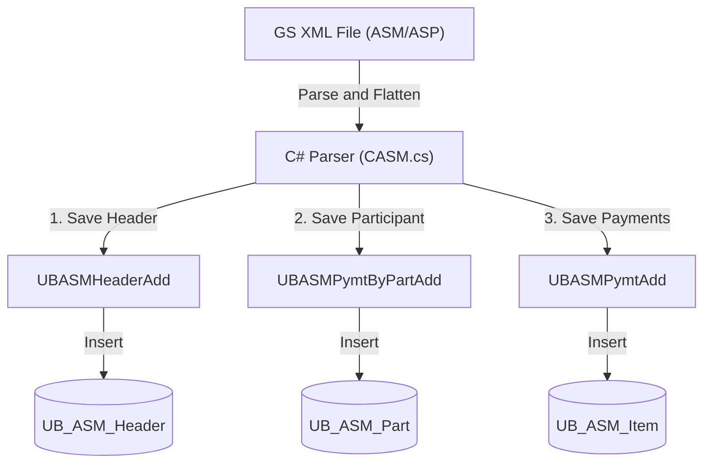

# Fundserv Settlement Report (GS File) Import Specification

This document details the architecture, file routing, XML parsing flow, and database mapping mechanism for the **Fundserv Settlement Report (GS File)** within the VieFund system.

---

## 1. Overview of GS File (Settlement Report)

In Fundserv Standards, the **GS File** (Settlement Report) is a daily report detailing the consolidated settlement instructions and net settlement amounts between Dealers and Manufacturers. 
* **XML Schema**: The GS file aligns with the Fundserv standard schema `SettlReport.xsd`.
* **File Types / Extensions**: In the actual transmission network, these files are delivered as:
  * **`ASM`**: Asymmetric Settlement Report (Member level).
  * **`ASP`**: Asymmetric Settlement Report (Participant level).

---

## 2. File Processing Flow

The import engine (`VieFUNDIE` Service) monitors incoming files and processes them via the following path:

### Step 1: Scanning & Routing
* The engine calls `FFImport.ProcessAllX()` which detects the files in the import directory.
* The file's File Code is checked against the database. For `ASM` or `ASP` files, `FFImport.ImportXMLFile()` is triggered.
* In [FFImport.cs](../../UBFFImport/FFImport.cs#L2492), the routing logic delegates the file to `CASM.ImportXML()`:
  ```csharp
  case "ASP":
  case "ASM":
      if (CASM.ImportXML(DBIDStr, FileName, eLog, iFileID, ref NumRecord, Options) == false)
          Ret = 3;
      break;
  ```

### Step 2: Parsing Levels
The parser [CASM.cs](../../UBFFImport/CASM.cs) reads the XML structure sequentially using `XmlReader` at three logical levels:
1. **Header Level (`ImportXML_ASM`)**: 
   Parses root metadata (Settlement Date, Dealer Code, Mgmt Code) and reads `<TOTTRADEPYMT>` or `<TOTNONTRADEPYMT>` sections.
2. **Participant Level (`ImportXMLASM_PymtByPart`)**: 
   Iterates through each `<PYMTBYPART>` block containing partner-specific settlement summaries.
3. **Payment Level (`ImportXMLASM_Pymt`)**: 
   Iterates through individual `<PYMT>` records representing single transactions.

### Step 3: XML Flattening via `CXML`
Because XML contains nested nodes (e.g., `<Payable>` containing `<AmtValue>`), the parser uses `CXML.GetOneElement(reader, drow, ElemName)` to flatten the structure.
* **Flattening Rule**: It constructs the data key by joining the parent node name and the child node name with an underscore.
* **Example**: 
  * `<Payable><AmtValue>123.45</AmtValue></Payable>` is flattened to a column named `PAYABLE_AMTVALUE` with value `"123.45"`.
  * `<Receivable><AmtValue>50.00</AmtValue></Receivable>` is flattened to `RECEIVABLE_AMTVALUE` with value `"50.00"`.

---

## 3. Database Mapping Mechanism

Rather than hardcoding XML element names, the import engine uses a **Dynamic Database Mapping** structure.

### Step 1: Loading Definition Mappings
Inside `CASM.ImportXML_ASM()`, the parser calls:
```csharp
DataSet DefSet = FFImport.GetRecordDefSet(DBIDStr, "UBXMLRecDefASM", 0, ref errorMessage);
```
The stored procedure `UBXMLRecDefASM` queries three metadata definition tables:
1. `UB_FS_DefASMHeaderRec` (for Header mapping)
2. `UB_FS_DefASMByPartRec` (for Participant mapping)
3. `UB_FS_DefASMPymtRec` (for Payment mapping)

### Step 2: Table Schema Mapping Table
Each definition table contains mapping fields:

| Column | Description | Example |
|---|---|---|
| `FieldName` | The flattened XML element name | `PAYABLE_AMTVALUE` |
| `SPParamName` | The SQL parameter name in the target Stored Procedure | `AmountPayable` |
| `iType` | Data type code | `0` (string/decimal) |
| `bRequired` | Is the field mandatory? | `0` |

### Step 3: Parameter Binding in `FFImport`
During database execution, the method `FFImport.SPAddParamXML()` iterates through the definition dataset and dynamically binds values from the parsed `DataRow` to the Stored Procedure parameters:
```csharp
for (i = 0; i < DefTB.Rows.Count; i++)
{
    string colStr = DefTB.Rows[i]["FieldName"].ToString();
    string SPParamName = DefTB.Rows[i]["SPParamName"].ToString();
    
    if (SPParamName.Length > 0)
    {
        string ValueStr = GetOneValueStr(dr, colStr);
        if (ValueStr.Length > 0)
            con.AddParam(SPParamName, ValueStr);
    }
}
```

---

## 4. Stored Procedures and Tables Flow

Once the parameters are bound, the system executes specific Stored Procedures to insert records into the database:



### Stored Procedures Summary:
1. **[UBASMHeaderAdd](../../ScriptDB/000_4_CreateSP.sql#L184002)**
   * **Parameters**: Includes `@AmountPayable`, `@AmountReceivable`, `@AmountNetSettl` mapped to `PAYABLE_AMTVALUE`, `RECEIVABLE_AMTVALUE`, and `NETSETTL` respectively.
   * **Target Table**: `UB_ASM_Header`.
2. **[UBASMPymtByPartAdd](../../ScriptDB/000_4_CreateSP.sql#L184401)**
   * **Parameters**: Maps participant-level payable/receivable amounts.
   * **Target Table**: `UB_ASM_Part`.
3. **[UBASMPymtAdd](../../ScriptDB/000_4_CreateSP.sql#L184292)**
   * **Parameters**: Handles transaction-level detail mapping (such as `@SettlAmt` from `<SettlAmt>`).
   * **Target Table**: `UB_ASM_Item`.

---

## 5. Fundserv V36 Standards Compatibility (DOT 183)

Fundserv Standards V36 expands the `AmtValue` field length within the GS file schema from **14 to 16 characters** (supporting up to 11 digits before the decimal: `99,999,999,999.9999`). 

No code changes are required in VieFund for this expansion due to the following design safeguards:
1. **String Parsing**: The XML reader parses element contents as raw `string` in C# without checking or restricting maximum length.
2. **Procedure Parameter Width**: The Stored Procedure parameters (such as `@AmountPayable` and `@AmountReceivable`) are declared as `varchar(20)`, which easily accommodates the new 16-character string.
3. **SQL Server MONEY Datatype**: The database columns (like `mPayable`, `mReceivable` in `UB_ASM_Header` and `mSettlAmt` in `UB_ASM_Item`) are typed as `MONEY`. The SQL Server `money` datatype supports up to 15 digits before the decimal place (`922,337,203,685,477.5807`), which is fully compatible with the new Fundserv V36 maximum limit.
