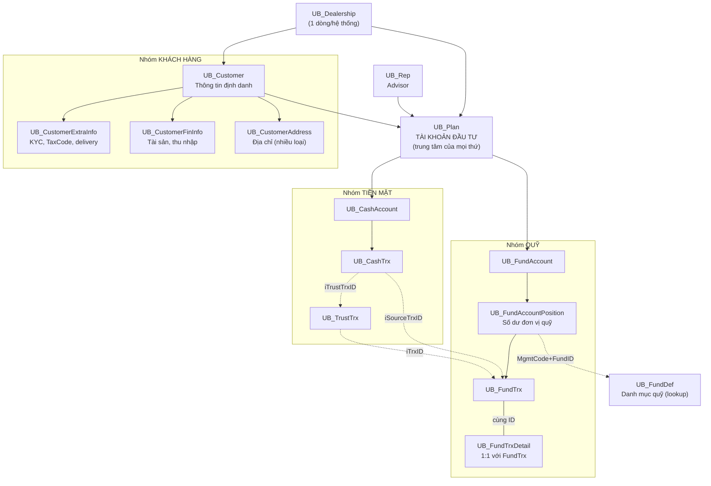
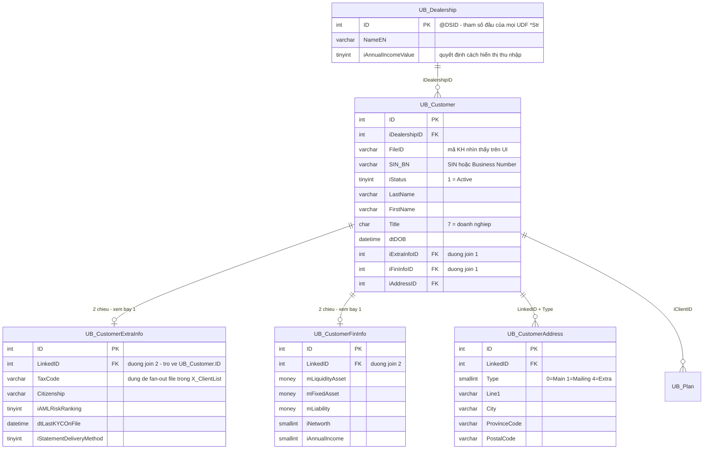
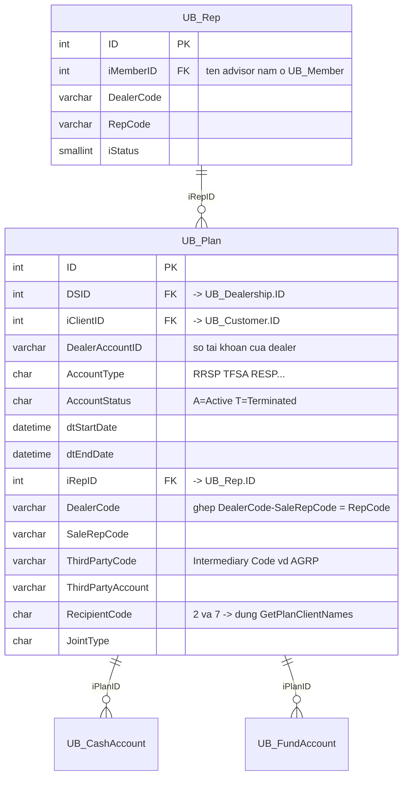
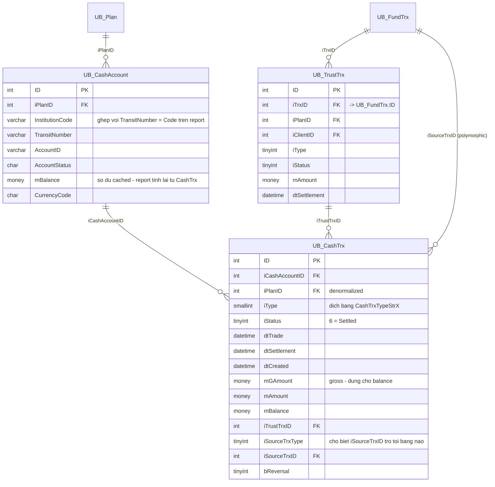
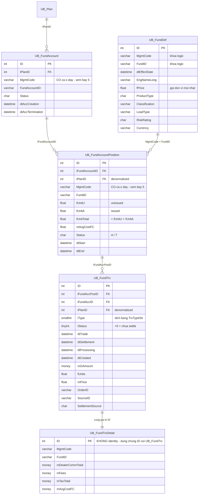

# ERD - 12 bảng cốt lõi VieFUND

> Sơ đồ quan hệ của nhóm bảng chiếm ~80% mọi báo cáo/extract trong hệ thống.
> Cột và kiểu dữ liệu lấy từ [Table_Description.md](../Database/Table_Description.md).
> Quan hệ suy ra từ các SP thật trong `ScriptDB/` và các SP extract `X_*`.

## Cách đọc

Database này **không khai báo FOREIGN KEY** ở tầng SQL. Quan hệ nằm trong quy ước đặt tên:

| Quy ước | Ý nghĩa | Ví dụ |
|---|---|---|
| `ID` | Khoá chính, hầu hết là identity | `UB_Plan.ID` |
| `i<Tên>ID` | Khoá ngoại trỏ tới `UB_<Tên>.ID` | `UB_CashTrx.iCashAccountID` → `UB_CashAccount.ID` |
| `LinkedID` | Khoá ngoại của bảng phụ trỏ về bảng cha | `UB_CustomerExtraInfo.LinkedID` → `UB_Customer.ID` |
| `MgmtCode` + `FundID` | Khoá **logic** (không phải ID) để tra quỹ | → `UB_FundDef` |

Vì không có constraint, sai join sẽ **không báo lỗi** — chỉ ra số liệu sai. Đây là lý do phần "Bẫy" ở cuối tài liệu quan trọng hơn bản thân sơ đồ.

---

## 1. Toàn cảnh



Đường liền = quan hệ cha-con qua ID. Đường gạch = liên kết chéo hoặc khoá logic (chỗ dễ sai nhất).

---

## 2. Nhóm khách hàng



`UB_Customer` chỉ chứa định danh. Mọi thông tin KYC/tài chính nằm ở 3 bảng phụ, tách ra để audit và phân quyền riêng (xem các cột `iLockClientInfo`, `iLockFinancialInfo` trong `UB_CustomerExtraInfo`).

---

## 3. UB_Plan — bảng trung tâm



Một client có nhiều plan (RRSP, TFSA, RESP...). Mọi giao dịch đều treo dưới plan, không treo trực tiếp dưới client. `ThirdPartyCode` là chỗ lọc intermediary — Extract 7 dùng `ThirdPartyCode = 'AGRP'`.

Tên advisor không nằm ở `UB_Rep`, phải qua `iMemberID` → `UB_Member`. Thực tế luôn gọi hàm `dbo.GetRepMemberStr(P.iRepID)` thay vì tự join.

---

## 4. Nhóm tiền mặt



Đây là nhóm phục vụ Extract 1–5. Ba mốc thời gian khác nhau (`dtTrade` / `dtSettlement` / `dtCreated`) chính là lý do mỗi báo cáo có 3 biến thể `@iMethod`.

Logic "pending" trong `X_CashTrxWeekly`: một cash trx được coi là pending nếu nó nối qua `UB_TrustTrx` (`iType IN (2,3,4)`) tới một `UB_FundTrx` còn `iStatus < 5`. Không có cột `bPending` — phải suy ra bằng join.

---

## 5. Nhóm quỹ



Chuỗi 4 tầng `Plan → FundAccount → Position → FundTrx` là xương sống của Extract 6 và 7. Một plan có nhiều fund account (mỗi công ty quỹ một cái), mỗi fund account có nhiều position (mỗi quỹ một cái), mỗi position có nhiều transaction.

Market value không được lưu: phải tính `fUnitTotal × fPrice` với `fPrice` lấy từ `UB_FundDef`, fallback về `mAvgCostFC` khi thiếu giá — đúng như Extract 6 đang làm.

---

## 6. Bảng tra khoá ngoại

| Bảng con | Cột | Trỏ tới | Dùng ở |
|---|---|---|---|
| `UB_Customer` | `iDealershipID` | `UB_Dealership.ID` | — |
| `UB_Customer` | `iExtraInfoID` | `UB_CustomerExtraInfo.ID` | `X_ClientList` |
| `UB_Customer` | `iFinInfoID` | `UB_CustomerFinInfo.ID` | `X_ClientList` |
| `UB_CustomerExtraInfo` | `LinkedID` | `UB_Customer.ID` | `X_AccountHoldingWeekly` |
| `UB_CustomerFinInfo` | `LinkedID` | `UB_Customer.ID` | — |
| `UB_CustomerAddress` | `LinkedID` + `Type` | `UB_Customer.ID` | `X_ClientAddress` |
| `UB_Plan` | `iClientID` | `UB_Customer.ID` | tất cả |
| `UB_Plan` | `iRepID` | `UB_Rep.ID` | `X_AccountHoldingWeekly` |
| `UB_Plan` | `DSID` | `UB_Dealership.ID` | — |
| `UB_CashAccount` | `iPlanID` | `UB_Plan.ID` | Extract 1–5 |
| `UB_CashTrx` | `iCashAccountID` | `UB_CashAccount.ID` | Extract 1–5 |
| `UB_CashTrx` | `iTrustTrxID` | `UB_TrustTrx.ID` | Extract 3–5 (pending) |
| `UB_CashTrx` | `iSourceTrxID` | `UB_FundTrx.ID` (polymorphic) | Extract 3–5 |
| `UB_TrustTrx` | `iTrxID` | `UB_FundTrx.ID` | Extract 3–5 |
| `UB_FundAccount` | `iPlanID` | `UB_Plan.ID` | Extract 6–7 |
| `UB_FundAccountPosition` | `iFundAccountID` | `UB_FundAccount.ID` | Extract 6–7 |
| `UB_FundAccountPosition` | `iPlanID` | `UB_Plan.ID` (denormalized) | `X_ARPTrxWeeklyMgmtList` |
| `UB_FundTrx` | `iFundAccPosID` | `UB_FundAccountPosition.ID` | Extract 7 |
| `UB_FundTrxDetail` | `ID` | `UB_FundTrx.ID` (1:1) | Extract 3–5, 7 |
| `UB_FundAccountPosition` | `MgmtCode`+`FundID` | `UB_FundDef` (khoá logic) | Extract 6–7 |

---

## 7. Bẫy — đọc trước khi viết SP

**Bẫy 1: hai đường join tới bảng phụ của client.** Tồn tại song song cả `UB_Customer.iExtraInfoID → CX.ID` và `CX.LinkedID → UB_Customer.ID`. `X_ClientList` dùng đường 1, `X_AccountHoldingWeekly` dùng đường 2. Nếu một trong hai cột không được populate đầy đủ, kết quả sẽ **rỗng âm thầm** chứ không lỗi. Trước khi giao SP mới phải chạy kiểm tra:

```sql
SELECT COUNT(*) AS Total,
       SUM(CASE WHEN C.iExtraInfoID > 0 THEN 1 ELSE 0 END) AS HasPath1,
       SUM(CASE WHEN CX.ID IS NOT NULL   THEN 1 ELSE 0 END) AS HasPath2
FROM UB_Customer C WITH (NOLOCK)
     LEFT JOIN UB_CustomerExtraInfo CX WITH (NOLOCK) ON (CX.LinkedID = C.ID);
```

**Bẫy 2: `UB_FundTrxDetail.ID` không phải identity.** Nó dùng chung giá trị `ID` với `UB_FundTrx` — quan hệ 1:1, join là `ON (TD.ID = T.ID)`. Đừng tìm cột `iFundTrxID`, không có.

**Bẫy 3: `UB_FundDef` có `dtEffectDate`.** Nếu tồn tại nhiều dòng cho cùng `(MgmtCode, FundID)` thì `LEFT JOIN UB_FundDef ON (MgmtCode, FundID)` sẽ **nhân dòng**, làm phồng số lượng record của report. Kiểm tra:

```sql
SELECT MgmtCode, FundID, COUNT(*) AS Cnt
FROM UB_FundDef WITH (NOLOCK)
GROUP BY MgmtCode, FundID HAVING COUNT(*) > 1;
```

Nếu có kết quả, phải join thêm điều kiện chọn dòng mới nhất theo `dtEffectDate`.

**Bẫy 4: `iPlanID` bị denormalize khắp nơi.** Có ở `UB_CashTrx`, `UB_FundTrx`, `UB_FundAccountPosition`. Tiện để tránh join nhưng nếu dữ liệu lệch thì hai cách tính ra hai số khác nhau. Quy tắc: báo cáo đối soát thì đi theo chuỗi quan hệ đầy đủ, báo cáo lọc nhanh mới dùng `iPlanID` trực tiếp.

**Bẫy 5: `MgmtCode` xuất hiện ở 3 bảng** — `UB_FundAccount`, `UB_FundAccountPosition`, `UB_FundTrxDetail`. Ba giá trị này có thể lệch nhau. Extract 7 hiện lấy danh sách từ `Pos.MgmtCode` nhưng lọc dữ liệu bằng `A.MgmtCode` → có mã sinh file rỗng hoặc bị thiếu mã. Phải chọn một nguồn duy nhất.

**Bẫy 6: mã tiền mặt có hai giá trị.** Codebase xử lý `MgmtCode IN ('CSH','CASH')` (thêm `'CSHUS'` ở vài chỗ): `CSH`+`001` là cash Monarch, `CASH`+`AGCH` là cash Agora/AGRP. Viết `<> 'CASH'` là lọc thiếu.

Ngoài ra tiền mặt có **hai cách biểu diễn song song**: nhóm `UB_CashAccount`/`UB_CashTrx` (tài khoản bank thật, dùng cho Extract 1–5) và position quỹ với `MgmtCode='CSH'/'CASH'` (dùng cho Extract 6). Đừng cộng chung.

**Bẫy 7: cột char bị pad space.** `MgmtCode`, `FundID`, `AccountType`... khi đọc ra C# sẽ mang space đuôi. Nếu giá trị đó đi vào tên file thì phải `RTRIM` trong SQL. Codebase luôn `RTRIM(MgmtCode)` trước khi so sánh — làm theo.

**Bẫy 8: không có FOREIGN KEY.** Join sai cột chỉ ra kết quả sai, không có lỗi. Luôn đối chiếu `COUNT(*)` trước và sau khi thêm một `INNER JOIN` mới.

---

## 8. Bảng mã trạng thái

Suy ra từ các SP và UDF `*Str` — cột "Nguồn" cho biết mức độ chắc chắn.

| Bảng.Cột | Giá trị | Ý nghĩa | Nguồn |
|---|---|---|---|
| `UB_Customer.iStatus` | `1` | Active | `X_ClientList`, `UBCsvExportParams` |
| `UB_Plan.AccountStatus` | `A` / `T` | Active / Terminated | `X_CashBalanceMonthEnd` |
| `UB_Plan.RecipientCode` | `2`, `7` | Joint / Corporate → dùng `GetPlanClientNames` | `X_ARPTrxWeeklyList` |
| `UB_Customer.Title` | `7` | Doanh nghiệp (dùng `Salutation` làm tên liên hệ) | `X_ClientList` |
| `UB_CustomerAddress.Type` | `0`/`1`/`4` | Main / Mailing / Extra | `X_ClientAddress` |
| `UB_CashTrx.iStatus` | `6` | Settled | Extract 1–5 |
| `UB_FundTrx.iStatus` | `< 5` | Chưa settle (pending) | Extract 3–5 |
| `UB_FundTrx.iStatus` | `5` | Pending — giá trị được gán để hiển thị | `X_CashTrxWeekly` |
| `UB_TrustTrx.iType` | `2, 3, 4` | Nhóm liên quan pending cash | Extract 3–5 |
| `UB_FundAccountPosition.Status` | `A` / `T` | Active / Terminated | `UBCsvExportParams` |
| `MgmtCode` | `CSH`, `CASH`, `CSHUS` | Position tiền mặt | `000_3_CreateUDF.sql` |

Muốn danh sách đầy đủ của một mã: mở `ScriptDB/000_3_CreateUDF.sql` và đọc hàm dịch tương ứng (`TrxStatusStr`, `AccountStatusStr`, `PlanTypeSymbolStr`, `CashTrxTypeStrX`...). Các hàm này là **nguồn chuẩn duy nhất** cho enum, không có bảng `UB_Def_*` đầy đủ.

---

## 9. Bốn công thức join hay dùng

```sql
-- (1) Client + toàn bộ KYC  (X_ClientList)
FROM UB_Customer C WITH (NOLOCK)
     LEFT JOIN UB_CustomerExtraInfo CX WITH (NOLOCK) ON (C.iExtraInfoID = CX.ID)
     LEFT JOIN UB_CustomerFinInfo   CI WITH (NOLOCK) ON (C.iFinInfoID   = CI.ID)

-- (2) Cash trx + chủ tài khoản  (Extract 1-5)
FROM UB_CashTrx Trx WITH (NOLOCK)
     INNER JOIN UB_CashAccount CA WITH (NOLOCK) ON (CA.ID = Trx.iCashAccountID)
     INNER JOIN UB_Plan        P  WITH (NOLOCK) ON (P.ID  = CA.iPlanID)
     INNER JOIN UB_Customer    CL WITH (NOLOCK) ON (P.iClientID = CL.ID)

-- (3) Holding: plan -> position -> định nghĩa quỹ  (Extract 6)
FROM UB_Plan P WITH (NOLOCK)
     INNER JOIN UB_FundAccount         A   WITH (NOLOCK) ON (P.ID = A.iPlanID)
     INNER JOIN UB_FundAccountPosition Pos WITH (NOLOCK) ON (A.ID = Pos.iFundAccountID)
     LEFT  JOIN UB_FundDef             F   WITH (NOLOCK) ON (F.MgmtCode = Pos.MgmtCode
                                                        AND F.FundID   = Pos.FundID)

-- (4) Fund trx + chi tiết phí  (Extract 7)
FROM UB_FundAccountPosition Pos WITH (NOLOCK)
     INNER JOIN UB_FundTrx       Trx WITH (NOLOCK) ON (Trx.iFundAccPosID = Pos.ID)
     INNER JOIN UB_FundTrxDetail TD  WITH (NOLOCK) ON (Trx.ID = TD.ID)
```

---

## Tham chiếu

- Chi tiết đầy đủ mọi cột: [Table_Description.md](../Database/Table_Description.md)
- Thư viện UDF (nguồn chuẩn cho enum và format): `ScriptDB/000_3_CreateUDF.sql`
- SP mẫu cho extract: `VFCsvExport/SampleScript.sql`, `VFCsvExport/SP.md`
