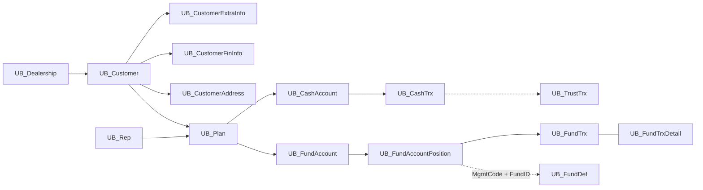

# Data Dictionary — VieFUND Database

> Điểm vào chính để tra cứu database: phạm vi schema, mô hình dữ liệu, quy ước, quan hệ lõi, domain ownership và cách xác minh ý nghĩa field.

## Trạng thái: ✅ Hoàn thành bản tra cứu nền

Snapshot hiện có bao phủ **1.127 bảng duy nhất**, chia thành **58 nhóm**, kèm column name, SQL type, nullable và identity trong [Table Description](../Database/Table_Description.md). Quan hệ và ngữ nghĩa sâu của 12 bảng dùng nhiều nhất nằm trong [ERD 12 bảng cốt lõi](12 bảng cốt lõi.md).

“Hoàn thành” ở đây có nghĩa:

- có inventory toàn bộ bảng trong schema snapshot;
- có đường tra cứu từ domain → nhóm bảng → table/column;
- có mô hình quan hệ lõi và quy tắc join;
- có cách phân biệt dữ kiện schema với mô tả suy luận;
- có checklist để bổ sung ngữ nghĩa mà không làm sai nguồn chuẩn.

Nó không có nghĩa mọi cột trong 1.127 bảng đã được business owner xác nhận thủ công. Những mô tả sinh từ naming convention phải tiếp tục được kiểm chứng bằng SP/UDF và code call site.

---

## 1. Bộ tài liệu database và vai trò

| Tầng | Tài liệu/nguồn | Dùng khi nào |
|---|---|---|
| Bản đồ | File này | Chưa biết dữ liệu thuộc domain hoặc bảng nào |
| Quan hệ lõi | [ERD 12 bảng cốt lõi](12 bảng cốt lõi.md) | Viết report/query quanh client, plan, cash, fund và transaction |
| Schema inventory | [Table Description](../Database/Table_Description.md) | Tra column, type, nullable, identity của mọi bảng trong snapshot |
| UDF/enum | `ScriptDB/000_3_CreateUDF.sql` | Tra cách dịch status/type code sang text |
| Stored procedure | `ScriptDB/000_4_CreateSP.sql` | Xác minh join, filter, lifecycle và business rule đang chạy |
| BLL caller | `UBClasses/*.cs` | Xác minh parameter, result set/`RecType` và UI consumer |
| Module guide | `Docs_V2/topics/*/module-guide.md` | Hiểu ý nghĩa nghiệp vụ và luồng end-to-end |

Header của `Table_Description.md` cho biết file được sinh từ `Tables.sql`. File input này không có trong workspace hiện tại, vì vậy `Table_Description.md` phải được coi là **schema snapshot**, không tự động là schema production mới nhất.

---

## 2. Cách tra cứu nhanh

### Biết tên bảng

Tìm heading chính xác trong `Table_Description.md`:

```powershell
rg -n '^### `UB_Plan`$' Docs_V2/Database/Table_Description.md
```

### Biết tên cột nhưng chưa biết bảng

```powershell
rg -n '\| `iPlanID` \|' Docs_V2/Database/Table_Description.md
```

Kết quả có thể rất nhiều vì database denormalize `iPlanID`. Đọc heading `###` gần nhất phía trên để xác định bảng.

### Muốn biết field được dùng thế nào

```powershell
rg -n --fixed-strings 'iApprovalStatus1' ScriptDB UBClasses WebApp
```

Thứ tự nên đọc:

1. Table definition/snapshot.
2. UDF dịch code nếu là status/type.
3. SP đọc/ghi field.
4. BLL truyền parameter/đọc result.
5. UI label và business guide.

Không suy luận enum chỉ từ một label UI; cùng field có thể hiển thị khác theo DSID/ngôn ngữ.

### Muốn biết một màn hình chạm bảng nào

```text
ASPX event
  → code-behind method
  → UBClasses method
  → db.SetSP("...")
  → CREATE PROCEDURE trong 000_4_CreateSP.sql
  → FROM/JOIN/INSERT/UPDATE/DELETE
```

[Traceability Matrix](traceability-matrix.md) đã chuẩn hóa 50 chuỗi nghiệp vụ/trục kỹ thuật quan trọng; Screen Catalog chịu trách nhiệm inventory diện rộng theo màn hình. Với luồng chưa có trong matrix, đây vẫn là workflow tra cứu thủ công đáng tin cậy.

---

## 3. Quy ước tên bảng

### Prefix

| Prefix | Ý nghĩa thường gặp | Lưu ý |
|---|---|---|
| `UB_` | VieFUND core/business data | Chiếm phần lớn schema |
| `VF_` | Dữ liệu riêng của VieFUND application | Ít bảng |
| `Ag_` | Agent/external integration mapping | Không phải mọi bảng đều dùng DSID giống core |
| `AGRA_` | Account/rep transfer management | Workflow chuyển giao |
| `AAA*`, `TMP*`, tên người | Development/migration/debug | Không dùng làm nguồn nghiệp vụ nếu chưa xác minh |
| `CON_*` | Conversion/migration support | Thường phục vụ chuyển đổi dữ liệu legacy |

### Suffix/pattern

| Pattern | Ý nghĩa |
|---|---|
| `ARC` | Archive/history snapshot |
| `TMP` | Temporary/staging/work table |
| `_SLP` | Tax slip header/data |
| `_TRX` | Transaction/line data liên quan slip |
| `Def` | Definition/reference/lookup |
| `Detail` | Dòng chi tiết hoặc extension 1:1/1:n |
| `History` | Lịch sử thay đổi/quyết định |
| `SearchList` | Bảng/cache tối ưu danh sách tìm kiếm |
| `Obj` | Object/binary/generated artifact tùy domain |

`ARC` và `History` không đồng nghĩa hoàn toàn: archive có thể là bản dữ liệu đã chuyển khỏi bảng active, còn history thường là event/snapshot audit.

---

## 4. Quy ước tên cột

| Prefix/pattern | Kiểu thường gặp | Ý nghĩa |
|---|---|---|
| `ID` | `int` identity | Primary identifier của bảng |
| `i<Name>ID` | `int` | Foreign/logical reference tới record khác |
| `iStatus`, `iType`, `iOptions` | integer | Enum/bitmask; phải tra UDF/SP |
| `dt*` | `datetime` | Mốc thời gian |
| `m*` | `money`/numeric | Monetary amount |
| `f*` | `float`/numeric | Unit, rate, percentage hoặc calculated value |
| `b*` | `bit`/tinyint | Boolean hoặc flag; tinyint đôi khi có hơn hai giá trị |
| `LinkedID` | `int` | Quan hệ polymorphic/extension về bảng cha |
| `MgmtCode` + `FundID` | string pair | Logical product key, không phải FK vật lý |
| `DSID` | integer/string | Dealership tenant scope |
| `iCreatedUserID`, `iLastModifiedUserID` | `int` | User tạo/sửa record |
| `dtCreated`, `dtLastModified` | `datetime` | Audit timestamps |

Hungarian prefix là gợi ý, không phải guarantee. Ví dụ một số field tiền dùng `float`, flag dùng `tinyint`, và column `mAvgCostFC` có thể xuất hiện ở nhiều cấp.

---

## 5. Tenant và ownership

Database access dùng hai khái niệm:

- **DBID** chọn physical database/connection và thường không xuất hiện như column ở mọi bảng.
- **DSID** xác định dealership/sub-dealer trong database.

Không phải bảng con nào cũng có DSID. Scope có thể phải suy ra qua chuỗi:

```text
child record → account/position → UB_Plan → DSID
child record → UB_Customer → iDealershipID
member/rep mapping → dealership/branch access
```

Khi viết query/update:

- không coi một numeric `ID` là globally safe;
- join ngược tới owner/tenant khi bảng con không có DSID;
- truyền `@iUserID` nếu SP hiện tại dùng rep/branch/member access;
- kiểm tra archive/TMP table vì chúng có thể thiếu constraint hoặc tenant column trực tiếp;
- không lấy DSID từ query string/hidden field nếu server Session đã có context chuẩn.

---

## 6. Mô hình dữ liệu lõi



### Bảng đầu mối

| Domain | Bảng | Vai trò |
|---|---|---|
| Tenant | `UB_Dealership` | Cấu hình dealership/DSID |
| Client | `UB_Customer` | Identity và trạng thái client |
| Client KYC | `UB_CustomerExtraInfo`, `UB_CustomerFinInfo` | KYC/tax/delivery và tài chính |
| Address | `UB_CustomerAddress` | Nhiều loại địa chỉ qua `LinkedID + Type` |
| Advisor | `UB_Rep`, `UB_Member`, `UB_MemberLogin` | Rep business entity, user/member và login |
| Plan | `UB_Plan` | Tài khoản đầu tư trung tâm |
| Plan KYC | `UB_PlanInvestInfo` | Risk/objective, horizon, KYC/freeze flags |
| Fund account | `UB_FundAccount` | Account tại management company |
| Holding | `UB_FundAccountPosition` | Vị thế theo fund |
| Trade | `UB_FundTrx`, `UB_FundTrxDetail`, `UB_FundTrxOrder` | Transaction, phí/chi tiết và order |
| Cash | `UB_CashAccount`, `UB_CashTrx`, `UB_TrustTrx` | Bank/cash ledger và trust movement |
| Product | `UB_FundDef` | Định nghĩa fund, price/risk/classification |
| GIC | `UB_GICAccount`, `UB_GICAccountTrx`, `UB_GICProdDef`, `UB_GICRate` | Holding, transaction, product và rate GIC |
| Compliance | `UB_CompPlanApprovalStatus`, `UB_CompTrxApprovalStatus` | Approval plan/KYC và trade |

Chi tiết column, cardinality, join và bẫy của nhóm này nằm trong [ERD 12 bảng cốt lõi](12 bảng cốt lõi.md) và các module guide.

---

## 7. Inventory toàn bộ schema

`Table_Description.md` chứa 58 nhóm sau. Việc phân nhóm được tạo theo naming convention nên một số bảng migration/legacy có thể nằm trong “VieFUND Core” thay vì domain dễ đoán.

| # | Nhóm | Số bảng | Nội dung chính |
|---|---|---:|---|
| 1 | Address Data | 2 | Address dùng chung |
| 2 | Agent/External System Integration | 1 | Mapping agent/external |
| 3 | AGRA Transfer Management | 5 | Transfer workflow |
| 4 | Transaction Confirmation | 4 | Confirmation/header/detail |
| 5 | Fund Conversion | 1 | Chuyển đổi fund |
| 6 | CRS/FATCA Reporting | 10 | Tax residency/reporting |
| 7 | Dealership Management | 14 | Dealer, branch, region, bank, Twilio |
| 8 | Definition/Lookup Tables | 286 | Enum/reference/configuration |
| 9 | Development/Testing | 6 | Debug/test artifacts |
| 10 | FundServ Configuration | 71 | Record definitions và staging `UB_FS_*` |
| 11 | Fund Definition & Transactions | 63 | Fund account, position, transaction, product |
| 12 | GIA | 6 | Guaranteed Interest Account |
| 13 | GIC | 14 | GIC product/rate/account/transaction |
| 14 | Help System | 1 | Help content |
| 15 | Identification Documents | 1 | Identification document |
| 16 | Insurance Products | 4 | Insurance/segregated-related data |
| 17 | Intermediary Management | 2 | Intermediary records |
| 18 | KYP Compliance | 14 | Product comparison và audit trail |
| 19 | LAP | 3 | Leveraged Asset Program |
| 20 | Loan Management | 7 | Loan/application/document |
| 21 | Logo Management | 1 | Branding asset |
| 22 | Member/Advisor Management | 18 | Member, login, license, access, permission |
| 23 | MER Reporting | 6 | Low MER/report data |
| 24 | MFDA Compliance | 29 | Compliance reporting datasets |
| 25 | Management Company | 2 | Fund company/master data |
| 26 | IBM MQ / FundServ Real-Time | 4 | Queue/message exchange |
| 27 | NFU via FundServ | 3 | Network Fund Update |
| 28 | Notes/Comments | 2 | Notes và comment |
| 29 | Notification System | 1 | Notification |
| 30 | Onboarding | 1 | Onboarding workflow data |
| 31 | Order Processing (FundServ) | 8 | Order file/message/sent/waiting |
| 32 | Person/Individual Data | 2 | Person identity |
| 33 | Phone/Contact Data | 2 | Phone/contact |
| 34 | Investment Plan/Account Management | 29 | Plan, beneficiary, KYC, fee, payment |
| 35 | Fund Price Data | 34 | Price/NAV/import/history |
| 36 | Province/Region Lookup | 1 | Province/reference |
| 37 | Redemption Schedule Processing | 2 | Redemption schedule |
| 38 | Representative/Advisor | 25 | Rep, assignment, hierarchy, production |
| 39 | RESP | 13 | Education savings workflow |
| 40 | RRIF | 15 | Retirement income fund/payment |
| 41 | RRSP | 6 | Retirement savings processing |
| 42 | Scheduled Processing | 2 | Scheduled/background jobs |
| 43 | Segregated Fund | 1 | Seg fund data |
| 44 | Service Task Management | 2 | Task/work management |
| 45 | Application Settings | 1 | App setting |
| 46 | Stock/ETF Management | 2 | Stock/ETF order/reference |
| 47 | System Configuration & Sequences | 19 | Sequence, setting, audit/system data |
| 48 | NR4 Non-Resident Tax | 44 | NR4/T3/T4A/T4RIF/T4RSP/T5 slips và transactions |
| 49 | Quebec Relevé Tax Slip | 19 | RL1/RL2/RL3/RL16/RL18 |
| 50 | TFSA | 5 | TFSA header, identity và transactions |
| 51 | Trust Account Management | 5 | Trust transaction/bank/cheque/detail |
| 52 | TS File Processing (FundServ) | 3 | Settlement/TS staging |
| 53 | VieFUND Core | 295 | Core, legacy, conversion và bảng chưa phân nhóm riêng |
| 54 | UCI | 3 | Universal Client Identifier |
| 55 | Uniformity Review | 4 | Uniformity workflow |
| 56 | VieFUND Application | 1 | App-specific data |
| 57 | View Settings | 1 | User/view preference |
| 58 | Web Client Portal | 1 | Client portal data |

Tổng kiểm tra bằng heading `###`: **1.127 table heading, 1.127 tên duy nhất, không trùng**.

---

## 8. Domain → nhóm bảng → tài liệu

| Câu hỏi nghiệp vụ | Bắt đầu từ bảng/nhóm | Tài liệu liên quan |
|---|---|---|
| Khách hàng/KYC là ai? | `UB_Customer*`, Person, Address, Phone | [Client & KYC](../topics/client-kyc/module-guide.md) |
| Plan/account thuộc ai? | `UB_Plan*`, `UB_CustomerPlan`, Rep | [Account & Plan](../topics/account-plan/module-guide.md) |
| Holding và trade chạy thế nào? | `UB_FundAccount*`, `UB_FundTrx*`, Order Processing | [Trading & Orders](../topics/trading-orders/module-guide.md) |
| Cash/settlement đi đâu? | `UB_Cash*`, `UB_TrustTrx*`, TS Processing | Settlement topic + core ERD |
| Product/NAV/GIC ở đâu? | Fund Definition, Fund Price, GIC/GIA | [Fund & GIC](../topics/fund-gic/module-guide.md) |
| Commission/fee được tính ở đâu? | `UB_Comm*`, `UB_Fee*`, plan fee | [Commission & Fee](../topics/commission-fee/module-guide.md) |
| Compliance quyết định gì? | `UB_Comp*`, `UB_Compliance*`, MFDA, MER | [Compliance](../topics/compliance/module-guide.md) |
| Product comparison/KYP? | `UB_KYP*` | Fund/GIC + Compliance guides |
| FundServ file/message? | `UB_FS_*`, Order, MQ, NFU, TS | [FundServ](../topics/fundserv/README.md) |
| Tax/year-end? | CRS/FATCA, NR4/T3/T4/T5, Relevé, TFSA | Tax & Year-End topic |
| User/permission? | Member, Login, Rep access, Dealership | [Auth](../viefund-framework/auth.md), [Security](../topics/security/module-guide.md) |
| Onboarding/client portal? | Onboarding, Web Client Portal | Onboarding topic |

---

## 9. Quan hệ không có foreign key vật lý

Schema snapshot và SP cho thấy nhiều quan hệ dựa trên convention thay vì FK constraint. Các pattern quan trọng:

| Bảng con/cột | Bảng cha/key | Ghi chú |
|---|---|---|
| `UB_Plan.iClientID` | `UB_Customer.ID` | Client chính của plan |
| `UB_Plan.iRepID` | `UB_Rep.ID` | Advisor/rep |
| `UB_FundAccount.iPlanID` | `UB_Plan.ID` | Fund company account của plan |
| `UB_FundAccountPosition.iFundAccountID` | `UB_FundAccount.ID` | Position thuộc account |
| `UB_FundTrx.iFundAccPosID` | `UB_FundAccountPosition.ID` | Trade thuộc position |
| `UB_FundTrxDetail.ID` | `UB_FundTrx.ID` | Quan hệ 1:1 dùng chung ID |
| `UB_CashTrx.iCashAccountID` | `UB_CashAccount.ID` | Cash ledger |
| `UB_CustomerExtraInfo.LinkedID` | `UB_Customer.ID` | Một trong hai đường join client extension |
| `MgmtCode + FundID` | `UB_FundDef` logical key | Có nguy cơ nhân dòng theo `dtEffectDate` |
| `LinkedID + Type` | Bảng cha phụ thuộc type | Polymorphic relation; phải đọc SP |

Hậu quả:

- orphan record không bị DB chặn;
- join nhầm vẫn chạy và trả dữ liệu sai;
- một logical key có thể có nhiều version;
- ID denormalized ở nhiều bảng có thể lệch nhau.

Query đối soát nên đi theo chuỗi quan hệ đầy đủ và so sánh với ID denormalized thay vì mặc định tin một phía.

---

## 10. Status, type và bitmask

Không có một data dictionary enum duy nhất. Giá trị thường nằm ở ba nguồn:

| Nguồn | Khi dùng |
|---|---|
| `UB_Def_*` / definition tables | Lookup có dữ liệu cấu hình theo DSID/ngôn ngữ |
| UDF `*Str`, `*SymbolStr` trong `000_3_CreateUDF.sql` | Code-to-label được hard-code trong SQL |
| `CASE`, comment và condition trong SP | Lifecycle/rule nội bộ không có lookup riêng |

Ví dụ UDF cần tra:

- `TrxStatusStr`
- `TrxTypeStr`
- `CashTrxTypeStrX`
- `AccountStatusStr`
- `PlanTypeSymbolStr`
- `GetApprovalStatusStr`

Quy tắc ghi tài liệu enum:

1. Ghi rõ field đầy đủ `Table.Column`.
2. Ghi value và label.
3. Ghi nguồn UDF/table/SP.
4. Nếu label phụ thuộc DSID/Lg, ghi rõ.
5. Nếu chỉ suy luận từ condition, đánh dấu “suy luận”, không viết như fact tuyệt đối.

---

## 11. Mốc thời gian và số tiền

Một record transaction có thể có nhiều ngày:

| Field pattern | Ý nghĩa thường gặp |
|---|---|
| `dtCreated` | Thời điểm ghi record |
| `dtTrade` | Trade date |
| `dtProcessing` | Ngày xử lý/order processing |
| `dtSettlement` | Settlement date |
| `dtEffective` | Ngày hiệu lực |
| `dtLastModified` | Lần sửa gần nhất |

Không thay thế các field này cho nhau trong report. Xác nhận business cut-off và timezone trước khi lọc ngày.

Với amount:

- `mGAmount` thường là gross amount nhưng phải kiểm tra theo transaction type;
- `mAmount` có thể là net/line amount tùy bảng;
- `fUnits × price` tạo market value, không phải realized value;
- `CurrencyCode` và exchange rate phải được xử lý trước khi aggregate;
- fee/tax/commission có thể nằm ở detail table, không chỉ transaction header.

---

## 12. Các bẫy dữ liệu đã xác minh

1. `UB_Customer` ↔ extra/financial info có cả direct ID và `LinkedID`; các SP khác nhau dùng đường khác nhau.
2. `UB_FundTrxDetail.ID` dùng chung ID với `UB_FundTrx`, không có `iFundTrxID`.
3. `UB_FundDef` có version/effective date; join chỉ bằng `MgmtCode + FundID` có thể nhân dòng.
4. `iPlanID` bị denormalize ở transaction/position/account tables.
5. `MgmtCode` tồn tại ở account, position và transaction detail; có thể lệch.
6. Cash có các mã `CSH`, `CASH`, đôi khi `CSHUS`, và còn có cash account ledger riêng.
7. Column `char` có padding; cần `RTRIM` khi so sánh/xuất file.
8. `WITH (NOLOCK)` xuất hiện rộng rãi trong SP; report có thể đọc dirty/non-repeatable data.
9. `tinyint` tên `b*` không phải lúc nào cũng chỉ có 0/1.
10. Archive/TMP table có thể khác schema active; không dùng `SELECT *` khi copy/migrate.

Chi tiết và query kiểm tra nằm tại phần “Bẫy” của [ERD 12 bảng cốt lõi](12 bảng cốt lõi.md).

---

## 13. Quy tắc viết query/report an toàn

- Liệt kê column rõ ràng, không dùng `SELECT *` ở integration/report contract.
- Bắt đầu bằng tenant/data scope rồi mới thêm filter nghiệp vụ.
- Kiểm tra `COUNT(*)` và tổng amount trước/sau mỗi join.
- Với logical key có version, chọn một record bằng effective date/window function.
- Không aggregate trước khi xử lý duplicate do join 1:n.
- Dùng parameterized SP; dynamic SQL phải dùng `sp_executesql` parameters.
- Không mặc định `NOLOCK` là tối ưu vô hại.
- Xác định currency và rounding rule trước SUM.
- Với report lịch sử, ưu tiên snapshot/archive đúng kỳ thay vì current master.
- Dùng transaction và optimistic status check cho update nhạy cảm.

Mẫu kiểm tra nhân dòng:

```sql
SELECT COUNT(*) AS RowCount,
       COUNT(DISTINCT T.ID) AS DistinctTransactionCount,
       SUM(T.mGAmount) AS GrossAmount
FROM UB_FundTrx T;
```

Chạy lại ba chỉ số sau mỗi join quan trọng. Nếu row count tăng ngoài cardinality mong đợi, dừng và sửa join trước khi viết tiếp report.

---

## 14. Độ tin cậy của mô tả

| Cấp | Nguồn | Cách dùng |
|---|---|---|
| A — Schema fact | Type, nullable, identity từ schema snapshot | Có thể dùng trực tiếp, nhưng cần kiểm tra freshness |
| B — Runtime logic | SP/UDF đang được BLL gọi | Nguồn tốt nhất cho join/rule hiện hành |
| C — Curated business note | Module guide, core ERD có source reference | Dùng để hiểu ngữ nghĩa |
| D — Naming inference | Description tự sinh từ tên cột | Chỉ là gợi ý tìm kiếm |
| E — UI label/comment | Label hoặc comment đơn lẻ | Cần đối chiếu code/DB |

Khi hai nguồn mâu thuẫn, ưu tiên schema đang deploy và runtime call path; ghi lại khác biệt thay vì xóa dấu vết.

---

## 15. Cách bổ sung một field đã hiểu rõ

1. Tìm table trong `Table_Description.md`.
2. Xác minh type/nullability với schema môi trường nếu có quyền.
3. Tìm mọi SP đọc/ghi field.
4. Tìm BLL/UI consumer.
5. Ghi note tiếng Việt có source cụ thể.
6. Nếu là enum, liệt kê value + label + UDF/table nguồn.
7. Nếu là FK logic, ghi direction và cardinality.
8. Nếu có PII/tenant implication, ghi cảnh báo.
9. Cập nhật module guide hoặc traceability nếu field quyết định business flow.

Mẫu note:

```markdown
> **[1] `iStatus`** — trạng thái nghiệp vụ của record.
>
> - `1` = ...
> - `2` = ...
>
> Nguồn: UDF `...`, SP `...`, màn hình `...`.
> Phạm vi: label phụ thuộc `@Lg`/`@DSID` nếu có.
```

Không sửa description tự sinh thành khẳng định nghiệp vụ nếu chưa có source.

---

## 16. Checklist khi thay đổi schema

- [ ] Có migration forward và rollback/recovery plan?
- [ ] Column mới có default/backfill cho dữ liệu cũ?
- [ ] Nullability phù hợp mọi caller cũ?
- [ ] Active, ARC, TMP và search/cache tables có cần đổi cùng nhau?
- [ ] `INSERT ... SELECT` không liệt kê column có bị lệch không?
- [ ] SP/UDF, BLL DataSet và PDF/export contract đã cập nhật?
- [ ] Index cho tenant + filter chính đã được đánh giá?
- [ ] PII retention/masking/audit được xem xét?
- [ ] EN/FR lookup/label đã có đủ?
- [ ] `Table_Description.md` và guide liên quan đã regenerate/update?

---

## 17. Giới hạn và việc cần duy trì

- Schema source `Tables.sql` không hiện diện trong workspace; cần regenerate từ DB/source chính thức khi có thay đổi.
- Database không khai báo đầy đủ FK vật lý; relation catalog vẫn cần được xây dựng dần từ SP.
- 286 definition/lookup tables cần mapping enum theo nhu cầu module, không nên đoán tự động.
- Một số bảng development/migration có tên không chuẩn; cần owner xác nhận trước khi dùng.
- [SP Catalog](sp-catalog/) và [Traceability Matrix](traceability-matrix.md) bổ sung hướng tra cứu theo procedure/luồng, không lặp lại schema inventory ở đây.

Tài liệu này là điểm vào ổn định; `Table_Description.md` là inventory chi tiết cần được regenerate khi schema thay đổi.
