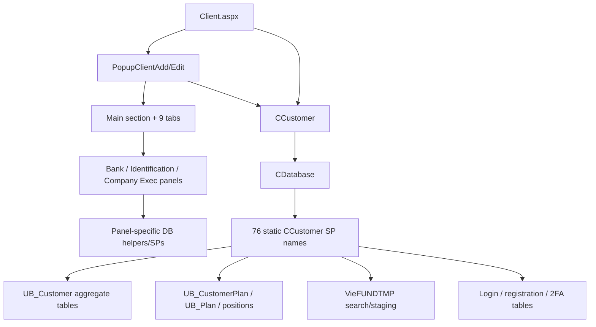

# Client & KYC — Module Guide đã đối chiếu source/database

> **Audit ngày 2026-09-18.** Tài liệu này đã được đối chiếu với source C# legacy/MyPortfolioNew, [`000_4_CreateSP.sql`](../../../MyPortfolioNew/VieFUND-Platform/src/SQLScript/000_4_CreateSP.sql) và [`Table_Description.md`](../../Database/Table_Description.md).
>
> **Giới hạn:** SQL snapshot có header ngày 2025-11-02; catalog bảng được sinh từ `Tables.sql` nhưng file DDL gốc không còn trong workspace. Máy audit không có VieFUND DBID, local SQL instance/database hoặc credential read-only, nên chưa xác nhận schema, dữ liệu lookup và procedure version đang deploy ở production.

## 0. Quy ước bằng chứng

| Nhãn | Ý nghĩa |
|---|---|
| **Đã xác minh** | C# caller và/hoặc SQL definition trong repository chứng minh trực tiếp hành vi được mô tả. |
| **Snapshot DB** | Được chứng minh bởi SQL/schema snapshot, chưa chứng minh production đang chạy đúng version đó. |
| **Giới hạn** | Chỉ thấy một phần call path, UI state hoặc persisted field; không suy diễn thành policy/enforcement đầy đủ. |
| **Business rule** | Khái niệm từ tài liệu nghiệp vụ; cần policy/config/deployed DB để dùng như invariant. |

Các line link dưới đây bám repository tại thời điểm audit; tên symbol/SP là mốc ổn định hơn line number.

### Các correction quan trọng sau audit

| Nội dung cũ | Kết quả audit |
|---|---|
| `Customer.cs` dùng 70 SP | Có **76 tên SP tĩnh distinct** trong `DLLs/UBClasses/Customer.cs`; SQL snapshot có definition cho cả 76. |
| `GetClientPlanList → UBClientPlanList` | Sai. Mapping đúng là `GetClientPlanList → UBClientPlan`. |
| `GetClientPlanSet → UBClientPlan` | Sai. Mapping đúng là `GetClientPlanSet → UBClientPlanList`. |
| Popup có 10 tabs | Markup có **Main section nằm ngoài TabContainer + 9 top-level TabPanel**. |
| Non-admin luôn read-only | `PopupClientAdd` đọc session `TMPReadOnly`; role và access mask được tính trước đó. Non-admin không đồng nghĩa tuyệt đối với read-only. |
| Có asset thì luôn khóa address | Chỉ khóa khi `iHasAsset == 1` **và** session `TMPiLockAddress4Rep == 1`. |
| Freeze chặn mọi giao dịch | Source/SQL đã khảo sát chỉ chứng minh lưu, hiển thị và batch freeze; chưa thấy C# guard hoặc trade SP proof chặn mọi giao dịch. |
| Status Deceased bắt buộc ngày mất | C# chỉ gửi và SQL chỉ parse `DeceasedDate` khi status `4`; snapshot cho phép chuỗi rỗng thành `NULL`. |
| `GetSingleSignOnPW2()` không gọi SP | Method gọi `UBClientLoginOther`. |
| Có field persisted `iAMLCheckResult` | Không thấy field được save. `idAMLCheckResult` là label UI tạm; field persisted đã xác minh là `iAMLRiskRanking`. |
| `PanelClientAddress.aspx` thuộc legacy add popup | Legacy popup giữ address inline trong `PopupClientAddBody.aspx`; wrapper include Bank/Identification/Company Executive panels, không include panel address này. |

---

## 1. Ranh giới runtime và source tree

Repository có hai implementation tree liên quan:

| Runtime/tree | Source basis | Kết luận |
|---|---|---|
| Legacy `WebApp` | [`DLLs/UBClasses/Customer.cs`](../../../DLLs/UBClasses/Customer.cs) | Guide dùng tree này làm baseline vì UI legacy và line evidence hiện tại nằm ở đây. `WebApp.csproj` reference `bin/UBClass.dll`, nên source hiện tại không tự chứng minh DLL đang deploy được build từ cùng revision. |
| MyPortfolioNew | [`src/libs/UBClasses/Customer.cs`](../../../MyPortfolioNew/VieFUND-Platform/src/libs/UBClasses/Customer.cs) | `WebApp.csproj` reference source project trực tiếp, nên đây là source canonical cho build MyPortfolioNew. |

Hai file không còn là mirror tuyệt đối. Baseline legacy có các input KYC `RiskCapacity`, `iIncomeSource`, `IncomeSourceOther` mà copy MyPortfolioNew được audit chưa có; MyPortfolioNew lại có logic login-history/session bằng SQL trực tiếp. Khi thay đổi Client/KYC phải kiểm tra cả hai tree theo runtime mục tiêu.

`CCustomer` vừa orchestration nghiệp vụ vừa trực tiếp dùng `CDatabase`; repository không có một DAL C# riêng cho từng aggregate. Pattern thực tế là:

```text
WebForms/UI
  -> CCustomer / panel helper
     -> CDatabase.SetSP + AddParam
        -> stored procedure
           -> UB_* tables / VieFUNDTMP staging
```

`CDatabase.SetSP` đặt `CommandType.StoredProcedure`; `FillDataSet` trả multi-result-set. Nhiều method đổi `DataTable.TableName` bằng cột `RecType`, do đó `RecType` là runtime contract giữa SQL và C#.

> Source evidence: [`CDatabase.SetSP`](../../../DLLs/UBConnection/CDatabase.cs#L618-L668), [`CCustomer.GetClientDataSet`](../../../DLLs/UBClasses/Customer.cs#L197-L244)

---

## 2. Data model Client/KYC

### 2.1. Các bảng chính

| Bảng | Vai trò đã xác minh từ snapshot |
|---|---|
| `UB_Customer` | Aggregate root: dealership, FileID, SIN/BN, status, name, DOB/deceased date, marital/spouse, advisor/member và các ID liên kết child records. |
| `UB_CustomerAddress` | Address theo `LinkedID`/`Type`, gồm main, mailing và additional address. |
| `UB_Phone` | Phone/email contact được Client liên kết. |
| `UB_CustomerFinInfo` | Income, net-worth category, knowledge/experience, asset/liability amounts và các cờ financial/KYC. |
| `UB_CustomerExtraInfo` | Review/KYC metadata, privacy/contact flags, bốn lock fields, `iClientFreezed`, rating, delivery, citizenship/tax và notes. |
| `UB_CustomerRep` | Liên kết Client với member/rep. |
| `UB_CustomerPlan`, `UB_Plan` | Liên kết Client–Plan và plan master. |
| `UB_PlanInvestInfo` | Investment objective/risk và plan freeze-related information. |
| `UB_CustomerLogin`, `UB_CustomerLoginHistory` | Web Client credential state, restrictions, attempts, 2FA/session history. |
| `UB_CustomerAssetLiquid`, `UB_CustomerAssetOther`, `UB_CustomerLiability`, `UB_CustomerOBA` | Extended KYC assets, liabilities và outside business activity. |

Catalog bảng là nguồn tham khảo column/type, không phải bằng chứng đầy đủ về PK/FK/index/check/default vì base `Tables.sql` không còn trong workspace.

> Database evidence: [`UB_Customer`](../../Database/Table_Description.md#ub_customer), [`UB_CustomerFinInfo`](../../Database/Table_Description.md#ub_customerfininfo), [`UB_CustomerExtraInfo`](../../Database/Table_Description.md#ub_customerextrainfo)

### 2.2. Client, Rep và quyền nhìn thấy dữ liệu

Luồng khái niệm thường là:

```text
Dealership (DSID)
  -> member/advisor/rep access
     -> Client
        -> Plan
           -> fund/GIC/cash position
              -> transaction
```

Không nên diễn giải đây là FK hierarchy tuyệt đối `Dealer Code -> Rep Code -> Advisor Code -> Client`:

- `UBClientSearchSel`, `UBClientPlan` và `UBClientPlanList` dựng rep allow-list cho user nội bộ không-admin.
- `UBClientSearchLoad` còn áp dụng MFDA filter khi phù hợp.
- Một số direct-ID detail procedure đọc theo supplied ClientID/PlanID mà phần đầu procedure không cho thấy ownership gate tương đương search. Caller/session/access checks vì vậy là trust boundary quan trọng.
- `UBClientJointRepList` tồn tại, nên câu “mỗi Client chỉ có đúng một repcode” không mô tả hết mô hình.
- Duplicate override cho phép tồn tại các Client records giống nhau, nhưng không có source/SQL evidence rằng hệ thống chủ ý tạo record riêng chỉ để tách home address và P.O. Box.

> SQL evidence: [`UBClientSearchSel`](../../../MyPortfolioNew/VieFUND-Platform/src/SQLScript/000_4_CreateSP.sql#L224073), [`UBClientPlan`](../../../MyPortfolioNew/VieFUND-Platform/src/SQLScript/000_4_CreateSP.sql#L217978), [`UBClientPlanList`](../../../MyPortfolioNew/VieFUND-Platform/src/SQLScript/000_4_CreateSP.sql#L220042)

### 2.3. Client status

Source và SQL snapshot xác nhận trực tiếp application behavior cho status `1`, `3` và `4`. Label của status `2` phụ thuộc dữ liệu lookup không được export trong repository:

| `UB_Customer.iStatus` | Ý nghĩa | Hành vi/mức bằng chứng |
|---:|---|---|
| `1` | Active | Default cho client thường; một số search mặc định chỉ lấy active. **Đã xác minh.** |
| `2` | Terminated theo business convention hiện tại | `UBClientStatusList` lấy label từ `UB_Def_ClientStatus`; snapshot chỉ có schema/procedure, không có lookup rows. Cần kiểm tra DB đang deploy. |
| `3` | Prospect | Read-only workflow vẫn cho tạo/sửa Prospect trong một số trường hợp. **Đã xác minh.** |
| `4` | Deceased | UI hiện deceased-date control; C# chỉ gửi và SP chỉ parse date ở status này. Date rỗng vẫn có thể thành `NULL`. **Đã xác minh trong snapshot.** |

Plan status là domain khác và thường dùng code chuỗi `A/T/P`; không trộn với integer Client status.

> Source evidence: [`PopupClientAdd.SetDefault`](../../../WebApp/Main/PopupClientAdd.aspx.cs#L384-L463), [`ClientAddUI`](../../../DLLs/UBClasses/Customer.cs#L2261-L2757)
>
> SQL evidence: [`UBClientStatusList`](../../../MyPortfolioNew/VieFUND-Platform/src/SQLScript/000_4_CreateSP.sql#L224412), [`UBClientAddUI`](../../../MyPortfolioNew/VieFUND-Platform/src/SQLScript/000_4_CreateSP.sql#L205937)

### 2.4. Individual và Corporation

Discriminator runtime là `Title`:

| Điều kiện | Fields/workflow chính |
|---|---|
| `Title != "7"` | Individual: first name, sex, DOB, SIN, marital/dependants, spouse và employment. |
| `Title == "7"` | Corporation: company name ở LastName, contact name/position, Federal/Provincial BN, website, corporation type/business type/start date. |

UI và BLL đều phân nhánh theo value này. `DeceasedDate` được xử lý trước title branch, nên source không ngăn corporation nhận status `4`.

> Source evidence: [`PopupClientAdd.ShowCompanyClient`](../../../WebApp/Main/PopupClientAdd.aspx.cs#L1433-L1488), [`CCustomer.ClientAddUI`](../../../DLLs/UBClasses/Customer.cs#L2261-L2757)

### 2.5. Account designation

Client Name, Nominee và Intermediary là các khái niệm business được mô tả tại [Client Access Rights](../../business-logic-topics/client-access-rights.md). Source/SQL snapshot có designation fields/lookups, nhưng audit này không chứng minh ba loại đó là tập hợp duy nhất cho mọi dealer/version hoặc xác nhận trách nhiệm tax-form như một quy tắc pháp lý. Khi implement validation phải lấy lookup/config và policy đang áp dụng, không hard-code từ đoạn mô tả này.

---

## 3. Client CRUD, search và detail contract

### 3.1. Mapping C# -> stored procedure

| Thao tác | C# method | Stored procedure | Hành vi chính |
|---|---|---|---|
| Search | `GetClientList()` | `UBClientSearch` | Basic/advanced criteria; normalize phone và wildcard; materialize kết quả phân trang. |
| Load trang search | `GetClientSearchList()` | `UBClientSearchLoad` | Đọc search state trong `VieFUNDTMP`; có thể ghi page/page-size setting, nên không phải pure read. |
| Search để chọn Client | `GetClientListSel()` | `UBClientSearchSel` | Áp rep access cho non-admin, paging và exclusion options. |
| Detail | `GetClientDataSet()` | `UBClientInfo` | Multi-result-set, đặt table name theo `RecType`. |
| Add | `ClientAddUI()` | `UBClientAddUI` | Nhánh khi `iClientID <= 0`. |
| Update | `ClientAddUI()` | `UBClientUpdateUI` | Nhánh khi `iClientID > 0`; dùng `LMD` cho optimistic concurrency. |
| Remove | `ClientDeleteUI()` | `UBClientRemoveUI` | Chạy remove/cascade pipeline. Full downstream cascade chưa thể xác minh vì thiếu declarative FK model. |
| Favorite | `GetClientFavoriteList()` | `UBClientFavoriteLoad` | Load favorites. |
| Add favorite | `ClientFavoriteAdd()` | `UBClientFavoriteAdd` hoặc `UBClientFavoriteAddAll` | Chọn `AddAll` khi `bAll=true`. |
| Remove favorite | `ClientFavoriteRemove()` | `UBClientFavoriteRemove` | Có option remove all. |

> Source evidence: [`Customer.cs` search/detail](../../../DLLs/UBClasses/Customer.cs#L25-L244), [`GetClientListSel`](../../../DLLs/UBClasses/Customer.cs#L2122-L2239), [`ClientAddUI`](../../../DLLs/UBClasses/Customer.cs#L2261-L2757), [`favorite methods`](../../../DLLs/UBClasses/Customer.cs#L2857-L2953)
>
> SQL evidence: [`UBClientSearch`](../../../MyPortfolioNew/VieFUND-Platform/src/SQLScript/000_4_CreateSP.sql#L221266), [`UBClientInfo`](../../../MyPortfolioNew/VieFUND-Platform/src/SQLScript/000_4_CreateSP.sql#L210678), [`UBClientUpdateUI`](../../../MyPortfolioNew/VieFUND-Platform/src/SQLScript/000_4_CreateSP.sql#L226989)

### 3.2. `UBClientInfo` multi-result-set

`UBClientInfo` không có một output schema cố định cho mọi call. Result sets phụ thuộc `Options`, `bEdit`, `iFlag`, user và dữ liệu. Các logical `RecType` thường gặp:

| `RecType` | Nội dung/source chính |
|---|---|
| `Client` | Core identity/status/type/member/rep và edit/permission flags. View mode có thể mask SIN/DOB. |
| `ClientAddress` | Main address. |
| `MailingAddress` | Mailing address. |
| `ExtraAddress` | Additional address. |
| `ClientPhone` | Main/business/cell/fax/email contact. |
| `FinInfo` | Income/knowledge/experience và asset/liability fields; edit mode thường trả code/raw values. |
| `ExtraInfo` | Review, lock, freeze, delivery, tax/citizenship và notes. |
| `WebClient` | Login/status metadata của portal. |
| `SpouseInfo`, `BankInfo`, `EmpInfo`, `IDInfo`... | Option-dependent child datasets. |

`GetClientDataSet` dùng fallback `CL<n>` nếu result table rỗng. Consumer không nên giả định mọi logical table luôn tồn tại, cũng không nên gọi cột bằng tên display như `Status`/`AnnualIncome` khi edit result thực dùng các tên như `iStatus`, `iAnnualIncome`, `mAnnualIncome`, `mNetworth`.

### 3.3. Add/update validation và return codes

SQL snapshot xác nhận một số return code quan trọng:

| Code | Ý nghĩa chính |
|---:|---|
| `1` | Duplicate FileID chưa được accept. |
| `3` | Duplicate SIN/BN chưa được accept. |
| `4` | Duplicate individual name hoặc corporation name chưa được accept. |
| `5` | Spouse invalid/missing trong flow tương ứng. |
| `6` / `7` | Client/spouse DOB ở tương lai. |
| `10` | Update conflict: DB `dtLastModified` mới hơn `LMD` từ UI. |
| `11` | Duplicate Web Client login ID. |
| `12` | Plan/client state không cho phép operation tương ứng, ví dụ update sang inactive khi còn active plan. |
| `13` | Default advisor/permission issue tùy add/update branch. |
| `14` | Required FileID thiếu. |
| `15` | Không có non-P.O.-box address theo validation branch. |
| `16` | Email invalid/required. |
| `18` / `19` | Financial asset/liability components không nhất quán. |
| `20` | E-sign 2FA không có usable cell phone. |

Các duplicate check dùng `NOLOCK` và check-before-insert; snapshot không cung cấp unique-index evidence hoặc transaction envelope. Vì vậy acceptance checkbox là business override, không phải concurrency guarantee.

---

## 4. KYC và financial information

### 4.1. Hai phạm vi dữ liệu

| Phạm vi | Dữ liệu điển hình | Evidence |
|---|---|---|
| Client-level | Income, net worth, investment knowledge/experience, employment, detailed assets/liabilities, risk-profile answers | `UB_CustomerFinInfo`, `UB_CustomerExtraInfo`, extended-KYC tables và Client popup |
| Plan-level | Objective, risk tolerance/capacity, plan review/investment settings | `UB_PlanInvestInfo`, `UBPlanInfo` và plan-level UI |

`GetClientKYCSet()` gọi `UBClientKYC` và truyền cả ClientID/PlanID khi có ClientID. Exact result sets vẫn phụ thuộc branch trong SP.

### 4.2. Financial fields và cách tính

| Field | Ý nghĩa/runtime |
|---|---|
| `iAnnualIncome` / `mAnnualIncome` | Income range và exact amount. |
| `iNetworth` / `mNetworth` | Net-worth range và amount. |
| `iInvestmentKnowledge` | Knowledge category. |
| `mLiquidityAsset` | Liquid assets. |
| `mFixedAsset` | Fixed assets. |
| `mFinancialLiability`, `mLiability` | Financial và other/fixed liabilities tùy schema branch. |
| Experience flags | Mutual fund, GIC, stock, bond, mortgage, real estate, ETF, exempt product, option... |

Snapshot `UBClientInfoFinancial` trả các derived amount, trong đó có:

```text
netFinancialAsset = liquidityAsset - financialLiability
netLiquidAsset    = liquidityAsset - financialLiability - exemptAsset
netFixedAsset     = fixedAsset - liability
netWorth          = liquidityAsset - financialLiability + fixedAsset - liability
```

Extended-KYC save flow không chỉ có `UBClientKYCExtraSaveEnd`:

1. `UBClientKYCExtraList` load liquid assets, other assets, liabilities, OBA và summary.
2. `UBClientAssetLiquidSave` / `UBClientAssetOtherSave` lưu assets.
3. `UBClientLiabilitySave` lưu liabilities.
4. `UBClientOBASave` lưu outside-business activity.
5. `UBClientKYCExtraSaveEnd` cộng totals, `FLOOR` amounts, tính net worth, map `GetNetworthIndex`, update `UB_CustomerFinInfo` và audit.

> Source evidence: [`ClientFinancialInfoSet` và KYC extra`](../../../DLLs/UBClasses/Customer.cs#L3301-L3344), [`KYCExtraDataSet/save`](../../../DLLs/UBClasses/Customer.cs#L5282-L5539)
>
> SQL evidence: [`UBClientKYC`](../../../MyPortfolioNew/VieFUND-Platform/src/SQLScript/000_4_CreateSP.sql#L214091), [`KYC-extra procedures`](../../../MyPortfolioNew/VieFUND-Platform/src/SQLScript/000_4_CreateSP.sql#L214934)

### 4.3. Risk Profile

- Dealer flag `bRiskProfileEnable` quyết định tab có được enable.
- UI load question list qua `Questionair.GetClientRiskProfileList`/`UBClientInfoQuestionairX`.
- UI chỉ render/save tối đa **8** slots.
- BLL unpack positional payload thành `iRiskProfileQ_ID1/A1` ... `iRiskProfileQ_ID8/A8`.
- Source không validate answer domain trong `CCustomer`; lookup/SP quyết định question/answer hợp lệ.

> Source evidence: [`PopupClientAdd.DisplayRiskProfile`](../../../WebApp/Main/PopupClientAdd.aspx.cs#L2580-L2700), [`Customer.cs risk pairs`](../../../DLLs/UBClasses/Customer.cs#L2641-L2699)

---

## 5. Plan, position và Spouse

### 5.1. Mapping Plan đã xác minh

| C# method | Stored procedure | Output/purpose |
|---|---|---|
| `GetClientPlanList()` | `UBClientPlan` | Stream list cho UI; logical rows `CLPlan`. |
| `GetClientPlanSet()` | `UBClientPlanList` | Multi-result-set `PlanList`/`SelectListP` và totals. |
| `GetClientPlanListCB[X]()` | `UBClientPlanCB` | Combo/select list. |
| `GetClientPlanList4Doc()` | `UBClientPlan4Doc` | Plan list cho document flow. |
| `GetPlanDataSet()` | `UBPlanInfo` | Plan detail với nhiều child result sets. |
| `GetPlanMFList()` | `UBPlanMFList` | Mutual-fund positions. |
| `GetPlanGICList()` / `GetPlanGICListSet()` | `UBPlanGICList` | GIC positions. |
| `GetFundPositionDataSet()` | `UBMFInfo` | Fund-position detail. |
| `GetMFTrxList*()` | `UBMFTrxList`, `UBMFTrxList4Doc`, `UBMFTrxListWC` | Transaction history theo runtime context. |

`UBClientPlan`/`UBClientPlanList` áp rep access cho internal non-admin; `UserID=0` đi theo Web Client/direct-client branch. `UBPlanInfo` là read-heavy nhưng snapshot có nhánh tự backfill spouse ID cho spousal plan, nên không nên coi mọi detail procedure là side-effect-free.

### 5.2. Plan và Account

Cách dùng phổ biến:

```text
Client
  -> Plan (RRSP, TFSA, OPEN, RRIF...)
     -> one or more fund-company accounts/positions
        -> transactions
```

“Plan là nhóm account có cùng đặc tính” và quy tắc Joint/Spousal nằm trong [Client Access Rights](../../business-logic-topics/client-access-rights.md). Không hard-code “Joint chỉ OPEN” hoặc “Spousal chỉ RRSP” chỉ từ guide này; phải kiểm tra plan-type lookup, create/update SP và dealer policy đang deploy.

### 5.3. Spouse

Spouse details được persist trong `UB_CustomerSpouse`:

- `UB_Customer.iSpouseID` trỏ tới `UB_CustomerSpouse.ID`.
- `UB_CustomerSpouse.iClientID` xác định Client sở hữu spouse record.
- Nếu spouse cũng là một Client hiện hữu, `UB_CustomerSpouse.iMainClientID` có thể liên kết tới `UB_Customer.ID` tương ứng.
- `UBClientAddUI`/`UBClientUpdateUI` insert hoặc update spouse row; `UBClientInfoSpouse` đọc `UB_CustomerSpouse`, nhưng có branch đọc trực tiếp `UB_Customer` khi caller truyền `iMainClientID`.

> Database evidence: [`UB_CustomerSpouse`](../../Database/Table_Description.md#ub_customerspouse), [`UBClientAddUI`](../../../MyPortfolioNew/VieFUND-Platform/src/SQLScript/000_4_CreateSP.sql#L206325-L206333), [`UBClientInfoSpouse`](../../../MyPortfolioNew/VieFUND-Platform/src/SQLScript/000_4_CreateSP.sql#L213510-L213684)

BLL cung cấp:

| Method | SP |
|---|---|
| `GetClientInfoSpouseSet()` | `UBClientInfoSpouse` |
| `GetClientInfoSpouseSetByPlanID()` | `UBClientInfoSpouseByPlanID` |

UI hiện có ba predicate không đồng nhất:

- load `SpouseInfo` khi parsed marital status `> 1`;
- enable spouse controls khi value `!= "1"`;
- validate spouse DOB chỉ với marital values `"2"` hoặc `"5"`.

Đây là implementation drift, không nên rút gọn thành một invariant `iMaritalStatus > 1` nếu chưa kiểm tra toàn bộ lookup values và sửa/test flow.

> Source evidence: [`PopupClientAdd spouse load/change/validation`](../../../WebApp/Main/PopupClientAdd.aspx.cs#L584-L596), [`OnClientMaritalChange`](../../../WebApp/Main/PopupClientAdd.aspx.cs#L1398-L1432), [`spouse DOB validation`](../../../WebApp/Main/PopupClientAdd.aspx.cs#L2515-L2525)

---

## 6. UI entry points và popup structure

### 6.1. Pages

| Page | Vai trò đã thấy trong source |
|---|---|
| `WebApp/Main/Client.aspx(.cs)` | Main search, current Client/Plan selection, detail views và navigation. |
| `WebApp/Main/PopupClientAdd.aspx(.cs)` | Wrapper add Client; dùng shared partial class/body/panels. |
| `WebApp/Main/PopupClientEdit.aspx` | Edit wrapper dùng cùng `PopupClientAdd` workflow. |
| `WebApp/Main/ClientStatement.aspx.cs` | Statement request/release/PDF workflows với admin/access branches. |
| `WebApp/Main/ClientImportView.aspx.cs` | Import Client/GIC/payable/price/statement-fee theo MultiView. |
| `WebApp/Main/WebClientRequest.aspx.cs` | Registration và address-change request workflows. |

Add/Edit route được gate bởi access mask JavaScript và popup gọi `CBase.IsAccessible(..., "ADD"/"MOD", "CLIENT")`. Không tìm thấy direct static link từ `Client.aspx` tới mọi page phụ; menu/page routing còn phụ thuộc DB/config.

### 6.2. Main section + 9 top-level tabs

Main identity/address/contact section nằm trước `TabContainer`. Chín `TabPanel` thực tế là:

| TabPanel | Nội dung chính |
|---|---|
| Financial | Income, net worth, knowledge/experience, assets/liabilities. |
| Identification | Identification documents/citizenship. |
| Questionnaire | Generic KYC questionnaire và AML check UI. |
| Risk Profile | Tối đa 8 risk-profile questions. |
| Spouse & Employment | Spouse và employment. |
| Banking | Bank accounts. |
| Company Exec | Corporation executives. |
| Administrative | LTA/POA/privacy, rating, delivery, freeze và lock flags. |
| Others | Mailing/additional addresses, notes và user-defined fields. |

Bank, Identification và Company Executive dùng included panel partials. Address của legacy add/edit popup nằm inline trong [`PopupClientAddBody.aspx`](../../../WebApp/Main/PopupClientAddBody.aspx), không qua `PanelClientAddress.aspx`.

> Markup evidence: [`PopupClientAddBody.aspx`](../../../WebApp/Main/PopupClientAddBody.aspx#L100-L2074), [`PopupClientAdd wrapper`](../../../WebApp/Main/PopupClientAdd.aspx#L1-L107)

---

## 7. Permission, read-only, lock và freeze

### 7.1. Read-only/access

`TMPReadOnly` được tạo trong login/session load từ DB result; popup không tự suy ra read-only chỉ bằng `bAdmin`.

- Popup luôn disable status khi read-only.
- New Client trong read-only flow được ép status Prospect (`3`) và vẫn có thể nhập/save.
- Existing Client status khác Prospect: disable parent/panel OK và hide add/edit/remove controls cho Bank, Identification, Company Exec và KYC-extra.
- Existing Prospect vẫn có thể sửa nhưng không đổi status.
- `ADD`/`MOD`/`DEL` permission và access masks là gate riêng; admin còn điều khiển một số control khác.

> Source evidence: [`Member` session flags](../../../DLLs/UBClasses/Member.cs#L1231-L1426), [`PopupClientAdd.SetDefault`](../../../WebApp/Main/PopupClientAdd.aspx.cs#L384-L463)

### 7.2. Four lock flags

Các field sau được load từ `UB_CustomerExtraInfo`, hiển thị và gửi lại add/update SP:

- `iLockClientInfo` / `bLockClient`
- `iLockSpouseInfo` / `bLockSpouse`
- `iLockBankingInfo` / `bLockBank`
- `iLockFinancialInfo` / `bLockFinance`

Trong C#/SQL path đã audit, chưa thấy chúng trực tiếp enforce disable cho toàn bộ target fields hoặc một DB authorization guard tương ứng. Vì vậy mô tả chính xác là **persisted lock intent/flags**, không khẳng định enforcement hoàn chỉnh.

### 7.3. Address lock

UI gọi `LockAddressField()` chỉ khi `iHasAsset == 1`; method chỉ disable main/mailing/extra address khi session `TMPiLockAddress4Rep == 1`. Login có role override cho setting này. Add/update SP vẫn nhận address params, nên đây là UI-level guard; audit chưa chứng minh DB từ chối address mutation nếu caller bypass UI.

> Source evidence: [`PopupClientAdd` asset check](../../../WebApp/Main/PopupClientAdd.aspx.cs#L614-L621), [`LockAddressField`](../../../WebApp/Main/PopupClientAdd.aspx.cs#L1050-L1078)

### 7.4. Client freeze

Đã xác minh:

- state nằm ở `UB_CustomerExtraInfo.iClientFreezed`;
- `UBClientInfo` trả `bCanFreeze`/`bCanUnFreeze` dựa trên trading-permission bits;
- popup enable checkbox theo current state + permission rồi save state;
- `UBClientFreezeOne`, `DI_ClientFreezeTaggedItems` và `DI_FreezeClientList` persist/batch freeze và audit;
- batch freeze không có transaction bao toàn vòng lặp trong snapshot, nên có thể partial nếu lỗi giữa chừng.

Chưa xác minh:

- không thấy `Client.aspx.OnTrxAdd` check client freeze;
- helper trade permission được tìm thấy nói về plan freeze, không chứng minh client freeze;
- chưa truy vết được trade SP enforcement cuối cùng.

Do đó không dùng câu “Client freeze chắc chắn chặn mọi giao dịch” nếu chưa kiểm tra transaction SP/deployed DB.

> SQL evidence: [`DI_ClientFreezeTaggedItems`](../../../MyPortfolioNew/VieFUND-Platform/src/SQLScript/000_4_CreateSP.sql#L96421), [`DI_FreezeClientList`](../../../MyPortfolioNew/VieFUND-Platform/src/SQLScript/000_4_CreateSP.sql#L98868), [`UBClientFreezeOne`](../../../MyPortfolioNew/VieFUND-Platform/src/SQLScript/000_4_CreateSP.sql#L209009)

---

## 8. Web Client, authentication và SSO

### 8.1. Mapping chính

| Flow | Method/SP |
|---|---|
| Pre-login | `PreLoginClientInfoWebClient()` -> `UBWebClientPreLogin` |
| Login/logout | `SessionLogin[X]()` -> `UBClientLogin`; `ClientLogout()` -> `UBClientLogout` |
| User verify/update | `UBWebClientUserIDVerify`, `UBWebClientUserUpdate` |
| Password update | `UBWebClientUserUpdatePW`, `...PWEx`, `...PWEx2` |
| Registration | `UBWCRegistrationRequestAdd`, `UBWCRequestList`, `UBWCRequestInfo`, `UBWCRegistrationApprove`, `UBWCRequestRemove` |
| 2FA | `UB2FAGetCode4Client` và branches trong `UBClientLogin` |
| eDocument access | `UBClienteDocAccessCode`, `UBClienteDocAccessCodeUpdate` (giữ nguyên spelling trong DB) |

`UBClientLogin` snapshot kiểm tra login/client state, attempt lock window, password state/effective date, active Client, forced/expired password, 2FA challenge và session history. Một số return code: `11` unknown login/client, `12` locked attempts, `13` password mismatch, `14` login status invalid, `15` future effective date, `16` Client không active, `17` phải đổi password, `25` cần 2FA và `26` access/verification failure.

### 8.2. SSO

| Method | DB call | Vai trò |
|---|---|---|
| `CreateWCParamStr()` | Không | Tạo encrypted parameter payload. |
| `GetSingleSignOnPW()` | Không | Decode/validate legacy payload, gồm optional expiry. |
| `GetSingleSignOnPW2()` | `UBClientLoginOther` | Resolve login/encrypted password từ key/options rồi decrypt theo LoginID. |

Không log hoặc đưa login payload/password vào tài liệu, telemetry hay query audit.

> Source evidence: [`Customer.cs SSO/login`](../../../DLLs/UBClasses/Customer.cs#L3522-L3905)
>
> SQL evidence: [`UBClientLogin`](../../../MyPortfolioNew/VieFUND-Platform/src/SQLScript/000_4_CreateSP.sql#L216105)

---

## 9. Duplicate detection

Add/update flow gửi ba override flags:

| Check | Override parameter | Snapshot behavior |
|---|---|---|
| FileID | `bAcceptDuplicateFileID` | Exact duplicate trả code `1` nếu chưa accept. |
| SIN/BN | `bAcceptDuplicateSIN` | Valid duplicate SIN/BN trả code `3`. |
| Name | `bAcceptDuplicateFNameLName` | Corporation name hoặc individual first+last duplicate trả code `4`. |

Popup hiện checkbox tương ứng sau khi nhận code rồi submit lại khi user xác nhận. Duplicate detection nằm trong `UBClientAddUI`/`UBClientUpdateUI`, không nằm ở control declarations.

Giới hạn concurrency: các check dùng `NOLOCK`, chạy trước insert/update và snapshot không cho thấy unique constraint hoặc transaction envelope. Hai request đồng thời vẫn có thể vượt qua check nếu DB không có constraint ngoài snapshot.

---

## 10. AML và Joint Rep

### 10.1. AML/FINTRAC

- `iAMLRiskRanking` được load/save và là persisted field đã xác minh.
- `OnAMLCheck` gọi `FINTRAC.ClientCheckFINRAC(...)` rồi đặt text vào label `idAMLCheckResult`.
- Label result không được truyền vào `ClientAddUI`; không thấy persisted field `iAMLCheckResult` trong flow này.
- Audit chưa mở rộng toàn bộ matching algorithm/list provenance, nên không mô tả label như một AML decision record chính thức.

> Source evidence: [`PopupClientAdd.OnAMLCheck`](../../../WebApp/Main/PopupClientAdd.aspx.cs#L2952-L2961), [`FINTRAC.cs`](../../../DLLs/UBClasses/FINTRAC.cs#L1036)

### 10.2. Joint Rep

`CCustomer.GetClientJointRepList()` gọi `UBClientJointRepList`, nhưng không tìm thấy caller trong các Client pages đã audit hoặc UI edit commission split. Joint plan/client và joint statement là khái niệm khác với joint reps.

Không dùng ví dụ “30% + 50% trên $100” như rule hoàn chỉnh: ví dụ không giải thích 20% còn lại, total validation, payee persistence hoặc commission engine. Logic commission phải được audit tại module commission, không suy ra từ sự tồn tại của `UBClientJointRepList`.

---

## 11. Inventory 76 stored procedures của `CCustomer`

Con số dưới đây là **76 tên tĩnh distinct có thể được `DLLs/UBClasses/Customer.cs` chọn tại runtime**, không phải toàn bộ SP của các panel/helper hoặc toàn hệ thống. Cả 76 có definition trong SQL snapshot.

| Nhóm | Count | Stored procedures |
|---|---:|---|
| Client/core | 43 | `UBClientSearch`, `UBClientSearchLoad`, `UBClientSearchSel`, `UBClientInfo`, `UBClientAddUI`, `UBClientUpdateUI`, `UBClientRemoveUI`, `UBClientLookup`, `UBClientAddressList`, `UBClientListSetSelection`, `UBClientListSetSelectionByType`, `UBClientListSetSelectionGIC`, `UBClientFavoriteLoad`, `UBClientFavoriteAdd`, `UBClientFavoriteAddAll`, `UBClientFavoriteRemove`, `UBClientInfoByEmail`, `UBClientInfoFinancial`, `UBClientKYC`, `UBClientInfoSpouse`, `UBClientInfoSpouseByPlanID`, `UBClientInfoWebClient`, `UBClientJointRepList`, `UBClientRRSPLIRAList`, `UBClientPWChanged`, `UBClientElectronicStmtUpdate`, `UBClientStmtDeliveryList`, `UBClientSummary`, `UBClientPlan`, `UBClientPlan4Doc`, `UBClientPlanCB`, `UBClientPlanList`, `UBClientLogin`, `UBClientLoginOther`, `UBClientLogout`, `UBClientKYCExtraList`, `UBClientKYCExtraSaveEnd`, `UBClientAssetLiquidSave`, `UBClientAssetOtherSave`, `UBClientLiabilitySave`, `UBClientOBASave`, `UBClienteDocAccessCode`, `UBClienteDocAccessCodeUpdate` |
| Plan/position/transaction | 9 | `UBPlanInfo`, `UBPlanMFList`, `UBPlanGICList`, `UBMFInfo`, `UBMFTrxList`, `UBMFTrxList4Doc`, `UBMFTrxListWC`, `UBGICInfo`, `UBTrxInfo` |
| Web registration/user | 11 | `UBWebClientPreLogin`, `UBWebClientUserIDVerify`, `UBWebClientUserUpdate`, `UBWebClientUserUpdatePW`, `UBWebClientUserUpdatePWEx`, `UBWebClientUserUpdatePWEx2`, `UBWCRegistrationRequestAdd`, `UBWCRegistrationApprove`, `UBWCRequestInfo`, `UBWCRequestList`, `UBWCRequestRemove` |
| Person | 3 | `UBPersonList`, `UBPersonUpdate`, `UBPersonRemove` |
| Other/report/security | 7 | `UBReportAdd`, `UBNetworthIndex`, `UBCustomerListWithEmail`, `UBCustomerTotalAsset`, `UBCalcRetirement`, `UBCDICDataListUCI`, `UB2FAGetCode4Client` |
| Freeze | 3 | `DI_ClientFreezeTaggedItems`, `DI_ClientZeroMKVInactivate`, `DI_FreezeClientList` |
| **Tổng** | **76** | |

Bốn tên bị thiếu trong inventory cũ là `UBClientSearchSel`, `UBClientFavoriteAddAll`, `UBClientAssetLiquidSave` và `UBClientAssetOtherSave`.

---

## 12. Rủi ro kỹ thuật và giới hạn cần giữ khi phát triển

1. **Snapshot không phải production:** cần query `sys.procedures`, `sys.columns`, lookup rows và `OBJECT_DEFINITION` trên DB/version được DBA phê duyệt trước release nhạy cảm.
2. **PII masking:** `UBClientInfo` mask SIN/DOB theo dealer/member settings; direct table query có thể bypass masking.
3. **Direct-ID authorization:** search/list có rep filters rõ hơn một số detail procedure. API/caller mới phải tự enforce authorization trước khi truyền ClientID/PlanID.
4. **Không có transaction envelope rõ ràng:** add/update/KYC-extra/freeze là multi-statement flows; lỗi giữa chừng có nguy cơ partial state.
5. **Duplicate race:** `NOLOCK` + check-before-write không thay thế unique constraint.
6. **Search state theo UserID:** `VieFUNDTMP` materialization/settings có thể bị hai tab/request cùng user ghi đè.
7. **`RecType` là contract:** thêm/bớt/reorder result sets hoặc trả empty table không có expected `RecType` có thể làm consumer không tìm thấy table.
8. **Exception visibility:** một số `CDatabase.FillDataSet` paths trả empty/zero thay vì propagate đầy đủ lỗi; caller cần kiểm tra data contract, không chỉ `errorCode`.
9. **Legacy DLL provenance:** source legacy hiện tại không tự chứng minh `WebApp/bin/UBClass.dll` đang deploy cùng revision.
10. **Policy/regulation:** KYC cadence, account-designation tax responsibility, Joint/Spousal eligibility và AML decisioning cần nguồn policy hiện hành; code snapshot không phải tư vấn pháp lý/compliance.

---

## 13. Kiến trúc đã xác minh



`CCustomer` là application-facing façade/orchestrator, nhưng nó trực tiếp bind SP parameters; “BLL” và “DAL” không phải hai source layers tách biệt hoàn toàn. Các panel còn gọi thêm SP ngoài inventory 76, ví dụ Bank/Identification/Company Executive persistence.