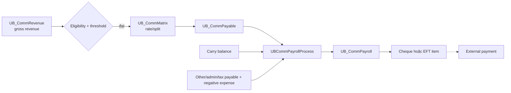

# Thanh toán VieFund — Business Guide

> **Trạng thái bằng chứng:** đã đối chiếu source code và SQL snapshot trong workspace ngày **2026-09-15**. Header của SQL snapshot ghi ngày **2025-11-02**; đây không phải bằng chứng về cấu hình, dữ liệu hoặc lịch batch đang chạy ở production.
>
> **Mục tiêu:** trả lời ba câu hỏi: client thực sự phải trả gì; representative (rep) được ghi nhận và nhận tiền thế nào; các luồng tiền còn lại đi qua VieFund ra sao.

### Quy ước bằng chứng

Tài liệu áp dụng ngưỡng chứng minh sau, không suy diễn từ label/comment/config đơn lẻ:

- một **fee đã xác minh** phải có đủ creator, amount/formula và posting;
- một **allocation payee đã xác minh** phải được persist vào `UB_CommPayable.iPayableMemberID`;
- một **settlement payee đã xác minh** phải được persist vào `UB_Cheque.Payee` hoặc các destination fields đã được điền của `UB_EFTItem`;
- `MgmtCode`, bank-account ID, report label, comment hoặc free-form instruction chỉ là routing/intent cho tới khi chuỗi trên được chứng minh;
- **Đã xác minh** = source/SQL snapshot chứng minh đủ chuỗi nội bộ; **Giới hạn** = chỉ chứng minh một phần hoặc chưa chứng minh runtime/external completion; **Cần xác minh** = chưa đủ chuỗi; **Không hỗ trợ** = code được khảo sát trực tiếp mâu thuẫn với claim.

## 1. Kết luận nghiệp vụ

| Câu hỏi | Kết luận | Mức bằng chứng |
|---|---|---|
| Client bị thu trực tiếp khoản nào? | Khoản có pipeline rõ nhất là **advisor/service fee** theo số tiền cố định hoặc DAV/AUA × bps, prorate theo thời gian, cộng GST/PST/HST. | **Đã xác minh** |
| Ngoài advisor fee còn fee nào? | Fee engine còn có portfolio/template fee (`iFeeType=1`), trustee/platform fee (`3`), transfer-out fee (`4`) và generic other fee (`99`) với creator + amount + posting đã truy vết. Type `5` xuất hiện ở UI/routing nhưng chưa đủ chuỗi để xác định business meaning. Ngoài ra còn transaction deductions, member expenses và product-cost metadata với mức bằng chứng khác nhau. | **Đã xác minh / Giới hạn** |
| Tiền đầu tư khi Buy/PAC có phải phí không? | Không. Đó là principal/contribution dùng mua tài sản. Chỉ phần được hạch toán riêng là fee/tax mới là chi phí trực tiếp. | **Đã xác minh** |
| Fee được lấy từ đâu? | Tùy cấu hình: bán fund, cash account, giảm commission của rep, hoặc thu từ bank account client qua trust/EFT. Nhánh GIC có định danh nhưng chưa đủ bằng chứng về auto-liquidation hoàn chỉnh. | **Đã xác minh / Giới hạn** |
| Rep được hưởng gì? | Gross revenue được phân bổ cho `iOverrideMemberID` của từng commission-matrix row; type `0` thường được dùng cho sell-rep bucket nhưng SP không cưỡng bức target về main member. Các row manager/override, split/joint hoặc assistant có thể nhận allocation riêng. Payroll cộng payable components, negative expense và carry balance rồi tạo cheque/EFT. | **Đã xác minh / Phụ thuộc matrix runtime** |
| Rep có “lương” hoặc “lợi nhuận” không? | Snapshot có **commission disbursement** mang tên Payroll, nhưng không thấy HR salary, hourly wage, benefits, employment-tax payroll hay accounting P&L/profit engine. | **Giới hạn** |
| Tạo EFT/cheque có đồng nghĩa tiền đã tới ngân hàng không? | Không. VieFund đã tạo payment instrument hoặc EFT item/file; external clearing/completion cần bằng chứng từ bank processor hoặc production operation. | **Đã xác minh / Cần xác nhận** |

## 2. Cách đọc một luồng tiền

Không nên dùng một từ “payment” cho mọi giai đoạn. Tài liệu này tách năm lớp:

1. **Obligation/cost** — ai nợ ai và vì lý do gì, ví dụ client nợ advisor fee.
2. **Funding source** — lấy tiền ở đâu, ví dụ cash account, bán fund, commission của rep hoặc bank account.
3. **Transaction posting** — VieFund ghi fee, trust transaction, revenue hoặc payable nào.
4. **Settlement/payment instrument** — transaction được settled và có thể gắn cheque/EFT.
5. **External completion** — ngân hàng/fund company thực sự nhận hoặc chuyển tiền; source snapshot thường không đủ để chứng minh bước này.

Ví dụ, việc tạo `UB_EFTItem` mới chỉ chứng minh hệ thống đã lập một yêu cầu EFT. Nó không tự chứng minh tài khoản ngân hàng đã debit/credit thành công.


## 3. Client phải chi trả những gì?

### 3.1. Advisor/service fee — khoản thu trực tiếp có pipeline đầy đủ

Fee được cấu hình bởi fee template và plan fee setting. Template quyết định tier, loại rate và nhóm tài sản được tính; plan setting quyết định template/phương thức funding áp dụng cho plan. Pipeline bắt đầu từ [`Fee4Service.aspx.cs`](../../../WebApp/Main/Fee4Service.aspx.cs#L891), qua [`Fee.StartGenerateTrxProcess`](../../../DLLs/UBClasses/Fee.cs#L89), rồi xử lý tại `UBFeeProcessOnePlanAdvisorFee` và `UBFeeGenerateTrxOneItem` trong [SQL snapshot](../../../MyPortfolioNew/VieFUND-Platform/src/SQLScript/000_4_CreateSP.sql#L329016).

#### Cơ sở tính

- `DAV` là daily/period asset value mà SP dùng làm base; tùy cấu hình tier có thể xét ở mức plan hoặc client.
- `dayRatio = GetDayYearRatio(dtStart, dtEnd)`; không nên hard-code `số ngày / 365` ở application vì hàm DB là nguồn tính hiện tại.
- Template có thể cho phép/loại các nhóm cash, GIC, FEL, DSC, NL hoặc F-series khi hình thành asset base.
- Các cờ `iIncludeFEL`, `iIncludeDSC`, `iIncludeNL` chỉ nói tài sản nào tham gia tính advisor fee; chúng **không chứng minh advisor fee chính là FEL/DSC**.

#### Công thức

**Fixed amount prorated**

```text
baseFee = ROUND(fixedAmount × dayRatio, 2)
```

**Basis points trên DAV**

```text
baseFee = ROUND(planDAV × 0.0001 × bps × dayRatio, 2)
```

Vì `1 bps = 0.0001`, cấu hình `40 bps` tương đương `0.40%` theo kỳ năm trước khi prorate.

**Thuế và tổng phải thu**

```text
feeTotal = baseFee + GST + PST + HST
```

Thuế được xác định qua `UBTaxDetail` dựa trên province của plan và province của head office. Rate thuế là dữ liệu/cấu hình tại thời điểm chạy; không nên chép một rate cố định vào code hoặc dùng ví dụ dưới đây làm production rate.

#### Ví dụ minh họa

Giả sử DAV là `$250,000`, rate là `40 bps`, `dayRatio = 0.25`:

```text
baseFee = ROUND(250,000 × 0.0001 × 40 × 0.25, 2)
        = $250.00
```

Nếu giả định riêng cho ví dụ rằng HST là `13%` và không có GST/PST tách riêng:

```text
HST      = $32.50
feeTotal = $282.50
```

**Cần xác nhận:** production template, tier, DAV, province và tax table mới quyết định số tiền thật.

### 3.2. Nguồn tiền dùng trả fee

`UB_FeeSource.iSourceType` ghi cách fee được fund. Đây là **nguồn thanh toán**, không làm thay đổi bản chất nghĩa vụ fee.

| `iSourceType` | Nguồn | Posting/hành vi đã thấy | Kết luận |
|---:|---|---|---|
| `0` | Fund holding | Gọi `UBFundTrxSellShort` để tạo sell/redemption phục vụ fee. | Phần tài sản bán ra fund fee; principal bán không phải là một loại fee mới. **Đã xác minh**. |
| `1` | GIC | Comment/nhánh code định danh nguồn GIC. | Chưa có nhánh thực thi source type `1` trong transaction generator đã khảo sát. **Giới hạn**. |
| `2` | Cash account | Ghi debit fee và các thành phần tax trong `UB_TrustTrx`. | **Đã xác minh**. |
| `11` | Rep commission | Generator đọc source `11`, tạo trust posting và expense/rebate âm làm giảm payout member. | **Đã xác minh ở generator** ([SQL](../../../MyPortfolioNew/VieFUND-Platform/src/SQLScript/000_4_CreateSP.sql#L324419)). [`UBFeeAddHoc`](../../../MyPortfolioNew/VieFUND-Platform/src/SQLScript/000_4_CreateSP.sql#L322295) có thể tạo source này, nhưng standard advisor-fee setting UI từ chối payment method `3` ([UI](../../../WebApp/Main/PanelPlanFeeSetting.aspx.cs#L432)); vì vậy không mô tả đây là funding mode advisor chuẩn nếu chưa có runtime producer khác. |
| `12` | Client bank | Tạo trust deposit và gọi `UBEFTItemAdd`. | Hệ thống tạo yêu cầu thu qua EFT; bank completion vẫn **cần xác nhận**. |

Chi tiết nguồn và liên kết transaction/trust nằm ở [`UB_FeeSource`](../../Database/Table_Description.md#ub_feesource). Một fee đã có `iTrxID > 0` hoặc `iStatus >= 2` bị bỏ qua trong bước generate, là guard chống xử lý lại cùng item.

#### 3.2.1. Một fee hay nhiều người nhận?

[`UBFeeProcessOnePlanAdvisorFee`](../../../MyPortfolioNew/VieFUND-Platform/src/SQLScript/000_4_CreateSP.sql#L329016) tạo **một** obligation trong `UB_Fee`, **một** phép tính trong `UB_FeeDetail`, nhưng có thể tạo nhiều `UB_FeeSource` cùng trỏ tới `iFeeID`. `UB_FeeSource` chỉ có source/account/amount và transaction links, không có payee hoặc tỷ lệ payee.

Vì vậy cần phân biệt:

- nhiều `UB_FeeSource` = **chia nguồn tiền để trả cùng một fee**;
- nhiều `UB_CommPayable` = **chia revenue downstream cho nhiều member/payee**;
- trust bank, fund position và client bank account là account/source trung gian, không tự trở thành bên hưởng fee.

Sau khi fee được post, `UBFeeGenerateCommOneItem` tạo một revenue record gắn với `iRepID` của plan. Revenue đó mới đi qua `UB_CommMatrix` để có thể sinh nhiều payable. Source snapshot không chứng minh external recipient cuối cùng của advisor fee.

#### 3.2.2. Nguồn được ưu tiên và chia amount thế nào?

[`UBFeeProcessRedeemInfo`](../../../MyPortfolioNew/VieFUND-Platform/src/SQLScript/000_4_CreateSP.sql#L330489) dùng `iCashOpt`:

| `iCashOpt` | Quy tắc chọn nguồn |
|---:|---|
| `0` | Fund only. |
| `1` | Cash first; thiếu thì tìm fund cho phần còn lại. |
| `2` | Fund first; không có fund đủ mới dùng cash. |
| `3` | Cash only. |

Trong implementation hiện tại:

- locked fund position được thử trước, sau đó fund được sắp theo load/risk/MKV option;
- một fund chỉ được chọn khi đủ phần còn lại; chưa có fan-out qua nhiều fund positions;
- nhánh mixed hiện có tối đa **cash + một fund**;
- nếu không có nguồn đủ theo policy, output source bị reset và fee không được generate thành transaction.

Việc tách fee/tax giữa các source nằm tại [SQL `L329170`](../../../MyPortfolioNew/VieFUND-Platform/src/SQLScript/000_4_CreateSP.sql#L329170). Về invariant nghiệp vụ:

```text
sourceGross_i = sourceFee_i + sourceTax_i
SUM(sourceGross_i) = UB_Fee.mFeeTotal
SUM(sourceFee_i)   = UB_Fee.mFee
SUM(sourceTax_i)   = UB_Fee.mGST + mPST + mHST
```

Nếu cash đủ toàn bộ gross, cash chịu toàn bộ fee và tax. Với nguồn mixed, code phân fee/tax cho cash theo amount khả dụng rồi fund nhận residual; [`UBFeeGenerateTrxOneItem`](../../../MyPortfolioNew/VieFUND-Platform/src/SQLScript/000_4_CreateSP.sql#L324069) kiểm tra và sửa chênh lệch component/rounding về hai chữ số trước khi posting.

Đây là **allocation theo nguồn tài trợ**, không phải chia fee cho dealer, rep, manager và assistant. Các bên đó chỉ xuất hiện ở lớp commission payable dưới đây.

### 3.3. Dữ liệu được lưu

| Bảng | Dữ liệu nghiệp vụ chính |
|---|---|
| `UB_FeeTemplate` | Tier, fixed/bps rate và điều kiện include/exclude asset. |
| [`UB_PlanFee`](../../Database/Table_Description.md#ub_planfee) | Fee setting áp dụng cho plan và phương án funding. |
| `UB_Fee` | `mFee`, `mGST`, `mPST`, `mHST`, `mFeeTotal`, plan/account/payment/currency/status. |
| `UB_FeeDetail` | DAV, rate, plan fee, tier/base dùng cho phép tính. |
| [`UB_FeeSource`](../../Database/Table_Description.md#ub_feesource) | Nguồn funding và liên kết tới fund/trust transaction. |

[`Fee.TemplateUpdate`](../../../DLLs/UBClasses/Fee.cs#L515) là entry point BLL cho cấu hình template; phần generate/batch nằm trong [`Fee.cs`](../../../DLLs/UBClasses/Fee.cs#L1580).

### 3.4. Các fee obligation khác do VieFund tạo

Ngoài advisor fee (`UB_Fee.iFeeType = 2`), audit tìm được bốn type khác có đủ creator + amount/formula + posting. Type `5` chỉ mới có UI và routing chung nên được tách khỏi inventory đã xác minh.

| `UB_Fee.iFeeType` | Loại | Cách xác định amount | Payer/funding và recipient | Mức bằng chứng |
|---:|---|---|---|---|
| `1` | Portfolio/template fee; đây là tên thể hiện trong comment/path code, không phải legal product label | UI yêu cầu fee template ([`PanelFeeAddItem.aspx.cs`](../../../WebApp/Main/PanelFeeAddItem.aspx.cs#L148)); `FeeProcessing` route type `1` tới `UBFeeProcessOnePlan` hoặc `UBFeeProcessOnePlanM` ([BLL](../../../DLLs/UBClasses/FeeProcessing.cs#L323)). SP tính fee từ template/DAV, ghi `mFee`/tax vào `UB_Fee` với `iFeeType=1`, tạo source rồi gọi `UBFeeGenerateTrxOneItem` ([SQL calculation](../../../MyPortfolioNew/VieFUND-Platform/src/SQLScript/000_4_CreateSP.sql#L327875), [insert/posting](../../../MyPortfolioNew/VieFUND-Platform/src/SQLScript/000_4_CreateSP.sql#L330130)). | Type `1` bị ép về payment method từ fund/cash redemption trong ad-hoc path; ultimate external recipient chưa được chứng minh. | **Đã xác minh creator + calculation + posting**. |
| `3` | Trustee fee; một số dealer đổi nhãn thành platform fee | Fixed amount từ `UB_PlanFee.iFeeRate`, có discount/cap và frequency adjustment; cộng GST/PST/HST. Lưu ý precision bị giới hạn bởi biến `int`, xem mục 3.4.1. | Obligation gắn plan; nguồn có thể là fund, cash, client bank hoặc rep commission. Ultimate legal trustee/payee chưa được chứng minh. | **Đã xác minh calculation + posting; payee giới hạn**. |
| `4` | Transfer-out / transfer fee | Amount do operator/config truyền từ generic fee-item UI; không có universal percentage. | Payer phụ thuộc `UB_FeeSource`; revenue nội bộ dùng transfer category. External recipient chưa xác minh. | **Đã xác minh manual amount + posting**. |
| `99` | Generic other fee | Amount manual/configured, sau đó fee engine tính tax và funding. | Payer phụ thuộc source; downstream đi vào other/admin revenue category. | **Đã xác minh generic fee**; subtype cụ thể phụ thuộc dealer/config. |
| `5` | Chưa xác định chắc business meaning | UI yêu cầu template và `FeeProcessing` route chung với type `1`, nhưng audit chưa cô lập được một chuỗi formula + insert/posting riêng đủ để phân biệt type `5`. | Không gán payer/recipient riêng từ label hoặc routing chung. | **Cần xác minh; không nằm trong inventory verified**. |

#### 3.4.1. Trustee/platform fee

[`UBFeeProcessOnePlanTrusteeFee`](../../../MyPortfolioNew/VieFUND-Platform/src/SQLScript/000_4_CreateSP.sql#L330178) xử lý setting được nhập tại [`PanelPlanFeeSetting.aspx.cs`](../../../WebApp/Main/PanelPlanFeeSetting.aspx.cs#L394). Precision cần đọc đúng theo kiểu biến trong snapshot: `@mFeeDefault` được khai báo là `int` ([SQL `L330188`](../../../MyPortfolioNew/VieFUND-Platform/src/SQLScript/000_4_CreateSP.sql#L330188)), rồi nhận `ROUND(iFeeRate, 2)` ([SQL `L330247`](../../../MyPortfolioNew/VieFUND-Platform/src/SQLScript/000_4_CreateSP.sql#L330247)). Vì assignment vào `int`, không được kết luận hai chữ số thập phân của configured rate được giữ nguyên.

```text
configuredRounded = ROUND(UB_PlanFee.iFeeRate, 2)
defaultFeeInt     = configuredRounded assigned to @mFeeDefault int

percentageDiscount = ROUND(defaultFeeInt × discountPercent × 0.01, 2)
dollarDiscount     = configuredDiscountAmount
netFee              = defaultFeeInt - applicableDiscount
feeTotal            = netFee + GST + PST + HST
```

Muốn xác định chính xác conversion/rounding cho một configured rate có phần lẻ phải chạy test trên SQL version đang deploy; snapshot chỉ đủ chứng minh rằng cent precision **không được bảo toàn một cách chắc chắn** qua biến `int`.

Nếu discount có total cap, SP trừ phần discount đã dùng trong các `UB_Fee` trước. Nhánh semiannual nhân amount còn lại với `0.5`; các frequency khác còn điều khiển next-run date, nên không được gọi mọi trustee fee là “annual fee”. Discount 100% có thể làm net fee bằng zero và không tạo một payee mới.

Fee được ghi vào `UB_Fee`, `UB_FeeDetail`, `UB_FeeSource`, rồi dùng transaction generator chung. Pending item có thể soft-delete; khi transaction/commission bị reverse, [`UBFeeItemResetTrxComm`](../../../MyPortfolioNew/VieFUND-Platform/src/SQLScript/000_4_CreateSP.sql#L325596) clear downstream links theo lifecycle, không sửa amount bằng SQL ad-hoc.

#### 3.4.2. Transfer-out và generic other fee

[`PanelFeeAddItem.aspx.cs`](../../../WebApp/Main/PanelFeeAddItem.aspx.cs#L130) cho phép tạo generic fee item với amount, fee subtype và payment option. Generator ánh xạ transfer fee vào transfer income category và generic fee vào other/admin category tại [SQL `L322976`](../../../MyPortfolioNew/VieFUND-Platform/src/SQLScript/000_4_CreateSP.sql#L322976).

Các label như deregistration, withdrawal hoặc cheque fee có xuất hiện trong report taxonomy, nhưng vòng khảo sát chưa tìm được dedicated creator/rate cho từng label. Vì vậy:

- một row `iFeeType = 99` có amount thật là **generic fee đã post**;
- chỉ nhìn label “cheque/withdrawal fee” chưa đủ để kết luận có một fee engine riêng;
- không tìm thấy dedicated NSF, returned-payment, bank-charge hoặc EFT-fee generator.

> `UB_Fee.iFeeType` và `UB_TrustTrx.iType` là hai namespace khác nhau. Ví dụ trust type `9/14/15` dùng cho trustee fee/rebate/advisor-paid routing; không được đọc chúng như `UB_Fee.iFeeType = 9/14/15`.

### 3.5. Fee/deduction ở cấp fund transaction

Nhóm này nằm chủ yếu trong `UB_FundTrxDetail`, không phải `UB_Fee`. Amount có thể do calculator preview, operator nhập hoặc import từ hệ thống/file bên ngoài.

| Khoản | Cách VieFund xử lý | Payer/recipient có thể kết luận | Mức bằng chứng |
|---|---|---|---|
| Transaction admin fee / other fee | Calculator [`UBFundTrxManualCalc`](../../../MyPortfolioNew/VieFUND-Platform/src/SQLScript/000_4_CreateSP.sql#L387127) chỉ **preview** cho purchase types `22–26`: `ROUND(gross × rate × 0.01, 2)` khi admin rate trong `(0,20)` và other rate trong `(0,6)`. UI vẫn truyền rate **và amount** khi save ([UI](../../../WebApp/Main/PopupTrxManualAdd.aspx.cs#L519)); persistence đi qua `Trx.ManualUpdate`, chọn `UBFundTrxManualAdd` hoặc `UBFundTrxManualUpdate` và truyền `AdminFee`/`OtherFee` ([BLL](../../../DLLs/UBClasses/Trx.cs#L3076)). | Field được persist cùng client transaction nhưng business payer/recipient còn phụ thuộc settlement và dealer/product. Không dùng output calculator làm bằng chứng rằng transaction đã được post. | **Đã xác minh preview + save path; recipient cần xác nhận**. |
| FEL / client-paid sales charge | Transaction có `fCLPaidCommRate` và dealer commission client-paid; calculator dùng gross × rate. | Khi amount client-paid khác zero, client là payer; revenue đi vào dealer/commission pipeline. Product `LoadType=FE` một mình chưa chứng minh charge phát sinh. | **Đã xác minh ở transaction level**. |
| DSC và `mFees` | Manual/import path lưu amount `mDSC`, `mFees`; product còn có DSC rate/duration metadata. | Không đồng nhất DSC client deduction với fund-company-paid commission. Recipient và universal schedule chưa được chứng minh. | **Đã xác minh amount storage; formula universal chưa có**. |
| Short-term, management, performance, penalty, clawback, deduction total | Các amount được lưu/import trong `UB_FundTrxDetail` và hiển thị ở compliance/report flows. | Payer/recipient phụ thuộc source transaction. | **Đã xác minh stored deduction; auto-calculation chỉ có dấu vết**. |
| Switch/redemption fee | Switch hoặc sell tự thân không tạo fee. Chỉ có cost khi transaction detail mang deduction hoặc một expense/fee item riêng được tạo. | Không có universal rate trong snapshot. | **Không phải fee mặc định**. |

UI nhập manual amount nằm tại [`PopupTrxManualAdd.aspx.cs`](../../../WebApp/Main/PopupTrxManualAdd.aspx.cs#L519). Reversal của transaction tạo linked opposite transaction và giữ original/detail phục vụ audit; không xóa deduction gốc.

### 3.6. Product cost/metadata chưa đủ bằng chứng về direct charge

| Thuật ngữ/field | Điều source chứng minh | Kết luận |
|---|---|---|
| MER | Được hiển thị trên fund/client UI; transaction có thể có imported `mMgmtFee`. | Product-embedded metadata/cost; không thấy universal `UB_Fee` accrual debit client. |
| Trailer / fund service fee | `fServFeeRate` là product metadata và service/trailing commission có revenue category. | Có thể tạo/import commission revenue; không chứng minh VieFund trực tiếp thu client bằng rate này. |
| Account setup fee | `mAcctSetupFee` được validate/lưu trong fund definition. | Chưa tìm thấy monetary posting consumer; **chỉ có dấu vết cấu hình**. |
| Insurance cost option/premium | Insurance module lưu issuer, policy, premium và cost option. | Contract/workflow data; chưa thấy trust/EFT/commission link chứng minh client đã trả insurer qua VieFund. |
| GIC/insurance matrix rate | `fTermDeposit` và `fInsurance` phân bổ commission revenue. | Là payout rate, không phải client fee rate. |
| Transfer-fee rebate applied | Boolean trên plan, không có amount/formula/posting consumer đã tìm thấy. | Flag metadata, không phải rebate transaction. |

### 3.7. Những khoản không được tự động gọi là “phí client”

| Khoản | Cách diễn giải đúng |
|---|---|
| Buy/PAC contribution | Principal client đưa vào để mua tài sản, không phải fee. |
| Sell/redemption proceeds | Tiền bán tài sản trả về trust/client; chỉ deduction được posting riêng mới là fee/tax. |
| Fee redemption | Bán fund để fund một obligation `UB_Fee`; không tự tạo “redemption fee” mới. |
| RRIF withholding | Khoản khấu trừ làm giảm net withdrawal; không phải advisor fee. |
| Cash/trust/bank/EFT/cheque | Funding source hoặc payment instrument; không tự tạo charge. |
| `mTaxCollected` trong commission | Component phân bổ/payout member trong trace hiện tại; không phải RRIF WHT. |
| NSF/bank/EFT fee | Không tìm thấy dedicated creator/rate trong source snapshot. |

Quy tắc phân loại ngắn:

```text
UB_Fee.iFeeType                       => fee obligation do fee engine quản lý
UB_FundTrxDetail.m*Fee                => transaction amount, có thể manual/imported
UB_FundDefDetail.*Rate / MER          => product metadata cho tới khi chứng minh posting consumer
UB_CommMatrix.f*                      => payout allocation rate, không phải client charge rate
UB_EFTItem / UB_Cheque / cash / trust => payment rail hoặc funding source, không phải fee
```

## 4. Representative được hưởng và được trả thế nào?

### 4.1. Bốn khái niệm không được đồng nhất

| Khái niệm | Nghĩa trong pipeline |
|---|---|
| **Revenue** | Gross commission/revenue được import, tạo từ trust settlement hoặc từ nghiệp vụ khác và lưu ở `UB_CommRevenue`. |
| **Payable** | Phần revenue đã qua eligibility, threshold và commission matrix, trở thành nghĩa vụ trả cho rep/member/manager. |
| **Payout / Payroll** | Kỳ giải ngân payable, carry balance và adjustment bằng cheque/EFT. |
| **Salary / Profit** | Không có engine đủ bằng chứng trong snapshot để tính lương HR hoặc lợi nhuận kế toán. Không dùng `UB_CommPayroll` thay cho hai khái niệm này. |

Luồng UI là [`CommissionView.aspx.cs`](../../../WebApp/Main/CommissionView.aspx.cs#L1369), BLL là [`CommissionRevenue.MoveTagged2Payable`](../../../DLLs/UBClasses/CommissionRevenue.cs#L254), DB wrapper là [`UBCommissionMove2Payable`](../../../MyPortfolioNew/VieFUND-Platform/src/SQLScript/000_4_CreateSP.sql#L234809), rồi mới phân bổ từng revenue tại [`UBCommissionMove2PayableOne`](../../../MyPortfolioNew/VieFUND-Platform/src/SQLScript/000_4_CreateSP.sql#L235408).



### 4.2. Điều kiện revenue được move sang payable

**Đã xác minh:** chỉ revenue đang ở trạng thái pending phù hợp mới được xét. Pipeline còn kiểm tra các guard về FX, deposit date và withholding. Revenue không đủ điều kiện có thể bị skip thay vì tạo payable.

Earning threshold lấy balance mới nhất trong `UB_CommRevenueBalance`, gồm `mRevenue` và `mServiceFee`. Tùy dealer policy, threshold được xét trên regular revenue hoặc regular + service fee. Vì vậy không thể chỉ lấy một dòng gross × rate mà bỏ qua eligibility/threshold.

### 4.3. Chọn loại và rate commission

Commission type được ánh xạ vào các cột rate của `UB_CommMatrix`:

| Type | Rate field |
|---|---|
| `REG` | `fRegular` |
| `PAC` | `fPAC` |
| `INT` | `fInternalTrx` |
| `SER` | `fServiceFee` |
| `GIC` | `fTermDeposit` |
| `INS` | `fInsurance` |
| `OTH` | `fOther` |

Matrix có thể áp dụng cho main rep và cho các member override/split. Allocator đọc `UB_CommMatrix.iOverrideMemberID`, `iOverrideMemberType` và các rate tại [`UBCommissionMove2PayableOne`](../../../MyPortfolioNew/VieFUND-Platform/src/SQLScript/000_4_CreateSP.sql#L235408); rate cuối cùng không phải một phần trăm hard-code.

Có một lớp setup khác trong `UB_MemberCommRate` với `fRepRate`, `fBranchOverride` và các split rate. Tuy nhiên allocator hiện tại không đọc trực tiếp bảng này, và vòng khảo sát chưa xác định bước đồng bộ sang `UB_CommMatrix`. Vì vậy không dùng các field setup đó trực tiếp để tính payable nếu chưa chứng minh matrix runtime.

### 4.4. Những đối tượng nào tham gia phần chia?

| Đối tượng | `iOverrideMemberType` | Cách tham gia | Bằng chứng/kết luận |
|---|---:|---|---|
| Main-advisor matrix row | `0` | Allocator giữ label/rate bucket “sell rep”, nhưng payable target được persist trực tiếp từ `@iOverrideMemberID`, không bị SP cưỡng bức về `@iMainMemberID`. | `UB_CommPayable.iPayableMemberID = @iOverrideMemberID` ([SQL](../../../MyPortfolioNew/VieFUND-Platform/src/SQLScript/000_4_CreateSP.sql#L235878)). Chỉ gọi target là main member khi matrix runtime thực sự trỏ tới member đó. **Đã xác minh persisted target; business role phụ thuộc matrix**. |
| Manager/override member M1/M2 | `1`, `2` | Có row/rate riêng, được load sau nhóm non-manager. | Có thể nhận payable và cheque/EFT riêng. Tên chức danh pháp lý chi tiết vẫn phụ thuộc lookup/config. |
| Split/joint member | `3`, `5` | Mỗi row nhận một allocation độc lập theo rate của row. | Type `3` được comment là split; code gom `3/5` vào split bucket. Khác biệt business giữa `3` và `5` **cần xác nhận**. |
| Assistant | `4` | Allocator chung vẫn tạo payable theo row matrix. | Một SP reporting gọi type `4` là assistant. **Đã xác minh ở mức code label**. |
| Dealer/dealership | Không phải payee row bắt buộc | Nếu tổng rate nhỏ hơn `100%`, phần chưa phân bổ không tạo payable cho member khác. | Có residual ở revenue layer; **không đủ bằng chứng gọi là net profit hoặc external cash retained**. |
| Member chịu fee rebate/expense | Chọn từ `0/3/5`, và type `1` có điều kiện | Nhận payable âm `iEntryType = 4`, làm giảm payout. | Đây là cost allocation cho member, không phải một payee mới. |

Fund company/management company có thể là nguồn gross revenue; trust bank/client bank là account vận chuyển tiền. Nhưng trong pipeline allocation này chưa có bằng chứng các đối tượng đó nhận một `UB_CommPayable` riêng.

### 4.5. Công thức phân bổ từng component

`CommissionRevenue.Update` lưu các component riêng: `mCommAmountGross`, `mCommPayable`, `mTrxOtherFee`, `mTrxAdminFee` và `mTaxCollected` ([BLL](../../../DLLs/UBClasses/CommissionRevenue.cs#L635)). Base thực sự được allocator chia cho commission là `mCommPayable`, được SP đặt tên nội bộ là dealer commission.

Với mỗi matrix row `i`:

```text
commission_i = ROUND(mCommPayable × commissionRate_i × 0.01, 2)
other_i      = ROUND(mTrxOtherFee × fOther_i × 0.01, 2)
admin_i      = ROUND(mTrxAdminFee × fTrxAdminFee_i × 0.01, 2)
tax_i        = ROUND(mTaxCollected × taxRate_i × 0.01, 2)
```

Nếu rate của component là `100%`, SP dùng nguyên source amount. Với service-fee revenue, `taxRate_i` có thể dùng `fServiceFee` khi `iTaxOpt = 1`; nhánh admin đặc thù có thể dùng admin rate. Vì vậy một member có thể nhận các tỷ lệ khác nhau cho commission, other fee, admin fee và tax-collected component.

Ví dụ `mCommPayable = $1,000`, ba row có rate `70%`, `20%`, `10%`:

```text
main rep = $700.00
split    = $200.00
manager  = $100.00
total    = $1,000.00
```

Quy tắc rounding/cap:

- mỗi allocation được round hai chữ số;
- cumulative amount bị chặn không vượt source amount, kể cả reversal âm;
- khi tổng rate của một component đúng `100%`, residual cent được điều chỉnh vào row đang xử lý để tổng khớp source; implementation không bảo đảm luôn chọn row lớn nhất;
- `bAssign100 = 1` hoặc plan thuộc rule commission 100% có thể ép một allocation thành `100%` và kết thúc loop;
- nếu tổng rate nhỏ hơn `100%`, phần chênh không tự tạo payable cho một stakeholder khác.

Sau khi thành công, SP ghi một hoặc nhiều `UB_CommPayable`, chuyển `UB_CommRevenue.iStatus` sang `1`, audit rate/ngày/user và cập nhật revenue balance.

### 4.6. Fee do commission của rep trả được chia cho ai?

Khi fee có source type `11`, [`UBCommissionExpenseAdd4Rebate`](../../../MyPortfolioNew/VieFUND-Platform/src/SQLScript/000_4_CreateSP.sql#L232968) chọn member từ matrix:

- type `0`, `3`, `5` nếu `fServiceFee > 0`;
- type `1` chỉ khi `fServiceFee >= 60`;
- type `2` và `4` không được chọn trong path rebate này.

Nếu chỉ có một member, member đó chịu toàn bộ. Nếu có nhiều member:

```text
expenseShare_i = ROUND(
    feeAmount × fServiceFee_i / SUM(fServiceFee),
    2
)
```

Residual do rounding được dồn vào member có allocation lớn nhất. Sau đó amount đổi thành số âm và được insert vào `UB_CommPayable` với `iEntryType = 4`, nên tự giảm tổng payout của member. Đây là weighted cost-sharing theo `fServiceFee`, không dùng `UB_CommMatrix.fExpense`.

Dealer `DSID = 1912` có nhánh riêng tạo negative internal commission revenue thay vì gọi rebate SP; không áp công thức trên một cách máy móc cho dealer đó.

### 4.7. Từ payable tới số tiền giải ngân

UI gọi payroll tại [`CommissionView.aspx.cs`](../../../WebApp/Main/CommissionView.aspx.cs#L2328); BLL gọi [`CommissionRevenue.PayrollProcess`](../../../DLLs/UBClasses/CommissionRevenue.cs#L1407); DB refresh/process tại [`UBCommPayrollTMPRefresh`](../../../MyPortfolioNew/VieFUND-Platform/src/SQLScript/000_4_CreateSP.sql#L254931) và [`UBCommPayrollProcess`](../../../MyPortfolioNew/VieFUND-Platform/src/SQLScript/000_4_CreateSP.sql#L254407).

Payroll gom theo `iPayableMemberID`:

```text
currentPayable = SUM(
    mPayableAmount
  + mTrxOtherFeePayable
  + mTrxAdminFeePayable
  + mTaxCollectedPayable
)

instrumentAmount = currentPayable + lastNegativeBalance
```

Negative expense `iEntryType = 4` đã nằm trong `mPayableAmount`, nên giảm `currentPayable`. Chỉ last balance âm được carry; nếu `instrumentAmount < 0`:

```text
instrumentAmount = 0
newCarryBalance  = phần âm chuyển sang kỳ sau
```

Điểm cần sửa cách hiểu: `mTaxCollectedPayable` được **cộng** vào `currentPayable` của member. Công thức nội bộ:

```text
mCommission = currentPayable - mTaxCollectedNet - mExpense
```

chỉ tách component phục vụ payroll/reporting; nó không phải công thức trừ tax khỏi cheque/EFT. Source đã khảo sát không chứng minh `mTaxCollectedPayable` được remittance tới tax authority hoặc là employment-tax withholding.

Payroll ghi `UB_CommPayroll`, đánh dấu payable đã paid, sau đó:

- cheque path gọi `UBChequeFromPayrollAdd`, resolve member name và persist vào `UB_Cheque.Payee`;
- EFT path chọn `UB_MemberBankAccount` rồi gọi `UBEFTItemAdd` với bank-account ID ([SQL](../../../MyPortfolioNew/VieFUND-Platform/src/SQLScript/000_4_CreateSP.sql#L254619)); item ban đầu có thể chưa có destination snapshot;
- [`UBEFTItemRefreshPending`](../../../MyPortfolioNew/VieFUND-Platform/src/SQLScript/000_4_CreateSP.sql#L307530) có logic hydrate `BankCode`, transit, account number và `HolderName` cho payroll EFT (`iLinkedType=0`), nhưng audit tĩnh chưa tìm thấy caller bảo đảm bước refresh đã chạy cho mọi item;
- enqueue `UB_CommPayrollObjPending` cho xử lý tiếp.

Do đó member/payable target của payroll đã được chứng minh, còn **settlement payee của từng EFT item** chỉ đạt ngưỡng đã xác minh sau khi destination fields được populate. Việc có cheque/EFT item vẫn chỉ là mốc internal processing, không phải bằng chứng bank clearing.

### 4.8. Những tên field không tạo thêm stakeholder

| Field/khái niệm | Điều có thể kết luận | Điều không được suy diễn |
|---|---|---|
| `mTrxOtherFeePayable` | Component được chia cho cùng matrix payee bằng `fOther`. | Không chứng minh có “other-fee department” riêng. |
| `mTrxAdminFeePayable` | Component được chia cho cùng payee bằng `fTrxAdminFee`. | Từ “admin” không định danh một admin employee/department nhận tiền. |
| `mTaxCollectedPayable` | Component được cộng vào payout member trong trace này. | Không chứng minh tax authority là recipient hoặc đây là payroll withholding. |
| Carry balance | Nghĩa vụ âm của chính member chuyển kỳ. | Không phải tiền chuyển cho stakeholder thứ ba. |
| Dealer residual | Phần source chưa thành member payable khi rate tổng nhỏ hơn `100%`. | Không phải net profit nếu chưa có GL, operating cost và tax accounting. |

### 4.9. “Lương” và “lợi nhuận” nằm ở đâu?

**Giới hạn đã xác minh trong phạm vi workspace/snapshot:** không tìm thấy module tính hourly wage, salary period, overtime, benefits, vacation, employment deductions/remittance hoặc journal/P&L để tính net profit.

Vì vậy:

- `UB_CommPayroll` nên dịch là **kỳ giải ngân commission**, không phải hệ thống payroll nhân sự;
- `gross revenue - rep payable` không được tự gọi là dealer profit, vì còn tax, expense, adjustment, operating cost và accounting recognition ngoài pipeline này;
- nếu rep có salary/bonus ngoài commission, hoặc dealer cần profitability report, phải xác nhận hệ thống HR/accounting tích hợp ngoài VieFund.

### 4.10. Các cost khác do rep/member chịu

| Cost | Ai chịu | Cách phân bổ/posting | Recipient có được chứng minh? |
|---|---|---|---|
| Advisor-fee rebate source `11` | Member type `0/3/5`, và type `1` có điều kiện | Weighted theo `fServiceFee`, ghi payable âm `iEntryType=4`; xem mục 4.6. | Không có positive payee riêng trong expense SP. |
| Extra trade admin expense | Member được chọn từ commission matrix theo điều kiện type/rate của SP | Trade UI truyền amount. [`UBCommissionExpenseAdd4Trade`](../../../MyPortfolioNew/VieFUND-Platform/src/SQLScript/000_4_CreateSP.sql#L233062) chỉ nhân amount với `1.13` khi `@iOptions=0`, sau đó chia weighted theo `fServiceFee` và ghi payable âm. | Comment ghi đây là feature lịch sử của dealer `1274`; không tạo payable cho admin person/department và không được áp `×1.13` như biểu phí universal. |
| MFDA fee | Member được tham chiếu bởi `UB_ReportAsset4MFDAFeeDetailTMP.iMemberID` | [`UBMFDAFeeProcess`](../../../MyPortfolioNew/VieFUND-Platform/src/SQLScript/000_4_CreateSP.sql#L438881) persist chính `D.iMemberID` làm `iPayableMemberID` và `mPayableAmount = -D.mFee` ([SQL](../../../MyPortfolioNew/VieFUND-Platform/src/SQLScript/000_4_CreateSP.sql#L438920)). | SP không phân loại member đó là main hay split và không tạo cheque/EFT/payable dương cho MFDA/regulator. |

Extra trade expense được bật/gửi từ trade UI, ví dụ [`PopupTradeAdd.aspx.cs`](../../../WebApp/Main/PopupTradeAdd.aspx.cs#L3243). Comment lịch sử nhắc amount `$5` và dealer `1274`, nhưng implementation không hard-code `$5`; amount runtime, `@iOptions` và dealer policy phải được xác nhận trước khi dùng làm biểu phí chính thức.

## 5. Các luồng tiền khác

### 5.1. Buy, sell, switch và transfer

| Luồng | Bản chất tiền/tài sản | DB entry point |
|---|---|---|
| Buy | Cash/principal của client đổi thành fund position. | [`UBFundTrxBuy`](../../../MyPortfolioNew/VieFUND-Platform/src/SQLScript/000_4_CreateSP.sql#L389772) |
| Sell/redemption | Fund position đổi thành proceeds; có thể trả client hoặc dùng fund một nghĩa vụ như fee. | [`UBFundTrxSell`](../../../MyPortfolioNew/VieFUND-Platform/src/SQLScript/000_4_CreateSP.sql#L397587) |
| Switch | Chuyển holding/fund; không mặc nhiên là payment fee. | [`UBFundTrxSwitch`](../../../MyPortfolioNew/VieFUND-Platform/src/SQLScript/000_4_CreateSP.sql#L400027) |
| Transfer | Chuyển tài sản/cash theo transaction context. | [`UBFundTrxTransfer`](../../../MyPortfolioNew/VieFUND-Platform/src/SQLScript/000_4_CreateSP.sql#L402581) |

BLL wrappers tương ứng nằm trong [`Trx.cs`](../../../DLLs/UBClasses/Trx.cs#L632). PAC và SWP là các cơ chế định kỳ dẫn tới buy/sell và trust movements tương ứng; cần đọc posting thực tế thay vì coi toàn bộ scheduled amount là fee.

### 5.2. Trust settlement, cheque và EFT

[`SettlementView.SettleItem`](../../../WebApp/Main/SettlementView.aspx.cs#L1080) gọi [`TrustAccount.Settle`](../../../DLLs/UBClasses/TrustAccount.cs#L1649). Trong luồng settlement:

- `UB_TrustTrx.iStatus = 1`: pending/unsettled;
- `UB_TrustTrx.iStatus = 2`: settled;
- tùy option, VieFund tạo/gộp cheque hoặc EFT và gắn ID vào trust transaction;
- unsettle có thể bị chặn bởi transaction phụ thuộc, payable đã paid hoặc EFT đã process.

Settlement là bước posting/authorization nội bộ. Chi tiết permission, dependency, cheque/EFT file và unsettle xem [Settlement — đối soát và thanh toán tiền trong trust account](../settlement/README.md).

#### 5.2.1. Settlement payee không đồng nghĩa economic recipient

Commission allocation payee được chứng minh bằng `UB_CommPayable.iPayableMemberID`. Settlement payee chỉ được chứng minh khi target được ghi vào `UB_Cheque.Payee` hoặc destination fields của `UB_EFTItem`.

| Đối tượng/record | Vai trò được source chứng minh | Điểm persist | Giới hạn |
|---|---|---|---|
| Member nhận commission payroll | Cheque path persist member name làm payee. EFT path link payroll với member bank account; destination snapshot cần bước hydrate. | [`UBChequeFromPayrollAdd`](../../../MyPortfolioNew/VieFUND-Platform/src/SQLScript/000_4_CreateSP.sql#L203396); [`UBEFTItemRefreshPending`](../../../MyPortfolioNew/VieFUND-Platform/src/SQLScript/000_4_CreateSP.sql#L307530). | EFT payee chỉ verified trên item đã populate destination fields; static caller của refresh chưa tìm thấy. |
| Client/plan clients — cheque | Withdrawal cheque lấy tên client của plan và persist vào `UB_Cheque.Payee`; có thể ghép nhiều tên. | [`UBChequeGetID4Client`](../../../MyPortfolioNew/VieFUND-Platform/src/SQLScript/000_4_CreateSP.sql#L203490). | Không chứng minh allocation tỷ lệ giữa joint holders hoặc cheque clearing. |
| Client — ordinary withdrawal EFT | Với trust type không phải `12/13`, code đọc customer bank destination và truyền holder/bank fields vào `UBEFTItemAdd`. | [`UBTrustTrxAddWithdrawal`](../../../MyPortfolioNew/VieFUND-Platform/src/SQLScript/000_4_CreateSP.sql#L645464). | Chỉ chứng minh EFT instruction; không chứng minh bank completion. |
| Dealer/dealership | Trust-commission cheque persist dealership name vào `UB_Cheque.Payee`. | [`UBChequeGetID4Dealer`](../../../MyPortfolioNew/VieFUND-Platform/src/SQLScript/000_4_CreateSP.sql#L203584). | Khác với member commission payable; không chứng minh dealer residual là profit. |
| Fund/management company (`UB_Mgmt`) — cheque | Configured management-company name/address được persist làm cheque payee. | [`UBChequeGetID4Mgmt`](../../../MyPortfolioNew/VieFUND-Platform/src/SQLScript/000_4_CreateSP.sql#L203754). | Không phải recipient mặc định của advisor fee chỉ vì trust row có `MgmtCode`. |
| Configured `UB_Mgmt` EFT target | `UBEFTGetID4Mgmt` đọc name và bank fields từ `UB_Mgmt`, rồi insert destination snapshot vào `UB_EFTItem`. | [`UBEFTGetID4Mgmt`](../../../MyPortfolioNew/VieFUND-Platform/src/SQLScript/000_4_CreateSP.sql#L307383). | Không đủ bằng chứng gọi target là legal **GIC issuer**; chỉ gọi là configured `UB_Mgmt` target. External receipt chưa chứng minh. |
| Configured intermediary — cheque | Intermediary resolved trong management cheque writer và được persist vào `UB_Cheque.Payee`. | [Cheque writer branch](../../../MyPortfolioNew/VieFUND-Platform/src/SQLScript/000_4_CreateSP.sql#L203790). | Chỉ verified cho cheque branch đã trace; không mở rộng thành EFT support. |
| Free-form external-transfer instruction | Type `12/13` có thể lưu tên/địa chỉ do operator nhập trong `UB_TrustTrxCheque`. | [`UBTrustChequeInfoUpdate`](../../../MyPortfolioNew/VieFUND-Platform/src/SQLScript/000_4_CreateSP.sql#L632090). | Đây là auxiliary intent, **không phải verified payee**: cùng withdrawal EFT path set `@iEFTBankAccountID=0`, nên guard `>0` không gọi `UBEFTItemAdd` ([SQL](../../../MyPortfolioNew/VieFUND-Platform/src/SQLScript/000_4_CreateSP.sql#L645467)); không thấy target này được copy vào `UB_Cheque.Payee`. |
| WHT routing code | WHT trust rows có code được chọn theo account type/province. | [`GetDealerWHTCode`](../../../MyPortfolioNew/VieFUND-Platform/src/SQLScript/000_3_CreateUDF.sql#L60883). | Chỉ là routing-code evidence; chưa chứng minh legal tax authority, remittance hoặc bank acknowledgement. |

“Supplier” trong settlement được group từ `UB_TrustTrx.MgmtCode` rồi resolve sang `UB_Mgmt` hoặc `UB_Intermediary`; không thấy một AP master `UB_Supplier` riêng. [`UBTrustListTrxSupplier`](../../../MyPortfolioNew/VieFUND-Platform/src/SQLScript/000_4_CreateSP.sql#L636809) và [`UBTrustSettle`](../../../MyPortfolioNew/VieFUND-Platform/src/SQLScript/000_4_CreateSP.sql#L643715) là entry points DB chính.

Các đối tượng sau **chưa có payment evidence đầy đủ** trong trace đã khảo sát:

- legal trustee: có fee/routing label nhưng chưa thấy target bắt buộc trong cheque/EFT;
- insurer: có policy, premium, cost option và issuer metadata nhưng chưa thấy trust/payment link;
- MFDA/regulator: member chịu payable âm, không thấy instrument trả MFDA;
- custodian/vendor: chỉ có reference/test data, không thấy payable/payment pipeline;
- bank/bank branch/account: settlement routing, không phải economic recipient.

### 5.3. Dividend và cash distribution

Snapshot có các SP:

- [`ETFCIDividendProcessOne`](../../../MyPortfolioNew/VieFUND-Platform/src/SQLScript/000_4_CreateSP.sql#L111134);
- [`ETFDividendProcess`](../../../MyPortfolioNew/VieFUND-Platform/src/SQLScript/000_4_CreateSP.sql#L111544);
- [`UBTrustCashDistributionAdd`](../../../MyPortfolioNew/VieFUND-Platform/src/SQLScript/000_4_CreateSP.sql#L644602).

**Đã xác minh:** hệ thống có posting/processing cho dividend/distribution và trust cash distribution. **Cần xác nhận:** caller chung, lịch batch production, source file/event và thời điểm external cash thực nhận.

### 5.4. GIC interest, maturity và commission

[`UBGICCalcMaturity`](../../../MyPortfolioNew/VieFUND-Platform/src/SQLScript/000_4_CreateSP.sql#L401532) tính maturity; [`UBGICMaturityProcessingOneItem`](../../../MyPortfolioNew/VieFUND-Platform/src/SQLScript/000_4_CreateSP.sql#L408160) tách:

- interest transaction type `2`;
- principal maturity transaction type `3`;
- `totalWithdrawal = ROUND(principal + totalInterest, 2)`.

Commission GIC có nhánh tính theo principal, ví dụ `ROUND(principal × 0.01 × commissionRate, 2)`, và có alternative one-rate. Đây là logic theo product/configuration, **không phải một công thức universal cho mọi GIC**.

### 5.5. RRIF withdrawal withholding

[`UBRRIFPlanGenerateWHTTrx`](../../../MyPortfolioNew/VieFUND-Platform/src/SQLScript/000_4_CreateSP.sql#L576335) tạo trust movement cho withholding tax. Khoản này làm giảm net payout của withdrawal và không phải advisor fee.

**Cần xác nhận:** source snapshot không đủ chứng minh remittance cuối cùng tới tax authority, rate production hoặc reconciliation ngoài hệ thống.

### 5.6. Reversal, unsettle và correction

Các SP như `UBFundTrxOrderREVAdd`, `UBFundTrxREV`, `UBCashAccountTrxReversal` và trust unsettle tạo/link reversal, cập nhật trạng thái và audit; nghiệp vụ không đơn thuần xóa original transaction.

Quy tắc vận hành:

- giữ original và reversal relationship để audit;
- kiểm tra downstream cheque/EFT/commission trước khi reverse;
- không sửa trực tiếp status/amount bằng SQL ad-hoc;
- đối soát lại trust, position, revenue/payable và payment instrument sau correction.

### 5.7. Reconciliation

`DI_TrustCashAccountDiscrepancies` cho thấy có kiểm tra discrepancy giữa trust/cash data. **Cần xác nhận:** static caller, lịch chạy, ownership xử lý exception và tiêu chí sign-off không xuất hiện đầy đủ trong source đã khảo sát.

## 6. Bản đồ dữ liệu

| Bảng | Vai trò trong payment |
|---|---|
| `UB_FeeTemplate`, [`UB_PlanFee`](../../Database/Table_Description.md#ub_planfee) | Chính sách/tier/rate, trustee discount/frequency và funding setting theo plan. |
| `UB_Fee`, `UB_FeeDetail`, [`UB_FeeSource`](../../Database/Table_Description.md#ub_feesource) | Fee obligation verified type `1/2/3/4/99`, phép tính và nguồn funding; type `5` còn cần xác minh. |
| `UB_FundTrx`, `UB_FundTrxDetail` | Fund transaction cùng các fee/deduction manual hoặc imported như admin/other/DSC/short-term/mgmt/performance. |
| [`UB_CommRevenue`](../../Database/Table_Description.md#ub_commrevenue), `UB_CommRevenueBalance` | Gross revenue và balance dùng eligibility/threshold. |
| `UB_CommMatrix` | Rate theo loại commission và rep/member/manager routing. |
| [`UB_CommPayable`](../../Database/Table_Description.md#ub_commpayable), `UB_CommExtraFeeTrx` | Allocation dương/âm, member expense và liên kết extra-fee trade. |
| [`UB_CommPayroll`](../../Database/Table_Description.md#ub_commpayroll) | Kỳ/lịch sử giải ngân commission, balance và adjustment. |
| [`UB_TrustTrx`](../../Database/Table_Description.md#ub_trusttrx) | Sổ tiền trust, withholding, supplier grouping và liên kết settlement/instrument. |
| `UB_Mgmt`, `UB_Intermediary` | Resolve configured cheque target; `UB_Mgmt` còn cung cấp EFT destination cho `UBEFTGetID4Mgmt`. Không tự chứng minh legal identity như GIC issuer/trustee. |
| `UB_TrustTrxCheque` | Auxiliary free-form cheque/transfer instruction gắn trust transaction; không tự chứng minh target đã được persist vào payment instrument. |
| [`UB_Cheque`](../../Database/Table_Description.md#ub_cheque) | Payment instrument dạng cheque; `Payee` là payee snapshot dùng cho ngưỡng chứng minh trong guide. |
| [`UB_EFTItem`](../../Database/Table_Description.md#ub_eftitem) | EFT item, source trust account và destination snapshot; một số path tạo item trước rồi hydrate destination sau. |
| `UB_InsuranceMain`, `UB_InsuranceDetail` | Policy/premium/cost metadata; chưa chứng minh payment posting. |

## 7. Traceability từ UI tới DB

| Use case | UI | BLL | Stored procedure | Bảng/output chính |
|---|---|---|---|---|
| Generate advisor fee | [`Fee4Service.aspx.cs:891`](../../../WebApp/Main/Fee4Service.aspx.cs#L891) | [`Fee.cs:89`](../../../DLLs/UBClasses/Fee.cs#L89) | [`UBFeeProcessOnePlanAdvisorFee`](../../../MyPortfolioNew/VieFUND-Platform/src/SQLScript/000_4_CreateSP.sql#L329016), [`UBFeeGenerateTrxOneItem`](../../../MyPortfolioNew/VieFUND-Platform/src/SQLScript/000_4_CreateSP.sql#L324069) | `UB_Fee`, `UB_FeeDetail`, `UB_FeeSource`, fund/trust/EFT posting |
| Generate portfolio/template fee type `1` | [`PanelFeeAddItem.aspx.cs:148`](../../../WebApp/Main/PanelFeeAddItem.aspx.cs#L148) | [`FeeProcessing.cs:323`](../../../DLLs/UBClasses/FeeProcessing.cs#L323) | [`UBFeeProcessOnePlan` / `M`](../../../MyPortfolioNew/VieFUND-Platform/src/SQLScript/000_4_CreateSP.sql#L327875), [`UBFeeGenerateTrxOneItem`](../../../MyPortfolioNew/VieFUND-Platform/src/SQLScript/000_4_CreateSP.sql#L330130) | `UB_Fee` type `1`, detail/source và transaction posting |
| Generate trustee/platform fee | [`PanelPlanFeeSetting.aspx.cs:394`](../../../WebApp/Main/PanelPlanFeeSetting.aspx.cs#L394) | `FeeProcessing` | [`UBFeeProcessOnePlanTrusteeFee`](../../../MyPortfolioNew/VieFUND-Platform/src/SQLScript/000_4_CreateSP.sql#L330178) | `UB_Fee` type `3`, discount/tax/source, revenue posting |
| Add transfer/other fee item | [`PanelFeeAddItem.aspx.cs:122`](../../../WebApp/Main/PanelFeeAddItem.aspx.cs#L122) | [`Fee.Add1Fee`](../../../DLLs/UBClasses/Fee.cs#L2192) | [`UBFeeAddHoc`](../../../MyPortfolioNew/VieFUND-Platform/src/SQLScript/000_4_CreateSP.sql#L322295) → [`UBFeeGenerateTrxOneItem`](../../../MyPortfolioNew/VieFUND-Platform/src/SQLScript/000_4_CreateSP.sql#L324069) | `UB_Fee` type `4/99`, detail/source, trust/revenue posting |
| Manual transaction preview | UI calculator caller | [`Trx.ManualTrxCalcInfoSet`](../../../DLLs/UBClasses/Trx.cs#L2992) | [`UBFundTrxManualCalc`](../../../MyPortfolioNew/VieFUND-Platform/src/SQLScript/000_4_CreateSP.sql#L387127) | Preview values only; không phải posting |
| Manual transaction add/update | [`PopupTrxManualAdd.aspx.cs:519`](../../../WebApp/Main/PopupTrxManualAdd.aspx.cs#L519), [save call](../../../WebApp/Main/PopupTrxManualAdd.aspx.cs#L660) | [`Trx.ManualUpdate`](../../../DLLs/UBClasses/Trx.cs#L3076) | `UBFundTrxManualAdd` / `UBFundTrxManualUpdate` được chọn theo `iTrxID` | `UB_FundTrx`, `UB_FundTrxDetail`, gồm amount admin/other do UI truyền |
| Extra-trade member cost | [`PopupTradeAdd.aspx.cs:3243`](../../../WebApp/Main/PopupTradeAdd.aspx.cs#L3243) | Commission expense path | [`UBCommissionExpenseAdd4Trade`](../../../MyPortfolioNew/VieFUND-Platform/src/SQLScript/000_4_CreateSP.sql#L233062) | Negative `UB_CommPayable`, `UB_CommExtraFeeTrx`; `×1.13` chỉ khi `iOptions=0` |
| MFDA member cost | — | MFDA processing path | [`UBMFDAFeeProcess`](../../../MyPortfolioNew/VieFUND-Platform/src/SQLScript/000_4_CreateSP.sql#L438881) | Negative `UB_CommPayable` cho `D.iMemberID`; không chứng minh MFDA payee |
| Revenue → payable | [`CommissionView.aspx.cs:1369`](../../../WebApp/Main/CommissionView.aspx.cs#L1369) | [`CommissionRevenue.cs:254`](../../../DLLs/UBClasses/CommissionRevenue.cs#L254) | [`UBCommissionMove2Payable`](../../../MyPortfolioNew/VieFUND-Platform/src/SQLScript/000_4_CreateSP.sql#L234809) → [`UBCommissionMove2PayableOne`](../../../MyPortfolioNew/VieFUND-Platform/src/SQLScript/000_4_CreateSP.sql#L235408) | `UB_CommRevenue`, `UB_CommMatrix`, `UB_CommPayable`, revenue balance |
| Commission payout | [`CommissionView.aspx.cs:2328`](../../../WebApp/Main/CommissionView.aspx.cs#L2328) | [`CommissionRevenue.cs:1407`](../../../DLLs/UBClasses/CommissionRevenue.cs#L1407) | [`UBCommPayrollProcess`](../../../MyPortfolioNew/VieFUND-Platform/src/SQLScript/000_4_CreateSP.sql#L254407), destination hydrate tại [`UBEFTItemRefreshPending`](../../../MyPortfolioNew/VieFUND-Platform/src/SQLScript/000_4_CreateSP.sql#L307530) | `UB_CommPayroll`, member cheque; EFT destination chỉ verified sau hydrate, pending object |
| Trust settlement | [`SettlementView.aspx.cs:1080`](../../../WebApp/Main/SettlementView.aspx.cs#L1080) | [`TrustAccount.cs:1649`](../../../DLLs/UBClasses/TrustAccount.cs#L1649) | `UBTrustSettle`, `UBTrustSettleOne` | `UB_TrustTrx`, `UB_Cheque`, `UB_EFTItem` |
| GIC maturity | — | GIC processing classes/callers | [`UBGICMaturityProcessingOneItem`](../../../MyPortfolioNew/VieFUND-Platform/src/SQLScript/000_4_CreateSP.sql#L408160) | principal, interest và withdrawal transaction |
| RRIF WHT | — | RRIF processing caller | [`UBRRIFPlanGenerateWHTTrx`](../../../MyPortfolioNew/VieFUND-Platform/src/SQLScript/000_4_CreateSP.sql#L576335) | trust withholding movement |

Dấu `—` nghĩa là vòng khảo sát này chưa chứng minh một UI entry point duy nhất; không có nghĩa nghiệp vụ không có caller.

## 8. Trạng thái và mốc “đã trả”

| Object/mốc | Điều có thể kết luận | Điều chưa thể kết luận |
|---|---|---|
| `UB_Fee` có transaction/status đã process | Fee đã được generate/post theo pipeline và guard không tạo lại. | External debit/collection đã clear. |
| `UB_CommRevenue.iStatus = 1` | Revenue đã được move sang payable. | Rep đã nhận tiền. |
| `UB_CommPayable` marked paid | Payroll process đã consume payable. | Cheque đã cash hoặc EFT đã credit bank. |
| `UB_TrustTrx.iStatus = 2` | Trust transaction đã settled nội bộ. | External settlement hoàn tất. |
| `UB_EFTItem` được tạo | Có EFT item/link nội bộ; destination có thể được ghi ngay hoặc chờ refresh tùy path. | Payee đã được populate, bank chấp nhận và hoàn tất. |
| EFT file generated/downloadable | VieFund đã gom và sinh output file theo workflow. | Processor không reject/return item. |

## 9. Ba kịch bản end-to-end

### Kịch bản A — client trả advisor fee từ cash account

1. Fee template và plan setting xác định DAV/rate/kỳ.
2. SP tính base fee và GST/PST/HST, ghi `UB_Fee`/`UB_FeeDetail`.
3. `iSourceType = 2` ghi debit fee/tax vào `UB_TrustTrx` và liên kết `UB_FeeSource`.
4. Trust transaction được settle theo quyền và dependency.
5. Nếu có payment instrument, cheque/EFT tiếp tục workflow riêng; external completion phải đối soát.

### Kịch bản B — fee dùng nguồn rep commission

1. Client fee được tính như bình thường.
2. Một source `iSourceType = 11` phải tồn tại để generator chuyển funding thành commission expense/rebate. Generator và ad-hoc fee path có support, nhưng standard advisor-fee setting UI chặn payment method `3`; vì vậy producer/runtime path cụ thể phải được chứng minh trước khi coi đây là advisor funding chuẩn.
3. `UBCommissionExpenseAdd4Rebate` chọn các member đủ điều kiện và chia cost theo tỷ trọng `fServiceFee`.
4. Mỗi phần được ghi thành payable âm `iEntryType = 4`, nên payout của member tương ứng giảm.
5. Kết quả instrument của từng member có thể bằng `0`; phần âm được carry sang kỳ sau.

### Kịch bản C — rep nhận commission qua EFT

1. Revenue pending vượt threshold/đủ guard.
2. `UBCommissionMove2PayableOne` áp rate, rounding và split để tạo payable.
3. `UBCommPayrollProcess` cộng last balance, áp adjustment và ghi payroll.
4. `UBEFTItemAdd` tạo item link tới payroll/member bank account; destination chỉ đạt ngưỡng verified sau khi `UBEFTItemRefreshPending` populate bank fields, rồi EFT workflow mới gom item thành file.
5. Chỉ sau bank response/reconciliation mới được gọi là external payment hoàn tất.

## 10. Kiểm soát và checklist xác minh production

### Đã có trong pipeline

- Guard tránh generate lại fee đã có transaction/status processed.
- Rounding tiền tới hai chữ số ở nhiều phép tính fee/payable/maturity quan trọng; trustee fee có ngoại lệ coercion qua `@mFeeDefault int` đã nêu tại mục 3.4.1.
- Eligibility, threshold, FX/deposit-date/withholding guard trước khi move revenue.
- Rounding correction khi allocation rate tổng cộng `100%`.
- Carry negative balance thay vì trả amount âm.
- Rào chắn unsettle khi có downstream payment/process state.
- Audit user/date/rate trên các bước chính.

### Cần xác nhận trước khi dùng tài liệu để đối soát tiền thật

- [ ] Fee template, plan fee, tier và funding option đang active ở production.
- [ ] Portfolio/template (`1`), trustee/platform (`3`), transfer (`4`) và other (`99`) fee settings, amount, discount cap, subtype và schedule đang active; xác định riêng business meaning/runtime của type `5`.
- [ ] Nguồn gốc các `UB_FundTrxDetail` deductions: VieFund calculator, operator nhập hay external import; kiểm tra sign/reversal.
- [ ] Extra trade expense/MFDA policy, input amount, member scope và ý nghĩa business của phép nhân `1.13`.
- [ ] DAV/AUA input, period boundary và kết quả `GetDayYearRatio` cho kỳ cần kiểm tra.
- [ ] Province và GST/PST/HST rate có hiệu lực tại transaction date.
- [ ] Commission matrix, hierarchy/split và revenue threshold đang active.
- [ ] Ý nghĩa business của từng other/admin/tax field theo dealer/product.
- [ ] Mapping bank account, EFT format, bank response/return và cheque clearing.
- [ ] `MgmtCode` → configured `UB_Mgmt`/`UB_Intermediary`, cheque payee snapshots, populated EFT destinations, payroll EFT refresh, dealer/client payee snapshot và WHT routing-code ownership.
- [ ] Batch schedule/caller cho dividend, GIC maturity, RRIF và reconciliation.
- [ ] Hệ thống HR/accounting bên ngoài nếu cần salary, tax payroll hoặc net profit.
- [ ] Production DB schema/data vì SQL file chỉ là static snapshot.

## 11. Giới hạn bằng chứng

- Không truy cập production DB, bank sandbox/processor, cheque clearing data hoặc runtime batch scheduler.
- SQL snapshot là một file tĩnh; nó chứng minh stored procedure tại thời điểm snapshot, không chứng minh procedure/version đó đang deploy.
- Physical foreign keys, synonym/temp DB và operational controls có thể khác snapshot.
- Những link SQL trong tài liệu này trỏ tới file vật lý hiện có tại `MyPortfolioNew/VieFUND-Platform/src/SQLScript/000_4_CreateSP.sql`; một số tài liệu cũ còn trỏ `ScriptDB/000_4_CreateSP.sql`, path đó không tồn tại trong workspace hiện tại.
- Không có một rate fee/commission/tax universal: số tiền thật phụ thuộc dealer, template, plan, product, rep hierarchy, province, date và runtime data.
- Không tìm thấy dedicated NSF/bank/EFT fee generator hoặc universal DSC/redemption/switch/MER/trailer/insurance-cost calculator.
- Các transaction deduction imported/manual chứng minh amount được lưu, không chứng minh VieFund là hệ thống tính gốc hoặc xác định được ultimate recipient.
- Cheque payee chỉ được coi là verified khi nằm ở `UB_Cheque.Payee`; EFT payee chỉ verified khi destination snapshot đã được populate. Free-form `UB_TrustTrxCheque` của external transfer type `12/13` không đạt ngưỡng này, và path đã trace còn chủ động đặt EFT bank-account ID về `0`.
- Các configured payee trong cheque/EFT chưa chứng minh external clearing; legal trustee, GIC issuer, insurer, MFDA/regulator và tax authority cần downstream identity/remittance evidence.

## 12. Tài liệu liên quan

- [Commission & Fee — Module Guide](module-guide.md)
- [Settlement — đối soát và thanh toán tiền trong trust account](../settlement/README.md)
- [Trading & Orders — Module Guide](../trading-orders/module-guide.md)
- [Fund & GIC — Module Guide](../fund-gic/module-guide.md)
- [Tax & Year-End — Module Guide](../tax-yearend/module-guide.md)
- [Table Description](../../Database/Table_Description.md)
