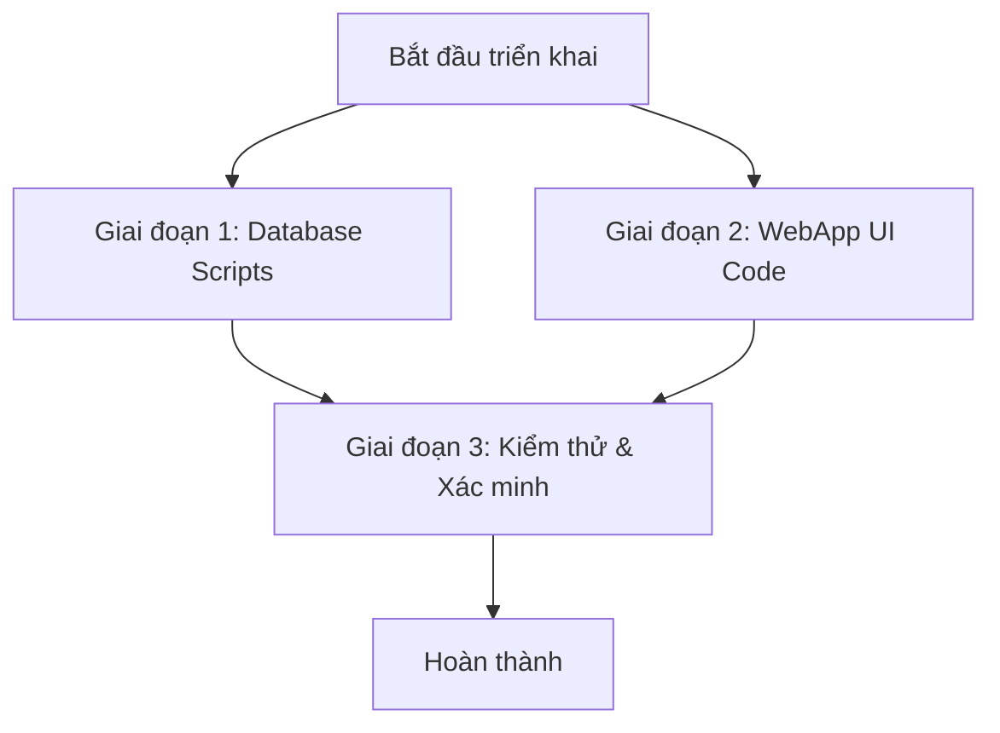

# Kế hoạch thực hiện: Rút phí tài khoản Client Name do Dealer đặt (DOT 155)

> [!NOTE]
> Kế hoạch này chi tiết hóa các bước thực hiện, các file cần chỉnh sửa trong code, cập nhật database script và các kịch bản kiểm thử cần thiết để triển khai tính năng Client Name Fee Redemption theo chuẩn Fundserv V36.
> Tất cả các task đều bám sát theo kết quả rà soát thực tế và kế hoạch triển khai tổng thể.
> trace hết impact trước rồi hãy sửa

---

## 1. Tóm tắt dự án & Mục tiêu

- **Mục tiêu**: Cho phép Dealer đặt lệnh **rút phí (Fee Redemption - Transaction Type = 4)** từ tài khoản **Client Name (AcctDesig = 1)**, đồng thời áp đặt quy tắc bắt buộc sử dụng phương thức thanh toán **Net$Market (N$M - Value = 1)**.
- **Phạm vi áp dụng (In-Scope)**:
  - Cập nhật logic validation và hành vi trên **WebApp UI** (PopupTradeAdd, PanelFeeRedemptionOrder, PanelFeeProcess, PanelFeeAddItem, TrxView).
  - Cập nhật các quy tắc chặn phòng thủ ở mức **Database SPs** (UBFundTrxSell, UBOrderCreateMSGXML, UBXMLRecOrderRespnProcess).
  - Xác minh luồng truyền file của **VieFUNDIE Service** và thư viện **UBFFImport** (Đã xác minh định dạng XML thô, không cần sửa code C#).
- **Phạm vi loại trừ (Out-of-Scope)**:
  - `PopupTradeBasket.aspx.cs` (Basket Trade) do nghiệp vụ đặt lệnh rổ (Basket) vốn đã block tính năng rút phí từ trước trên giao diện (Line 740).

---

## 2. Kế hoạch hành động theo từng Component

### Giai đoạn 1: Cập nhật Database Stored Procedures & UDFs (SQL Server)

#### Task 1.1: Cập nhật Stored Procedure `UBFeeGenerateTrx_Start`
- **File**: `ScriptDB/000_4_CreateSP.sql` (tìm định nghĩa [dbo].[UBFeeGenerateTrx_Start])
- **Nội dung thay đổi**:
  - Loại bỏ điều kiện chặn nạp tài khoản `AND PL.AccountDesignation <> '1'` để cho phép các tài khoản Client Name được thêm vào hàng đợi tiến trình chạy phí tự động.
- **Cách xác minh**: Chạy script SQL kiểm thử để đảm bảo tài khoản Client Name có trong hàng đợi chạy phí.

#### Task 1.2: Xác minh SP `UBFeeGenerateTrxOneItem`
- **File**: `ScriptDB/000_4_CreateSP.sql` (SP)
- **Nội dung thay đổi**:
  - Xác nhận/đảm bảo dòng `IF(@AccountDesignation = '1') RETURN; -- Client Account, no processing` đã được vô hiệu hóa (comment bằng `--`) trong SP hiện tại để mở block chạy thu phí tự động cho Client Name.

#### Task 1.3: Cập nhật Stored Procedure `UBFundTrxSell` và `UBFundTrxSellShort`
- **File**: `ScriptDB/000_4_CreateSP.sql` (tìm [dbo].[UBFundTrxSell] và [dbo].[UBFundTrxSellShort])
- **Nội dung thay đổi**:
  - Bổ sung cơ chế validation phòng thủ (Defense-in-depth) ở mức Database: Nếu `@Type = '4'` (Fee Redemption) VÀ `@AccountDesignation = '1'` (Client Name) VÀ `@SettlementMethod <> '1'` (Khác N$M), gán `@Ret = 104` và `GOTO leave` để trả về lỗi hợp lệ cho WebApp.
- **Cách xác minh**: Thực thi SP trực tiếp bằng các tham số không hợp lệ trong SSMS và xác nhận mã lỗi trả về là `104`.

---

### Giai đoạn 2: Cập nhật WebApp & Code-Behind (C#)

#### Task 2.1: Xác nhận và bảo trì `PopupTradeAdd.aspx.cs`
- **File**: [PopupTradeAdd.aspx.cs](../../../../WebApp/Main/PopupTradeAdd.aspx.cs)
- **Nội dung thay đổi**:
  - **Không cần sửa đổi UI code C#**. Logic thiết lập N$M (`CBase.SetDropdownSelIndex("1", cbSettlMethodSell)`), khóa dropdown (`cbSettlMethodSell.Enabled = false`), ẩn `chPayToClient` và validate phòng thủ trong `OnSell` đã được xây dựng hoàn thiện và chính xác trong source code hiện tại.

#### Task 2.2: Cập nhật `CMSG.cs` (Bổ sung mã lỗi)
- **File**: `UBStatic/CMSG.cs`
- **Nội dung thay đổi**:
  - Thêm phần tử định nghĩa lỗi tại index `94` của mảng `m_MSG_Trx_EN` và `m_MSG_Trx_FR` (dòng tương ứng index `94` hiện đang để trống `""` ở cuối mảng):
    - EN: `"Settlement method for Client Name Fee Redemption must be N$M."`
    - FR: `"La méthode de règlement pour le rachat de frais Client Name doit être N$M."`
  - Đảm bảo khi DB trả về mã lỗi `104`, WebApp sẽ tự động giải mã thành `94` (`errorCode - 10`) và hiển thị đúng thông báo lỗi song ngữ song hành.

#### Task 2.3: Các Panel Fee & Màn hình xem giao dịch (`TrxView.aspx.cs`)
- **Files**: `WebApp/Main/PanelFeeRedemptionOrder.aspx.cs`, `WebApp/Main/PanelFeeProcess.aspx.cs`, `WebApp/Main/PanelFeeAddItem.aspx.cs`, `WebApp/Main/TrxView.aspx.cs`
- **Nội dung thay đổi**:
  - Không cần sửa đổi C# trong các Panel Fee vì logic chặn nằm ở database đã được xử lý.
  - Kiểm tra `TrxView.aspx.cs` để đảm bảo bộ lọc hiển thị không vô tình bỏ qua lệnh Fee Redemption cho Client Name.

---

### Giai đoạn 3: Xác minh VieFUNDIE & UBFFImport (KHÔNG CẦN SỬA CODE C#)
- **VieFUNDIE Service (`VieFUNDIE.cs`)**: Không cần viết lại code. Tiến trình chạy ngầm gọi các hàm export/import vẫn tương thích 100%.
- **Thư viện UBFFImport (`COrder.cs` / `CAT.cs`)**: Không cần viết lại code. Thư viện này chỉ làm nhiệm vụ ghi/đọc file XML thô từ database. Mọi định dạng XML chuẩn V36 đều được xử lý tự động qua database SPs đã sửa ở Giai đoạn 1.

---

## 3. Kịch bản kiểm thử & Xác minh chi tiết

### Kịch bản 1: Kiểm thử Giao diện UI Đặt lệnh (PopupTradeAdd)
- **Các bước thực hiện**:
  1. Chọn một tài khoản **Client Name (AcctDesig = 1)** trên màn hình khách hàng.
  2. Mở popup đặt lệnh (`PopupTradeAdd.aspx`), chọn tab **Sell**.
  3. Chọn loại giao dịch (`Transaction Type`) là **Fee Redemption (4)**.
- **Kết quả kỳ vọng**:
  - Dropdown `Settlement Method` tự động nhảy về **N$M** và bị **mờ đi (disable)**.
  - Checkbox `Pay To Client` tự động **ẩn đi**.
  - Nếu đổi loại giao dịch về Redemption thường (`6`), dropdown được mở khóa lại bình thường.
  - Bấm lưu lệnh thành công, dữ liệu trong bảng `UB_FundTrxOrder` được chèn đúng với `SettlementMethod = '1'`, `Type = '4'`.

### Kịch bản 2: Kiểm thử tính bảo mật ở mức DB (Database Guard Check)
- **Các bước thực hiện**:
  1. Mở SQL Server Management Studio (SSMS), chạy trực tiếp stored procedure `UBFundTrxSell` hoặc `UBFundTrxSellShort`.
  2. Truyền tham số `@Type = '4'` (Fee Redemption), `@AccountDesignation = '1'` (Client Name) nhưng cố tình chọn `@SettlementMethod = '2'` (Cheque).
- **Kết quả kỳ vọng**:
  - Việc thực thi SP phải thất bại. Database trả về mã lỗi `104`.
  - Trên WebApp UI, hiển thị thông báo lỗi: `"Settlement method for Client Name Fee Redemption must be N$M."`

---

## 4. Ước lượng thời gian & Tiến độ

| Task ID | Mô tả công việc | Thời gian ước lượng | Độ ưu tiên | Trạng thái |
|---|---|---|---|---|
| **TSK-1** | Cập nhật Stored Procedure `UBFeeGenerateTrx_Start` | 1 Giờ | Cao | ⬜ Pending |
| **TSK-2** | Cập nhật Stored Procedure `UBFundTrxSell` và `UBFundTrxSellShort` | 2 Giờ | Cao | ⬜ Pending |
| **TSK-3** | Cập nhật file `CMSG.cs` (Bổ sung mã lỗi song ngữ) | 1 Giờ | Cao | ⬜ Pending |
| **TSK-4** | Rà soát `TrxView.aspx.cs` filter | 1 Giờ | Thấp | ⬜ Pending |
| **TSK-5** | Kiểm thử tích hợp E2E (UI -> DB -> VieFUNDIE XML Export) | 2 Giờ | Cao | ⬜ Pending |
| **TỔNG CỘNG**| | **7 Giờ** | | |
