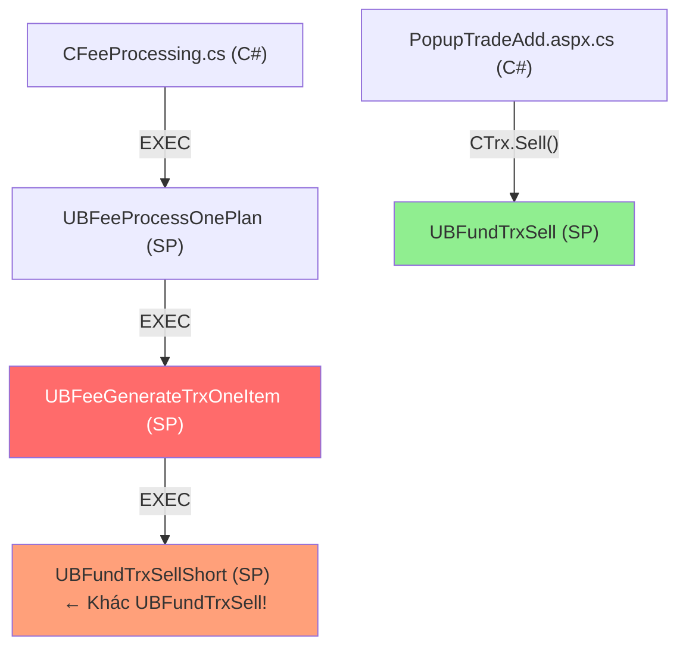

# Review: Gemini Plan cho Section 4 – Client Name Fee Redemptions (DOT 155)

## Tóm tắt đánh giá

Sau khi trace toàn bộ source code thực tế, phát hiện **plan của Gemini có một số điểm đúng nhưng cũng có nhiều vấn đề quan trọng cần sửa**. Dưới đây là phân tích chi tiết từng mục.

---

## 1. Những điểm Gemini đề xuất ĐÚNG ✅

### 1.1 `PopupTradeAdd.aspx.cs` – Enforce N$M trên UI
- ✅ **Đúng**: Cần thêm logic trong `ScreenSellChange()` để force `SettlementMethod = "1"` (N$M) và disable dropdown khi `TrxType = "4"` + `AcctDesig = "1"`.
- ✅ **Đúng**: Cần thêm server-side validation trong `OnSell()` để chặn phòng thủ.
- ✅ **Đúng**: `CanPayToClient()` ở [PopupTradeAdd.aspx.cs:850](../../../../WebApp/Main/PopupTradeAdd.aspx.cs#L850) đã tự động trả `false` cho cả Fee Redemption (TrxType=4) và Client Name (AcctDesig=1), nên **không cần sửa** hàm này.

### 1.2 `PopupTradeBasket.aspx.cs` – Out of Scope
- ✅ **Đúng**: Basket đã block Fee Redemption từ trước → không cần sửa.

### 1.3 `VieFUNDIE` và `UBFFImport` – Không cần sửa C#
- ✅ **Đúng**: Các thư viện này chỉ đóng vai trò trung chuyển XML, logic nằm ở DB.

### 1.4 `UBOrderCreateMSGXML` / `FSXMLOrderXMLSell` – Không cần sửa
- ✅ **Đúng**: UDF đã sinh đúng XML theo tham số truyền vào (`<TrxnTyp>`, `<SettlMethd>`).

---

## 2. Những điểm Gemini đề xuất SAI hoặc THIẾU ❌

### 2.1 ❌ CRITICAL: Thiếu SP `UBFeeGenerateTrxOneItem` – Block chính của Fee Processing

> [!CAUTION]
> **Đây là lỗi nghiêm trọng nhất trong plan.** Gemini bỏ sót SP quan trọng nhất trong luồng Fee Processing tự động.

**Phát hiện**: SP [UBFeeGenerateTrxOneItem](../../../../ScriptDB/000_4_CreateSP.sql#L332106) (dòng 332106 trong `000_4_CreateSP.sql`) chứa đoạn code **block cứng** Client Name accounts:

```sql
-- Dòng ~332192 trong SP UBFeeGenerateTrxOneItem
IF(dbo.IsNomineeDealer(@DSID) = 0)
BEGIN
    IF(@AccountDesignation = '1') RETURN; -- Client Account, no processing
END
```

**Ý nghĩa**: Khi dealer không phải Nominee dealer (tức là hầu hết các dealer), hệ thống **tự động bỏ qua** (RETURN) tất cả tài khoản Client Name khi chạy fee processing tự động. Điều này có nghĩa là:
- Dù `GetPlanFeeFundList` trả về đầy đủ vị thế
- Dù `PanelFeeRedemptionOrder` hiển thị đúng danh sách
- → **Khi tạo lệnh thực tế, SP này sẽ bỏ qua và không sinh giao dịch**

**Cần sửa**: Phải mở block này cho Fee Redemption (Type=4) của Client Name, đồng thời đảm bảo gán `@SettlementMethod = '1'` (N$M).

---

### 2.2 ❌ Sai luồng gọi: Fee Processing KHÔNG gọi `UBFundTrxSell`

> [!WARNING]
> Gemini sai khi cho rằng sửa `UBFundTrxSell` sẽ ảnh hưởng đến Fee Processing tự động.

**Thực tế call chain**:



| Luồng | SP được gọi | Gemini đề cập? |
|---|---|---|
| **UI Manual** (PopupTradeAdd) | `UBFundTrxSell` | ✅ Có |
| **Fee Processing Auto** (CFeeProcessing) | `UBFeeGenerateTrxOneItem` → `UBFundTrxSellShort` | ❌ **Bỏ sót** |

**Kết luận**: SP `UBFundTrxSell` chỉ ảnh hưởng đến **đặt lệnh thủ công trên PopupTradeAdd**. Luồng Fee Processing tự động đi qua `UBFeeGenerateTrxOneItem` → `UBFundTrxSellShort`, hoàn toàn khác.

---

### 2.3 ❌ Sai: `UBFundTrxSell` KHÔNG block AcctDesig=1 cho Fee Redemption

> [!IMPORTANT]
> Plan của Gemini nói "Loại bỏ điều kiện chặn `@Type = '4'` khi `@AccountDesignation = '1'`" nhưng **điều kiện này không tồn tại** trong SP `UBFundTrxSell`.

Sau khi đọc toàn bộ [UBFundTrxSell.sql](UBFundTrxSell.sql), **không có dòng code nào** check `IF(@Type = '4' AND @AccountDesignation = '1')` để block. SP này cho phép tất cả AcctDesig đặt Fee Redemption.

**Tuy nhiên**, việc thêm validation phòng thủ (enforce N$M khi AcctDesig=1 + Type=4) vẫn **đúng và cần thiết** như một defense-in-depth layer.

---

### 2.4 ❌ Sai: `PanelPlanFeeSetting.aspx.cs` KHÔNG chứa logic `cbFeeType.Enabled`

Plan Gemini ghi:
```csharp
// Trước:
cbFeeType.Enabled = (AccountDesignation != "1"); // not for client name
// Sau:
cbFeeType.Enabled = true;
```

**Thực tế**: Grep toàn bộ file `PanelPlanFeeSetting.aspx.cs` không tìm thấy bất kỳ reference nào đến `AccountDesignation`, `AccDesig`, `cbFeeType`, hay `FeeType`. File này không chứa logic chặn Client Name. → **Mục này trong plan là phantom code, không tồn tại.**

---

### 2.5 ⚠️ Thiếu: `PanelFeeRedemptionOrder`, `PanelFeeProcess`, `PanelFeeAddItem` KHÔNG chứa logic AcctDesig

Gemini ghi rằng cần "rà soát và loại bỏ logic lọc chặn Client Name" trong 3 file này, nhưng:

| File | Có chứa logic AcctDesig? |
|---|---|
| `PanelFeeRedemptionOrder.aspx.cs` | ❌ Không |
| `PanelFeeProcess.aspx.cs` | ❌ Không |
| `PanelFeeAddItem.aspx.cs` | ❌ Không |

**Logic chặn thực sự nằm ở mức Database** trong SP `UBFeeGenerateTrxOneItem`, không phải trong C# UI code. Các panel này chỉ hiển thị dữ liệu và gọi SP ở backend.

---

### 2.6 ⚠️ Thiếu: `UBFundTrxSellShort` chưa được trace

SP `UBFundTrxSellShort` được gọi bởi `UBFeeGenerateTrxOneItem` khi tạo lệnh fee redemption tự động. Gemini chưa trace SP này để xác nhận nó **không có block tương tự** cho AcctDesig=1.

---

## 3. Tổng hợp: Thay đổi thực sự cần làm

### Giai đoạn 1: Database (SQL Server)

| SP/UDF | Thay đổi | Ưu tiên |
|---|---|---|
| **`UBFeeGenerateTrxOneItem`** | Mở block `IF(@AccountDesignation = '1') RETURN;` cho fee redemption. Khi `@AccountDesignation = '1'`, vẫn cho phép chạy nhưng enforce `@SettlementMethod = '1'` (N$M) | 🔴 **Cao nhất** |
| **`UBFundTrxSell`** | Thêm validation phòng thủ: block nếu `@Type='4'` + `@AccDesig='1'` + `@SettlMethod <> '1'` | 🟡 Trung bình |
| **`UBFundTrxSellShort`** | Cần trace để xác nhận không có block AcctDesig=1 tương tự | 🟡 Cần trace |

### Giai đoạn 2: WebApp UI (C#)

| File | Thay đổi | Ưu tiên |
|---|---|---|
| **`PopupTradeAdd.aspx.cs`** | `ScreenSellChange()`: enforce N$M + disable dropdown. `OnSell()`: server-side validation phòng thủ. | 🔴 Cao |
| **`PanelFeeRedemptionOrder`** | Không cần sửa C# (không có logic block trong code) | ⚪ Không cần |
| **`PanelFeeProcess`** | Không cần sửa C# (logic nằm ở DB SP) | ⚪ Không cần |
| **`PanelFeeAddItem`** | Không cần sửa C# (logic nằm ở DB SP) | ⚪ Không cần |
| **`TrxView.aspx.cs`** | Cần verify filter query hiển thị Fee Redemption cho Client Name | 🟢 Thấp |

---

## 4. Open Questions cần giải quyết trước khi code

> [!IMPORTANT]
> 1. **`UBFundTrxSellShort`**: Cần trace SP này xem có block AcctDesig=1 giống `UBFeeGenerateTrxOneItem` không?
> 2. **`IsNomineeDealer` logic**: Khi mở block trong `UBFeeGenerateTrxOneItem`, cần hiểu rõ: block hiện tại là `IF(IsNomineeDealer = 0 AND AcctDesig = '1') RETURN`. Có phải mở cho **tất cả** dealer hay chỉ specific dealer types?
> 3. **SettlementMethod trong `UBFeeGenerateTrxOneItem`**: SP đã hardcode `@SettlementMethod = '1'` (N$M) cho mọi fee redemption. Với V36, cần xác nhận rằng logic này đã đủ hay cần thêm check `AccountDesignation` riêng.
