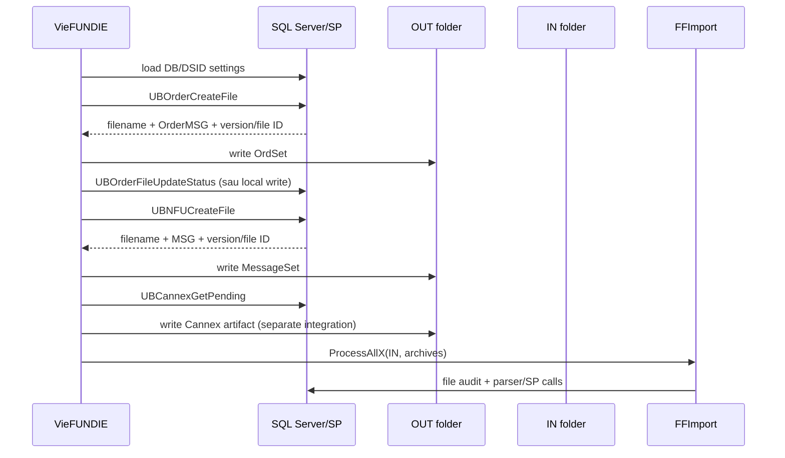

# Fundserv — Batch File Flow

> Luồng canonical cho kênh filesystem do `VieFUNDIE` điều phối. Xem [MQ Realtime Flow](mq-realtime-flow.md) cho kênh IBM MQ và [Inbound Dispatch Matrix](inbound-dispatch-matrix.md) cho từng physical code.

## 1. Một timer cycle



`OnTimer` xử lý DBID/DSID tuần tự, gọi TFS, NFU, Cannex rồi inbound scanner. Timer được stop trong callback và start lại cuối cycle để hạn chế re-entry trong cùng process.

> Source evidence: `Services/VieFUNDIE/VieFUNDIE.cs:654-818`.

## 2. Settings và schedule

| Nguồn | Giá trị chính |
|---|---|
| Registry | DBID và database connection. |
| DB topic `Service` | `FILE_PATH`, `FILE_PATH_IMPORTED`, `FILE_PATH_ERROR`, `FILE_PATH_SKIPPED`, `FILE_PATH_UPLOAD`, `GIC_FILE_PATH_UPLOAD`, `FILE_ENCODING`, blackout settings. |
| `App.config` | Chủ yếu `QUERYINTERVAL`; giá trị dưới 1000 ms bị source đưa về 60000 ms. |

Nếu DB path trống/không tồn tại, code derive các folder dưới `<service>\FF`. Đây là fallback source, không phải production configuration mặc định được xác nhận.

> Source evidence: `Services/VieFUNDIE/VieFUNDIE.cs:248-276,442-620`; `DLLs/UBConnection/CRegistry.cs:18-250`.

## 3. TFS/order outbound

```text
COrder.OrderFileGenerate
  -> UBOrderCreateFile
  -> OrderFileCreate
  -> UBOrderFileUpdateStatus(iStatus=1) nếu local write thành công
```

C# kiểm soát:

- XML declaration UTF-8;
- root `OrdSet`, namespace `tfs` và version attribute;
- local file write.

DB/SP-dependent:

- filename;
- `OrderMSG` body;
- order selection/file ID;
- ý nghĩa chính xác của status update.

`iStatus=1` sau write không phải Fundserv ACK.

> Source evidence: `DLLs/UBFFImport/COrder.cs:20-167`.

## 4. NFU outbound

```text
CXM.FileGenerate
  -> UBNFUCreateFile
  -> NFUFileCreate
```

C# tạo UTF-8 `MessageSet` namespace `nfu`; filename/body/version input đến từ SP. Comment tại call SP nói SP đổi file/message status trước bước C# write, và method không có post-write status call tương đương TFS. Vì thiếu deployed SP definition, đây là rủi ro cần test: disk write thất bại có thể không đồng bộ với DB state.

> Source evidence: `DLLs/UBFFImport/CXM.cs:36-150`.

## 5. Version và encoding

```text
input version <= 35 -> 35 trước 2026-06-13; 36 từ 2026-06-13
input version > 35  -> giữ nguyên
```

Trong code đây là hai bước tuần tự: trước hết nâng mọi giá trị `<35` lên 35, sau đó áp dụng cutoff cho mọi giá trị `<=35`.

Rule dùng local host time. Nó chỉ chứng minh envelope version; không chứng minh body/SP/XSD đã compliant V36.

`FILE_ENCODING` mặc định 1252 dành cho inbound/fixed-width handling. Nó không được truyền vào TFS/NFU outbound writers.

> Source evidence: `DLLs/UBFFImport/COrder.cs:20-85`; `DLLs/UBFFImport/CXM.cs:36-76`; `Services/VieFUNDIE/VieFUNDIE.cs:514-577`.

## 6. Cannex GIC — sibling integration

`VieFUNDIE` gọi `CannexOrder.OrderFileGenerate` với `GIC_FILE_PATH_UPLOAD`. Generator là flat-file/data-driven flow riêng. Source cho thấy pending item có thể được remove/advance trong lúc dựng content trước khi file write hoàn tất; caller cũng không dùng boolean write result như một transaction boundary đáng tin cậy.

Không coi Cannex là TFS/NFU hoặc mặc định dùng cùng external gateway.

> Source evidence: `DLLs/UBFFImport/CannexOrder.cs:271-347,507-619`.

## 7. Inbound handoff

`ProcessAllX` nhận IN, Imported, Error, Skipped và encoding từ service. Discovery gồm DB-driven `FileCode*`/`FileCodeTest*` cộng special patterns. Sau khi chọn file, `FFImport` đăng ký audit, dispatch parser và move file.

Chi tiết code/handler nằm tại [Inbound Dispatch Matrix](inbound-dispatch-matrix.md). Semantics lỗi/replay nằm tại [State, Error & Recovery](state-error-recovery.md).

> Source evidence: `DLLs/UBFFImport/FFImport.cs:910-1501,1712-1930`.

## 8. Failure boundaries cần giám sát

| Điểm lỗi | Điều cần kiểm tra |
|---|---|
| DB/SP create-file | Event log, SP result, file/message state trên đúng DB. |
| Local write | ACL, disk space, path tồn tại, partial/zero-byte file. |
| Gateway pickup | Gateway log/ACK ngoài repository. |
| Inbound discovery | DB file-code row, pattern, readiness, test mode. |
| Parse/SP | `UBFF_Add`/`UBFF_End`, event audit và business rows. |
| Archive move | collision rename, `_DONOTIMPORT`, Error/Skipped. |

Không replay chỉ dựa trên vị trí file. Luôn kiểm tra DB side effects và idempotency của SP đang deploy.