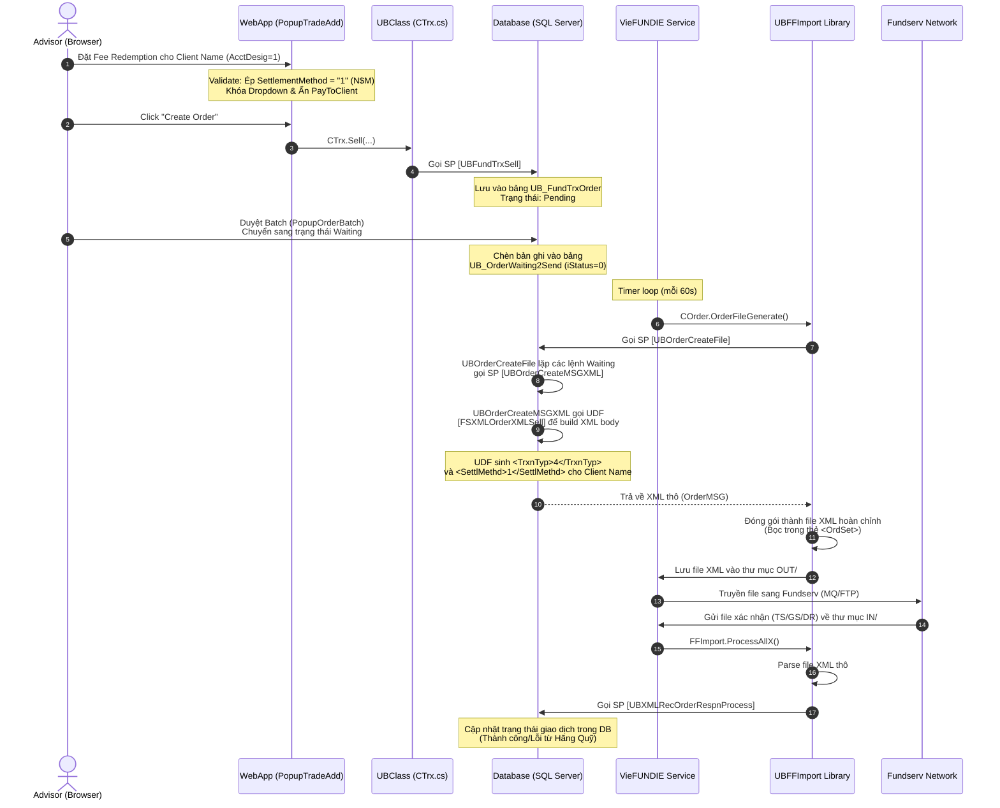

# Nghiệp vụ & Kỹ thuật: Client Name Distributor Placed Fee Redemptions (DOT 155)

> [!NOTE]
> Tài liệu này mô tả chi tiết về mặt nghiệp vụ tài chính, các màn hình liên quan trên UI và luồng xử lý kỹ thuật (Data Flow) xuyên suốt từ giao diện WebApp, dịch vụ nền **VieFUNDIE**, thư viện shared **UBFFImport** xuống các **Stored Procedures/UDFs** trong Database đối với loại giao dịch **Fee Redemption (Transaction Type = 4)**.

---

## 1. Nghiệp vụ Fee Redemption là gì?

**Fee Redemption** (Transaction Type = `4`) là loại giao dịch đặc thù trên mạng lưới Fundserv. Thay vì rút tiền trả về cho nhà đầu tư (Redemption thông thường - Type = `6`), Fee Redemption cho phép **Dealer/Intermediary** (Đại lý/Nhà phân phối) chủ động đặt lệnh rút tiền từ tài khoản quỹ của khách hàng để **thu các loại phí** (phí quản lý tài khoản, phí tư vấn, v.v.).

Toàn bộ số tiền sau khi hãng quỹ khấu trừ sẽ được chuyển trực tiếp về cho Dealer thông qua hoạt động thanh toán bù trừ hàng ngày.

### 1.1 Khác biệt nghiệp vụ trước và sau V36

```
┌────────────────────────────────────────────────────────────────────────┐
│                              FEE REDEMPTION                            │
├───────────────────────────────────┬────────────────────────────────────┤
│           TRƯỚC V36               │             TỪ V36 (2026)          │
├───────────────────────────────────┼────────────────────────────────────┤
│ Chỉ áp dụng cho tài khoản:        │ Mở rộng áp dụng cho cả tài khoản:  │
│ Nominee & Intermediary (AcctDesig │ Client Name accounts (AcctDesig=1) │
│ = 2, 3) do Dealer quản lý hộ.      │ đứng tên trực tiếp khách hàng.     │
└───────────────────────────────────┴────────────────────────────────────┘
```

### 1.2 Các ràng buộc nghiệp vụ bắt buộc cho Client Name Fee Redemptions

Do tài khoản **Client Name (AcctDesig = 1)** đứng tên trực tiếp của khách hàng tại hãng quỹ, để đảm bảo an toàn pháp lý và tránh gian lận, Fundserv Standards V36 đưa ra các quy tắc khắt khe:

1. **Bắt buộc N$M Settlement (Net$Market)**: 
   - Lệnh rút phí của tài khoản Client Name **bắt buộc** phải sử dụng phương thức thanh toán **N$M (Value = '1')**. 
   - Không được phép dùng séc hay chuyển khoản trực tiếp (EFT) tự do bên ngoài để tránh việc dòng tiền đi sai mục đích thu phí.
2. **EPA (Electronic Processing Agreement) Eligible**:
   - Do rút tiền từ tài khoản đứng tên khách hàng, thông thường hãng quỹ sẽ đòi chữ ký của khách hàng cho mỗi lệnh. 
   - Với EPA, Dealer và khách hàng đã ký thỏa thuận điện tử trước đó, cho phép Dealer đặt lệnh thu phí trực tuyến mà không cần submit chữ ký vật lý mỗi lần. Lệnh Fee Redemption của Client Name nằm trong danh sách **EPA Eligible**.
3. **Miễn Thuế khấu trừ tại nguồn (Withholding Tax = 0%)**:
   - Đối với tài khoản hưu trí/đăng ký (như RRSP, RRIF), lệnh rút tiền thông thường (Redemption) sẽ bị đánh thuế khấu trừ tại nguồn. 
   - Tuy nhiên, vì đây là lệnh **Fee Redemption** (rút phí dịch vụ), số tiền này được **miễn thuế khấu trừ**. Do đó, tỷ lệ thuế khấu trừ tại nguồn (`FedWHoldTaxRt`) **bắt buộc luôn bằng 0**.
4. **Sales Tax (Thuế bán hàng) trên tài khoản Thường (Non-registered)**:
   - Khi rút phí dịch vụ từ tài khoản thường (Cash account), Dealer phải tự động tính và cộng thêm thuế bán hàng (GST/HST/PST tùy theo tỉnh bang cư trú của khách hàng) vào số tiền phí dịch vụ trước khi gửi lệnh đi.
5. **Gross/Net Rule**:
   - Nếu chọn Gross (`G`), các khoản khấu trừ (phí phạt rút sớm, thuế) sẽ bị trừ trực tiếp vào số tiền Dealer nhận được (Dealer nhận ít hơn thực tế). Khuyến cáo luôn đặt lệnh theo Net (`N`).

---

## 2. Các màn hình liên quan trên Giao diện (WebApp UI)

| Màn hình | File vật lý | Vai trò & Nghiệp vụ xử lý |
|---|---|---|
| **Single Trade placement** | `PopupTradeAdd.aspx` / `.cs` | **Màn hình chính của Advisor để đặt lệnh đơn lẻ:**<br>- Cho phép chọn `TrxType = 4` (Fee Redemption) khi tài khoản là Client Name (`AcctDesig = 1`).<br>- **Validation**: Nếu `TrxType = 4` & `AcctDesig = 1`, tự động set và disable dropdown `cbSettlMethodSell` về giá trị `"1"` (N$M). Ẩn checkbox `chPayToClient` và đặt về unchecked. |
| **Basket Trade placement** | `PopupTradeBasket.aspx` / `.cs` | **Không áp dụng (Out of Scope)**:<br>Nghiệp vụ đặt lệnh hàng loạt (Basket) cấm tạo lệnh Fee Redemption (Line 740: `if (cbTrxnTypSell.SelectedValue == "4") return false;`). Advisor bắt buộc phải đặt Fee Redemption đơn lẻ trên từng tài khoản để kiểm soát EPA và Sales Tax. |
| **Fee Processing** | `PanelFeeProcess.aspx` / `.cs` | **Xử lý thu phí tự động hàng loạt:**<br>Khi Advisor/Staff chạy tiến trình tính phí tự động, nếu tài khoản là Client Name, hệ thống tự động gán phương thức thanh toán (Settlement Method) là `"1"` (N$M). |
| **Fee Add Item** | `PanelFeeAddItem.aspx` / `.cs` | **Thêm dòng thu phí thủ công:**<br>Tự động áp dụng quy tắc gán Settlement Method = `"1"` (N$M) cho Client Name accounts. |
| **Trade View** | `TrxView.aspx` / `.cs` | Cho phép lọc, tìm kiếm và hiển thị các giao dịch rút phí của tài khoản Client Name. |

---

## 3. Luồng chạy chi tiết của Code (Data Flow)

Luồng đi của dữ liệu từ khi Advisor click tạo lệnh trên trình duyệt đến khi truyền sang Fundserv và nhận kết quả xác nhận về được mô tả qua sơ đồ dưới đây:

### Sơ đồ Luồng dữ liệu (Data Flow Diagram)



---

## 4. Chi tiết kỹ thuật & Tương tác trong Code

### 4.1 Tầng Giao diện UI (`PopupTradeAdd.aspx.cs`)
Khi Advisor thay đổi loại giao dịch hoặc tài khoản, sự kiện `OnTrxTypeListChanged` -> `LoadTrxAmtTypeEO` -> `ScreenSellChange` được kích hoạt. Logic nghiệp vụ khống chế N$M được cài đặt như sau:

```csharp
protected void ScreenSellChange(int iOptions)
{
    // ...
    // Nghiệp vụ V36: Rút phí (TrxType=4) từ tài khoản Client Name (AcctDesig=1)
    if (cbTrxnTypSell.SelectedValue == "4" && hdCurrentAccDesig.Value == "1")
    {
        // 1. Bắt buộc Settlement Method là N$M (Value = "1")
        CBase.SetDropdownSelIndex("1", cbSettlMethodSell);
        cbSettlMethodSell.Enabled = false; // Khóa dropdown không cho Advisor đổi

        // 2. Không cho phép chuyển tiền trực tiếp cho khách hàng
        chPayToClient.Checked = false;
        chPayToClient.Visible = false;
    }
    else
    {
        cbSettlMethodSell.Enabled = true;
    }
    // ...
}
```

Và cơ chế validation phòng thủ tại server-side trước khi gọi hàm BLL lưu vào Database:

```csharp
protected int OnSell()
{
    // ...
    string TrxType = cbTrxnTypSell.SelectedValue;
    string SettlementMethod = cbSettlMethodSell.SelectedValue;
    
    // Server-side validation phòng thủ
    if (TrxType == "4" && hdCurrentAccDesig.Value == "1")
    {
        if (SettlementMethod != "1")
        {
            string MsgTxt = Lg == 1 
                ? "La méthode de règlement choisi doit être N$M (Net$Market)." 
                : "Settlement method for Client Name Fee Redemption must be N$M (Net$Market).";
            CBase.DisplayAlert(cbSettlMethodSell, MsgTxt, false);
            return 0;
        }
    }
    // ...
}
```

### 4.2 Tầng Trung gian Shared Library (`UBFFImport.dll`)
* **Hàm `COrder.OrderFileGenerate`** (`UBFFImport/COrder.cs`):
  * Mở kết nối database và chạy Stored Procedure `UBOrderCreateFile`.
  * Đọc kết quả trả về gồm `FileName` và `OrderMSG` (chứa chuỗi XML thô của các lệnh).
  * Gọi hàm `OrderFileCreate` để lưu file XML vật lý vào thư mục gửi đi (`OUT/`).
  * Hoàn toàn không có logic C# kiểm tra cứng nhắc, giúp hệ thống linh hoạt và dễ nâng cấp qua SQL.

* **Hàm `FFImport.ProcessAllX` / `CAT.cs`** (`UBFFImport/FFImport.cs`):
  * Quét thư mục `IN/` để tìm file phản hồi từ Fundserv (ví dụ file `TS`).
  * Thực hiện parse XML bằng `XmlReader` để bóc tách các tag dữ liệu thô.
  * Đưa dữ liệu thô vào các tham số của SP `UBXMLRecOrderRespnProcess` để cập nhật database. Không can thiệp logic nghiệp vụ của lệnh Fee Redemption bằng C#.

### 4.3 Tầng Database & SQL Stored Procedures
Đây là nơi xử lý nghiệp vụ tối cao và trực tiếp tạo ra định dạng XML gửi sang Fundserv.

* **Stored Procedure `UBOrderCreateMSGXML`**:
  * Đọc thông tin chi tiết lệnh từ bảng `UB_FundTrxOrder` và bảng `UB_Plan` (lấy `AccountDesignation`, `AccountType`, `RecipientCode`).
  * Chứa đoạn logic nghiệp vụ cấm tính thuế khấu trừ cho lệnh rút phí:
    ```sql
    -- Type = '4' là Fee Redemption, bắt buộc set thuế khấu trừ nguồn = 0
    IF(@Type = '4' OR @AccountDesignation <> '1' OR @TypeDetail = '7') 
        SET @fFedWHoldTaxRt = 0;
    ```
  * Chuyển các tham số đã chuẩn hóa vào User Defined Function `FSXMLOrderXMLSell` để sinh XML block.

* **User Defined Function `FSXMLOrderXMLSell`**:
  * Build thẻ `<Sell>` chứa thông tin lệnh rút phí:
    ```sql
    -- Sinh loại giao dịch Fee Redemption (Type = '4')
    SET @MSG = @MSG + '<TrxnTyp>' + @Type + '</TrxnTyp>';
    
    -- Sinh phương thức thanh toán N$M (SettlMethd = '1') và nguồn thanh toán (SettlSrc = 'D')
    SET @MSG = @MSG + '<SettlMethd>' + RTRIM(@SettlementMethod) + '</SettlMethd>';
    SET @MSG = @MSG + '<SettlSrc>' + RTRIM(@SettlementSource) + '</SettlSrc>';
    ```

---

## 5. Kế hoạch Kiểm thử & Xác minh Nghiệp vụ

Để đảm bảo luồng chạy Fee Redemption hoạt động hoàn hảo và không gây lỗi hệ thống, cần thực hiện quy trình kiểm thử 3 bước sau:

### Bước 1: Kiểm thử trên Giao diện UI (Manual Web Test)
1. Chọn một tài khoản **Client Name (AcctDesig = 1)** trên màn hình `Client.aspx`.
2. Mở popup đặt lệnh `PopupTradeAdd.aspx` và chọn tab **Sell**.
3. Chọn loại giao dịch (`Transaction Type`) là **Fee Redemption (Value = 4)**.
4. **Xác minh**:
   - Dropdown `Settlement Method` phải tự động nhảy về **N$M** và bị **disable (mờ đi)**, Advisor không thể chọn hình thức khác.
   - Checkbox `Pay To Client` phải **biến mất** hoặc ẩn đi.
5. Nhập số tiền thu phí và bấm **Create Order**.
6. **Xác minh**: Lệnh được lưu thành công vào Database ở trạng thái Pending.

### Bước 2: Kiểm thử sinh File XML gửi đi (Export XML Validation)
1. Vào màn hình duyệt batch `PopupOrderBatch.aspx`, duyệt lệnh Fee Redemption vừa tạo để chuyển sang trạng thái **Waiting**.
2. Run dịch vụ nền `VieFUNDIE` (hoặc chạy manually SP `UBOrderCreateFile`).
3. Mở thư mục `OUT/` kiểm tra file XML vừa được sinh ra.
4. **Xác minh nội dung thẻ XML**:
   - Thẻ `<TrxnTyp>` phải có giá trị là `4`.
   - Thẻ `<SettlMethd>` phải có giá trị là `1`.
   - Thẻ `<SettlSrc>` phải có giá trị là `D` (Dealer Placed).
   - Thẻ `<FedWHoldTaxRt>` **không được xuất hiện** (hoặc bằng 0) để đảm bảo không bị hãng quỹ khấu trừ thuế sai quy định.

### Bước 3: Kiểm thử luồng nhận file phản hồi (Import Confirmation Test)
1. Tạo một file response `TS` giả lập có chứa kết quả xác nhận cho lệnh Fee Redemption vừa gửi đi với mã giao dịch tương ứng.
2. Thả file vào thư mục `IN/` để dịch vụ `VieFUNDIE` quét và import.
3. **Xác minh**: Giao dịch Fee Redemption tương ứng trong WebApp được cập nhật trạng thái thành **Confirmed** (Thành công) mà không có lỗi hệ thống phát sinh.
