# Sơ đồ luồng dữ liệu các loại file Fundserv

## 1. Tổng quan hệ sinh thái

Trong hệ thống Fundserv, có 3 vai trò chính:

| Vai trò | Mô tả | Ví dụ |
|---|---|---|
| **Dealer/Distributor** | Đại lý phân phối quỹ đầu tư | VieFund (hệ thống WebApp này) |
| **Manufacturer** | Công ty quỹ đầu tư (tạo/quản lý quỹ) | Fidelity, Manulife, CI, AGF... |
| **Fundserv** | Mạng lưới trung gian (clearing house) | Fundserv Inc. |

```
┌──────────────┐           ┌──────────────┐           ┌──────────────┐
│   DEALER     │  ◄─────►  │  FUNDSERV    │  ◄─────►  │ MANUFACTURER │
│  (VieFund)   │   MQ/File  │  (Network)   │   MQ/File  │  (Fund Co.)  │
└──────────────┘           └──────────────┘           └──────────────┘
```

---

## 2. Phân loại file theo hướng truyền

### 2.1 Dealer GỬI ĐI → Fundserv → Manufacturer

| File | Tên đầy đủ | Mục đích |
|---|---|---|
| **TFS** | Transaction/Financial Submission | Gửi lệnh mua/bán/chuyển đổi |
| **NFU** | Non-Financial Update | Cập nhật thông tin phi tài chính |

### 2.2 Manufacturer GỬI VỀ → Fundserv → Dealer

| File | Tên đầy đủ | Mục đích |
|---|---|---|
| **TS** | Transaction Reconciliation | Xác nhận giao dịch đã xử lý |
| **HS** | Historical Transaction Reconciliation | Lịch sử giao dịch đã xử lý |
| **NS** | Account Demographic Reconciliation | Đối soát thông tin tài khoản |
| **PS** | Position Statement | Báo cáo vị thế/holdings |
| **FS** | Settlement Instruction | Chỉ dẫn thanh toán |
| **GS** | Settlement Report | Báo cáo thanh toán (N$M) |
| **FD** | Fund Setup / Fund Definition | Thông tin quỹ đầu tư mới |
| **MD** | Product Update | Cập nhật thông tin quỹ |

> **Ghi chú**: Trong WebApp, file gửi đi gọi là **CO file** (Confirmation Order) – đây là format output của hệ thống khi đóng gói TFS thành XML để gửi.

---

## 3. Luồng chi tiết từng loại file

### 3.1 CO / TFS – Lệnh giao dịch (Dealer → Fundserv)

**CO (Confirmation Order)** là file XML chứa các lệnh TFS mà Dealer gửi cho Manufacturer thông qua Fundserv.

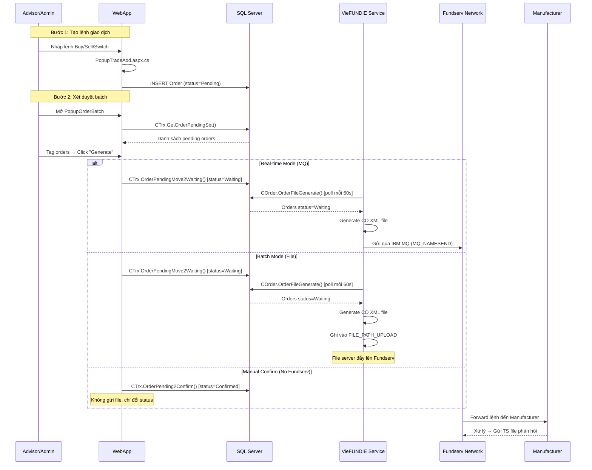

#### Nội dung CO file

```
CO XML file chứa:
├── Header: Dealer Code, File Date, Sequence
├── Order Records (1..N):
│   ├── Action Code: Buy (PUR), Sell (RED), Switch (SW), Transfer (TFR)
│   ├── Fund ID (CUSIP/Fund Code)
│   ├── Account Info: Account #, Plan Type, AcctDesig
│   ├── Amount / Units
│   ├── Settlement Method
│   ├── Source ID (tracking number)
│   └── Special Instructions
└── Trailer: Record Count, Total Amount
```

#### Source code liên quan

| File | Function | Vai trò |
|---|---|---|
| `PopupTradeAdd.aspx.cs` | `OnSaveOrder()` | Lưu lệnh vào DB (Pending) |
| `PopupOrderBatch.aspx.cs` | `OnGenerateOrderFileBtn()` | Chuyển status sang Waiting |
| `UBFFImport.COrder` | `OrderFileGenerate()` | Sinh CO XML file (trong service) |
| `UBFFImport.CXM` | `FileGenerate()` | Sinh NFU/Transfer file |

---

### 3.2 NFU – Cập nhật phi tài chính (Dealer → Fundserv)

**NFU (Non-Financial Update)** gửi cập nhật thông tin tài khoản mà không liên quan đến tiền.

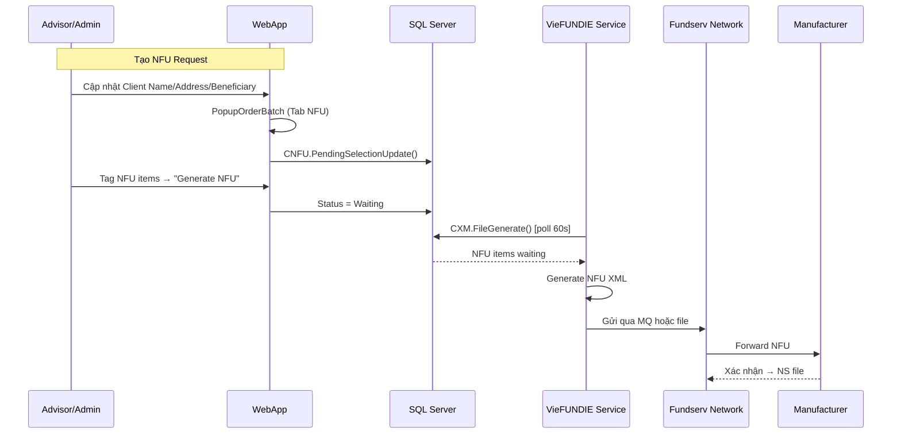

#### Các loại NFU

| NFU Type | Mô tả |
|---|---|
| Client Name | Cập nhật tên khách hàng |
| Client Address | Cập nhật địa chỉ |
| New Account | Tạo tài khoản mới |
| Beneficiary | Cập nhật người thụ hưởng |
| Account Attributes | Thay đổi thuộc tính tài khoản |
| Add Successor | Thêm Successor Annuitant (TFSA/RRIF/FHSA) |

---

### 3.3 TS – Xác nhận giao dịch (Manufacturer → Dealer)

**TS (Transaction Reconciliation)** là file Manufacturer gửi để xác nhận giao dịch đã xử lý.

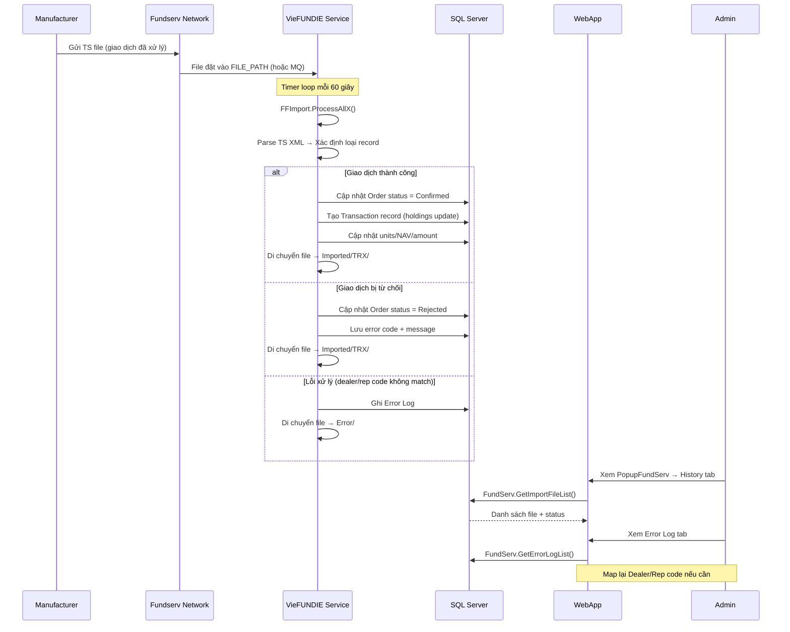

#### Nội dung TS file

```
TS XML file chứa:
├── Header: Manufacturer Code, File Date
├── Transaction Records:
│   ├── Buy Section: Units purchased, NAV, Amount, Trade Date, Settlement Date
│   ├── Sell Section: Units redeemed, NAV, Amount, Deductions (TCR V36: 4 loại mới)
│   ├── Switch Section: From Fund, To Fund, Units, NAV
│   ├── Transfer Section: Transfer In/Out, Units, From/To Dealer
│   └── Distribution Section: Dividend, Capital Gain, Return of Capital
├── Commission Data: Trailer Fee, Front-End Load, DSC
└── Trailer: Record Count
```

#### V36 Changes cho TS file
- **4 deduction mới** (DOT 149): `EarlyRdmtnFee`, `DlrAdvsrFee`, `MVA`, `IRSTax`
- **Client Name Fee Redemptions** (DOT 155): Hỗ trợ AcctDesig=1

---

### 3.4 HS – Lịch sử giao dịch (Manufacturer → Dealer)

**HS (Historical Transaction Reconciliation)** tương tự TS nhưng cho dữ liệu lịch sử.

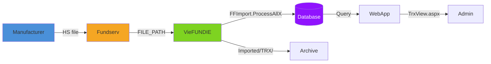

| So sánh | TS | HS |
|---|---|---|
| Tần suất | Hàng ngày (end-of-day) | Theo yêu cầu hoặc định kỳ |
| Nội dung | Giao dịch mới nhất | Giao dịch lịch sử (có thể nhiều tháng) |
| Xử lý | Cập nhật holdings real-time | Reconciliation / kiểm tra |
| V36 impact | Thêm 4 deduction fields | Thêm 4 deduction fields (giống TS) |

---

### 3.5 FS – Chỉ dẫn thanh toán (Manufacturer → Dealer)

**FS (Settlement Instruction)** chứa thông tin thanh toán cho các giao dịch đã confirm.

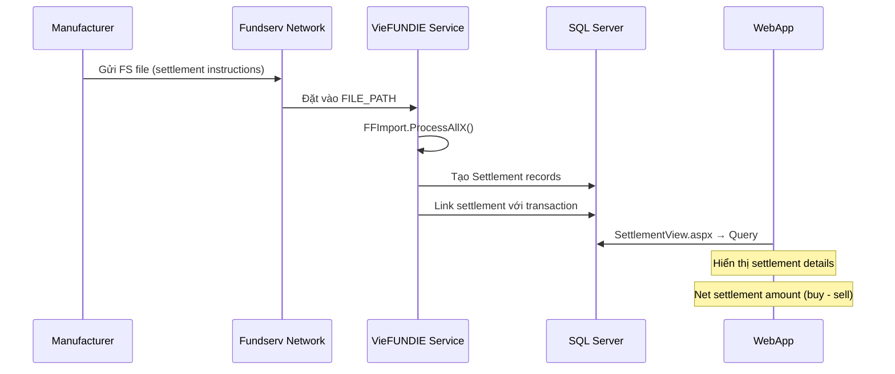

#### Nội dung FS file

```
FS file chứa:
├── Settlement Date
├── Fund ID
├── Net Amount (Buy amount - Sell amount)
├── Settlement Method (Cheque, EFT, N$M)
├── Dealer/Account Info
└── V36: Thêm deduction fields trong Sell section
```

---

### 3.6 GS – Báo cáo thanh toán (Manufacturer → Dealer)

**GS (Settlement Report)** cung cấp chi tiết thanh toán net settlement giữa các bên.

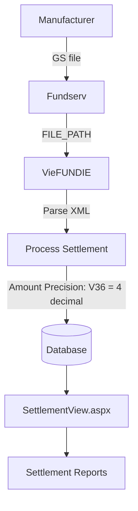

#### V36 Changes cho GS file
- **DOT 183**: Amount fields mở rộng từ 2 → 4 decimal places (schema alignment)

---

### 3.7 NS – Đối soát tài khoản (Manufacturer → Dealer)

**NS (Account Demographic Reconciliation)** để đồng bộ thông tin tài khoản.

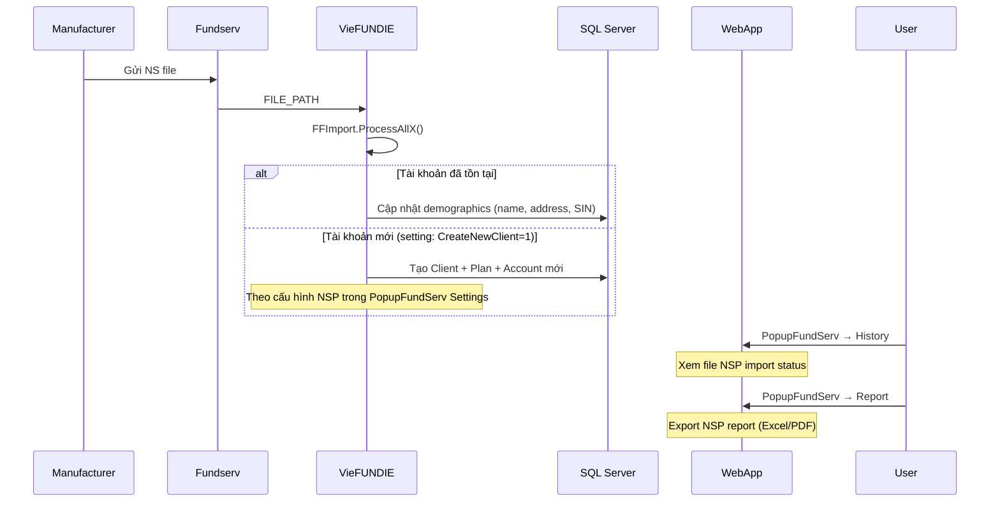

#### Cấu hình import NSP (trong PopupFundServ Settings)

| Setting | Control | Mô tả |
|---|---|---|
| `CreateNewClient` | `chNSPCreateClient` | Tự động tạo Client mới? |
| `CreateNewPlan` | `chNSPCreatePlan` | Tự động tạo Plan mới? |
| `CreateNewClientStatus` | `cbNSPClientStatus` | Status mặc định cho client mới |

---

### 3.8 PS – Báo cáo vị thế (Manufacturer → Dealer)

**PS (Position Statement)** báo cáo holdings (số units, NAV) của tất cả tài khoản.

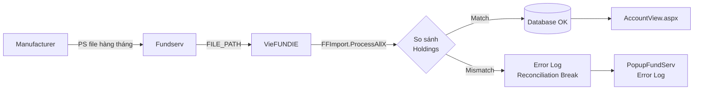

#### V36 Changes cho PS file
- **DOT 158**: Thêm category **Terminated** funds (fund đã đóng nhưng còn units)

---

### 3.9 FD / MD – Thông tin quỹ (Manufacturer → Dealer)

**FD (Fund Setup)** và **MD (Product Update)** cung cấp/cập nhật thông tin quỹ đầu tư.

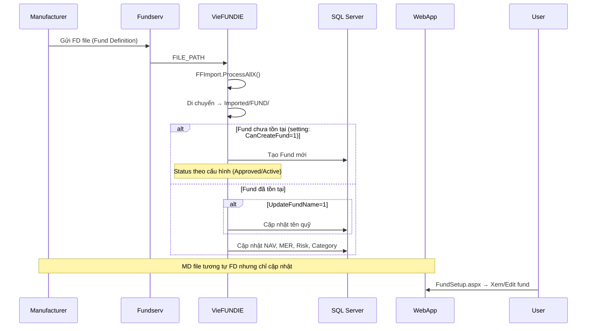

#### Cấu hình FD import (trong PopupFundServ Settings)

| Setting | Control | Mô tả |
|---|---|---|
| `CanCreateFund` | `chFDCanCreate` | Cho phép tạo fund mới? |
| `MgmtMustExist` | `chFDMgmtMustExist` | Management Company phải tồn tại? |
| `UpdateFundName` | `chFDUpdateName` | Cập nhật tên fund? |
| `CreateFundApproved` | `chFDCreateApproved` | Fund mới = Approved? |
| `CreateFundActive` | `chFDCreateActive` | Fund mới = Active? |
| `IgnoreEffectiveDate` | `chFDIgnoreEffectiveDate` | Bỏ qua Effective Date? |
| `SaveSkippedRecord` | `chFDSaveSkippedRecordFund` | Lưu record bị skip? |

#### V36 Changes cho FD file
- **DOT 178**: Thêm Product Type = **Bullion**, xóa **ETF** và **Other**
- **DOT 180**: Custom Date mở rộng từ 2 → 10 entries

---

### 3.10 DR – Tái đầu tư cổ tức (Manufacturer → Dealer)

**DR (Dividend/Distribution Reinvestment)** thông báo cổ tức đã được tái đầu tư.

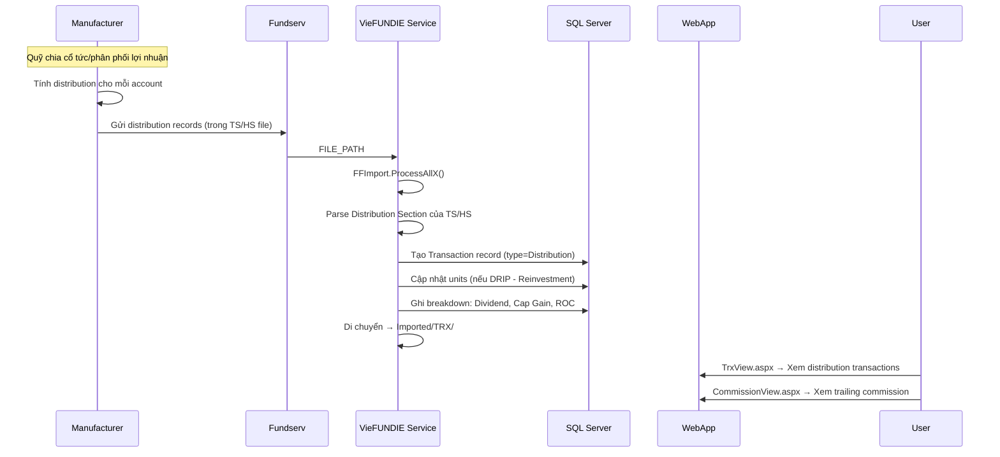

> **Lưu ý**: DR không phải là file riêng biệt mà là **Distribution section** nằm bên trong TS/HS file. Trong hệ thống, records loại distribution được xử lý và lưu trữ trong thư mục `Imported/TRX/`.

#### Loại Distribution

| Loại | Mô tả |
|---|---|
| **Dividend** | Cổ tức từ income |
| **Capital Gain** | Lợi nhuận vốn |
| **Return of Capital (ROC)** | Hoàn vốn |
| **Foreign Income** | Thu nhập nước ngoài |
| **DRIP** | Dividend Reinvestment Plan (tái đầu tư tự động) |

---

### 3.11 COM – Hoa hồng (Manufacturer → Dealer)

**COM (Commission)** file chứa thông tin hoa hồng Manufacturer trả cho Dealer.

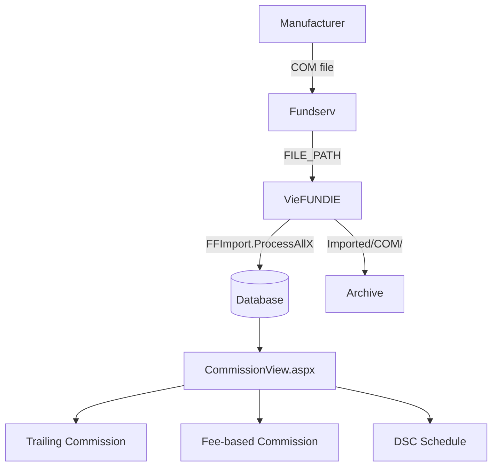

---

### 3.12 PRICE – Giá NAV (Manufacturer → Dealer)

**PRICE** file cung cấp giá NAV (Net Asset Value) hàng ngày cho mỗi fund.

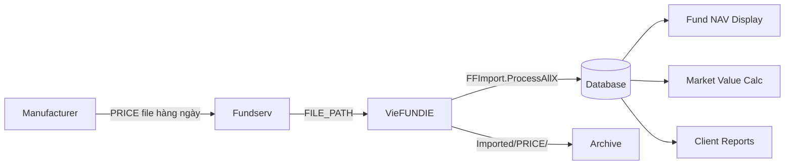

---

## 4. Sơ đồ tổng hợp – Vòng đời giao dịch

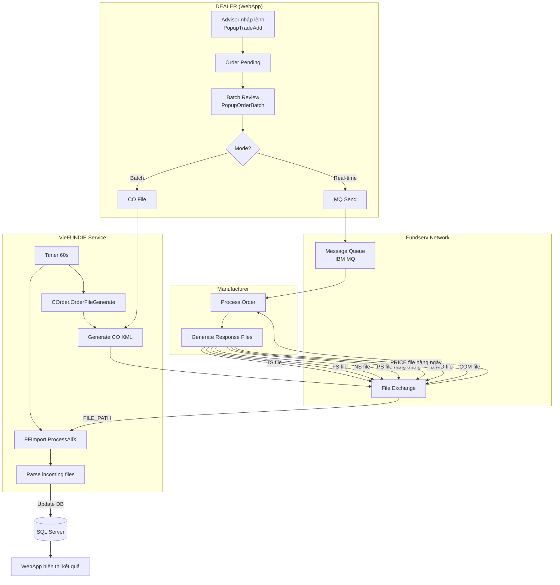

---

## 5. Bảng tổng hợp – File lifecycle

| # | File | Hướng | Nguồn sinh | Engine xử lý | Lưu trữ | UI hiển thị |
|---|---|---|---|---|---|---|
| 1 | **CO/TFS** | Dealer → FS | `PopupOrderBatch` → `COrder.OrderFileGenerate()` | VieFUNDIE | `FILE_PATH_UPLOAD/` | PopupOrderBatch (History tab) |
| 2 | **NFU** | Dealer → FS | `PopupOrderBatch` (NFU tab) → `CXM.FileGenerate()` | VieFUNDIE | `FILE_PATH_UPLOAD/` | PopupOrderBatch (NFU History) |
| 3 | **GIC** | Dealer → FS | `PopupGICTrxAdd` → `CannexOrder.OrderFileGenerate()` | VieFUNDIE | `FILE_PATH_UPLOAD/GIC/` | GIC Order screen |
| 4 | **TS** | FS → Dealer | Manufacturer | `FFImport.ProcessAllX()` | `Imported/TRX/` | TrxView, CommissionView |
| 5 | **HS** | FS → Dealer | Manufacturer | `FFImport.ProcessAllX()` | `Imported/TRX/` | TrxView (historical) |
| 6 | **FS** | FS → Dealer | Manufacturer | `FFImport.ProcessAllX()` | `Imported/TRX/` | SettlementView |
| 7 | **GS** | FS → Dealer | Manufacturer | `FFImport.ProcessAllX()` | `Imported/` | SettlementView |
| 8 | **NS** | FS → Dealer | Manufacturer | `FFImport.ProcessAllX()` | `Imported/` | PopupFundServ (NSP report) |
| 9 | **PS** | FS → Dealer | Manufacturer (monthly) | `FFImport.ProcessAllX()` | `Imported/` | AccountView (reconciliation) |
| 10 | **FD** | FS → Dealer | Manufacturer | `FFImport.ProcessAllX()` | `Imported/FUND/` | FundSetup |
| 11 | **MD** | FS → Dealer | Manufacturer | `FFImport.ProcessAllX()` | `Imported/FUND/` | FundSetup |
| 12 | **COM** | FS → Dealer | Manufacturer | `FFImport.ProcessAllX()` | `Imported/COM/` | CommissionView |
| 13 | **PRICE** | FS → Dealer | Manufacturer (daily) | `FFImport.ProcessAllX()` | `Imported/PRICE/` | Fund NAV display |

---

## 6. Xử lý lỗi trong luồng Import

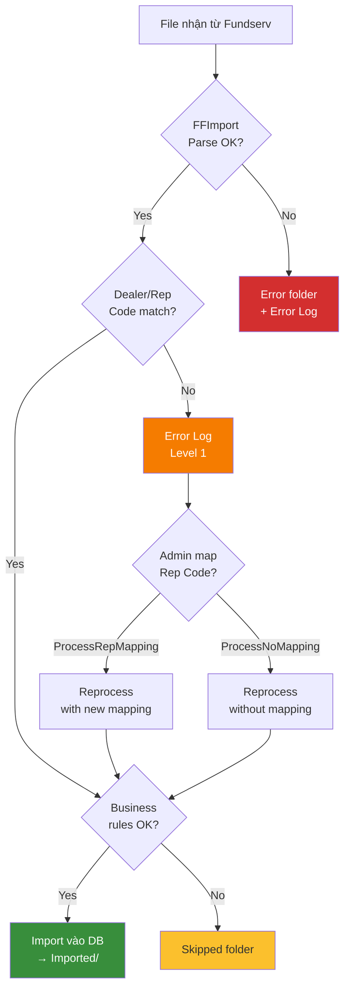

### Các level error

| Level | Mô tả | Xử lý |
|---|---|---|
| **0** | Info/Warning | Tự động skip, ghi log |
| **1** | Recoverable Error | Admin có thể map lại Dealer/Rep code rồi reprocess |
| **2** | Fatal Error | File bị chuyển sang Error folder, cần can thiệp manual |

---

## 7. Thay đổi V36 ảnh hưởng đến Data Flow

| DOT | Thay đổi | Files bị ảnh hưởng | Impact |
|---|---|---|---|
| 149 | Thêm 4 deduction types (TCR) | TS, HS, FS (import) | Parse thêm 4 fields mới |
| 153 | Quebec Joint Account restriction | TFS, NFU (export) | Validate trước khi gửi CO |
| 155 | Client Name Fee Redemptions | TFS (export), TS (import) | Mở rộng AcctDesig=1 cho fee redemption |
| 158 | PS Terminated funds | PS (import) | Xử lý thêm category Terminated |
| 163 | Successor Annuitant RRIF/FHSA | NFU (export), NS (import) | Mở rộng AddSucsr cho RRIF/FHSA |
| 178 | Product Type: +Bullion, -ETF/-Other | FD, MD (import) | Cập nhật dropdown/validation |
| 180 | FD Custom Date 2→10 | FD (import) | Parse thêm 8 custom date fields |
| 183 | GS Amount 2→4 decimals | GS (import) | Đổi precision parsing |
