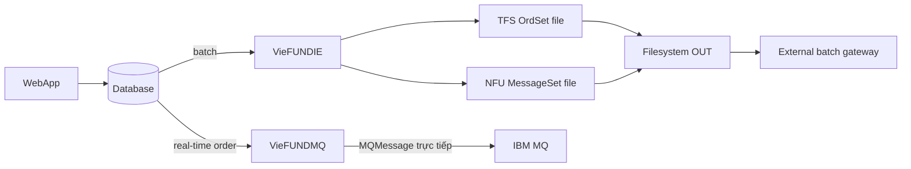
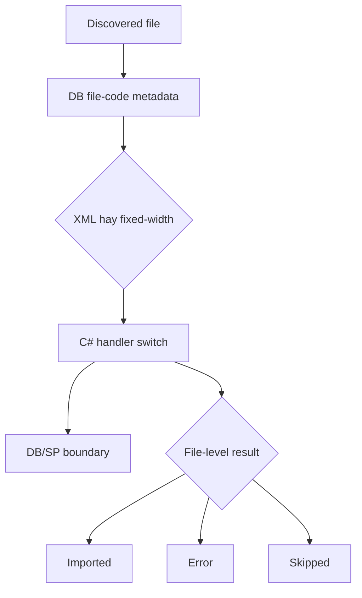

# Luồng dữ liệu file Fundserv

Tài liệu này tập trung vào artifact và vòng đời filesystem. Luồng end-to-end canonical nằm tại [TFS/NFU flow](tfs-nfu-flow.md); quy ước bằng chứng nằm tại [README](README.md).

## 1. Hai kênh outbound độc lập



| Kênh | Artifact tại source-visible boundary | Kết luận đúng |
|---|---|---|
| TFS batch | File `OrdSet` dưới configured upload path | `VieFUNDIE` ghi filesystem; external gateway pickup. |
| NFU batch | File `MessageSet` dưới configured upload path | Không thấy NFU MQ sender trong call path đã kiểm tra. |
| TFS real-time | `MQMessage` gửi trực tiếp vào IBM MQ | `VieFUNDMQ` lấy body từ DB, không đọc file OUT. |

> Source evidence: `Services/VieFUNDIE/VieFUNDIE.cs:745-790`
>
> Source evidence: `Services/VieFUNDMQ/VieFUNDMQ.cs:997-1144`
>
> Source evidence: `Services/VieFUNDMQ/Order.cs:37-147`

## 2. Contract file outbound

| File | Phần C# kiểm soát | Phần DB/SP-dependent |
|---|---|---|
| TFS | XML UTF-8, root `OrdSet` namespace `tfs`, version và write | `UBOrderCreateFile`: filename, `OrderMSG`, input version, file ID/flags. |
| NFU | XML UTF-8, root `MessageSet` namespace `nfu`, version và write | `UBNFUCreateFile`: filename, `MSG`, input version, file ID. |

Hai writer outbound không dùng DB setting `FILE_ENCODING`. Output version luôn `>=35`: input `<=35` thành 35 trước **2026-06-13 00:00:00** và 36 từ thời điểm đó theo local host time; input `>35` được giữ nguyên.

TFS gọi `UBOrderFileUpdateStatus` sau write, nhưng row/status cuối là **DB/SP-dependent**. NFU call path đã đọc không có post-write status SP riêng; không suy diễn từ comment hay từ hành vi TFS.

> Source evidence: `DLLs/UBFFImport/COrder.cs:20-166`
>
> Source evidence: `DLLs/UBFFImport/CXM.cs:36-150`

## 3. Pickup/drop và cấu hình filesystem

```text
filesystem OUT -> [external pickup; actor/protocol ngoài repository]
[external drop; actor/protocol ngoài repository] -> filesystem IN
```

Repository không chứa FTP/SFTP client implementation cho hop Fundserv batch trong inventory đã rà soát. `VieFUNDIE` chỉ chứng minh điểm ghi OUT và điểm đọc IN; gateway, transfer schedule, ACK, credentials và retention là **External boundary**. Đây là negative repository-wide review; các citation dưới đây chứng minh local filesystem boundary, không chứng minh mọi deployment artifact bên ngoài repository.

Path, inbound encoding và blackout schedule đến từ DB qua `UBFSRuleList('Service')`. Registry chọn DB/connection; `App.config` chủ yếu cung cấp `QUERYINTERVAL`. Timer interval không phải business schedule, và default code không phải production value.

> Source evidence: `DLLs/UBFFImport/COrder.cs:50-84`
>
> Source evidence: `DLLs/UBFFImport/CXM.cs:46-75`
>
> Source evidence: `Services/VieFUNDIE/VieFUNDIE.cs:299-325`
>
> Source evidence: `Services/VieFUNDIE/VieFUNDIE.cs:352-610`
>
> Source evidence: `Services/VieFUNDIE/VieFUNDIE.cs:785-790`
>
> Source evidence: `DLLs/UBConnection/CDatabase.cs:1906-1923`
>
> Source evidence: `DLLs/UBConnection/CRegistry.cs:69-125`
>
> Source evidence: `DLLs/UBConnection/CRegistry.cs:221-250`
>
> Source evidence: `Services/VieFUNDIE/App.config:3-8`

## 4. Inbound discovery

Discovery không phải “quét mọi XML”:

1. File-code metadata đến từ first-timer result hoặc fallback `UBFSFileCodeList`.
2. Generic patterns là `FileCode*`; test DB có thể dùng `FileCodeTest*`.
3. Special branches xử lý RESP, `ETFDAILYMARKET*.TXT*`, `DAILYTCR*.txt`, `FUNDLIST_*`, NEO/DIVCI, Cannex `TERM...` và Fundata patterns.
4. Từng branch có thể thêm readiness, size, date/name parsing hoặc skip rule riêng.

> Source evidence: `Services/VieFUNDIE/VieFUNDIE.cs:681-704`
>
> Source evidence: `DLLs/UBFFImport/FFImport.cs:721-760`
>
> Source evidence: `DLLs/UBFFImport/FFImport.cs:904-1321`
>
> Source evidence: `DLLs/UBFFImport/FFImport.cs:1322-1375`
>
> Source evidence: `DLLs/UBFFImport/FFImport.cs:1400-1499`

## 5. Dispatch và archive



Dispatch là mô hình lai: DB cung cấp code/layout, C# chọn parser/handler. Archive tùy integration: mapping có các nhóm như `COM`, `FUND`, `PRICE`, `TRX`, `FUNDATA`, `CANNEX`; special branches có thể dùng `YYYY/MM`, generic branch dùng `YYYY/MM/DD`, còn error/skipped và collision có xử lý riêng. Không áp một archive invariant cho mọi file.

Handler/SP call-site không chứng minh final DB mutation. Không kết luận transaction, holding, NAV hay business status nào được tạo/cập nhật nếu chưa có đúng SP source/version đang deploy.

> Source evidence: `DLLs/UBFFImport/FFImport.cs:1562-1707`
>
> Source evidence: `DLLs/UBFFImport/FFImport.cs:1712-1917`
>
> Source evidence: `DLLs/UBFFImport/FFImport.cs:1957-2005`
>
> Source evidence: `DLLs/UBFFImport/FFImport.cs:2166-2518`

## 6. Hai phân biệt bắt buộc

### `DR` không phải distribution

Physical code `DR` là order response và được route vào `COrder.ImportXML`. Distribution trong TS/HS là luồng transaction-reconciliation khác; các TS/HS-family codes đi vào CAT và có content/model như `DISTRIBCOF`, `CDistribCof`, `CDistribFund`.

> Source evidence: `DLLs/UBFFImport/COrder.cs:13-15`
>
> Source evidence: `DLLs/UBFFImport/FFImport.cs:2435-2472`
>
> Source evidence: `DLLs/UBFFImport/CAT.cs:1141-1175`
>
> Source evidence: `DLLs/UBExport/TS_Export.cs:151-210`
>
> Source evidence: `DLLs/UBExport/TS_Export.cs:562-625`

### Cannex GIC là integration sibling

Cannex dùng chung service/timer/filesystem engine `VieFUNDIE`, nhưng có GIC upload path, generator, discovery/import và archive `CANNEX` riêng. Không gọi Cannex là Fundserv TFS/NFU file và không suy diễn nó dùng cùng external gateway.

> Source evidence: `Services/VieFUNDIE/VieFUNDIE.cs:763-782`
>
> Source evidence: `DLLs/UBFFImport/CannexOrder.cs:536-618`
>
> Source evidence: `DLLs/UBFFImport/FFImport.cs:1123-1328`
>
> Source evidence: `DLLs/UBFFImport/FFImport.cs:1641-1660`
>
> Source evidence: `DLLs/UBFFImport/FFImport.cs:1811-1831`

## 7. Standards V36: số liệu và mức bằng chứng

Các mục dưới đây là **Historical requirement**, không phải runtime/deployment proof:

| DOT | Nội dung đúng |
|---|---|
| **158** | Với account đã terminated, bỏ yêu cầu zero balance; account vẫn được report trạng thái `Terminated` trong hai tháng liên tiếp. |
| **180** | `CustomDate` maximum occurrences tăng **250 → 500**. |
| **183** | GS `AmtValue`: phần nguyên tăng **9 → 11 digits**; `maxLength` tăng **14 → 16**; decimal precision vẫn 2–4 digits. |

Envelope cutover sang version 36 ngày **2026-06-13** là bằng chứng runtime riêng; nó không chứng minh DOT 158/180/183 đã được implement hoặc deploy đầy đủ.

> Source evidence: `Docs_V2/topics/fundserv/v36-requirements.md:678-729`
>
> Source evidence: `Docs_V2/topics/fundserv/v36-requirements.md:730-793`
>
> Source evidence: `Docs_V2/topics/fundserv/v36-requirements.md:794-832`
>
> Source evidence: `DLLs/UBFFImport/COrder.cs:20-29`
>
> Source evidence: `DLLs/UBFFImport/CXM.cs:36-45`