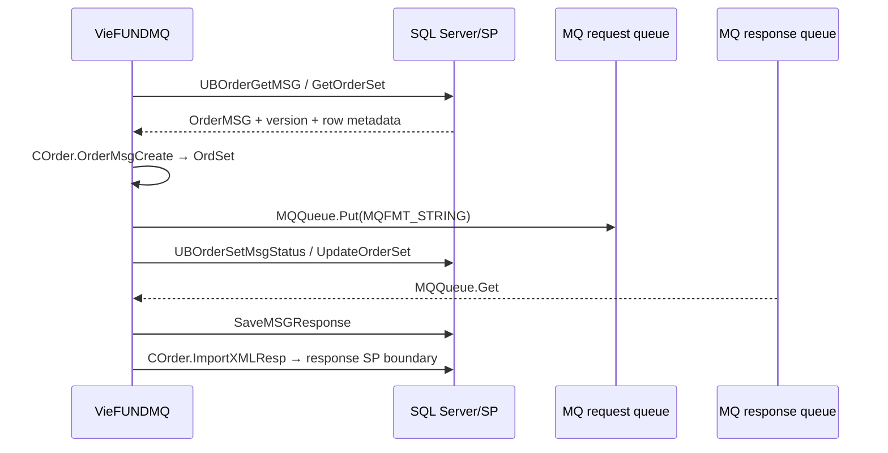

# Fundserv — IBM MQ Realtime Flow

> Kênh order realtime do `VieFUNDMQ` thực hiện. Đây là message integration, không phải file transport và không phải bước tiếp theo của `VieFUNDIE`.

## 1. Luồng request/response

Không có bước đọc `FILE_PATH_UPLOAD`, không có filename discovery và response không được move vào Imported/Error/Skipped.

> Source evidence: `Services/VieFUNDMQ/VieFUNDMQ.cs:997-1209`; `Services/VieFUNDMQ/Order.cs:20-139`.

## 2. Outbound message

`SendMsg` lấy `OrderMSG`, gọi `UBFFImport.COrder.OrderMsgCreate`, tạo `MQMessage` dạng string và `Put` vào queue. `MsgID` và local send status được đưa lại vào dataset rồi gửi sang DB update boundary.

Các milestone phải phân biệt:

1. DB row được claim/lấy ra.
2. `MQQueue.Put` thành công.
3. DB status update thành công.
4. Fundserv gửi response.
5. Response được parser/SP áp dụng.

Một milestone không thay thế milestone kế tiếp.

> Source evidence: `Services/VieFUNDMQ/VieFUNDMQ.cs:997-1148`.

## 3. Response path

`GetMsgData` mở response queue, đọc MQ string và gọi `COrder.ProcessResponseMsg`. Adapter lưu raw response rồi dùng cùng order-response parser/SP boundary với option dành cho MQ.

Physical DR file trong batch IN chỉ test batch parser; nó không test MQ connection, queue metadata, charset hoặc receive behavior.

> Source evidence: `Services/VieFUNDMQ/VieFUNDMQ.cs:1149-1209`; `Services/VieFUNDMQ/Order.cs:20-34`.

## 4. Configuration

DB settings được source dùng gồm host, port, queue manager, channel, request/response queue names, charset, user/password, TLS certificate/key settings, send window, weekend và run mode. Có production, test suffix `_T` và một connection/channel thứ hai.

Giá trị production không được ghi vào tài liệu; phải đọc qua approved operational tooling và không đưa secrets vào ticket.

> Source evidence: `Services/VieFUNDMQ/VieFUNDMQ.cs:24-120,481-858`.

## 5. Encoding và security

- `MQ_CHARACTERSET` mặc định source là `1208` và được gán vào `MQMessage.CharacterSet`.
- Source có TLS cipher/certificate store settings và encrypted-password handling.
- Source snapshot còn bật các protocol legacy trong `ServicePointManager`; production posture phải được security owner xác minh thay vì suy từ source alone.

`FILE_ENCODING` của `VieFUNDIE` không áp dụng cho MQ.

> Source evidence: `Services/VieFUNDMQ/VieFUNDMQ.cs:191-283,997-1018`.

## 6. Error và retry boundary

Source xử lý queue-empty reason `2033` như không còn message; một số connection errors dẫn tới re-init hoặc timer delay. Không thấy contract end-to-end cho exponential backoff, maximum attempts, dead-letter ownership hoặc business-idempotency trong wrapper đã rà soát.

Vì `Put` và DB status update là hai thao tác riêng, incident phải đối chiếu cả queue/MsgID và DB row trước khi resend.

> Source evidence: `Services/VieFUNDMQ/VieFUNDMQ.cs:1149-1209,1306-1536`.

## 7. Scope đã xác minh

- Có source runtime cho realtime **order/TFS** request và response.
- Không tìm thấy NFU sender qua MQ trong call path đã rà soát.
- Không được dùng sự tồn tại của MQ settings để kết luận mọi dealer/DSID chạy MQ.

Routing production, queue ownership và Fundserv ACK/SLA cần deployment evidence.