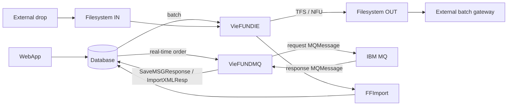

# Hướng dẫn source runtime Fundserv

Tài liệu này lập bản đồ entry point và ranh giới có thể truy vết trong repository. Quy ước nhãn và dẫn chứng theo [README](README.md); luồng chi tiết nằm tại [TFS/NFU flow](tfs-nfu-flow.md), vòng đời file tại [Files dataflow](files-dataflow.md).

## 1. Ranh giới runtime

- **Verified:** `VieFUNDIE` là batch filesystem service: sinh TFS/NFU rồi quét inbound folder.
- **Verified:** `VieFUNDMQ` là service độc lập: lấy `OrderMSG` từ DB và gửi request trực tiếp vào IBM MQ; chiều nhận đọc response queue, gọi `SaveMSGResponse`/`COrder.ImportXMLResp` rồi đi vào DB/SP boundary. Nó không đọc file OUT và MQ response không qua `FFImport`/file archive.
- **External boundary:** gateway pickup/drop nằm ngoài repository. Repository không chứa FTP/SFTP client implementation cho hop Fundserv batch này; không gán protocol, lịch, ACK hay credentials khi chưa có deployment evidence.
- Source đã kiểm tra không cho thấy NFU-over-MQ; luồng NFU được xác nhận ở đây là batch filesystem.

> Source evidence: `Services/VieFUNDIE/VieFUNDIE.cs:745-797`
>
> Source evidence: `Services/VieFUNDMQ/VieFUNDMQ.cs:997-1193`
>
> Source evidence: `Services/VieFUNDMQ/Order.cs:20-34`
>
> Source evidence: `Services/VieFUNDMQ/Order.cs:37-147`
>
> Source evidence: `DLLs/UBFFImport/COrder.cs:50-84`
>
> Source evidence: `DLLs/UBFFImport/CXM.cs:46-75`

## 2. Entry point và trách nhiệm

| Thành phần | Trách nhiệm thấy trong source |
|---|---|
| `WebApp/Main/PopupOrderBatch.aspx.cs` | Truyền order mode (`0` batch, `1` real-time) và đưa NFU qua business/DB boundary. |
| `Services/VieFUNDIE` | Timer batch, DB-backed settings, TFS/NFU/Cannex generation và inbound scan. |
| `DLLs/UBFFImport/COrder.cs` | Tạo TFS `OrdSet`; parse physical order response như `DR`. |
| `DLLs/UBFFImport/CXM.cs` | Tạo NFU `MessageSet`; parse NFU response như `XR`. |
| `DLLs/UBFFImport/FFImport.cs` | File discovery, dispatch và move/archive/error/skipped. |
| `Services/VieFUNDMQ` | Kết nối IBM MQ, gửi order message real-time và xử lý queue response riêng. |
| `DLLs/UBConnection` | Registry DB selection, connection và wrapper gọi settings/SP. |

Call-site UI chỉ chứng minh mode/request đi vào business layer; row/status mutation cuối cùng vẫn là **DB/SP-dependent**.

> Source evidence: `WebApp/Main/PopupOrderBatch.aspx.cs:320-377`
>
> Source evidence: `WebApp/Main/PopupOrderBatch.aspx.cs:864-903`
>
> Source evidence: `DLLs/UBFFImport/COrder.cs:20-166`
>
> Source evidence: `DLLs/UBFFImport/CXM.cs:36-150`
>
> Source evidence: `DLLs/UBFFImport/FFImport.cs:721-1499`

## 3. Ownership cấu hình

| Nguồn | Ownership |
|---|---|
| Registry | Chọn `DBID`/connection string. Không phải nguồn Fundserv path, encoding hay business schedule. |
| DB qua `UBFSRuleList('Service')` | `FILE_PATH*`, upload/GIC path, `FILE_ENCODING`, `NO_RUNTIME`, `NO_WRUNDAY`, `NO_MRUNDAY`, `TEST_RUN` và service settings liên quan. |
| `Services/VieFUNDIE/App.config` | Chủ yếu `QUERYINTERVAL` cho timer (`60000` ms trong file), cùng `DEBUGMODE`. |

`QUERYINTERVAL` là polling interval, không phải blackout schedule. Paths, encoding và schedule thực tế phải đọc từ DB/deployment; default trong code không phải production fact. `FILE_ENCODING` được truyền cho inbound scanner, không điều khiển TFS/NFU outbound writers.

Wrapper `GetVieFundIESettings` nhận tham số `DSID`, nhưng implementation thấy trong repository chỉ bind `TopicStr` khi gọi `UBFSRuleList`. Vì vậy không khẳng định settings được DB lọc theo DSID nếu chưa kiểm tra SP đang deploy.

> Source evidence: `Services/VieFUNDIE/App.config:3-8`
>
> Source evidence: `Services/VieFUNDIE/VieFUNDIE.cs:243-271`
>
> Source evidence: `Services/VieFUNDIE/VieFUNDIE.cs:299-325`
>
> Source evidence: `Services/VieFUNDIE/VieFUNDIE.cs:352-610`
>
> Source evidence: `DLLs/UBConnection/CDatabase.cs:1906-1923`
>
> Source evidence: `DLLs/UBConnection/CRegistry.cs:24-43`
>
> Source evidence: `DLLs/UBConnection/CRegistry.cs:69-125`
>
> Source evidence: `DLLs/UBConnection/CRegistry.cs:221-250`

## 4. Outbound contracts

| Luồng | C# kiểm soát | DB/SP-dependent |
|---|---|---|
| TFS batch | UTF-8 declaration/writer, root `OrdSet` namespace `tfs`, version normalization và file write | `UBOrderCreateFile` trả filename, `OrderMSG`, version, file ID và flags. |
| NFU batch | UTF-8 declaration/writer, root `MessageSet` namespace `nfu`, version normalization và file write | `UBNFUCreateFile` trả filename, `MSG`, version và file ID. |
| TFS real-time | Tạo envelope/MQ message và gửi queue trực tiếp | `UBOrderGetMSG` cung cấp body; status cuối sau SP không suy diễn từ tên call. |

Output XML version luôn `>=35`. Với input `<=35`, output là 35 trước **2026-06-13 00:00:00** và 36 từ thời điểm đó theo local time của host; input `>35` giữ nguyên. Cutover này chỉ chứng minh version attribute của envelope, không chứng minh mọi thay đổi parser/business V36 đã deploy.

TFS có call `UBOrderFileUpdateStatus` sau write; final mutation của SP vẫn chưa được chứng minh. Trong `CXM.FileGenerate`/`UBNFUCreateFile` call path đã đọc không có post-write status SP riêng, nên không gán hành vi TFS đó cho NFU.

> Source evidence: `DLLs/UBFFImport/COrder.cs:20-166`
>
> Source evidence: `DLLs/UBFFImport/CXM.cs:36-150`
>
> Source evidence: `Services/VieFUNDMQ/Order.cs:37-139`

## 5. Inbound, physical code và archive

`FFImport` lấy file-code metadata từ first-timer result hoặc `UBFSFileCodeList`, dùng generic pattern `FileCode*`/`FileCodeTest*` và các special patterns cho từng integration. Dispatch kết hợp DB metadata với C# switch. Archive cũng tùy integration: subdirectory, layout theo tháng/ngày, error/skipped và collision handling không có một invariant chung.

Physical code `DR` là **order response** và được route vào `COrder.ImportXML`. Distribution trong TS/HS là luồng khác, đi qua CAT/content như `DISTRIBCOF`, `CDistribCof`, `CDistribFund`; không diễn giải `DR` thành distribution.

Handler response gọi SP và đọc status trả về. Chỉ call-site không đủ để kết luận order được confirm/reject thế nào hoặc transaction, holding, NAV hay status nào đã bị thay đổi; các final DB mutations là **DB/SP-dependent**.

> Source evidence: `Services/VieFUNDIE/VieFUNDIE.cs:681-704`
>
> Source evidence: `DLLs/UBFFImport/FFImport.cs:721-760`
>
> Source evidence: `DLLs/UBFFImport/FFImport.cs:904-1499`
>
> Source evidence: `DLLs/UBFFImport/FFImport.cs:1562-1707`
>
> Source evidence: `DLLs/UBFFImport/FFImport.cs:1712-2005`
>
> Source evidence: `DLLs/UBFFImport/FFImport.cs:2435-2472`
>
> Source evidence: `DLLs/UBFFImport/COrder.cs:713-824`
>
> Source evidence: `DLLs/UBFFImport/CXM.cs:575-644`
>
> Source evidence: `DLLs/UBFFImport/CAT.cs:1141-1175`
>
> Source evidence: `DLLs/UBExport/TS_Export.cs:151-210`
>
> Source evidence: `DLLs/UBExport/TS_Export.cs:562-625`

## 6. Cannex GIC và giới hạn deployment

Cannex GIC là integration riêng dùng chung timer/filesystem engine `VieFUNDIE`. Nó có GIC path, generator, inbound patterns/import và archive `CANNEX` riêng; source không chứng minh Cannex đi qua Fundserv hay cùng gateway TFS/NFU.

> Source evidence: `Services/VieFUNDIE/VieFUNDIE.cs:763-782`
>
> Source evidence: `DLLs/UBFFImport/CannexOrder.cs:536-618`
>
> Source evidence: `DLLs/UBFFImport/FFImport.cs:1123-1328`
>
> Source evidence: `DLLs/UBFFImport/FFImport.cs:1641-1660`
>
> Source evidence: `DLLs/UBFFImport/FFImport.cs:1811-1831`

SQL snapshot, requirement và source snapshot không tự chứng minh production SP/binary parity. Khi thiếu đúng SP version hoặc deployment evidence, giữ nhãn **Historical**, **DB/SP-dependent** hoặc **External boundary** thay vì suy diễn hành vi cuối.