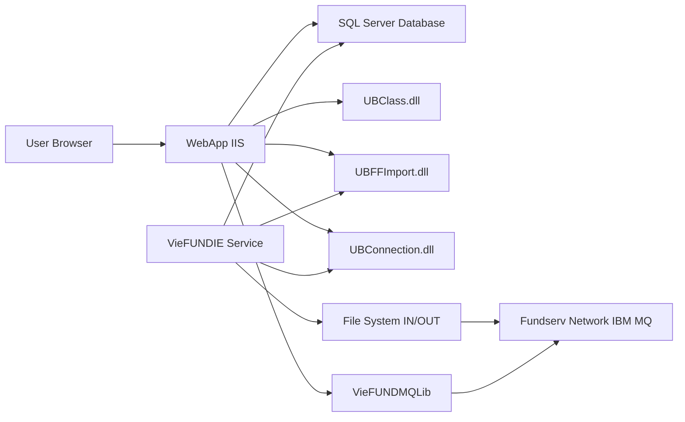

# VieFund AG – Hướng dẫn cấu trúc Source Code

## 1. Tổng quan hệ thống

- **WebApp** là source code back office cho một công ty Dealer (VieFund) tại Canada.
- Hệ thống quản lý đầu tư (mutual funds, GIC), khách hàng, giao dịch, hoa hồng, thuế và tuân thủ quy định.
- Giao tiếp với **Fundserv** (mạng lưới trao đổi giao dịch mutual fund tại Canada) thông qua IBM MQ hoặc batch file.

---

## 2. Kiến trúc tổng thể

```
VieFundAG/
├── WebApp/              ← ASP.NET Web Forms (Front-end + Back-end logic)
├── VieFUNDIE/           ← Windows Service (Import/Export engine)
├── VieFUNDMQLib/        ← IBM MQ Library (compiled only, no source)
├── Guide.md             ← File hướng dẫn này
└── FundserV36.md        ← Tài liệu Fundserv Standards V36
```

### Luồng dữ liệu chính

```
┌──────────────────────────────────────────────────────────┐
│                WebApp (IIS Web Application)              │
│  ┌────────────────────────────────────────────────────┐  │
│  │ .aspx/.aspx.cs (UI + Code-behind logic)            │  │
│  │   PopupTradeAdd → Orders                           │  │
│  │   PopupOrderBatch → CO file / MQ real-time         │  │
│  │   PopupFundServ → File history/settings            │  │
│  └────────────────┬───────────────────────────────────┘  │
│                   │ DLLs (shared with service)           │
│  ┌────────────────┴───────────────────────────────────┐  │
│  │ UBClass.dll    → Business logic, PDF generation    │  │
│  │ UBConnection.dll → Database access (SQL Server)    │  │
│  │ UBStatic.dll   → Utility/helper classes            │  │
│  │ UBFFImport.dll → File Format Import/Export engine  │  │
│  │ VieFUNDPdf.dll → PDF report generation             │  │
│  └────────────────────────────────────────────────────┘  │
└──────────────────────┬───────────────────────────────────┘
                       │
                       │ Shared DLLs: UBConnection, UBFFImport
                       ▼
┌──────────────────────────────────────────────────────────┐
│           VieFUNDIE (Windows Service)                    │
│  ┌────────────────────────────────────────────────────┐  │
│  │ UBImportFS class (VieFUNDIE.cs)                    │  │
│  │   Timer loop (60s) → For each DSID:                │  │
│  │     1. COrder.OrderFileGenerate()  → CO file       │  │
│  │     2. CXM.FileGenerate()          → NFU/XM file   │  │
│  │     3. CannexOrder.OrderFileGenerate() → GIC order  │  │
│  │     4. FFImport.ProcessAllX()      → Import files  │  │
│  └────────────────────────────────────────────────────┘  │
└──────────────────────┬───────────────────────────────────┘
                       │
              IBM MQ / File System
                       │
                       ▼
              ┌───────────────┐
              │   Fundserv    │
              │   Network     │
              └───────────────┘
```

---

## 3. VieFUNDIE – Windows Service (Import/Export Engine)

### 3.1 Tổng quan

| Thuộc tính | Giá trị |
|---|---|
| Tên service | `VieFund IE Service` |
| Class chính | `UBImportFS` : `ServiceBase` |
| Namespace | `VieFundIE` |
| Framework | .NET Framework 4.5.2 |
| Version hiện tại | `34.24.04.15` (Fundserv V34, ngày 2024-04-15) |
| Run mode | `LocalSystem`, `Automatic` start |

### 3.2 Source Files

| File | Vai trò |
|---|---|
| `Program.cs` | Entry point – khởi tạo `UBImportFS()` và chạy service |
| `VieFUNDIE.cs` (969 dòng) | **Logic chính**: Timer, LoadSettings, OnTimer, file I/O |
| `VieFUNDIE.Designer.cs` | Designer auto-generated: Timer component, ServiceName |
| `UBInstaller.cs` | Windows Service installer (InstallUtil) |
| `App.config` | Cấu hình: `QUERYINTERVAL=60000` (60 giây), `DEBUGMODE=0` |

### 3.3 Dependencies (DLL)

| DLL | Nguồn | Vai trò |
|---|---|---|
| `UBConnection.dll` | `WebApp/bin/` | Kết nối SQL Server database, registry, XML helpers |
| `UBFFImport.dll` | `WebApp/bin/` | **Core import/export engine** – parse và xử lý tất cả file Fundserv |
| `UBStatic.dll` | `WebApp/bin/` | Utility functions |
| `EPPlus.dll` | bundled | Excel export |

### 3.4 Cơ chế hoạt động (Timer Loop)

Service hoạt động dựa trên **timer loop** mỗi 60 giây (cấu hình `QUERYINTERVAL`):

```csharp
OnTimer() {
    // 1. Lấy DBID tiếp theo (round-robin nếu multi-DB)
    GetDBIDStr();
    
    // 2. Lấy danh sách DSID (dealership) từ DB
    DSIDList = GetDSIDList();
    
    // 3. Với mỗi DSID:
    foreach (DSID in DSIDList) {
        LoadSettings(DSID);           // Đọc cấu hình từ DB
        
        if (IsIgnore(serverTime))     // Kiểm tra lịch nghỉ
            continue;
        
        // === EXPORT (Dealer → Fundserv) ===
        COrder.OrderFileGenerate();    // Sinh CO file từ pending orders
        CXM.FileGenerate();            // Sinh NFU/Transfer file
        CannexOrder.OrderFileGenerate(); // Sinh GIC order file
        
        // === IMPORT (Fundserv → Dealer) ===
        FFImport.ProcessAllX();        // Import tất cả file nhận về
    }
}
```

### 3.5 Cấu hình thư mục (LoadSettings)

Cấu hình lưu trong *database* (không phải App.config), đọc qua `GetVieFundIESettings()`:

| Setting Key | Biến | Mô tả | Mặc định |
|---|---|---|---|
| `FILE_PATH` | `m_FilePath` | Thư mục chứa file **chờ import** (IN) | `{app}\FF` |
| `FILE_PATH_IMPORTED` | `m_FileImportedPath` | File đã import thành công | `{FF}\Imported` |
| `FILE_PATH_ERROR` | `m_FileErrorPath` | File bị lỗi | `{FF}\Error` |
| `FILE_PATH_SKIPPED` | `m_FileSkippedPath` | File bị skip | `{FF}\Skipped` |
| `FILE_PATH_UPLOAD` | `m_FileUploadPath` | Thư mục **ghi CO file** (OUT) | `{FF}\OUT` |
| `GIC_FILE_PATH_UPLOAD` | `m_FileUploadPathGIC` | Thư mục ghi GIC order | `{OUT}\GIC` |
| `FILE_ENCODING` | `m_FileEncoding` | Encoding file (Windows-1252) | `1252` |
| `NO_RUNTIME` | `m_No_RunTime` | Giờ nghỉ (VD: `0:00-4:00,22:00-23:59`) | |
| `NO_WRUNDAY` | `m_No_WRunDay` | Ngày nghỉ trong tuần (VD: `7,1` = Sat,Sun) | |
| `NO_MRUNDAY` | `m_No_MRunDay` | Ngày nghỉ trong tháng | |

### 3.6 Cấu trúc thư mục file trên server

```
{FILE_PATH}/                    ← Incoming files from Fundserv
├── Imported/                   ← Successfully processed
│   ├── COM/                    ← Commission files
│   ├── TRX/                    ← Transaction files (TS/HS)
│   ├── FUND/                   ← Fund definition files (FD)
│   └── PRICE/                  ← Price/NAV files
├── Error/                      ← Files that failed processing
├── Skipped/                    ← Files that were skipped
└── OUT/                        ← Outgoing files to Fundserv
    └── GIC/                    ← GIC-specific orders
```

### 3.7 Quy trình Export – Cách sinh CO file

**CO (Confirmation Order)** file là file lệnh giao dịch Dealer gửi tới Fundserv:

1. **User tạo trade** trong WebApp → `PopupTradeAdd.aspx.cs` → lưu vào DB với status = **Pending**
2. **User xét duyệt batch** → `PopupOrderBatch.aspx.cs`:
   - Tab Pending: Xem danh sách orders → Tag → Click "Generate Order"
   - Có 2 mode gửi:
     - **Real-time** (`rdModeRT`): `CTrx.OrderPendingMove2Waiting()` → VieFUNDMQLib gửi qua IBM MQ
     - **Batch** (`rdModeBatch`): `CTrx.OrderPendingMove2Waiting()` → Đánh dấu "waiting" trong DB
3. **VieFUNDIE service** (timer loop mỗi 60s):
   - Gọi `UBFFImport.COrder.OrderFileGenerate()` → Đọc orders "waiting" từ DB → Generate XML CO file → Ghi ra `FILE_PATH_UPLOAD`
   - Gọi `UBFFImport.CXM.FileGenerate()` → Generate NFU (Non-Financial Update) files
   - Gọi `UBFFImport.CannexOrder.OrderFileGenerate()` → Generate GIC order files

### 3.8 Quy trình Import – Cách nhận và xử lý file

**TS, HS, NS, PS, GS, FD, MD...** là file Manufacturer gửi cho Dealer qua Fundserv:

1. File được Fundserv đặt vào thư mục `FILE_PATH` (hoặc gửi qua MQ)
2. **VieFUNDIE service** timer loop:
   - Gọi `UBFFImport.FFImport.ProcessAllX()` → Quét thư mục `FILE_PATH`
   - Parse từng file XML dựa trên `m_FileCodeList` (ánh xạ file type → handler)
   - Import data vào database
   - Di chuyển file xong sang `FILE_PATH_IMPORTED/{subdir}/{filename}`
   - File lỗi → `FILE_PATH_ERROR`
   - File skip → `FILE_PATH_SKIPPED`
3. **WebApp** hiển thị kết quả:
   - `PopupFundServ.aspx` → Tab History: xem danh sách file đã import/lỗi
   - `PopupFundServ.aspx` → Tab Error Log: xem chi tiết lỗi, map lại Dealer/Rep code

### 3.9 Lịch trình hoạt động (IsIgnore)

Service tự động nghỉ trong các trường hợp:
- **Chủ nhật trước 7AM**: Luôn bỏ qua
- **NO_RUNTIME**: Khoảng thời gian cấu hình (mặc định `0:00-4:00` và `22:00-23:59`)
- **NO_WRUNDAY**: Ngày trong tuần (1=CN, 2=T2...7=T7)
- **NO_MRUNDAY**: Ngày cụ thể trong tháng
- **Midnight (23:57 - 00:02)**: Luôn bỏ qua
- **Ngoại lệ**: Luôn chạy vào khoảng ngày thứ 59-64 trong năm (cuối Feb/đầu Mar – deadline year-end)

### 3.10 Quản lý service

| Batch file | Lệnh |
|---|---|
| `Run_VieFundIE_Service.bat` | Cài đặt và chạy service |
| `Stop_VieFundIE_Service.bat` | Dừng service |
| `Remove_VieFundIE_Service.bat` | Gỡ cài đặt service |

---

## 4. VieFUNDMQLib – IBM MQ Library

### 4.1 Tổng quan

`VieFUNDMQLib` là thư viện **kết nối IBM WebSphere MQ** (Message Queue) để giao tiếp real-time với Fundserv.

- **Chỉ có compiled binaries** (bin/, obj/) – **không có source code** trong thư mục này.
- Thư viện này được WebApp sử dụng (có thể thông qua DLLs trong WebApp/bin/) cho chế độ gửi **real-time**.
- Cấu hình MQ nằm trong database, quản lý qua `PopupFundServ.aspx.cs` (tab Settings).

### 4.2 Cấu hình MQ (Production)

Được set trong WebApp → PopupFundServ → Settings:

| Setting Key | UI Control | Mô tả |
|---|---|---|
| `MQ_HOSTNAME` | `idMQHostName` | Hostname MQ Server |
| `MQ_PORTNUMBER` | `idMQPortNumber` | Port number |
| `MQ_CHANNEL` | `idMQChannelName` | Channel name |
| `MQ_MANAGER` | `idMQManagerName` | Queue Manager name |
| `MQ_NAMESEND` | `idMQNameSend` | Queue name cho **gửi** (CO orders) |
| `MQ_NAMERESPONSE` | `idMQNameResponse` | Queue name cho **nhận** (responses) |
| `MQ_TIMERINTERVAL` | `idMQTimerInterval` | Polling interval |
| `MQ_CHARACTERSET` | `idMQCharacterSet` | Character set |
| `MQ_SSLUSED` | `chMQSSLUsed` | Có dùng SSL không |
| `MQ_SSLKEYPATH` | `idMQSSLKeyPath` | SSL key file path |
| `MQ_LABEL` | `idMQLabel` | Label |
| `MQ_SENDSTARTTIME` | `cbMQStartTime` | Giờ bắt đầu gửi |
| `MQ_SENDSTOPTIME` | `cbMQStopTime` | Giờ ngừng gửi |
| `MQ_SENDWEEKEND` | `chMQIncludeWeekend` | Có gửi cuối tuần không |

### 4.3 Cấu hình MQ (Testing)

Hỗ trợ môi trường test song song (suffix `_T`): `MQ_HOSTNAME_T`, `MQ_CHANNEL_T`, v.v.

### 4.4 Cấu hình MQ Extra (Thứ 3)

Hỗ trợ kết nối MQ bổ sung (suffix `2`): `MQ_HOSTNAME2`, `MQ_CHANNEL2`, v.v.

### 4.5 Run Mode

| Mode | Giá trị | Mô tả |
|---|---|---|
| Production | `MQ_RUNOPT` | Chỉ dùng MQ Production |
| Test | `MQ_RUNOPT` | Chỉ dùng MQ Test |
| Concurrent | `MQ_RUNOPT` | Dùng cả 2 đồng thời |

---

## 5. WebApp – ASP.NET Web Forms Application

### 5.1 Tổng quan

| Thuộc tính | Giá trị |
|---|---|
| Framework | ASP.NET Web Forms (.NET Framework) |
| Ngôn ngữ | C# |
| UI | `.aspx` pages + Ajax Control Toolkit |
| Bilingual | EN (English) + FR (French – suffix `_FR`) |
| Solution file | `WebApp.sln` |

### 5.2 Cấu trúc thư mục

```
WebApp/
├── Default.aspx / .cs          ← Login page
├── Main/                       ← Tất cả trang chức năng chính
│   ├── Client.aspx / .cs       ← Trang khách hàng (master page)
│   ├── PopupTradeAdd.aspx/.cs  ← Popup nhập lệnh giao dịch
│   ├── PopupOrderBatch.aspx/.cs← Popup quản lý đơn hàng batch
│   ├── PopupFundServ.aspx/.cs  ← Popup quản lý Fundserv I/E
│   ├── CommissionView.aspx/.cs ← Quản lý hoa hồng
│   ├── FundSetup.aspx/.cs      ← Cài đặt thông tin quỹ
│   ├── YearEnd.aspx/.cs        ← Year-end tax processing
│   ├── TrxView.aspx/.cs        ← Xem transactions
│   ├── SettlementView.aspx/.cs ← Xem settlement data
│   ├── AccountView.aspx/.cs    ← Xem danh mục tài khoản
│   ├── OnBoardView.aspx/.cs    ← Onboarding workflow
│   ├── RESPView.aspx/.cs       ← RESP management
│   ├── Panel*.aspx/.cs         ← Các panel con (embedded controls)
│   ├── Popup*.aspx/.cs         ← Các popup dialog
│   └── *_FR.aspx               ← Bản tiếng Pháp
├── bin/                        ← Compiled DLLs
├── Css/                        ← Stylesheets
├── Js/                         ← JavaScript files
├── Img/                        ← Images
├── Inc/                        ← Server-side includes
├── Controls/                   ← User controls (.ascx)
├── Cert/                       ← SSL certificates
├── Fonts/                      ← Web fonts
└── Plugins/                    ← Third-party plugins
```

### 5.3 Shared DLL Libraries (WebApp/bin/)

| DLL | Chức năng |
|---|---|
| **UBClass.dll** (1.6MB) | Business logic: CTrx (transactions), CNFU (NFU), Fee, Intermediary, CPlanDoc |
| **UBConnection.dll** (67KB) | Database access layer (SQL Server), CDatabase, CRegistry |
| **UBStatic.dll** (172KB) | Static helpers: CFunctions, CBase, CMSG, CMember |
| **UBFFImport.dll** (216KB) | Fundserv file import/export: FFImport, COrder, CXM, CannexOrder |
| **UBExport.dll** (213KB) | Data export utilities |
| **VieFUNDPdf.dll** (930KB) | PDF report generation: tax slips, trade confirmations |
| **VieFUNDOnBoarding.dll** (152KB) | Client onboarding workflow |
| **VFOmnibus.dll** (56KB) | Omnibus account processing |
| **VFFundata.dll** (31KB) | Fundata integration |
| **VFDocSign.dll** (40KB) | Document signing integration |
| **VFSignority.dll** (53KB) | Signority e-signature integration |
| **VFOneSpan.dll** (23KB) | OneSpan e-signature integration |
| **VieFUNDSaml.dll** (70KB) | SAML SSO authentication |
| **VieFUNDSmS.dll** (11KB) | SMS notifications |
| **PdfBase.dll** (1.8MB) | PDF rendering engine |
| **EPPlus.dll** (1.3MB) | Excel file generation |

### 5.4 Các chức năng chính

| Module | Files chính | Mô tả |
|---|---|---|
| Client Management | `Client.aspx`, `PopupClientAdd.aspx`, `PanelKYCExtra.aspx` | Quản lý khách hàng, KYC |
| Account/Plan | `PopupPlanAdd.aspx`, `PopupAccountAdd.aspx`, `AccountView.aspx` | Tài khoản đầu tư |
| Trading | `PopupTradeAdd.aspx`, `PopupTradeBasket.aspx`, `TrxView.aspx` | Nhập/xem giao dịch |
| Order Submission | `PopupOrderBatch.aspx` | Gửi CO file / MQ real-time |
| Fundserv I/E | `PopupFundServ.aspx` | Quản lý file import/export |
| Commission | `CommissionView.aspx`, `PopupCommissionAdd.aspx` | Hoa hồng |
| Fund Setup | `FundSetup.aspx`, `PopupFundDefAdd.aspx` | Cài đặt thông tin quỹ |
| Settlement | `SettlementView.aspx` | Thanh toán / settlement |
| Year-End/Tax | `YearEnd.aspx`, `PanelT619.aspx` | T4RSP, T4RIF, T4FHSA, NR4 |
| GIC | `PopupGICAdd.aspx`, `PopupGICTrxAdd.aspx` | GIC (Guaranteed Investment Certificate) |
| RESP | `RESPView.aspx` | RESP (Registered Education Savings Plan) |
| Onboarding | `OnBoardView.aspx` | New account onboarding |
| Fee Management | `PanelFeeProcess.aspx`, `PanelFeeRedemptionOrder.aspx` | Quản lý phí |
| FINTRAC | `FINTRACView.aspx` | KYC/AML compliance |
| PDF/Reporting | `PdfView.aspx` | PDF generation endpoint |
| Confirmation | `TrxConfirmationView.aspx` | Trade confirmations |

---

## 6. Các loại file Fundserv trao đổi

### 6.1 File Dealer GỬI ĐI (Export – qua VieFUNDIE service)

| Code | Loại | Được sinh bởi | Mô tả |
|---|---|---|---|
| **CO** | Confirmation Order | `COrder.OrderFileGenerate()` | Lệnh giao dịch (Buy/Sell/Switch/Transfer) |
| **NFU** | Non-Financial Update | `CXM.FileGenerate()` | Cập nhật thông tin phi tài chính (địa chỉ, beneficiary) |
| **GIC** | GIC Order | `CannexOrder.OrderFileGenerate()` | Lệnh mua/bán GIC |

### 6.2 File Dealer NHẬN VỀ (Import – qua VieFUNDIE service)

| Code | Loại | Xử lý bởi | Mô tả |
|---|---|---|---|
| **TS** | Transaction Reconciliation | `FFImport.ProcessAllX()` → `Imported/TRX/` | Xác nhận giao dịch |
| **HS** | Historical Statement | `FFImport.ProcessAllX()` → `Imported/TRX/` | Báo cáo giao dịch historical |
| **NS** | New Account Setup | `FFImport.ProcessAllX()` | Xác nhận tài khoản mới |
| **PS** | Position Statement | `FFImport.ProcessAllX()` | Báo cáo vị thế (holdings) |
| **FS** | Settlement Instruction | `FFImport.ProcessAllX()` | Chỉ dẫn thanh toán |
| **GS** | Settlement Report | `FFImport.ProcessAllX()` | Báo cáo thanh toán (N$M) |
| **FD** | Fund Definition | `FFImport.ProcessAllX()` → `Imported/FUND/` | Thông tin quỹ đầu tư |
| **MD** | Fund Definition Update | `FFImport.ProcessAllX()` → `Imported/FUND/` | Cập nhật thông tin quỹ |
| **DR** | Dividend Reinvestment | `FFImport.ProcessAllX()` → `Imported/TRX/` | Tái đầu tư cổ tức |
| **COM** | Commission | `FFImport.ProcessAllX()` → `Imported/COM/` | File hoa hồng |
| **PRICE** | Price/NAV | `FFImport.ProcessAllX()` → `Imported/PRICE/` | Giá NAV hàng ngày |

---

## 7. Mối quan hệ giữa các components



### Shared code qua DLL

- **UBFFImport.dll** chứa toàn bộ logic import/export file Fundserv. Được dùng bởi CẢ WebApp và VieFUNDIE service.
- **UBConnection.dll** chứa database access layer. Hỗ trợ **multi-tenant** (nhiều DBID/DSID = nhiều dealership trên cùng 1 instance).
- VieFUNDIE csproj tham chiếu DLL từ `WebApp/bin/`, nghĩa là **khi build WebApp xong, copy DLL sang** cho service dùng.

---

## 8. Lưu ý quan trọng cho development

### 8.1 Multi-tenant
- Hệ thống hỗ trợ nhiều dealership (`DSID`) trên cùng 1 database (`DBID`).
- VieFUNDIE service round-robin qua các DBID và lặp qua tất cả DSID.

### 8.2 Bilingual (EN/FR)
- Mỗi page `.aspx` có bản `_FR.aspx` riêng.
- Code-behind `.aspx.cs` **dùng chung** cho cả 2 ngôn ngữ.
- Biến `Lg` = 0 (English), 1 (French).

### 8.3 Build và Deploy
- Build WebApp → output ra `WebApp/bin/`.
- Build VieFUNDIE → output ra `Services/VieFUNDIE/` (debug) hoặc `Services/` (release).
- Service cài đặt: `InstallUtil.exe VieFundIE.exe`.

### 8.4 Fundserv Standards Version
- Hiện tại: **V34** (theo `m_Version = "34.24.04.15"`).
- Cần nâng cấp lên **V36** (effective June 15, 2026) – xem `FundserV36.md`.