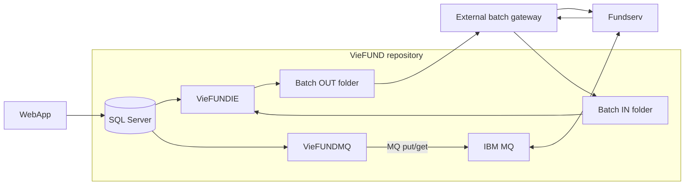

# Fundserv — System Boundary

> Trang canonical để xác định thành phần nào thuộc VieFUND, thành phần nào thuộc Fundserv/gateway bên ngoài và bằng chứng nào còn thiếu. Quy ước nhãn theo [README](README.md).

## 1. Sơ đồ ranh giới

## 2. Hai kênh Fundserv độc lập

| Kênh | Runtime đã xác minh | Điểm dừng của source-visible flow |
|---|---|---|
| **Batch filesystem** | `VieFUNDIE` lấy dữ liệu từ DB, sinh TFS/NFU vào OUT, sau đó quét IN qua `FFImport.ProcessAllX`. | File được ghi/đọc trên filesystem. Pickup/drop tiếp theo thuộc gateway ngoài repository. |
| **IBM MQ realtime** | `VieFUNDMQ` lấy order message từ DB, gửi trực tiếp vào request queue và đọc response queue. | MQ put/get và DB response-processing boundary; không dùng file OUT/IN. |

Hai kênh không phải chuỗi “VieFUNDIE tạo file rồi VieFUNDMQ gửi file”. `VieFUNDMQ` tạo `MQMessage` từ `OrderMSG` lấy riêng từ DB.

> Source evidence: `Services/VieFUNDIE/VieFUNDIE.cs:654-818`; `Services/VieFUNDMQ/VieFUNDMQ.cs:997-1209`.

## 3. Trách nhiệm từng thành phần

| Thành phần | Trách nhiệm có thể chứng minh |
|---|---|
| WebApp | Thu thập/approve nghiệp vụ và chuyển request vào business/DB boundary. |
| SQL Server/SP | Chọn dữ liệu chờ, tạo filename/body, record definitions và thực hiện phần lớn state mutation. |
| `VieFUNDIE` | Timer batch, load settings, sinh TFS/NFU/Cannex và gọi inbound scanner. |
| `COrder` / `CXM` | Bọc body DB bằng envelope TFS/NFU; parse order/NFU response. |
| `FFImport` | Discovery, dispatch, file audit và move Imported/Error/Skipped. |
| `VieFUNDMQ` | Kết nối IBM MQ, gửi order realtime, đọc response và chuyển vào order parser. |
| External gateway | Pickup OUT, chuyển tới Fundserv và deposit response vào IN; implementation không hiện diện trong source đã rà soát. |

> Source evidence: `DLLs/UBFFImport/COrder.cs:20-166`; `DLLs/UBFFImport/CXM.cs:36-150`; `DLLs/UBFFImport/FFImport.cs:910-1930`.

## 4. Trust boundary

### Boundary A — WebApp/Service ↔ Database

Filename, XML body, file-code metadata và final business status thường nằm trong SP/lookup. Nếu chỉ thấy C# gọi SP thì phải ghi **DB/SP-dependent**, không suy ra final row mutation.

### Boundary B — VieFUNDIE ↔ filesystem

Source chứng minh local file write/read/move. File xuất hiện trong OUT chỉ là local milestone, chưa phải gateway pickup hoặc Fundserv acknowledgement.

### Boundary C — filesystem ↔ external gateway

Không tìm thấy FTP/SFTP client trong call path Fundserv batch đã rà soát. Protocol, host, credentials, pickup interval, ACK, retry và retention phải lấy từ deployment/runbook của gateway.

### Boundary D — VieFUNDMQ ↔ IBM MQ

Source chứng minh queue configuration, put/get và response adapter. Queue-manager deployment, certificate validity, network ACL và Fundserv-side acceptance vẫn cần evidence vận hành.

> Source evidence: `DLLs/UBFFImport/COrder.cs:50-85`; `DLLs/UBFFImport/CXM.cs:36-76`; `Services/VieFUNDMQ/VieFUNDMQ.cs:191-283,997-1209`.

## 5. Cannex và shared service boundary

Cannex GIC dùng chung timer/filesystem engine `VieFUNDIE`, nhưng có generator, path và inbound patterns riêng. Source không chứng minh Cannex là Fundserv file hoặc dùng cùng gateway TFS/NFU.

> Source evidence: `Services/VieFUNDIE/VieFUNDIE.cs:763-785`; `DLLs/UBFFImport/CannexOrder.cs:536-619`.

## 6. Điều chưa thể kết luận từ repository

- Dealer/DSID nào dùng batch, MQ hoặc cả hai.
- Gateway product/service nào đang pickup/drop batch files.
- Production SP/schema/config và binary có trùng source snapshot hay không.
- File-level ACK, duplicate suppression, resend, retention và purge policy.
- Chứng thư/credential hiện hành và quyền ACL production.

Các thông tin trên chỉ được đưa thành fact sau khi có owner, environment và deployment evidence.