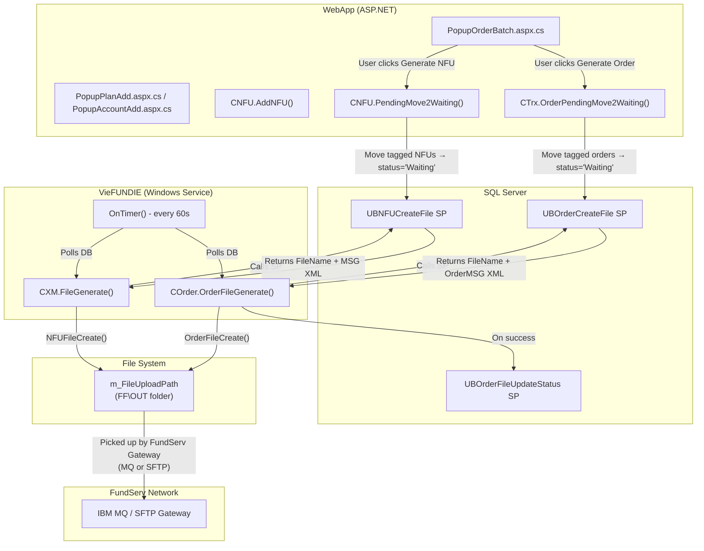

# TFS/NFU → FundServ: Current Sending Mechanism

## Architecture Overview



---

## TFS (Transaction File System) — Order Sending Flow

### Step 1: User Tags & Triggers Send (WebApp)

**File**: `PopupOrderBatch.aspx.cs`

1. User opens **Order Entry** page (tab "Pending")
2. Tags orders using checkboxes → calls `CTrx.OrderPendingSelectionUpdate()`
3. Clicks **"Generate Order"** button → `OnGenerateOrderFile()` (L295)
4. Confirm dialog: *"Send tagged items to FundServ. Are you sure?"*
5. On confirm → `OnGenerateOrderFileBtn()` (L320)
6. Calls `CTrx.OrderPendingMove2Waiting()` — moves tagged orders to **"Waiting"** status in DB

Two modes available:
- **Real-time (RT)**: `iMode=1` → sent immediately via MQ
- **Batch**: `iMode=0` → generates CO file for pickup

### Step 2: VieFUNDIE Windows Service Generates File

**File**: `VieFUNDIE.cs` → `OnTimer()` (L654)

Every ~60 seconds, the service:
1. Calls `COrder.OrderFileGenerate()` (L754)
2. Then calls `CXM.FileGenerate()` (L758) for NFU

### Step 3: TFS XML File Generation

**File**: `COrder.cs`

`OrderFileGenerate()` (L86):
1. Calls SP `UBOrderCreateFile` — returns `FileName`, `OrderMSG` (XML body), `iVersion`, `bLTI`
2. The SP assembles XML from order data in DB using classes from `TS_Export.cs`
3. Calls `OrderFileCreate()` (L50) which wraps the body in TFS envelope:

```xml
<?xml version="1.0" encoding="UTF-8"?>
<OrdSet xmlns:xsi="http://www.w3.org/2001/XMLSchema-instance" 
        xmlns="tfs" xsi:schemaLocation="tfs tfs.xsd" Version="35">
  <!-- OrderMSG body from SP -->
</OrdSet>
```

4. Writes file to `m_FileUploadPath` (e.g., `C:\VieFUND\FF\OUT\`)
5. On success → calls SP `UBOrderFileUpdateStatus` to mark `iStatus=1`

### Step 4: Version Control

**File**: `COrder.cs` → `GetFSVersion()` (L20)

```csharp
static public int GetFSVersion(int iVersion)
{
    if (iVersion < 34) iVersion = 34;
    if (iVersion <= 34)
    {
        DateTime dtToday = DateTime.Now;
        DateTime dtCutOff = new DateTime(2025, 9, 6);
        iVersion = 34;
        if (dtToday >= dtCutOff) iVersion = 35;
    }
    return iVersion;
}
```

> [!IMPORTANT]
> Currently hardcoded to switch from V34 → V35 based on date `2025-09-06`. **V36 is not yet implemented here**. This will need a new cutoff for the V36 go-live date (June 15, 2026).

---

## NFU (Non-Financial Update) — Sending Flow

### Step 1: User Tags & Triggers Send (WebApp)

**File**: `PopupOrderBatch.aspx.cs` — Tab "NFU"

1. User opens **Order Entry** page, tab "NFU" (index 2)
2. Selects NFU types to send (checkboxes):
   - Client Name, Client Address, New Account, Beneficiary, Account Attributes
   - Distribution Options, Pre-Auth Chequing, Advisor Info, Advisor Deactivate
   - Transfer to Advisor, TFSA Successor, FATCA, Fee, CDIC
3. Tags items → `CNFU.PendingSelectionUpdate()`
4. Clicks **"Generate NFU"** → `OnGenerateNFUFile()` (L873)
5. Calls `CNFU.PendingMove2Waiting()` — moves tagged items to "Waiting" status

### Step 2: VieFUNDIE Windows Service Generates File

Same as TFS — `OnTimer()` calls `CXM.FileGenerate()` right after `COrder.OrderFileGenerate()`.

### Step 3: NFU XML File Generation

**File**: `CXM.cs`

`FileGenerate()` (L77):
1. Calls SP `UBNFUCreateFile` — returns `FileName`, `MSG` (XML body), `iVersion`, `iFileID`
2. Calls `NFUFileCreate()` (L36) which wraps the body in NFU envelope:

```xml
<?xml version="1.0" encoding="UTF-8"?>
<MessageSet xmlns:xsi="http://www.w3.org/2001/XMLSchema-instance" 
            xmlns="nfu" xsi:schemaLocation="nfu nfu.xsd" Version="35">
  <!-- MSG body from SP -->
</MessageSet>
```

3. Writes file to `m_FileUploadPath`

### NFU Data Sources

NFU messages originate from various UI pages:
- `PopupPlanAdd.aspx.cs` — Account Setup (New Account, Successor, etc.)
- `PopupAccountAdd.aspx.cs` — Account modifications
- `PanelTFSAEdit.aspx.cs` — TFSA Successor edits
- `PanelPlanBenAdd.aspx.cs` — Beneficiary updates

These pages call `CNFU.AddNFU()` (`NFU.cs:L458`) which calls SP `UBNFUAdd` to queue the NFU message.

---

## File Delivery to FundServ

### Output Path

Files are written to the **Upload Path** (configurable per dealership):
- Default: `<AppPath>\FF\OUT\`
- Configurable via WebApp: `PopupFundServ.aspx.cs` → `idFundServUploadPath`

### Transport Mechanism

Files in the output directory are picked up by the **FundServ Gateway** infrastructure:
- **IBM MQ** (via `VieFUNDMQLib`) — for real-time dealers
- **SFTP/File-based** — FundServ's standard file pickup mechanism

> [!NOTE]
> The WebApp/VieFUNDIE **does not directly connect** to FundServ's network. It writes XML files to a shared directory. A separate FundServ-provided gateway (or IBM MQ middleware) handles actual network transmission.

---

## Response Handling (DR/XR files)

After FundServ processes the TFS/NFU, response files are deposited back:

| File Type | Handler | SP |
|---|---|---|
| **DR** (Order Response) | `COrder.cs` `ImportXML()` | `UBXMLRecOrderRespnProcess` |
| **XR** (NFU Response) | `CXM.cs` `ImportXML()` | `UBXMLRecNFURespnProcess` |

The VieFUNDIE service picks up response files from `m_FilePath` (the IN folder), parses them, and updates order/NFU status in the DB.

---

## TFS XML Structure (Export)

**File**: `TS_Export.cs`

Key XML serialization classes:

```
CTS_Export (root: TrxnRecon)
├── CreateDate, MgmtCode, DlrCode
└── TrxnRec[] (CTrxnRec)
    ├── ProcessDate, FundAcctID, AcctDesig, DlrCode, RepCode, AcctType, OrdSrc, OrdType, SrcID
    ├── BuyCof (Buy Confirmation)
    │   ├── TrxnTyp, TrxnTypDtl, TradeDate, SettlDate
    │   └── BuyFund (FundID, Currency, GrossAmt, NetAmt, NAV, UnitTrxnd, SettlMethd, SettlAmt)
    ├── SellCof (Sell Confirmation)
    │   └── SellFund (+ CDedns deductions)
    ├── SwitchCof (Switch Out + In)
    ├── DistribCof (Distribution)
    │   └── DistribFund (+ CDedns)
    └── ETCof (External Transfer)
        ├── ToAcct / FromAcct
        ├── TrnsfrFund (+ CDedns)
        └── Demo (Owner, Jnt, Spousal, ITF, RESPBenDtl, DthBenDtl, TFSASucsr)
```

### Current Deductions (CDedns) fields:

```csharp
public class CDedns
{
    public string ShortTermFee;
    public string AdminFee;
    public string MgmtFee;
    public string PerformFee;
    public string OtherFee;          // ← Only specific deduction fee
    public string Penalty;
    public string DSCAmount;
    public string SalesTax;
    public string FedWHoldTax;
    public string ProvWHoldTax;
    public string LSIFClawbackFed;
    public string LSIFClawbackProv;
    public string Clawback;
    public string TotalDedns;        // ← Required
    // MISSING: EarlyRdmtnFee, DlrAdvsrFee, MVA, IRSTax
}
```

> [!WARNING]
> The 4 new V36 deduction fields (`EarlyRdmtnFee`, `DlrAdvsrFee`, `MVA`, `IRSTax`) are **completely absent** from the current `CDedns` class. These need to be added for V36 compliance.

### Current Successor section:

```csharp
// In CDemo:
public CTFSASucsr TFSASucsr;  // ← Named "TFSASucsr", V36 renames to "Sucsr"
```

> [!WARNING]
> V36 requires renaming `TFSASucsr` → `Sucsr` in the XML output, and extending scope to RRIF (type=04) and FHSA (type=22). See implementation plan Section 5.

---

## Summary: Key Files in TFS/NFU Send Pipeline

| Stage | TFS Files | NFU Files |
|---|---|---|
| **UI (WebApp)** | `PopupOrderBatch.aspx.cs` | Same file, NFU tab |
| **Business Logic** | `CTrx` class | `NFU.cs` (`CNFU`) |
| **XML Serialization** | `TS_Export.cs` | SP-generated (DB-side) |
| **File Generation** | `COrder.cs` | `CXM.cs` |
| **Windows Service** | `VieFUNDIE.cs` | Same service |
| **Schema version** | `tfs.xsd` Version="35" | `nfu.xsd` Version="35" |
| **Response Import** | `COrder.cs` `ImportXML()` → DR files | `CXM.cs` `ImportXML()` → XR files |

