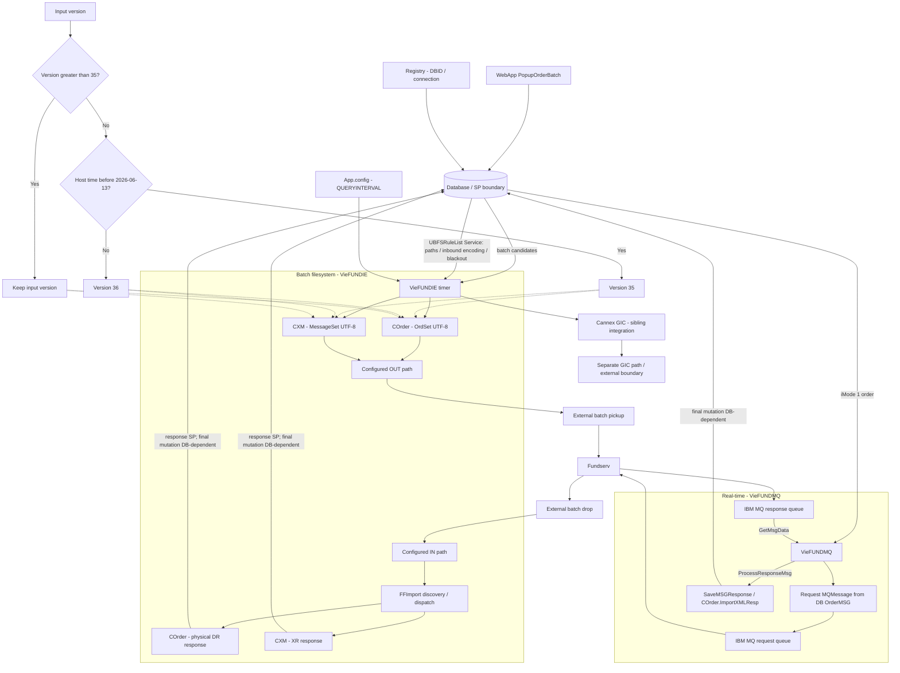

# Sơ đồ runtime TFS/NFU

[Nội dung canonical và source evidence: Luồng runtime TFS/NFU](tfs-nfu-flow.md)

```mermaid
flowchart TB
    UI[WebApp PopupOrderBatch] --> DB[(Database / SP boundary)]

    subgraph BATCH[Batch filesystem - VieFUNDIE]
        IE[VieFUNDIE timer]
        TFS[COrder - OrdSet UTF-8]
        NFU[CXM - MessageSet UTF-8]
        OUT[Configured OUT path]
        IN[Configured IN path]
        SCAN[FFImport discovery / dispatch]
        DR[COrder - physical DR response]
        XR[CXM - XR response]
    end

    subgraph REALTIME[Real-time - VieFUNDMQ]
        MQS[VieFUNDMQ]
        MQREQ[Request MQMessage from DB OrderMSG]
        MQOUT[IBM MQ request queue]
        MQIN[IBM MQ response queue]
        MQPROC[SaveMSGResponse / COrder.ImportXMLResp]
    end

    DB -->|batch candidates| IE
    IE --> TFS
    IE --> NFU
    TFS --> OUT
    NFU --> OUT
    OUT --> PICKUP[External batch pickup]
    PICKUP --> FUND[Fundserv]

    DB -->|iMode 1 order| MQS
    MQS --> MQREQ
    MQREQ --> MQOUT
    MQOUT --> FUND
    FUND --> MQIN
    MQIN -->|GetMsgData| MQS
    MQS -->|ProcessResponseMsg| MQPROC
    MQPROC -->|final mutation DB-dependent| DB

    FUND --> DROP[External batch drop]
    DROP --> IN
    IN --> SCAN
    SCAN --> DR
    SCAN --> XR
    DR -->|response SP; final mutation DB-dependent| DB
    XR -->|response SP; final mutation DB-dependent| DB

    REG[Registry - DBID / connection] --> DB
    DB -->|UBFSRuleList Service: paths / inbound encoding / blackout| IE
    APP[App.config - QUERYINTERVAL] --> IE

    IE --> GIC[Cannex GIC - sibling integration]
    GIC --> GICOUT[Separate GIC path / external boundary]

    V[Input version] --> GT{Version greater than 35?}
    GT -->|Yes| KEEP[Keep input version]
    GT -->|No| DATE{Host time before 2026-06-13?}
    DATE -->|Yes| V35[Version 35]
    DATE -->|No| V36[Version 36]
    V35 -.-> TFS
    V35 -.-> NFU
    V36 -.-> TFS
    V36 -.-> NFU
    KEEP -.-> TFS
    KEEP -.-> NFU
```
