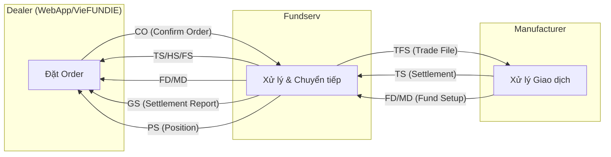

# Giải thích Plan: Fundserv Standards V36 – Cập nhật cho Dealer WebApp

> [!NOTE]
> Đây là bản giải thích cho file plan gốc tại:
> `implementation_plan.md.resolved`
>
> File plan gốc **không bị thay đổi**.

---

## Tổng quan dự án

### Fundserv là gì?
**Fundserv** là hệ thống trung gian điện tử được sử dụng tại Canada để xử lý giao dịch quỹ đầu tư (mutual funds) giữa hai bên:
- **Distributor (Dealer)**: Công ty phân phối quỹ đầu tư (phía chúng ta – dùng WebApp)
- **Manufacturer**: Công ty quản lý quỹ đầu tư

Fundserv đóng vai trò như **"bưu điện điện tử"** – nhận order từ Dealer, gửi cho Manufacturer, rồi trả kết quả settlement về.

### V36 là gì?
Fundserv phát hành bản cập nhật tiêu chuẩn mỗi năm, gọi là **"Standards Version"**. **V36** là phiên bản năm 2026, có hiệu lực từ **ngày 15/06/2026**. Tất cả Dealer và Manufacturer phải tuân thủ.

### Hệ thống của chúng ta gồm gì?
- **WebApp** (`WebApp/Main/`): Ứng dụng ASP.NET Web Forms – giao diện cho nhân viên dealer đặt giao dịch, quản lý tài khoản nhà đầu tư
- **VieFUNDIE**: Windows Service chạy nền – tự động gửi/nhận file XML với Fundserv

### Deadline
| Mốc | Ngày |
|---|---|
| External UAT (test với Fundserv) | 25/03/2026 |
| Go-live | 15/06/2026 |

---

## Giải thích từng thay đổi

---

### 1. TCR – Deductions Update (4 loại phí mới)

#### Đây là gì?
**TCR (Total Cost Reporting)** là quy định của cơ quan quản lý chứng khoán Canada (CSA) yêu cầu báo cáo **tất cả chi phí đầu tư** cho nhà đầu tư một cách rõ ràng.

Khi nhà đầu tư bán quỹ (redemption), số tiền nhận được bị khấu trừ nhiều loại phí. Phần **Deductions** trong file giao dịch ghi nhận các khoản khấu trừ này.

#### Vấn đề hiện tại
Hiện tại hệ thống chỉ có loại "Other Fee" (phí khác) – quá chung chung, không cho biết nhà đầu tư bị trừ phí gì cụ thể. Điều này **không đáp ứng yêu cầu TCR**.

#### Cần làm gì?
Thêm **4 loại phí mới** vào hệ thống:

| Loại phí | Tên XML | Ý nghĩa |
|---|---|---|
| **Early Redemption Fee** | `EarlyRdmtnFee` | Phí bán sớm – khi nhà đầu tư bán quỹ trước thời hạn tối thiểu |
| **Dealer Advisory Fee** | `DlrAdvsrFee` | Phí tư vấn của dealer – phí mà dealer thu cho dịch vụ tư vấn |
| **Market Value Adjustment** | `MVA` | Điều chỉnh giá trị thị trường – thường áp dụng cho segregated funds (quỹ bảo hiểm) |
| **IRS Tax** | `IRSTax` | Thuế IRS – áp dụng cho nhà đầu tư Mỹ có tài khoản tại Canada |

#### Ảnh hưởng lên code
- **Nhiều file cần sửa**: Tất cả nơi hiển thị hoặc xử lý deductions (phí khấu trừ)
- **Database**: Thêm 4 cột mới vào bảng giao dịch
- **XML parsing**: Khi nhận file TS (Transaction Settlement), HS (Historical Settlement), FS (Settlement Instruction) từ Fundserv → phải đọc được 4 trường mới
- **Công thức tính**: `TotFees` và `TotTaxClawback` phải bao gồm các phí mới

#### Mức độ: 🔴 Bắt buộc | Độ phức tạp: **Cao**

> **Tóm lại**: Fundserv yêu cầu ghi nhận chi tiết hơn các khoản phí khi nhà đầu tư rút tiền. Phải thêm 4 loại phí mới vào UI, database, và logic xử lý file XML.

---

### 2. Quebec Joint Account Setup (Hạn chế tài khoản chung tại Quebec)

#### Đây là gì?
**Joint Account** là tài khoản đầu tư đồng sở hữu (2 người trở lên). Có 2 loại chính:
- **Joint Tenants with Right of Survivorship (JTWROS)**: Khi một người chết, phần của họ tự động chuyển cho người còn lại
- **Tenants in Common (TIC)**: Khi một người chết, phần của họ theo di chúc (không tự động chuyển)

#### Vấn đề hiện tại
Theo **luật dân sự Quebec** (Code civil du Québec), tỉnh Quebec **không công nhận** quyền survivorship (JTWROS). Do đó, tài khoản chung tại Quebec chỉ được phép là **Tenants in Common** (giá trị `T`).

Hiện tại hệ thống cho phép chọn bất kỳ loại nào → gây lỗi khi Manufacturer nhận được → phải xử lý thủ công.

#### Cần làm gì?
- Khi tỉnh = **QC** (Quebec) và loại tài khoản = **Joint**:
  - Tự động chọn và **khóa** Joint Survivor Type = `T` (Tenants in Common)
  - Nếu có nhiều Joint Owner → chỉ cho phép **1 Joint Owner** duy nhất (theo quy tắc Recipient Code = 2)
- Hiển thị cảnh báo trên giao diện cho người dùng biết lý do bị hạn chế

#### Ảnh hưởng lên code
- `PopupPlanAdd.aspx.cs` và `PopupAccountAdd.aspx.cs`: Thêm validation
- UI (`.aspx` files): Hiển thị warning

#### Mức độ: 🔴 Bắt buộc | Độ phức tạp: **Thấp**

> **Tóm lại**: Quebec không cho phép "right of survivorship" cho tài khoản chung. Cần khóa lựa chọn trên UI để tránh tạo tài khoản không hợp lệ.

---

### 3. Cập nhật thuật ngữ xác minh danh tính khách hàng

#### Đây là gì?
Khi mở tài khoản đầu tư, **FINTRAC** (cơ quan chống rửa tiền Canada) yêu cầu xác minh danh tính khách hàng bằng giấy tờ tùy thân.

#### Vấn đề hiện tại
Hệ thống dùng thuật ngữ **"Provincial health card"** (thẻ bảo hiểm y tế tỉnh) cho ID Type = `C`. Nhưng:
- Một số tỉnh **cấm** dùng health card cho mục đích tài chính
- FINTRAC dùng thuật ngữ khác: **"provincial or territorial identity card"** (thẻ căn cước tỉnh/vùng lãnh thổ)

#### Cần làm gì?
Chỉ đổi **nhãn hiển thị** (label) trên giao diện:
- **Cũ**: `C – Provincial health card`
- **Mới**: `C – Provincial or territorial identity card`

Không thay đổi giá trị (`C`) hay logic xử lý.

#### Ảnh hưởng lên code
- Dropdown/label trên vài trang ASPX (bản EN và FR)
- Có thể cập nhật lookup table trong database

#### Mức độ: 🟡 Thay đổi text | Độ phức tạp: **Thấp**

> **Tóm lại**: Đổi tên hiển thị của một loại giấy tờ tùy thân cho phù hợp với thuật ngữ FINTRAC. Chỉ thay đổi chữ, không thay đổi logic.

---

### 4. Fee Redemptions cho Client Name Accounts

#### Các khái niệm cần biết
- **Fee Redemption**: Giao dịch mà dealer rút phí từ tài khoản nhà đầu tư (ví dụ: phí tư vấn hàng quý)
- **Account Designation (AcctDesig)**:
  - `1 – Client Name`: Tài khoản đứng tên nhà đầu tư trực tiếp
  - `2 – Nominee`: Tài khoản đứng tên công ty chứng khoán (dealer giữ hộ)
  - `3 – Intermediary`: Tài khoản trung gian
- **EPA (Electronic Processing Agreement)**: Thỏa thuận xử lý điện tử – thay thế ủy quyền bằng giấy

#### Vấn đề hiện tại
Fee Redemptions hiện chỉ cho phép với tài khoản **Nominee** (AcctDesig=2) và **Intermediary** (AcctDesig=3). Tài khoản **Client Name** (AcctDesig=1) bị chặn.

#### Cần làm gì?
- **Mở rộng** cho phép Fee Redemption trên Client Name accounts
- **Bắt buộc settlement qua N\$M** (Net Settlement via Manufacturer) cho Client Name
- **Hỗ trợ sửa lỗi**: AOTs (Account Ownership Transfers) và reversals
- **Sales tax**: Dealer phải tính thuế nếu tài khoản non-registered
- **Gross/Net**: Khuyến cáo dùng "Net" để tránh bị khấu trừ thêm

#### Ảnh hưởng lên code
- **Nhiều file**: Tất cả nơi check `AcctDesig` cho Fee Redemption
- Logic nghiệp vụ phức tạp: settlement method, tax, error correction

#### Mức độ: 🔴 Bắt buộc | Độ phức tạp: **Cao**

> **Tóm lại**: Trước đây dealer chỉ rút phí được từ tài khoản đứng tên dealer. Giờ cho phép rút phí từ tài khoản đứng tên khách hàng trực tiếp, kèm theo nhiều quy tắc mới.

---

### 5. Mở rộng Successor Annuitant cho RRIF và FHSA

#### Các khái niệm cần biết
- **Successor Annuitant** (Người nhận kế tiếp): Người được chỉ định nhận quyền sở hữu tài khoản khi chủ tài khoản qua đời, **không qua di chúc** (probate), tài khoản tiếp tục tồn tại
- **Death Beneficiary** (Người thụ hưởng tử vong): Người nhận **số tiền** trong tài khoản khi chủ qua đời, tài khoản bị đóng
- **Loại tài khoản đăng ký tại Canada**:
  - **TFSA** (Tax-Free Savings Account, type=17): Tài khoản tiết kiệm miễn thuế
  - **RRIF** (Registered Retirement Income Fund, type=04): Quỹ thu nhập hưu trí đăng ký
  - **FHSA** (First Home Savings Account, type=22): Tài khoản tiết kiệm mua nhà lần đầu (mới)

#### Vấn đề hiện tại
Hệ thống đã hỗ trợ Successor cho:
- ✅ TFSA (type=17)
- ✅ RRIF (type=04) – đã có sẵn
- ❌ FHSA (type=22) – **chưa có**

#### Cần làm gì?
1. **Thêm FHSA** (type=22) vào danh sách account types cho phép Successor
2. **Đổi tên** trong code và UI: `TFSASucsr` → `Sucsr` (vì không chỉ dành cho TFSA nữa)
3. **Validation Quebec**: Quebec không cho phép Successor cho tài khoản non-segregated, non-locked-in
4. **Validation non-Quebec**: Bắt buộc phải có Death Beneficiary HOẶC Successor

#### Thay đổi code cụ thể nhất
```diff
- if (AccountType != "17" && !IsRIFPlan(AccountType)) bTFSASuccessorInd = false;
+ if (AccountType != "17" && AccountType != "22" && !IsRIFPlan(AccountType)) bTFSASuccessorInd = false;
```
→ Thêm điều kiện `AccountType != "22"` để FHSA cũng được phép có Successor.

#### Mức độ: 🔴 Bắt buộc | Độ phức tạp: **Trung bình**

> **Tóm lại**: Khi chủ tài khoản qua đời, cho phép chỉ định "người nhận kế tiếp" cho thêm loại tài khoản FHSA (mua nhà lần đầu), đồng thời đổi tên hệ thống cho chính xác hơn.

---

### 6. Giảm thiểu trao đổi dữ liệu cá nhân – Phase 1

#### Đây là gì?
Do luật bảo mật mới của Canada (đặc biệt **Law 25** của Quebec), Fundserv giảm lượng thông tin cá nhân nhạy cảm truyền qua hệ thống.

#### Thay đổi chính
| Dữ liệu | Trước | Sau |
|---|---|---|
| **SIN** (số bảo hiểm xã hội) | Toàn bộ 9 chữ số | Chỉ **4 chữ số cuối** (`SINPartial`) |
| **Số tài khoản ngân hàng** | Toàn bộ | Chỉ **4 ký tự cuối** (`BkAcctNumPartial`) |
| **Thông tin xác minh danh tính** (IDVerify) | Có | **Xóa hoàn toàn** khỏi kết quả truy vấn |
| **Tìm kiếm theo SIN** | Có | **Xóa** tính năng |

#### Ảnh hưởng
- **Phase 1 (V36)**: Chỉ ảnh hưởng **myserv** (API trực tuyến), KHÔNG ảnh hưởng file TFS/NFU
- **Phase 2 (V37, năm 2027)**: Sẽ ảnh hưởng file TFS/NFU
- **Chỉ cần thay đổi nếu WebApp kết nối trực tiếp với myserv API**

#### Mức độ: 🟡 Tùy thuộc có myserv hay không | Độ phức tạp: **Thấp - Trung bình**

> **Tóm lại**: Fundserv che bớt thông tin nhạy cảm (SIN, số tài khoản ngân hàng) để tuân thủ luật bảo mật. Chỉ cần thay đổi nếu hệ thống có kết nối myserv.

---

### 7. Cập nhật Product Type cho Fund Setup

#### Đây là gì?
Mỗi quỹ trên Fundserv có **Product Type** (loại sản phẩm) để phân loại. Dealer dùng thông tin này cho **KYP (Know Your Product)** reviews – đánh giá sản phẩm trước khi bán cho khách.

#### Thay đổi
| Hành động | Product Type | Lý do |
|---|---|---|
| ➕ Thêm | `B – Bullion` (vàng/bạc) | Loại sản phẩm mới được giao dịch |
| ❌ Xóa | `E – ETF` | ETF không giao dịch qua Fundserv |
| ❌ Xóa | `O – Other` | Quá chung chung, không có giá trị phân loại |

Ngoài ra, kiểu dữ liệu đổi từ **enum cố định** sang **pattern** `[A-Z]{1}` → linh hoạt thêm giá trị mới mà không cần đổi schema.

#### Mức độ: 🔴 Bắt buộc | Độ phức tạp: **Thấp**

> **Tóm lại**: Thêm loại quỹ "Bullion", bỏ "ETF" và "Other" khỏi danh sách Product Type. Cập nhật dropdown/validation trên UI.

---

### 8. Mở rộng Custom Date cho Fund Setup

#### Đây là gì?
Một số quỹ đặc biệt (exempt market, alternative products) cần **custom pricing model** – tức là mỗi ngày có bộ 3 ngày riêng: Cutoff Date, Price Date, Settlement Date. Thông tin này nằm trong file **FD/MD** (Fund Definition / Model Definition).

#### Thay đổi
- Giới hạn tối đa Custom Date sections: **250 → 500**
- Lý do: 250 entries không đủ cho quỹ cần define dates cho 1-2 năm (~250-500 ngày làm việc)

#### Mức độ: 🟡 Chỉ nếu xử lý file FD/MD | Độ phức tạp: **Thấp**

> **Tóm lại**: Tăng gấp đôi số ngày tùy chỉnh cho phép trong file thiết lập quỹ. Chỉ cần thay đổi nếu hệ thống import/parse file FD/MD.

---

### 9. Tăng kích thước field Amount Value trong GS File

#### Đây là gì?
**GS file (Settlement Report)** là báo cáo tổng hợp số tiền settlement hàng ngày giữa Dealer và Manufacturer.

#### Vấn đề
Khi volume giao dịch tăng cao (rebalancing hàng loạt, same-to-same order), tổng giá trị settlement một ngày có thể **vượt quá** giới hạn hiện tại (999,999,999.9999 ~ gần 1 tỷ CAD).

#### Thay đổi
| | Cũ | Mới |
|---|---|---|
| Độ dài tối đa | 14 ký tự | **16 ký tự** |
| Số nguyên tối đa | 9 chữ số | **11 chữ số** |
| Giá trị tối đa | ~1 tỷ | **~100 tỷ** |

#### Mức độ: 🔴 Bắt buộc | Độ phức tạp: **Thấp**

> **Tóm lại**: Tăng kích thước field số tiền trong báo cáo settlement để chứa được giá trị lớn hơn. Cập nhật parser và database column.

---

### 10. Xử lý Terminated Funds trong PS File

#### Đây là gì?
**PS file (Position Reconciliation)** là báo cáo đối soát vị thế (balance) giữa Dealer và Manufacturer, gửi định kỳ.

#### Thay đổi
Khi tất cả quỹ trong một tài khoản đã bị terminated (đóng):
- **Trước**: Manufacturer phải include ít nhất 1 terminated fund (báo cáo balance = 0) để đáp ứng quy tắc "báo cáo 2 tháng sau khi đóng"
- **Sau**: Manufacturer chỉ cần báo cáo Account Status = "Terminated" trong 2 tháng, **không bắt buộc** include fund position

#### Ảnh hưởng
- Chỉ thay đổi **logic validation** (nếu có) khi xử lý PS file – relax điều kiện cho terminated funds

#### Mức độ: 📝 Documentation/Logic | Độ phức tạp: **Thấp**

> **Tóm lại**: Nới lỏng quy tắc validation khi đối soát quỹ đã đóng. Ảnh hưởng tối thiểu.

---

## Tóm tắt: Việc gì cần làm trước?

### Nhóm ưu tiên cao (phức tạp, bắt buộc)
1. **TCR Deductions** – Thêm 4 loại phí mới → ảnh hưởng nhiều file, DB, parsing
2. **Client Name Fee Redemptions** – Mở rộng giao dịch rút phí → logic nghiệp vụ phức tạp

### Nhóm ưu tiên cao (đơn giản, bắt buộc)
3. **Quebec Joint Account** – Thêm validation cho tài khoản chung Quebec
4. **Successor RRIF/FHSA** – Mở rộng chức năng đã có sang loại tài khoản mới
5. **Product Type Updates** – Cập nhật dropdown
6. **GS File Amount** – Tăng field width

### Nhóm ưu tiên thấp (tùy điều kiện)
7. **ID Verification text** – Đổi nhãn hiển thị
8. **Minimizing Data Exchange** – Chỉ nếu có myserv
9. **Custom Date Expansion** – Chỉ nếu xử lý FD/MD file
10. **PS Terminated Funds** – Chỉ documentation/logic

---

## 5 câu hỏi mở cần trả lời

| # | Câu hỏi | Tại sao quan trọng? |
|---|---|---|
| 1 | WebApp có kết nối trực tiếp **myserv** không? | Quyết định mục 6 có cần làm hay không |
| 2 | Database schema hiện tại của bảng `Deductions` có những cột nào? | Để biết cần thêm bao nhiêu cột cho mục 1 |
| 3 | File FD/MD được xử lý ở đâu (WebApp hay hệ thống khác)? | Quyết định mục 8 có cần làm hay không |
| 4 | Có cần hỗ trợ **cả V35 lẫn V36** cùng lúc không? | Ảnh hưởng cách viết parser (backward compatible hay không) |
| 5 | Xác nhận Phase 2 (TFS/NFU data minimization) chỉ nằm trong V37? | Để không làm thừa cho V36 |

---

## Giải thích các thuật ngữ viết tắt trong plan

| Viết tắt | Tên đầy đủ | Ý nghĩa |
|---|---|---|
| **TCR** | Total Cost Reporting | Quy định báo cáo tổng chi phí đầu tư |
| **CSA** | Canadian Securities Administrators | Cơ quan quản lý chứng khoán Canada |
| **FINTRAC** | Financial Transactions and Reports Analysis Centre of Canada | Cơ quan chống rửa tiền Canada |
| **SIN** | Social Insurance Number | Số bảo hiểm xã hội Canada (tương tự CMND/CCCD) |
| **EPA** | Electronic Processing Agreement | Thỏa thuận xử lý điện tử (thay giấy ủy quyền) |
| **KYP** | Know Your Product | Quy trình đánh giá sản phẩm trước khi bán |
| **DOT** | Design Option Topic | Mã đề tài thiết kế trong quy trình Fundserv |
| **TS** | Transaction Settlement | File kết quả giao dịch |
| **HS** | Historical Settlement | File kết quả giao dịch lịch sử |
| **FS** | Settlement Instruction | File chỉ thị thanh toán |
| **GS** | Settlement Report | File báo cáo thanh toán tổng hợp |
| **PS** | Position Statement | File đối soát vị thế |
| **FD/MD** | Fund Definition / Model Definition | File thiết lập quỹ |
| **TFS** | Trade & Financial Services | File giao dịch và dịch vụ tài chính |
| **NFU** | Non-Financial Update | File cập nhật phi tài chính (demographic) |
| **NS** | Notification & Status | File thông báo và trạng thái |
| **CO** | Confirmation Order | File xác nhận order |
| **N\$M** | Net Settlement via Manufacturer | Phương thức thanh toán ròng qua Manufacturer |
| **AOT** | Account Ownership Transfer | Chuyển quyền sở hữu tài khoản |
| **TFSA** | Tax-Free Savings Account | Tài khoản tiết kiệm miễn thuế |
| **RRIF** | Registered Retirement Income Fund | Quỹ thu nhập hưu trí đăng ký |
| **FHSA** | First Home Savings Account | Tài khoản tiết kiệm mua nhà lần đầu |
| **AcctDesig** | Account Designation | Phân loại loại tài khoản (Client Name/Nominee/Intermediary) |
| **QC** | Quebec | Tỉnh Quebec, Canada |
| **myserv** | Fundserv myserv (real-time API) | Kênh API trực tuyến của Fundserv (khác với batch file) |

---

## Các loại file XML trong hệ thống Fundserv



> **Luồng cơ bản**: Dealer gửi order → Fundserv chuyển → Manufacturer xử lý → Kết quả trả về Dealer qua các file TS/HS/FS/GS/PS.

