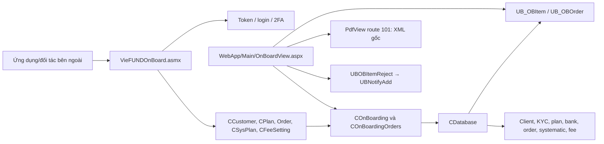

# Onboarding — ASMX, import hồ sơ và duyệt back-office

> Guide này mô tả contract dịch vụ, payload, luồng ghi database, chế độ auto/manual, màn hình duyệt và order import. Nội dung được đối chiếu trực tiếp với source C#, Web Forms và SQL snapshot ngày 2026-09-05. `VFCsvExport` không nằm trong phạm vi.

## 1. Kết luận nhanh

Onboarding trong repository là một **integration API cho hệ thống bên ngoài** và một **màn hình vận hành nội bộ**, không phải một feature đã được chứng minh thuộc `WebClient`:



Luồng hồ sơ khách hàng luôn ghi payload vào `UB_OBItem` trước. Sau đó:

- **Auto mode**: dịch vụ gọi chuỗi SP để tạo/cập nhật client, các section KYC và plan ngay trong request.
- **Manual mode dự kiến**: item ở trạng thái Pending để operator so sánh payload với client hiện có, ghép vào client hoặc tạo client mới, duyệt toàn bộ/từng section, hoặc reject và thông báo advisor.

Hai source tree `VFOnBoarding/` và `OnboardingWebServices/` cùng khai báo endpoint, root namespace, assembly name và project GUID. `VFOnBoarding` là bản mở rộng hơn, nhưng repository không có bằng chứng deployment đủ để kết luận production đang host tree nào.

## 2. Phạm vi và ranh giới đã xác minh

### 2.1. Hai implementation ASMX

| Thuộc tính | `VFOnBoarding` | `OnboardingWebServices` |
|---|---:|---:|
| Target framework | .NET Framework 4.5.2 | .NET Framework 4.5 |
| File C# được compile | 29 | 26 |
| `[WebMethod]` active | 54 | 38 |
| ASMX | `VieFUNDOnBoard.asmx` | `VieFUNDOnBoard.asmx` |
| Class endpoint | `VieFUNDOnBoarding.CVieFUNDOnBoarding` | Cùng class |
| Assembly | `VieFUNDOnBoarding.dll` | Cùng tên assembly |
| Phần mở rộng riêng | Password, 2FA, đăng ký user, TCP, bank, systematic plan, advisor fee | Không có các phần này |

`WebApp/WebApp.csproj` không project-reference một source tree cụ thể; nó reference `WebApp/bin/VieFUNDOnBoarding.dll`. Vì vậy phải kiểm tra artifact/IIS của từng môi trường trước khi sửa hoặc deploy. Không build và copy cả hai project vào cùng output vì chúng có cùng assembly identity.

### 2.2. `WebClient` không phải caller đã được chứng minh

Quét source active của `WebClient` không tìm thấy reference đến:

- `VieFUNDOnBoard.asmx`;
- namespace/assembly `VieFUNDOnBoarding`;
- các method như `ImportClient`, `ClientListXML`, `GetDashboardXML`.

Tên `WebClient` xuất hiện trong `VieFUNDOnBoarding.cs` là `System.Net.WebClient`, dùng để callback URL khi cấp token; nó không phải project portal `WebClient/`. Vì vậy guide này không gộp login/self-service portal vào pipeline onboarding khi chưa có caller hoặc tài liệu deployment bổ sung.

### 2.3. E-signature không nằm trong pipeline này

Không tìm thấy call tới DocuSign, Signority hoặc OneSpan trong hai project onboarding, `COnBoard` và `OnBoardView`. Nếu một quy trình onboarding ngoài repository gọi e-sign rồi gửi payload vào ASMX thì đó là orchestration bên ngoài, chưa thể suy ra từ source hiện có. Xem riêng [E-Signature](../../viefund-framework/esignature.md).

## 3. Bản đồ source

| Thành phần | Source chính | Vai trò |
|---|---|---|
| Endpoint | `VFOnBoarding/VieFUNDOnBoarding.cs` | 54 WebMethod active, XML/JSON facade, login, 2FA, import/query |
| Payload client | `ClientInfo.cs`, `Address.cs`, `Plan.cs` | Object graph client, KYC, TCP, bank và plan |
| Client importer | `COnBoarding.cs` | Validate token, stage payload, gọi từng SP section, tổng hợp lỗi |
| Order payload | `Data/Input/*.cs`, `Data/Output/*.cs` | Buy/Sell/Switch request và result |
| Order importer | `COnBoardingOrders.cs` | Stage order rồi gọi `UBOBFundTrxBuy/Sell/Switch` |
| Systematic plan | `CSysPlan.cs` | Query/import PAC, SWP và RRIF setting |
| Advisor fee | `CFeeSetting.cs` | Query/import plan fee và tier/payment option |
| Read APIs | `ClientDetail.cs`, `Dashboard*.cs`, `CDefinitions.cs` | Export client/plan, dashboard AUA, lookup definition |
| Back-office BLL | `UBClasses/COnBoard.cs` | List/detail/remove/reject, tìm client, advisor và question list |
| Back-office UI | `WebApp/Main/OnBoardView.aspx(.cs)` | Listing, compare, manual approve/reject, XML download |
| SQL | `ScriptDB/000_4_CreateSP.sql`, `000_3_CreateUDF.sql` | 52 routine name active từ phạm vi trên đều có definition trong snapshot |

Không dùng `.bak`, `Backup/`, `obj/` hoặc DLL decompile làm bằng chứng cho luồng active.

## 4. Contract ASMX

### 4.1. Nhóm endpoint active trong `VFOnBoarding`

| Nhóm | WebMethod | Auth nhìn thấy ở facade/BLL |
|---|---|---|
| Cấp token/login | `GetToken`, `LoginXML/JSON` | User/password, `CDatabase.InitToken*` |
| Account recovery | `UserPasswordChangeXML/JSON`, `UserPasswordForgotXML/JSON` | Credential/identity inputs; không nhận token |
| 2FA | `RequestVerificationCodeXML/JSON` | Tạo code qua `GetNew2FACode`, email hoặc Twilio SMS |
| Đăng ký | `RegistrationNewUserXML/JSON` | Không có token parameter; gọi `RegisterNewMember` |
| Client/plan | `ImportClient*`, `GetClientInfo*`, `ClientList*`, `GetPlanInfo*` | Các luồng nghiệp vụ gọi `GetTokenInfo` |
| Dashboard/AUA | `GetDashboard*`, `GetAUAClient*`, `GetAUAPlanType*`, `GetAUAProductType*` | Token |
| Order | `ImportOrders*`, `ImportSwitchOrders*`, `GetFundAccPos*` | Token |
| Definition/settings | `GetDefinition*`, `VASettings`, `VASettingsJSONStr/JSON` | Definition dùng token; `VASettings*` không nhận token |
| Systematic plan | `GetSysPlanByPlanID*`, `ImportSysPlan*` | Token |
| Advisor fee | `GetAdvisorFeeByPlanID*`, `ImportAdvisorFee*` | Token |

Các method test order vẫn còn source nhưng nằm trọn trong block comment, nên không tính là endpoint active.

### 4.2. XML và JSON không phải hai API độc lập

Phần lớn cặp endpoint chia sẻ cùng BLL:

- bản XML return object để ASMX serialize;
- bản JSON deserialize `ObjStr` bằng Newtonsoft.Json hoặc gọi bản XML rồi tự ghi response;
- JSON response đang đặt `Content-Type: text/html`, không phải `application/json`;
- nhiều payload vẫn được truyền trong một string `ObjStr`, thay vì request body typed theo REST convention.

Response client-level dùng `CRspn` với các trường chính:

- `RtnCode`, `ErrorMsg`;
- `VerificationMethod`, email/phone đã lấy từ login flow;
- `MemberLogin` chứa token và expiry;
- `ClientList`, `ClientDetail`, `PlanDetail`;
- dashboard/AUA, definitions/settings;
- `SysPlans`, `AdvisorFees`.

Order import dùng các result class riêng với `RtnCode`, `ErrorMsg`, order ID và danh sách kết quả từng record.

### 4.3. Token và `ConnectionID`

`ConnectionID` vừa được dùng để mở DB qua `CDatabase`, vừa thường được SQL diễn giải thành DSID numeric. Các BLL đọc token bằng:

```text
CDatabase.GetTokenInfo(ConnectionID, Token, ref UserID, ref EncPW)
```

Sau đó các SP staging còn gọi `IsThirdPartyLoginOK('0', UserID, EncPW)`. Đây là hai lớp kiểm tra nhìn thấy trong source, nhưng không thay thế ownership/tenant predicate ở các SP nhận entity ID.

Nhiều import method fallback sang `ConnectionID = "1912"` khi caller gửi chuỗi rỗng. Đây là convention legacy có thể route request sai tenant; client mới phải luôn truyền ConnectionID rõ ràng và deployment nên loại bỏ fallback sau khi có compatibility test.

## 5. Payload hồ sơ khách hàng

Root `COnBoarding` chứa `CustomerList`. Mỗi `CCustomer` có thể mang các section sau:

| Section payload | Class/field | Nhóm bảng đích chính |
|---|---|---|
| Client core | `ClientInfo`, `Individual`/corporation | `UB_Customer`, `UB_CustomerRep` |
| Address | `AddressPtr` | `UB_Address`, `UB_CustomerAddress` |
| Phone/email | `Phone` | `UB_Phone`, link từ customer |
| Spouse | `SpousePtr` | `UB_CustomerSpouse` |
| Identification | `IDVerifyPtr` | `UB_Identification` |
| Employment | `Employment` | `UB_Employment` |
| KYC/financial | `ClientKYC` | `UB_CustomerFinInfo`, `UB_CustomerExtraInfo` |
| Questionnaire | `QuestionPtr` | `UB_CustomerQuestionair` |
| Trusted contact | `TCP` | `UB_Person`, `UB_PersonLink`, `UB_CustomerExtraInfo` |
| Banking | `BankAccountPtr` | `UB_Bank`, `UB_BankBranch`, `UB_CustomerBankAccount` |
| Plan/account | `PlanPtr` | `UB_Plan`, `UB_CustomerPlan` và các bảng plan con |

Plan có thể kéo theo joint holder, in-trust, beneficiary, plan KYC, questionnaire, banking, systematic plan và advisor fee. `ImportClient.xsd`/`ImportClient.xml` là sample contract hữu ích, nhưng sample XML có dữ liệu cá nhân và không nên copy vào ticket/log.

## 6. Luồng import client

### 6.1. Stage payload

```text
ImportClient / ImportClientJSON
  → deserialize COnBoarding
  → COnBoarding.Process
  → GetTokenInfo
  → mỗi CCustomer:
      Serialize payload
      → UBOBItemAdd
      → INSERT UB_OBItem
```

`UBOBItemAdd`:

1. Xác nhận `ConnectionID` numeric map được tới `UB_Dealership`.
2. Xác thực `UserID` + encrypted password bằng `IsThirdPartyLoginOK`.
3. Dịch/chuẩn hóa note qua `UBOBItemNotesTranslate`.
4. Lưu nguyên XML/JSON đã normalize thành XML trong `ItemStr` cùng tên, SIN/BN, dealer/rep, section flags và plan count.

### 6.2. Auto processing

Nếu không chờ manual review, `ProcessOneItem` thực thi theo thứ tự:

```text
Client core
  → Address
  → Phone
  → Spouse
  → Identification
  → Employment
  → Client bank
  → Client KYC
  → Client questions
  → Trusted Contact Person
  → close audit group
  → từng Plan:
      Plan core
      → Joint / InTrust / Beneficiary
      → Plan KYC / questions / bank
      → Systematic plan
      → Advisor fee
  → UBOBItemProcessEnd
```

Client core là chốt chặn: nếu không tạo/tìm được client thì method trả ngay. Các section sau đó được xử lý kiểu best-effort; lỗi từng section được ghép vào `ErrorMsg`, rồi plan vẫn được gọi. Snapshot không cho thấy transaction bao trùm toàn item, nên item `Incomplete` có thể đã ghi thành công một phần vào core tables.

Các rule đáng chú ý trong SP:

- rep phải tồn tại theo `DealerCode + RepCode` trước khi tạo client mới;
- SP thử match client theo system ID, file ID, SIN/BN, member và tên tùy nhánh;
- SIN được validate, với ngoại lệ riêng cho non-Canadian của `ConnectionID=2262`;
- update SIN cũ có guard `bMatchSIN`;
- plan được match theo client + account attributes hoặc system ID;
- tạo plan mới kéo theo cash account verification và audit trail.

Không khái quát các dealer-specific rule sang tenant khác nếu chưa đọc đúng nhánh `ConnectionID`/DSID.

### 6.3. Trạng thái

Trạng thái tổng của `UB_OBItem.iStatus`:

| Giá trị | Label từ `UBOBItemInfo/List` | Ý nghĩa trong importer |
|---:|---|---|
| 0 | Pending | Chưa process/manual queue |
| 1 | Incomplete | Có ít nhất một section lỗi/chưa hoàn tất |
| 2 | Complete | Hoàn tất |
| 3 | Rejected | Back-office reject item đang Pending |

Các cột section (`iClient`, `iAddress`, `iPhone`, `iSpouse`, `iIdentification`, `iEmployment`, `iClientKYC`, `iQuestion`) dùng convention khác:

- `0`: section không có/không áp dụng;
- `1`: có dữ liệu nhưng chưa hoàn tất hoặc lỗi;
- `2`: done;
- giá trị khác: warning icon qua `GetOnBoardingItemStatus`.

Đừng dùng status tổng làm status của từng section hoặc ngược lại.

## 7. Chế độ manual và màn hình `OnBoardView`

### 7.1. UI hiện có

Menu `Operation → Onboarding` gọi `OnBoardingView(Lg)` và mở `OnBoardView` EN/FR. Page dùng `CBase.IsPageValid`, tenant context từ session và ba view logic:

- **Listing**: filter ngày/status, paging, hiển thị status từng section.
- **Detail**: chỉ hiện khi `CBase.IsManualOnboardingEnabled` trả true; deserialize `ItemStr`, tìm client có thể trùng, load client hiện tại và dựng bảng compare field-by-field.
- **History**: control còn trong code nhưng hiện bị ẩn và `RefreshHistory()` rỗng.

Operator có thể:

- chọn “Add new Client”;
- ghép payload vào một client hiện có;
- approve all;
- chọn các section Address, Phone, Spouse, Identification, Employment, KYC, Question, Plans để approve;
- reject item và gửi notification cho advisor;
- xem XML gốc qua `PdfView.aspx` route `101` với `FileType=text/xml`.

### 7.2. Partial approval

Partial approval vẫn gọi `ProcessClientInfo` trước để lấy client ID và audit group, sau đó switch theo index section. TCP và client bank không có lựa chọn độc lập trong switch của UI; chúng chỉ đi cùng full `ProcessOneItem`. Sau partial approval, code không gọi `UBOBItemProcessEnd`, nên status tổng phải được hiểu từ section state/luồng tiếp theo chứ không tự động chuyển Complete tại đây.

### 7.3. Reject

`COnBoard.ItemReject` gọi `UBOBItemReject`. SP:

1. yêu cầu `UB_Member.bAdmin=1`;
2. chỉ reject item có status `0`;
3. cập nhật status `3`, process user và note;
4. lấy email operator/advisor;
5. gọi `UBNotifyAdd` nếu đủ email.

Nếu item đã reject nhưng thiếu email, SP trả `2`; UI hiển thị “rejected but cannot notify”. Do đó return code `2` không có nghĩa database rollback reject.

## 8. Order import

Order là pipeline riêng, không đi qua `UB_OBItem`:

```text
ImportOrders BUY/SELL hoặc ImportSwitchOrders
  → deserialize batch
  → GetTokenInfo
  → mỗi order:
      UBOBOrderAdd → UB_OBOrder status 0
      UBOBFundTrxBuy / Sell / Switch
      nếu thành công: UBOBOrderProcessEnd status 2
      trả order result
```

`UBOBFundTrx*` tái sử dụng rule giao dịch lõi: access `CanTrade`, plan/fund/position, eligibility, settlement, banking, compliance/risk, order/trx records và audit. Đây không phải “ghi order thô”; thay đổi endpoint có thể ảnh hưởng trực tiếp Trading & Orders. Xem [Trading & Orders](../trading-orders/module-guide.md).

`GetFundAccPosByPlan` và `GetFundAccPosTo` cung cấp vị thế hợp lệ cho sell/switch. Các method `GetTest*Orders` nằm trong comment và không phải API active.

## 9. Systematic plan và advisor fee

Bản `VFOnBoarding` mới hơn còn xử lý:

| Luồng | Query | Mutation |
|---|---|---|
| Systematic plan | `UBOBSystematicPlanListByPlanID` | `UBOBItemProcessPACSWP`, `UBOBItemProcessRRIF` |
| Advisor fee | `UBOBPlanFeeSettingListByPlanID` | `UBOBItemProcessFeeSetting` |

Systematic plan ghi các bảng schedule/PAC-SWP hoặc RRIF setting; advisor fee ghi `UB_PlanFee` và `UB_PlanFeePYMTOpt`. Chúng có thể được import độc lập qua WebMethod hoặc lồng trong `CPlan` của client import.

## 10. Database map

### 10.1. Staging/audit

| Bảng | Vai trò |
|---|---|
| `UB_OBItem` | Payload client, status tổng và status section, actor/timestamp, dealer/rep, note |
| `UB_OBOrder` | Payload và trạng thái order import; được SP dùng nhưng schema table không có trong `Table_Description.md` hiện tại |
| Audit trail tables qua `UBAuditTrail*` | Ghi nhóm thay đổi client/plan/section |
| `UB_Notification` và outbox liên quan | Reject notification cho advisor |

### 10.2. Core write model

Onboarding có thể mutate ít nhất các vùng sau:

- client/party: `UB_Customer`, `UB_CustomerRep`, `UB_Address`, `UB_Phone`, `UB_Employment`, `UB_Identification`, spouse, bank và TCP;
- KYC/questionnaire: `UB_CustomerFinInfo`, `UB_CustomerExtraInfo`, `UB_CustomerQuestionair`;
- plan: `UB_Plan`, `UB_CustomerPlan`, joint/in-trust/beneficiary, invest info, question, bank;
- systematic: fund account schedule và RRIF setting tables;
- fee: `UB_PlanFee`, `UB_PlanFeePYMTOpt`;
- trade/order: fund account/position, `UB_FundTrxOrder` và các bảng detail/bank/cheque/trx liên quan.

### 10.3. Routine coverage

Quét literal DB routine trong source active của `VFOnBoarding` cộng `UBClasses/COnBoard.cs` cho kết quả:

- 52 tên routine duy nhất;
- 52/52 có definition khớp trong `ScriptDB/000_4_CreateSP.sql`;
- SQL snapshot có 56 procedure thuộc prefix/nhóm onboarding; bốn procedure không có literal caller trong phạm vi trên có thể được gọi nội bộ từ SQL hoặc là legacy.

Con số này chỉ chứng minh source ↔ SQL snapshot khớp tên, không chứng minh production DB cùng version.

## 11. Multi-tenancy, quyền và dữ liệu nhạy cảm

- DAL không tự thêm DSID predicate; xem [Multi-tenancy](../../viefund-framework/multitenancy.md).
- `ConnectionID` numeric được nhiều SP dùng như DSID, đôi khi normalize `% 10000`, đôi khi query `UB_Dealership` không có predicate. Phải test DB multi-dealer.
- Payload stage chứa SIN/BN, contact, KYC, bank và có thể chứa beneficiary/TCP. Không log nguyên `ObjStr`, token hoặc sample XML.
- `RestrictionInstruction.txt` mô tả cách whitelist IP ở IIS, nhưng `VFOnBoarding/web.config` trong repository chỉ cấu hình default document; không có `ipSecurity`. Phải kiểm tra IIS thật, không coi file hướng dẫn là control đã áp dụng.
- `OnBoardView` từng nằm trong finding Broken Access Control của Red Sentry. Source hiện vẫn chỉ kế thừa `System.Web.UI.Page`, chưa có `SecureBasePage`; xem [Security module guide](../security/module-guide.md).

## 12. Findings phát hiện khi đối chiếu source

Đây là backlog kỹ thuật, không phải khẳng định production chắc chắn bị ảnh hưởng. Cần tái hiện trên đúng artifact/DB/IIS trước khi sửa.

### F-OB-01 — Callback URL validation luôn pass

Trong `VieFUNDOnBoarding.cs::Is2URLEqual`:

```csharp
URL1 = URL1.ToLower();
URL2 = URL1.ToLower();
```

Dòng thứ hai ghi đè URL cấu hình bằng URL caller, nên method return true ngay. `GetToken` sau đó append `UserID`, token và expiry vào `ReturnURL` rồi gọi URL đó. Nếu endpoint được expose, đây là nguy cơ gửi token tới callback không được đăng ký. Ưu tiên cao: sửa thành `URL2 = URL2.ToLower()`, dùng URI canonicalization + allowlist, và không truyền token trong query string nếu có thể.

### F-OB-02 — Manual onboarding có ba contract không khớp

Snapshot hiện có ba dấu hiệu cùng lúc:

1. UI/C# đọc và lưu key `OnBoardingManual`/`OnboardingManual`.
2. SQL UDF `IsOnboardingManual()` đọc key khác là `ManualOnboarding`.
3. `COnBoarding.SaveOneRecord` đọc result column `bManualOnBoarding`, nhưng `UBOBItemAdd` chỉ select `iRet`, `DSID`, `iUserID`.

Với đúng source + SQL snapshot này, service có thể không nhận được cờ manual và tiếp tục auto-process dù SP vừa stage item Pending. Cần thống nhất một key, trả `bManualOnBoarding` rõ ràng từ SP, rồi test cả auto và manual end-to-end.

### F-OB-03 — Các SP quản trị item không enforce đầy đủ DSID/user

`UBOBItemList` và `UBOBItemInfo` nhận `@DSID`, `@iUserID` nhưng không dùng chúng để filter `UB_OBItem`. `UBOBItemRemove` xóa theo `ID` mà không kiểm tra DSID, ownership hoặc admin. `UBOBItemReject` kiểm tra admin nhưng lookup/update item không scope theo DSID.

Kết hợp với finding force-browse `OnBoardView`, đây là access-control risk thực tế ở tầng dữ liệu. Fix cần ownership/tenant predicate trong SP và authorization server-side ở page/event, không chỉ ẩn nút/menu.

### F-OB-04 — Switch order được stage với loại Sell

Overload `COnBoardingOrders.SaveOneRecord(... SwitchOrder ...)` truyền:

```csharp
db.AddParam("iOrderType", (int)OrderTypes.Sell);
```

Enum đã khai báo `Switch = 2`, nhưng row `UB_OBOrder` của switch nhận giá trị Sell (`1`). Trade thực tế vẫn gọi `UBOBFundTrxSwitch`; lỗi nằm ở audit/staging classification và có thể làm report/reconciliation hiểu sai.

### F-OB-05 — French 2FA message không nối masked destination

Hai biểu thức ternary trong `RequestVerificationCodeXML` chỉ nối `MaskPhone`/`MaskEmail` vào nhánh tiếng Anh do precedence của `?:` và `+`. Kết quả tiếng Pháp thiếu destination đã mask. Finding này cũng được ghi trong [Email & Notifications](../../viefund-framework/email-notifications.md).

### F-OB-06 — History UI là skeleton

`ResetAllTabs` luôn ẩn History và `RefreshHistory` rỗng. `OnProcessSelectedItem` cũng rỗng. Không hứa với operator rằng repository hiện có audit/history tab sử dụng được; dữ liệu lịch sử phải tra qua status/timestamp/audit trail hoặc tooling khác.

### F-OB-07 — Error/HTTP contract không đồng nhất

- JSON response dùng `text/html`.
- Nhiều catch trả nguyên `Exception.Message` cho caller.
- Import client trả `RtnCode=0` khi JSON deserialize thành `null` nhưng chỉ set `ErrorMsg`.
- Khi xử lý order lỗi sau staging, code không gọi `UBOBOrderProcessEnd`; row log có thể giữ status `0`.

Cần chuẩn hóa content type, error envelope/correlation ID, trạng thái failure và logging đã redact.

## 13. Checklist thay đổi an toàn

### Thêm/sửa field client

1. Sửa cả DTO XML/JSON và `ImportClient.xsd` nếu contract còn được publish.
2. Map field trong `COnBoarding.ProcessClientInfo_*`.
3. Sửa đúng SP và bảng đích; kiểm tra type/length/null.
4. Bổ sung export ngược trong `ClientDetail.cs` để round-trip không mất dữ liệu.
5. Bổ sung compare row trong `OnBoardView` nếu manual reviewer cần thấy field.
6. Test new client, existing client, missing section, EN/FR và multi-tenant.

### Thêm endpoint

1. Xác định endpoint public có thật sự cần ASMX/XML + JSON pair hay không.
2. Yêu cầu `ConnectionID` rõ ràng; validate token trước mọi query/mutation.
3. Validate entity ownership qua DSID/user, không chỉ token hợp lệ.
4. Không trả exception/credential/PII thô.
5. Cấu hình transport/IP allowlist tại deployment và xác minh bằng request thực.
6. Cập nhật client contract và backward-compatibility test.

### Debug item Pending/Incomplete

1. Lấy `UB_OBItem.ID`, status tổng và các section status.
2. Kiểm tra payload deserialize được và dealer/rep tồn tại.
3. Kiểm tra token/third-party login cùng `ConnectionID`.
4. Đọc `Notes`/`ErrorMsg`, không chỉ `RtnCode` cuối.
5. Kiểm tra core entity đã được ghi một phần trước khi retry.
6. Với manual mode, kiểm tra cả setting key C# và UDF SQL cùng result contract `UBOBItemAdd`.
7. Với reject, tách kết quả cập nhật status khỏi kết quả gửi notification.

## 14. Câu hỏi còn mở cần môi trường runtime

- IIS/site nào đang host `VFOnBoarding` hay `OnboardingWebServices`?
- Consumer thực tế của ASMX là ứng dụng/đối tác nào, contract version nào?
- IP restriction, TLS, authentication mode và request limit trên IIS hiện tại là gì?
- Production DB đã có bản SP khác trả `bManualOnBoarding` hay chưa?
- `UB_OBOrder` schema và retention/monitoring thực tế là gì?
- Có job/reconciliation nào xử lý row `UB_OBOrder.iStatus=0` sau lỗi không?
- Manual onboarding đang bật ở tenant nào và có test case ghép client hiện hữu không?

## 15. Kiểm tra đã chạy

- Build `VFOnBoarding/VieFUNDOnBoarding.csproj` bằng `dotnet msbuild /t:Compile`: thành công, có compiler warnings nhưng không có error.
- Đếm sau khi loại block comment: 54 WebMethod active ở `VFOnBoarding`, 38 ở `OnboardingWebServices`.
- Quét source active: không có caller onboarding trong project `WebClient`, không có e-sign provider trong pipeline.
- Đối chiếu 52 routine literal active với SQL snapshot: 52/52 có definition.
- Đối chiếu status, manual flag, list/detail/remove/reject, route PDF `101` và switch-order staging trực tiếp giữa C# và SQL.

## Tài liệu liên quan

- [Client & KYC](../client-kyc/module-guide.md)
- [Account & Plan](../account-plan/module-guide.md)
- [Trading & Orders](../trading-orders/module-guide.md)
- [Email & Notifications](../../viefund-framework/email-notifications.md)
- [Database Access](../../viefund-framework/database-access.md)
- [Multi-tenancy](../../viefund-framework/multitenancy.md)
- [Security](../security/module-guide.md)
- [PDF Workflow](../../viefund-framework/pdf/pdf-workflow.md)
- [Table Description](../../Database/Table_Description.md#onboarding)
