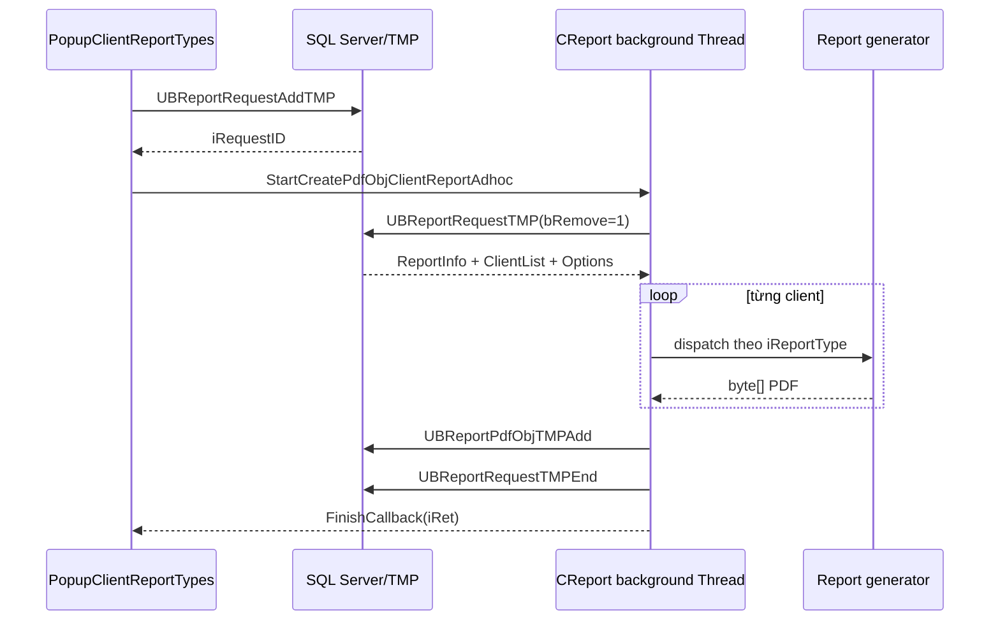

# Client Report PDF — Ad-hoc Generation

> Trạng thái: **đã đối chiếu source/SP/DB snapshot ngày 2026-09-05**. Đây là pipeline “Run now” của màn hình Client Report, không phải toàn bộ hệ thống report scheduler.

## 1. Luồng thực tế

Entry point UI là [`PopupClientReportTypes.aspx.cs`](../../../WebApp/Main/PopupClientReportTypes.aspx.cs#L1219). UI xây `KeyIDStr/KeyValueStr`, gọi `CReport.AddRequestTMP`, rồi:

- `iRunMode=0`: tạo `CReport`, khởi động thread trong web process và giữ handler trong Session;
- `iRunMode>0`: chỉ báo request đã gửi cho service. Nhánh scheduled/service dùng request bền (`UB_ReportRequest`) và nằm ngoài pipeline TMP mô tả ở đây.

## 2. Request và data contract

### 2.1. Tạo request

`CReport.AddRequestTMP()` gọi `UBReportRequestAddTMP` ([source](../../../VieFUNDPdf/CReport.cs#L6590)). SP:

- lấy tập rep user được truy cập qua `UBMemberRepAccessList` hoặc danh sách rep chỉ định;
- dựng client list từ một client, search list, favorite list hoặc toàn bộ client của rep;
- lưu request/options/client list vào các bảng TMP;
- trả `iRequestID`, hoặc `0` ở wrapper nếu `iRet>0`.

`UBReportAdd` **không** tạo request ad-hoc; đó là SP tính dữ liệu summary được `Customer.GetSummaryDataSet()` gọi. Tài liệu cũ đã nhầm hai vai trò này.

### 2.2. Đọc và consume request

`ClientReportAdhocHeaderSet()` gọi `UBReportRequestTMP` với `bRemove=true` ([source](../../../VieFUNDPdf/ClientReportAdhoc.cs#L306)). SP trả ba result set có `RecType`:

| Result set | Nội dung |
|---|---|
| `ReportInfo` | `iReportType`, status, user, effective/from/transaction-from dates. |
| `ClientList` | Danh sách `iClientID`, sort theo tên. |
| `Options` | Cặp `KeyID`/`KeyValue` do UI gửi. |

Sau khi select, SP xóa request/client/options khi `bRemove=1`. Worker vẫn gọi `UBReportRequestTMPEnd` ở cuối để cleanup thêm `UB_ReportRepListClientTMP` và các dòng còn sót.

## 3. Dispatch report type

Các type sau có trong memory-mode switch ([source](../../../VieFUNDPdf/ClientReportAdhoc.cs#L55)):

| Type | Generator được gọi | Data/SP tiêu biểu đã xác minh |
|---:|---|---|
| `1` | `ClientAccountStatementPdfObj` | `UBReportClientAccountStatement` |
| `2` | `ClientInvestorStatementPdfObj(..., false)` | Nhánh DataSet trong `CReport.cs`; có tên SP động theo option. |
| `3` | `ClientAssetMixPdfObj` | `UBReportClientAssetMix` |
| `5` | `ClientAccountStatementPdfObj_XIRR` | `UBReportClientAccountStatement_XIRR` |
| `6` | `ClientInvestorStatementPdfObj(..., true)` | Cùng family investor statement. |
| `7` | `ClientInvestorStatementPdfObj_XIRR` | `UBReportClientInvestorStatement_XIRR` |
| `8` | `ClientAccountStatementPdfObj_CG` | `UBReportClientCapitalGainStatement` |
| `9` | `ClientAccountStatementPdfObj_2015` | `UBReportClientAccountStatement_2015` |
| `10` | `ClientAccountStatementPdfObj_DailyGraph` | `UBReportClientAccountStatementWithDailyGraph` |
| `11` | `ClientCommission` | `UBReportClientCommission` |
| `12` | `ClientInvestmentPerformance` | Report/performance dataset trong `CReport`. |
| `13` | `AccountSummaryBySupplierPdfObj` | `UBReportClientAccountSummaryBySupplier` |
| `14` | `ClientPortfolioPerformance` | Portfolio performance pipeline trong `CReport`/`ClientPerformance`. |
| `50` | `ClientAccountStatementPdfObjTrxOnly` | `UBReportClientAccountStatementTrxOnly` |
| `104` | `ClientHoldingPerformanceAndPortfolioSummary` | Ghép holding performance và portfolio summary. |

Không thêm type mới chỉ ở UI: phải thêm cùng contract ở request definition, worker dispatch, generator, SP/data set và download/persistence.

## 4. Memory mode và file mode

### 4.1. Memory mode (`<=5` client)

`CreatePdfObjClientReportAdhocMemory()` tạo `byte[]` từng client rồi merge bằng `PdfBuilder.Merge2PdfObjs`. Nó hỗ trợ đủ 15 report type trong bảng trên và kiểm tra `m_Abort` trước mỗi client.

### 4.2. File mode (`>5` client)

`CreatePdfObjClientReportAdhocFile()` mở `PdfCopy`, add từng PDF vào file tạm, đóng document, đọc file lại thành `byte[]` và xóa file.

Source hiện chỉ có case `1,2,3,5,6,7,8,9,10,13`. Type `11,12,14,50,104` rơi vào `default`, tạo `PdfObj=null`. Đây là khác biệt chức năng theo số lượng client, không phải chỉ là tối ưu bộ nhớ.

## 5. Lưu output và trạng thái

`CreatePdfObjClientReportAdhoc()` gọi `SavePdfObj2TMP(DBIDStr, TMPFILE_CLIENT, UserID, MainPdfObj)`. Wrapper này gọi `UBReportPdfObjTMPAdd`, insert/update `UB_ReportObjTMP` theo `(iUserID, iType)` ([SQL](../../../ScriptDB/000_4_CreateSP.sql#L564080)).

Hệ quả:

- kết quả TMP là “slot mới nhất” theo user/type, không phải lịch sử bất biến theo request;
- request khác của cùng user/type có thể overwrite output nếu chạy chồng nhau;
- download phải giữ đúng user/type/session contract.

`iRet` callback:

| Giá trị | Nghĩa ở worker |
|---:|---|
| `0` | Có PDF và lưu TMP trả ID > 0. |
| `1` | Không tạo/lưu được output. |
| `2` | Worker thấy `m_Abort`. |

## 6. Option contract

UI serialize option thành hai chuỗi key/value; SP chuyển lại thành bảng `Options`. Generator đọc option bằng helper `GetReportOption*`. Các key thường gặp:

- dữ liệu: `IncludeGIC`, `IncludeCash`, `IncludeStock`, `ShowTrx`, `TrxCapGain`;
- layout: `ShowBVAccount`, `ShowBVPlan`, `ShowPercentagePlan`, chart/ROR flags;
- lọc: `ExInactivePlan`, `ExcludeSegFund`, `TaggedPlanOnly`, intermediary/exempt options;
- branding/localization: `LogoOption`, `MFDALogo`, `UseClientLg`, bulletin;
- disclosure: `IncludeCostDisclosure`, `IncludeRiskSummary`;
- split: `SplitByDealerCode`, `SplitGroupID`.

Đây là contract stringly typed: sai chính tả thường rơi về default và không có compile-time error. Khi đổi key phải tìm cả UI writer lẫn mọi generator reader.

## 7. Findings

### PDF-ADHOC-01 — file mode thiếu năm report type

Với `>5` client, type `11`, `12`, `14`, `50`, `104` không có trong switch file mode dù memory mode hỗ trợ. Kết quả có thể là PDF thiếu client/nội dung hoặc `MainPdfObj` không hợp lệ. Nên dùng một hàm dispatch chung cho cả hai mode.

### PDF-ADHOC-02 — đọc thiếu byte cuối file PDF

File mode cấp phát `new byte[stream.Length - 1]` rồi chỉ đọc số byte đó ([source](../../../VieFUNDPdf/ClientReportAdhoc.cs#L227)). Output bị cắt đúng một byte. Một số PDF reader có thể tự phục hồi, nhưng đây vẫn là binary corruption. Phải cấp phát `stream.Length` và đọc đủ stream.

### PDF-ADHOC-03 — abort có thể để lại file/handle

Trong vòng lặp file mode, khi `m_Abort=true`, hàm `return null` trước `pdfDoc.Close()` và `File.Delete()`. Cần chuyển cleanup vào `finally`/`using`; đồng thời bảo đảm writer/document được dispose khi generator ném exception.

### PDF-ADHOC-04 — output TMP có thể bị ghi đè khi chạy đồng thời

`UBReportPdfObjTMPAdd` upsert theo `(iUserID, iType)`, không theo request ID. Hai report cùng user và type chạy chồng nhau có thể thay output của nhau. Cần xác minh UI có khóa concurrent request hay không; nếu không, nên bind object với request/token.

### PDF-ADHOC-05 — namespace bảng TMP không nhất quán trong SQL snapshot

`UBReportRequestTMP` dùng tên `dbo.UB_Report*TMP`, còn `UBReportRequestTMPEnd` dùng `VieFUNDTMP.dbo.UB_Report*TMP`. Tương tự Settlement, cần kiểm tra synonym/duplicate objects trên DB thật trước khi kết luận lỗi runtime.

## 8. Cách thêm report type an toàn

1. Xác định type ID không trùng trong UI/DB/router.
2. Tạo DataSet method với SP và `RecType` contract rõ ràng.
3. Tạo generator trả `byte[]`; test rỗng, một trang và nhiều trang.
4. Thêm dispatch **một nơi dùng chung** cho memory/file mode; nếu chưa refactor thì cập nhật cả hai switch.
5. Thêm option UI và kiểm tra key reader/writer.
6. Test `1`, `5`, `6` và `>6` client để đi qua cả hai mode.
7. Test abort/exception, temp-file cleanup và concurrent request cùng user.
8. Test EN/FR, duplex, split dealer, disclosure và chart nếu report dùng.
9. Xác minh output tải đúng user/request và không lộ dữ liệu giữa session.

## 9. Source và tài liệu liên quan

- [`ClientReportAdhoc.cs`](../../../VieFUNDPdf/ClientReportAdhoc.cs)
- [`CReport.cs`](../../../VieFUNDPdf/CReport.cs)
- [`PopupClientReportTypes.aspx.cs`](../../../WebApp/Main/PopupClientReportTypes.aspx.cs)
- [Report Catalog](report-catalog.md)
- [PDF Workflow](../../viefund-framework/pdf/pdf-workflow.md)
- [Charts](../../viefund-framework/charts.md)
