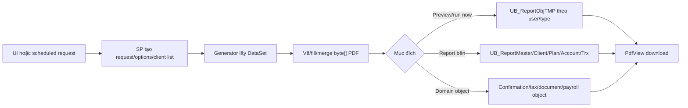

# Report Catalog — bản đồ nghiệp vụ, code, SP và dữ liệu

> Trạng thái: **đã đối chiếu source ngày 2026-09-05**. Catalog này trả lời “report nằm ở đâu và chạm dữ liệu nào”; bảng route 98 nhãn và chi tiết kỹ thuật render nằm ở [PDF Workflow](../../viefund-framework/pdf/pdf-workflow.md).

## 1. Bốn kiểu output trong hệ thống

| Kiểu | Entry/đích | Cơ chế | Ví dụ |
|---|---|---|---|
| Report vẽ từ đầu | `CReport`, generator độc lập | DataSet từ SP → `PdfBuilder`/iTextSharp → `byte[]` | Statement, AUA, compliance trend, settlement. |
| PDF form/template | `PdfForm`, `CForm` | Load template → map field/checkbox/signature → flatten/merge | KYC, trade ticket, loan, transfer form. |
| Document đã lưu | `PdfView` route đọc object | Đọc `varbinary(max)`/file object từ DB, có thể merge watermark/letter | Statement đã release, confirmation, attachment. |
| Không phải PDF nhưng đi qua `PdfView` | Route chuyên biệt | Trả MIME theo nội dung | Imported file route `100`, onboarding XML route `101`. |

Không nên suy từ tên endpoint rằng mọi response là PDF.

## 2. Entry point và routing

- WebApp mở `../Main/PdfView.aspx?Param1=...&Param2=...` qua `PopupReportPdf/PopupReportPdf6`.
- [`WebApp/Main/PdfView.aspx.cs`](../../../WebApp/Main/PdfView.aspx.cs#L109) có 98 nhãn `case`, nhận bộ ba ID mã hóa và payload route-specific.
- [`WebClient/Main/PdfView.aspx.cs`](../../../WebClient/Main/PdfView.aspx.cs#L20) chỉ hỗ trợ route `98`, `99`, `26`, `1/default` và có behavior khác WebApp.
- Report ad-hoc nhiều client vào qua [`PopupClientReportTypes.aspx.cs`](../../../WebApp/Main/PopupClientReportTypes.aspx.cs), không dispatch trực tiếp bằng toàn bộ route table.
- Form tương tác/preview vào qua [`PdfForm.aspx.cs`](../../../WebApp/Main/PdfForm.aspx.cs#L145) rồi dùng iframe `PdfView`.

Contract `Param4..6` thay đổi theo route và không có DTO chung. Khi debug phải đọc cả caller tạo URL lẫn `case` nhận URL.

## 3. Catalog theo miền nghiệp vụ

### 3.1. Client statement, performance và portfolio

| Chức năng | UI/route | Generator | SP/data chính |
|---|---|---|---|
| Ad-hoc client report | `PopupClientReportTypes` | `ClientReportAdhoc.cs` + partial `CReport` | `UBReportRequestAddTMP`, `UBReportRequestTMP`, `UBReportPdfObjTMPAdd`; xem [guide riêng](client-report-adhoc.md). |
| Account statement | Ad-hoc type `1`; route object `1/3/98/99` tùy lifecycle | `CReport.ClientAccountStatementPdfObj` | `UBReportClientAccountStatement`, nhóm `UB_Report*`. |
| Investor statement | Ad-hoc type `2/6` | `CReport.ClientInvestorStatementPdfObj` | SP được chọn động theo option/format trong `CReport`. |
| XIRR/performance | Type `5/7/12/14/104` | `CReport`, `ClientPerformance.cs` | `UBReportClientAccountStatement_XIRR`, `UBReportClientInvestorStatement_XIRR`, `UBReportClientPerformance`, `UBReportClientPortfolioPerformance`. |
| Asset mix/account summary | Type `3/13` | `CReport`, `AccountSummary.cs` | `UBReportClientAssetMix`, `UBReportClientAccountSummaryBySupplier`. |
| Family report | Route `17/31` | `FamilyReport.cs`, `ClientLabel.cs` | `UBFamilyList`, `UBReportFamily`, family/client tables. |
| Client summary WebClient | Route `26` | `CReport` | `UBClientSummary` và report/plan/account tables. |

Các bảng bền thường gặp: [`UB_ReportMaster`](../../Database/Table_Description.md#ub_reportmaster), [`UB_ReportClient`](../../Database/Table_Description.md#ub_reportclient), [`UB_ReportPlan`](../../Database/Table_Description.md#ub_reportplan), [`UB_ReportAccount`](../../Database/Table_Description.md#ub_reportaccount), [`UB_ReportTrx`](../../Database/Table_Description.md#ub_reporttrx), [`UB_ReportOption`](../../Database/Table_Description.md#ub_reportoption), [`UB_ReportRequest`](../../Database/Table_Description.md#ub_reportrequest) và [`UB_ReportTask`](../../Database/Table_Description.md#ub_reporttask).

### 3.2. Trading, order và confirmation

| Chức năng | Caller/route | Generator | SP/bảng tiêu biểu |
|---|---|---|---|
| Pending/sent order | `PopupOrderBatch`, route `7/12` | `Orders.cs` | Order/request/message tables và SP order report. |
| Order receipt | Trade popup/basket, route `19/20/33` | `OrderReceipt.cs` | `UBOrderReceiptSet`, `UBOrderReceiptBasketSet`, `UBRedemptionScheduleOrderReceiptSet`. |
| Trade confirmation | `TrxView`, `TrxConfirmationView`, route `28/35/200` | `TradeConfirmation.cs` | `UBTrxViewListCof`, `UBTrxConfViewList4Pdf`, `UBTrxConfirmationSavePdfObj`; [`UB_TrxConfirmation`](../../Database/Table_Description.md#ub_trxconfirmation). |
| Trade ticket/form | route `36/37/40/41` | `CForm`, PDF templates | `UBFormClientSet` và các SP form động; `UB_FormFile`, `UB_Forms`, `UB_FormSigPos`. |
| Bulk switch/basket | route `46/47` | `CBulkSwitchBasket.cs` | Route `46` gọi `CBulkSwitchBasket.GetPdfObjTaggedItems`; route `47` hiện có block rỗng. `CBulkConversionBasket.cs` có trên disk nhưng không được compile trong project hiện tại. |
| Blotter/recap/cash | route `55–59` | `CTradeBlotter.cs`, `CTrxRecap.cs`, `CTrustAccountPdf.cs` | SP report tương ứng và transaction/trust tables. |

### 3.3. Settlement, cheque và commission

| Chức năng | Caller/route | Generator | SP/bảng tiêu biểu |
|---|---|---|---|
| Deposit/transaction/settlement detail | `SettlementView`, route `8/9/10/11/14` | `CTrustAccountPdf.cs`, `CSettlementFile.cs`, `CReport` | `UB_TrustTrx` và các SP `UBTrustList*Prn/Settlement*`. |
| Cheque | `SettlementView`, route `23` | `CPayroll.cs`/trust PDF path | `UBTrustChequeListDetail`; `UB_Cheque`, `UB_ChequeDetail`. |
| Commission payroll | route `2` | `CPayroll.cs` | `UBCommPayrollDetail`, `UBCommPayrollSavePdfObj`; `UB_CommPayroll*`. |
| Payable/expense/preview | route `15/25/29/38` | `Commission.cs`, `CCommFile.cs` | Commission revenue/payable/payroll tables và SP động theo report. |

Chi tiết settle/unsettle/payment object xem [Settlement](../settlement/README.md).

### 3.4. Compliance, KYC và risk

| Chức năng | Route | Generator | Data/SP tiêu biểu |
|---|---|---|---|
| Plan KYC/suitability object | `13/22/50` | `CClientKYC.cs`, `Compliance.cs` | `UBReportClientKYC`, compliance/KYC/account/plan tables. |
| New account/plan/trade review | `60–68` | `Compliance.cs` | Các SP detail/summary theo workflow compliance. |
| Trend/exception reports | `90–97` | `Compliance.cs` | `UBCompTrendFrequentTrading`, `UBCompTrendExCommTrading`, `UBCompTrend_LowMER_List` và tên SP động. |
| Uniformity | `102/103` | `Uniformity.cs` | `UBGetUniformitySnapshot`, `UBUniformityReview`, object review. |
| Risk assessment | `104` | `CRiskAssessmentPdf.cs` | `UBPlanAssetAndRiskAssessmentSet`. |

Một số route cùng số với ad-hoc `iReportType` nhưng hai namespace ID này độc lập; ví dụ ad-hoc type `104` không đồng nghĩa mọi lời gọi route `104` đi qua `ClientReportAdhoc`.

### 3.5. Tax & Year-End

| Route | Generator | Loại |
|---:|---|---|
| `45` | `CRRSPReceipt` | RRSP contribution receipt |
| `70/71` | `CT4APdf` | T4A và summary |
| `72/73` | `CRL1Pdf` | RL-1 và summary |
| `74` | `CT4RSPPdf` | T4RSP |
| `75` | `CT4RIFPdf` | T4RIF |
| `76` | `CRL2Pdf` | RL-2 |
| `77` | `CT5008Pdf` | T5008 |
| `79` | `CNR4Pdf` | NR4 |
| `80` | `CT3Pdf` | T3 |
| `81` | `CRL16Pdf` | RL-16 |
| `82` | `CT5Pdf` | T5 |
| `83` | `CRL3Pdf` | RL-3 |
| `84` | `CRL18Pdf` | RL-18 |
| `85` | `CT4FHSAPdf` | T4FHSA |

Pattern chung: SP lấy slip/data → fill template hoặc vẽ PDF → các SP `*SavePdfObj` lưu object → `PdfView` trả binary. Bảng tiêu biểu gồm `UB_T4A*`, `UB_T4RSP*`, `UB_T4RIF*`, `UB_T5008*`, `UB_NR4*`, `UB_TaxFile`, `UB_TaxReceipt`. Workflow create/approve/release/XML/submission xem [Tax & Year-End](../tax-yearend/module-guide.md).

### 3.6. GIC, AUA và dashboard

| Chức năng | Route | Generator | SP tiêu biểu |
|---|---|---|---|
| GIC transaction/maturity/reminder | `18` và nhánh liên quan | `GIC.cs` | `UBGICReportTrx`, `UBGICReportMaturity`, `UBGICReportReminder`. |
| GIC confirmation/application | `39/42/43/44` | `GICConfirmation.cs`, `CForm` | `UBGICConfirmationSet`, `UBGICConfirmationSavePdfObj`; `UB_GICConfirmation`. |
| Current/quarter AUA | `16` và report UI | `AUACurrent.cs`, `QuarterAUA.cs`, `CAssetByFund.cs` | `UBAUACurrent`, `UBReportAssetByFund`, các SP Quarter AUA động. |
| Dashboard/chart | Dashboard UI | `DashBoard.cs` | `UBDashBoardAssetInit/Calc/CalcEnd`; xem [Charts](../../viefund-framework/charts.md). |

### 3.7. Form, document, transfer và e-sign

- General/blank form: route `40/41`, `CForm.cs`, template trong `WebApp/Pdf` và `VieFUNDPdf/Pdf`.
- Transfer reminder/document: route `150/151`, `CTransferDoc.cs`, `UBTransferReminderDataSet`, `UBTransferReminderSaveObj`.
- Attachment/note: route `24/98/99/999` tùy object, liên quan `UB_Document`, `UB_DocumentFileLink`, `UB_DocumentFileLog` hoặc TMP.
- E-signature bắt đầu từ document/form đã tạo rồi chuyển sang provider; xem [E-Signature](../../viefund-framework/esignature.md).
- Workflow payable route `888` gọi `CWFPayable.GetPdf`; route này bỏ qua session token URL thông thường và đang là finding cần audit authorization sâu.

## 4. Lifecycle lưu trữ

Ba nhóm lưu trữ không có cùng ownership/authorization. Đặc biệt `UB_ReportObjTMP` và các request TMP không có DDL trong data dictionary snapshot; phải kiểm tra DB `VieFUNDTMP`/synonym khi debug.

## 5. Checklist tìm một report bất kỳ

1. Từ nút UI, tìm `PopupReportPdf6('<route>'` hoặc `AddRequestTMP/AddRequest`.
2. Nếu là route, đọc đúng `case` trong WebApp hay WebClient `PdfView`.
3. Ghi lại cách giải `Param2` và format `Param4..6`.
4. Tìm generator/method được gọi; với partial `CReport`, tìm trên toàn thư mục `VieFUNDPdf`.
5. Tìm `SetSP`, kể cả `SPName` động; đối chiếu [SP Catalog](../../reference/sp-catalog/README.md).
6. Mở SQL definition để xác định table, DSID/user filter, `RecType` và side effect.
7. Xác định output là TMP, report bền hay domain object.
8. Test authorization, EN/FR, empty data, nhiều trang, merge/duplex và response MIME.

## 6. Findings xuyên topic

| ID | Mức | Nội dung |
|---|---|---|
| `PDF-ADHOC-01` | Bug candidate cao | File mode thiếu 5 report type; kết quả phụ thuộc số client. |
| `PDF-ADHOC-02` | Bug source rõ | File mode đọc `stream.Length - 1`, cắt byte cuối PDF. |
| `PDF-ADHOC-03` | Độ bền | Abort/exception có thể không đóng/xóa temp file. |
| `PDF-ADHOC-04` | Concurrency risk | TMP output upsert theo user/type, không theo request. |
| `PDF-ROUTE-47` | Bug candidate | Route `47` tồn tại nhưng block rỗng, trả no-data. |
| `PDF-ROUTE-888` | Security review | Bỏ qua session token URL chuẩn; cần chứng minh authorization trong BLL/SP. |
| `PDF-FR-INHERITS` | Build/runtime risk | `CommPayrollHistoryPrn_FR.aspx` khai báo `Inherits` đáng ngờ; cần smoke test. |

Chi tiết kỹ thuật và bằng chứng cho ba finding cuối nằm trong [PDF Workflow](../../viefund-framework/pdf/pdf-workflow.md#10-error-handling-và-điểm-cần-theo-dõi); finding ad-hoc nằm trong [guide ad-hoc](client-report-adhoc.md#7-findings).

## 7. Ranh giới tài liệu

- Catalog là bản đồ source/snapshot, không khẳng định mọi screen/route đều được menu production sử dụng.
- Chưa render/smoke-test 98 route bằng database thật.
- Các SP name động được ghi theo family; muốn sửa một report phải trace giá trị runtime theo option.
- `VFCsvExport` không thuộc phạm vi.
