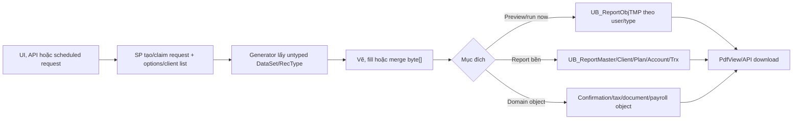

# Report Catalog — bản đồ nghiệp vụ, code, SP và dữ liệu

> Audit baseline: **2026-09-18**, source commit `06c586b78`. Catalog dùng source chuẩn [`DLLs/VieFUNDPdf`](../../../DLLs/VieFUNDPdf) và SQL artifact [`000_4_CreateSP.sql`](../../../MyPortfolioNew/VieFUND-Platform/src/SQLScript/000_4_CreateSP.sql); **chưa xác minh DB live**. Chi tiết render/route inventory nằm ở [PDF Workflow](../../viefund-framework/pdf/pdf-workflow.md).

## 1. Quy ước bằng chứng và bốn kiểu output

- **[S]**: đã thấy trong source/call site đang checkout.
- **[A]**: đã thấy trong SQL/UDF artifact hoặc schema snapshot của repo.
- **[L]**: cần kiểm tra database/deployment live.
- Tên SP trong bảng dưới được xác nhận ở call site **[S]** trừ khi ghi khác. Tên table “tiêu biểu” không tự chứng minh SP phụ thuộc table đó nếu chưa có definition/dependency metadata.

| Kiểu | Entry/đích | Cơ chế | Ví dụ |
|---|---|---|---|
| Report vẽ từ đầu | `CReport`, generator độc lập | `DataSet` từ SP → `PdfBuilder`/`PdfBase` → `byte[]` | Statement, AUA, compliance trend, settlement. |
| PDF form/template | `PdfForm`, `CForm` | DB trả template path → map field/checkbox/signature → flatten/merge | KYC, trade ticket, loan, transfer form. |
| Document đã lưu | `PdfView` route đọc object | Đọc `varbinary(max)`/file object, có thể merge letter/newsletter | Statement đã release, confirmation, attachment. |
| Không phải PDF qua `PdfView` | Route chuyên biệt | Trả MIME theo nội dung | Imported file route `100`, onboarding XML route `101`. |

`PdfBase` là source engine vendored/fork trong repo, không phải package/namespace `iTextSharp`. Không nên suy từ tên endpoint rằng mọi response là PDF.

## 2. Entry point, routing và service

### WebApp/WebClient

- WebApp mở `../Main/PdfView.aspx?Param1=...&Param2=...` qua `PopupReportPdf/PopupReportPdf6`.
- [`WebApp/Main/PdfView.aspx.cs`](../../../WebApp/Main/PdfView.aspx.cs) nhận route, bộ ba ID mã hóa, session token và payload stringly typed `Param4..6`.
- Ngoại trừ route `888`, router yêu cầu session token URL khớp session và giải `Param2` thành `(iID,iRequestID,iClientID)` [S].
- Route `888` gọi `CWFPayable.GetPdf` trước contract token chuẩn; authorization còn lại phải được chứng minh trong BLL/SP [S]/[L].
- [`WebClient/Main/PdfView.aspx.cs`](../../../WebClient/Main/PdfView.aspx.cs) chỉ có route `98`, `99`, `26`, `1/default` và behavior khác WebApp [S].
- Ad-hoc nhiều client vào qua [`PopupClientReportTypes.aspx.cs`](../../../WebApp/Main/PopupClientReportTypes.aspx.cs); form interactive vào qua [`PdfForm.aspx.cs`](../../../WebApp/Main/PdfForm.aspx.cs) rồi iframe `PdfView`.
- HTTP boundary mặc định `application/pdf`; route có thể đổi MIME. Router trả attachment khi request yêu cầu hoặc object lớn hơn 16 MiB, còn lại inline [S].

Contract `Param4..6` thay đổi theo route và không có DTO chung. Khi debug phải đọc cả caller tạo URL lẫn `case` nhận URL.

### Scheduled/API callers

- [`VieFUNDReport`](../../../Services/VieFUNDReport/VieFundReport.cs) poll khoảng 30 giây, gọi `CReport.ServiceCall` rồi `CDashBoard.ServiceCall`. `CReport.GenerateReport` lấy request bền qua `UBReportRequest`, dispatch type `1–15` và historical asset type `101–103`, lưu qua `UBReportSavePdfObj`, kết thúc qua `UBReportRequestEnd` [S].
- [`RespApp4Rep`](../../../RespApp4Rep/VieFund) gọi report/form helpers từ onboarding/API; pipeline PDF không chỉ có Web Forms router [S].
- WebApp/services legacy reference binary trong `WebApp/bin`; source project output vào đó nhưng audit không chứng minh DLL deployed khớp commit hiện tại.

## 3. Catalog theo miền nghiệp vụ

### 3.1. Client statement, performance và portfolio

| Chức năng | UI/route | Generator | SP/data chính |
|---|---|---|---|
| Ad-hoc client report | `PopupClientReportTypes` | `ClientReportAdhoc.cs` + partial `CReport` | `UBReportRequestAddTMP`, `UBReportRequestTMP`, `UBReportRequestTMPEnd`, `UBReportPdfObjTMPAdd`; xem [guide riêng](client-report-adhoc.md). |
| Account statement | Ad-hoc type `1`; route object `1/3/98/99` tùy lifecycle | `CReport.ClientAccountStatementPdfObj` | `UBReportClientAccountStatement`, nhóm `UB_Report*`. |
| Investor statement | Ad-hoc type `2/6` | `CReport.ClientInvestorStatementPdfObj` | Dynamic `UBReportClientInvestorStatement` hoặc `_PerCurrency`. |
| XIRR/performance | Ad-hoc type `5/7/12/14/15` | `CReport`, `ClientPerformance.cs` | `UBReportClientAccountStatement_XIRR`, `UBReportClientInvestorStatement_XIRR`, `UBReportClientPerformance`, `UBReportClientPortfolioPerformance`, portfolio “U” path. |
| Asset mix/account summary | Ad-hoc type `3/13` | `CReport`, `AccountSummary.cs` | `UBReportClientAssetMix`, `UBReportClientAccountSummaryBySupplier`. |
| Capital gain/2015/daily graph/trx-only | Ad-hoc type `8/9/10/50` | `CReport` | `UBReportClientCapitalGainStatement`, `UBReportClientAccountStatement_2015`, `UBReportClientAccountStatementWithDailyGraph`, `UBReportClientAccountStatementTrxOnly`. |
| Client commission | Ad-hoc type `11` | `CReport.ClientCommission` | `UBReportClientCommission` family. |
| Family report | Route `17/31` | `FamilyReport.cs`, `ClientLabel.cs` | Source chuẩn gọi `UBFamilyList4Print`, `UBReportFamily`, `UBReportFamilyCommission`, `UBReportFamilyPerformance`. |
| Client summary WebClient | Route `26` | `CReport` | `UBClientSummary` và report/plan/account data. |

Source chuẩn có ad-hoc type `15`, **không có type `104`**. Route WebApp `104` là risk assessment và thuộc namespace ID khác.

Các bảng bền có schema snapshot [A]: [`UB_ReportMaster`](../../Database/Table_Description.md#ub_reportmaster), [`UB_ReportClient`](../../Database/Table_Description.md#ub_reportclient), [`UB_ReportPlan`](../../Database/Table_Description.md#ub_reportplan), [`UB_ReportAccount`](../../Database/Table_Description.md#ub_reportaccount), [`UB_ReportTrx`](../../Database/Table_Description.md#ub_reporttrx), [`UB_ReportOption`](../../Database/Table_Description.md#ub_reportoption), [`UB_ReportRequest`](../../Database/Table_Description.md#ub_reportrequest), [`UB_ReportTask`](../../Database/Table_Description.md#ub_reporttask). Đây là snapshot mô tả, không phải executable DDL/live proof.

### 3.2. Trading, order và confirmation

| Chức năng | Caller/route | Generator | SP/bảng tiêu biểu |
|---|---|---|---|
| Pending/sent order | `PopupOrderBatch`, route `7/12` | `Orders.cs` | Order/request/message SP theo report. |
| Order receipt | Trade popup/basket, route `19/20/33` | `OrderReceipt.cs` | `UBOrderReceiptSet`, `UBOrderReceiptBasketSet`, `UBRedemptionScheduleOrderReceiptSet`. |
| Trade confirmation | `TrxView`, `TrxConfirmationView`, route `28/35/200` | `TradeConfirmation.cs` | `UBTrxViewListCof`, `UBTrxConfViewList4Pdf`, `UBTrxConfirmationSavePdfObj`, `UBTrxConfirmationDeliverItemX`; [`UB_TrxConfirmation`](../../Database/Table_Description.md#ub_trxconfirmation) [A-snapshot]. |
| Trade ticket/form | route `36/37/40/41` | `CForm`, PDF templates | `UBFormClientSet`, `UBFormGetTradeTicketInfo[/One]`, `UBFormGetGICTicketInfo[/One]`; form metadata/signature tables cần DB dependency [L]. |
| Bulk switch/basket | route `46/47` | `CBulkSwitchBasket.cs` | Route `46` gọi `GetPdfObjTaggedItems`; route `47` có block rỗng. `CBulkConversionBasket.cs` có trên disk nhưng không compile. |
| Blotter/recap/cash | route `55–59` | `CTradeBlotter.cs`, `CTrxRecap.cs`, `CTrustAccountPdf.cs` | SP report tương ứng và transaction/trust data. |

Confirmation không gửi SMTP trực tiếp trong renderer. Email/portal flags được truyền vào các save/delivery SP, nên side effect cuối cùng phải kiểm tra trong DB/BLL [S]/[L].

### 3.3. Settlement, cheque và commission

| Chức năng | Caller/route | Generator | SP/bảng tiêu biểu |
|---|---|---|---|
| Deposit/transaction/settlement detail | `SettlementView`, route `8/9/10/11/14` | `CTrustAccountPdf.cs`, `CSettlementFile.cs`, `CReport` | `UBTrustList*Prn/Settlement*`; trust transaction tables cần dependency check. |
| Cheque | route `23` | `CPayroll.cs`/trust path | `UBTrustChequeListDetail`; `UB_Cheque`, `UB_ChequeDetail` [A-snapshot]. |
| Commission payroll | route `2` | `CPayroll.cs` | `UBCommPayrollDetail`, `UBCommPayrollSavePdfObj`; `UB_CommPayroll*` [A-snapshot]. |
| Payable/expense/preview | route `15/25/29/38` | `Commission.cs`, `CCommFile.cs` | SP động theo report/option. |
| Plan cash balance | route `105` | `TrustAccount.PdfPlanTrustBalance` | Parse dealer/rep/language/currency/plan/account/date/sort options từ `Param4`, rồi tạo balance PDF [S]. |

Chi tiết settle/unsettle/payment object xem [Settlement](../settlement/README.md).

### 3.4. Compliance, KYC và risk

| Chức năng | Route | Generator | Data/SP tiêu biểu |
|---|---|---|---|
| Plan KYC/suitability object | `13/22/50` | `CClientKYC.cs`, `Compliance.cs` | `UBReportClientKYC`, compliance/KYC data. |
| New account/plan/trade review | `60–68` | `Compliance.cs` | SP detail/summary theo workflow. |
| Trend/exception reports | `90–97` | `Compliance.cs` | `UBCompTrendFrequentTrading`, `UBCompTrendExCommTrading`, `UBCompTrend_LowMER_List` và dynamic SP. |
| Uniformity | `102/103` | `Uniformity.cs` | `UBGetUniformitySnapshot`, `UBUniformityReview`, `UBUniformityReviewObjAdd`. |
| Risk assessment | route `104` | `CRiskAssessmentPdf.cs` | `UBPlanAssetAndRiskAssessmentSet`. |

Route ID và ad-hoc `iReportType` là hai namespace độc lập. Source chuẩn không có ad-hoc type `104`.

### 3.5. Tax & Year-End

| Route | Generator | Loại |
|---:|---|---|
| `45` | `CRRSPReceipt` | RRSP contribution receipt |
| `70/71` | `CT4APdf` | T4A và summary |
| `72/73` | `CRL1Pdf` | RL-1 và summary |
| `74` | `CT4RSPPdf` | T4RSP |
| `75` | `CT4RIFPdf` | T4RIF |
| `76` | `CRL2Pdf` | RL-2 |
| `77` | `CT5008Pdf` | T5008 |
| `79` | `CNR4Pdf` | NR4 |
| `80` | `CT3Pdf` | T3 |
| `81` | `CRL16Pdf` | RL-16 |
| `82` | `CT5Pdf` | T5 |
| `83` | `CRL3Pdf` | RL-3 |
| `84` | `CRL18Pdf` | RL-18 |
| `85` | `CT4FHSAPdf` | T4FHSA |

Source comment xác định route `78` không nên tồn tại. Pattern chung: SP lấy slip/data → fill template hoặc vẽ PDF → `*SavePdfObj` lưu object → `PdfView` trả binary. Các family `UBT4A*`, `UBT4RSP*`, `UBT4RIF*`, `UBT5008*`, `UBNR4*`, `UBRL*`, `UBT3*`, `UBT5*` được thấy ở call site [S]; dependency table chính xác vẫn cần SP definition/live metadata. Workflow xem [Tax & Year-End](../tax-yearend/module-guide.md).

### 3.6. GIC, AUA và dashboard

| Chức năng | Route | Generator | SP tiêu biểu |
|---|---|---|---|
| GIC transaction/maturity/reminder | `18` và nhánh liên quan | `GIC.cs` | `UBGICReportTrx`, `UBGICReportMaturity`, `UBGICReportReminder`. |
| GIC confirmation/application | `39/42/43/44` | `GICConfirmation.cs`, `CForm` | `UBGICConfirmationSet`, `UBGICConfirmationSavePdfObj`; delivery flags đi qua SP. |
| Current/quarter AUA | `16` và report UI | `AUACurrent.cs`, `QuarterAUA.cs`, `CAssetByFund.cs` | `UBAUACurrent`, `UBReportAssetByFund`, dynamic Quarter AUA SP. |
| Dashboard/chart | Dashboard UI/service | `DashBoard.cs` | Mutating sequence `UBDashBoardAssetInit` → `UBDashBoardAssetCalc` → `UBDashBoardAssetCalcEnd`; không chạy để audit read-only. |

### 3.7. Form, document, transfer và e-sign

- General/blank form: route `40/41`, `CForm.cs`. `UBFormClientSet` trả `FullFileName`/`FileName`; [`WebApp/Pdf`](../../../WebApp/Pdf) chỉ là tập file deploy, không phải manifest runtime duy nhất.
- Transfer reminder/document: route `150/151`, `CTransferDoc.cs`, `UBTransferReminderDataSet`, `UBTransferReminderSaveObj`.
- Attachment/note: route `24/98/99/999` tùy object, liên quan document/TMP storage; dependency table cần xác minh qua SP [L].
- E-signature bắt đầu từ document/form rồi chuyển provider; xem [E-Signature](../../viefund-framework/esignature.md).
- Route `100` đọc imported physical file/MIME từ DB; route `101` trả XML; route `999` đọc TMP document.

## 4. Database contract đã kiểm chứng từ artifact

Core ad-hoc có definition trong [`000_4_CreateSP.sql`](../../../MyPortfolioNew/VieFUND-Platform/src/SQLScript/000_4_CreateSP.sql) [A]:

| Object | Contract đáng chú ý |
|---|---|
| `UBReportRequestAddTMP` | Dùng rep scope, search/favorite/all-client rules; ghi request/client/rep/options TMP; parse date bằng `UBDate`, split option bằng `SplitStr`, default `ShowRepName=1`. |
| `UBReportRequestTMP` | Trả `ReportInfo`, `ClientList`, `Options`; client sort `LastName, FirstName, ID`; `bRemove=1` consume rows. Artifact nhận `iUserID` nhưng select request chỉ filter `iRequestID`. |
| `UBReportRequestTMPEnd` | Cleanup thêm request/client/rep/options TMP bằng tên `VieFUNDTMP.dbo`. |
| `UBReportPdfObjTMPAdd` | `TOP 1` theo `(iUserID,iType)` không `ORDER BY`. Slot có sẵn: null object xóa row, object khác null thì update. Chưa có slot: nhánh `ELSE` insert cả khi object null. Không có DDL repo để chứng minh uniqueness. |
| UDF `UBDate`, `DateStr`, `SplitStr` | Parse/format date và tách chuỗi TAB trong request contract. |

Các điểm cần **[L]**: synonym/local-vs-`VieFUNDTMP`; deployed procedure text; permission; unique key của `UB_ReportObjTMP`; owner predicate của request; dynamic SP variants; dependency table/view/function. Không execute report SP để kiểm chứng vì nhiều SP có write/cache side effect.

## 5. Lifecycle lưu trữ

Ba nhóm lưu trữ không có cùng ownership/authorization. `UB_ReportObjTMP` và request TMP không có executable DDL trong repo, nên constraint và physical database vẫn là **[L]**.

## 6. Findings xuyên topic

| ID | Mức | Bằng chứng | Nội dung |
|---|---|---|---|
| `PDF-ADHOC-01` | Cao | [S] | File mode thiếu `11,12,14,15,50`; behavior thay đổi khi client thứ 6 xuất hiện. |
| `PDF-ADHOC-02` | Cao | [S] | Đọc `Length - 1` cắt byte cuối; cùng pattern còn có trong `CForm` và `CPortfolioFundFact`. |
| `PDF-ADHOC-03` | Cao | [S] | Abort/exception có thể rò handle/temp; `OpenOrCreate` có stale-tail risk. |
| `PDF-ADHOC-04` | Cao | [A]/[L] | TMP output theo user/type, `TOP 1` không order; concurrent request có thể overwrite hoặc chọn duplicate không xác định. |
| `PDF-ADHOC-05` | Vừa | [A]/[L] | TMP procedures trộn `dbo` và `VieFUNDTMP.dbo`. |
| `PDF-ADHOC-06` | Security review | [A]/[L] | `UBReportRequestTMP` artifact không filter owner theo `iUserID`. |
| `PDF-ADHOC-07` | Contract drift | [S] | Handler hard-code `iRunMode=0`; nhánh `>0` hiện không reachable. Nếu được bật, `AddRequestTMP` vẫn chạy trước nhánh đó nên chưa chứng minh durable request. |
| `PDF-ROUTE-47` | Cao | [S] | Case label tồn tại nhưng block rỗng, trả no-data. |
| `PDF-ROUTE-888` | Security review | [S]/[L] | Bỏ session-token URL chuẩn; cần chứng minh authorization trong `CWFPayable`/SP. |
| `PDF-FILE-01` | Độ bền | [S] | Nhiều writer dùng `OpenOrCreate` thay vì truncate/create mới. |
| `PDF-SERVICE-01` | Độ bền | [S] | Service timer stop/reset không nằm trong `try/finally`; exception có thể làm poller không restart. |
| `PDF-FR-INHERITS` | Build/runtime | [S] | `CommPayrollHistoryPrn_FR.aspx` có `Inherits` đáng ngờ; cần smoke test. |

Chi tiết ad-hoc ở [guide ad-hoc](client-report-adhoc.md#8-findings); route/render findings khác ở [PDF Workflow](../../viefund-framework/pdf/pdf-workflow.md#10-error-handling-và-điểm-cần-theo-dõi).

## 7. Checklist trace một report

1. Xác định source tree/project thật sự được build; không trộn `DLLs` và `MyPortfolioNew/libs`.
2. Từ UI/API/service tìm `PopupReportPdf6`, `AddRequestTMP/AddRequest` hoặc direct generator call.
3. Nếu là route, đọc đúng WebApp/WebClient `case`, cách giải `Param2` và format `Param4..6`.
4. Tìm generator trên toàn `DLLs/VieFUNDPdf`; kiểm tra file có trong `.csproj` hay chỉ nằm trên disk.
5. Tìm mọi `SetSP`, kể cả `SPName` động; ghi parameter, `RecType`, selected columns và side effect.
6. Đối chiếu definition artifact rồi metadata/dependency/permission trên DB live; không execute SP mutating để audit.
7. Xác định output là TMP, report bền hay domain object và principal nào được phép đọc.
8. Kiểm tra template path từ DB, publish file, temp filename, collision/truncation và cleanup.
9. Test EN/FR, empty data, page boundary, merge/duplex, MIME, client thứ `5/6`, abort và concurrent request.

## 8. Ranh giới tài liệu

- Catalog là bản đồ source/artifact, không khẳng định mọi route được menu production sử dụng.
- Chưa render route bằng database thật, chưa query metadata live và chưa hash DLL deployed.
- Dynamic SP chỉ ghi theo family; cần trace runtime option/data để biết object thực.
- Source project không có typed DataSet/XSD; contract result set vẫn stringly typed.
- `VFCsvExport` không thuộc phạm vi.
