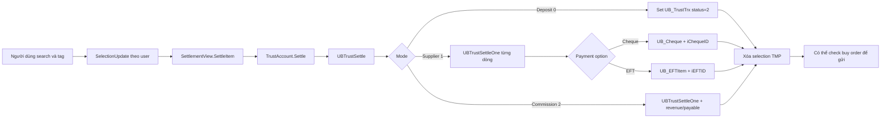

# Settlement — đối soát và thanh toán tiền trong trust account

> Trạng thái: **đã đối chiếu source ngày 2026-09-05**. Tài liệu mô tả hành vi có thể chứng minh từ Web Forms, lớp nghiệp vụ và SQL snapshot trong workspace. Các quy ước vận hành ngân hàng/dealer chưa hiện diện trong source được ghi rõ là cần xác minh.

## 1. Kết luận nhanh

Settlement trong VieFUND không phải chỉ là đổi trạng thái một giao dịch. Màn hình `SettlementView` gom ba nhóm tiền trong `UB_TrustTrx` — deposit, transaction/supplier và commission — vào danh sách chọn tạm theo user, sau đó:

1. kiểm tra quyền theo loại settlement;
2. bắt buộc deposit liên quan đã settled trước khi settle transaction/commission, trừ các nhánh “forced” trong SP;
3. cập nhật `UB_TrustTrx.iStatus` từ `1` sang `2`, ghi ngày và user settle;
4. tùy lựa chọn, tạo/gộp cheque hoặc EFT và gắn `iChequeID`/`iEFTID` vào trust transaction;
5. với commission, sinh/move dữ liệu sang revenue/payable;
6. sau settlement có thể kích hoạt kiểm tra gửi buy order khi setting cho phép.

Luồng ngược (unsettle) có rào chắn: không bỏ settle deposit khi transaction/commission phụ thuộc đã settled; không bỏ commission đã paid; không bỏ EFT supplier/GIC đã được đưa vào file xử lý.

## 2. Phạm vi và entry point

| Tầng | File/đối tượng | Vai trò |
|---|---|---|
| UI chính | [`SettlementView.aspx`](../../../WebApp/Main/SettlementView.aspx), [`SettlementView.aspx.cs`](../../../WebApp/Main/SettlementView.aspx.cs#L21) | Search, tag, settle/unsettle, cheque, EFT, reminder, plan và listing. |
| UI phụ | [`SettlementView_ASM.aspx.cs`](../../../WebApp/Main/SettlementView_ASM.aspx.cs), [`SettlementView_Plan.aspx.cs`](../../../WebApp/Main/SettlementView_Plan.aspx.cs), [`SettlementView_Reminder.aspx.cs`](../../../WebApp/Main/SettlementView_Reminder.aspx.cs) | Popup/detail cho ASM, plan và reminder. |
| In | [`SettlementFilePrn.aspx.cs`](../../../WebApp/Main/SettlementFilePrn.aspx.cs) | Entry point in file/danh sách settlement. |
| Business/DAL | [`TrustAccount.cs`](../../../UBClasses/TrustAccount.cs#L1649) | Wrapper gọi các SP trust, cheque, EFT, reminder, plan và listing. |
| ASM/file | [`ASMView.cs`](../../../UBClasses/ASMView.cs#L31), [`CAFFile.cs`](../../../UBClasses/CAFFile.cs#L89) | Danh sách ASM và money-movement/LS file. |
| EFT file | [`EFT.cs`](../../../UBFFImport/EFT.cs#L16) | Hoàn tất và xuất file EFT ngoài phần chọn/gom item của màn hình. |
| SQL | [`000_4_CreateSP.sql`](../../../ScriptDB/000_4_CreateSP.sql#L658507) | Nguồn định nghĩa SP trong snapshot repository. |

Không bao gồm `VFCsvExport` theo quyết định phạm vi của dự án.

## 3. Các tab và quyền truy cập

`SettlementView` có chín vùng nghiệp vụ: Client/Deposit, Supplier/Transactions, Commission, Cheque, EFT, ASM File, EFT Reminder, Plan và Listing. `ResetAllTabs()` chỉ hiển thị Cheque, EFT, EFT Reminder, ASM và Listing cho admin; Plan vẫn có thể hiển thị ngoài nhánh admin ([source](../../../WebApp/Main/SettlementView.aspx.cs#L282)).

Các quyền chức năng được kiểm tra cả ở UI và trong SP settle/unsettle:

| Loại | `iSettlementMode` | Quyền | Selection table theo user |
|---|---:|---|---|
| Deposit | `0` | `SETTLEDEPOT` | `UB_TrustINHeaderSelTMP` |
| Supplier transaction | `1` | `SETTLETRX` | `UB_TrustTrxSelTMP` |
| Commission | `2` | `COMM` | `UB_TrustCommSelTMP` |

UI disable/hide nút tại [`SettlementView.aspx.cs:437`](../../../WebApp/Main/SettlementView.aspx.cs#L437). `UBTrustSettle` và `UBTrustUnSettleTagged` kiểm tra lại quyền bằng `GetMemberPermission`, vì vậy settle/unsettle hàng loạt không chỉ dựa vào việc ẩn nút ([SQL](../../../ScriptDB/000_4_CreateSP.sql#L658536)).

Các thao tác quản trị cheque/EFT/listing chủ yếu được chặn bằng việc ẩn tab. Khi thay đổi các handler này cần kiểm tra thêm authorization phía server/SP; không nên coi visibility của Web Forms là ranh giới bảo mật đầy đủ.

## 4. Trạng thái và tham số điều khiển

### 4.1. Trạng thái trust transaction

| `UB_TrustTrx.iStatus` | Nghĩa trong settlement |
|---:|---|
| `1` | Chưa settled; là điều kiện đầu vào cho settle. |
| `2` | Đã settled; là điều kiện đầu vào cho unsettle. |
| `3` trở lên | Deleted/ngoài luồng settle bình thường; một số cleanup cheque/EFT tách các dòng này khỏi payment object. |

### 4.2. Cách trả tiền

`SettleItem()` chuyển lựa chọn UI thành `iChequeOpt` ([source](../../../WebApp/Main/SettlementView.aspx.cs#L1080)):

| `iChequeOpt` | Hành vi |
|---:|---|
| `0` | Không tạo cheque/EFT. |
| `1` | Tạo cheque mới. |
| `2` | Tái sử dụng cheque phù hợp nếu có thể. |
| `3` | EFT mới. |
| `4` | Gộp vào EFT còn pending nếu có thể. |

Nếu `iBankAccountID = 0`, `UBTrustSettle` tự hạ `iChequeOpt` về `0`. EFT (`3/4`) chỉ được SP chấp nhận cho settlement mode `1`; mode khác trả lỗi ([SQL](../../../ScriptDB/000_4_CreateSP.sql#L658526)).

`DealerSpecifics()` điều chỉnh lựa chọn dựa trên `DealerInfo.iLevel`, `bNSM`, `bASMHide` ([source](../../../WebApp/Main/SettlementView.aspx.cs#L320)):

- `iLevel < 4`: EFT bị disable; nếu `bNSM=true` thì buộc No Cheque, nếu không thì mặc định Cheque + reuse.
- `iLevel >= 4`: mặc định No Cheque nhưng vẫn cho chọn Cheque/EFT.
- `bASMHide=true`: ẩn vùng ASM.

Không diễn giải “N$M/NSM” rộng hơn hành vi trên vì workspace không chứa đặc tả nghiệp vụ chính thức của cờ này.

## 5. Luồng settle end-to-end

### 5.1. Chọn dòng

`TrustAccount.SelectionUpdate()` ánh xạ `iSP` sang sáu SP selection ([source](../../../UBClasses/TrustAccount.cs#L2045)):

- `0/1`: header/detail deposit;
- `2/3`: supplier header/transaction;
- `4/5`: commission header/item;
- `6`: EFT.

Selection được khóa theo `iUserID`, không theo session ID. Các SP total tương ứng (`UBTrustListINTotal`, `...TrxTotal`, `...CommTotal`) dùng cùng selection để tính tổng tagged.

### 5.2. Deposit

`OnSettleDeposit()` gọi mode `0`, options `1`. `UBTrustSettle` cập nhật tất cả dòng `iStatus=1` nằm trong `UB_TrustINHeaderSelTMP`, ghi `dtSettlement`, `iSettledUserID`, `iLastModifiedUserID`, rồi xóa selection của user ([SQL](../../../ScriptDB/000_4_CreateSP.sql#L658572)).

### 5.3. Supplier transaction

Mode `1` xử lý từng dòng đã tag. `UBTrustSettleOne`:

- chỉ xử lý dòng chưa settled, trừ nhánh forced;
- tìm deposit qua `iTrustDepositID` hoặc `UB_TrustTrxDetail` và trả `3` nếu deposit phụ thuộc chưa settled;
- gắn cheque/EFT nếu đã tạo được payment object;
- cập nhật status/date/user trên `UB_TrustTrx`;
- có nhánh đặc thù DSID/dealer cho fee, portfolio cash và trust front-end ([SQL](../../../ScriptDB/000_4_CreateSP.sql#L658796)).

Cheque được gom theo `MgmtCode` trong phạm vi một lần gọi. EFT chỉ được tạo ở nhánh `iType=2`; dòng không tạo được EFT bị bỏ qua. Sau vòng lặp, SP tính lại tổng từ `-UB_TrustTrx.mAmount` và cập nhật `UB_Cheque.mAmount` hoặc `UB_EFTItem.mAmount`.

### 5.4. Commission

Mode `2` xử lý từng dòng. `UBTrustSettleOne` gọi `UBCommissionAddFromTrust`; nếu không tạo được revenue thì trả `4`. Cheque commission được tạo/gộp ở cấp dealer, rồi tổng cheque được tính lại từ các trust transaction liên kết.

### 5.5. Tác động tới order

Sau khi settle thành công, nếu `IsSettledSendOrder(@DSID)=1`, `UBTrustSettle` gom các plan có dòng tiền dương và gọi `UBTrxBuyOrderCheck4Cash2SendOnePlan` ([SQL](../../../ScriptDB/000_4_CreateSP.sql#L658762)). Vì vậy thay đổi settlement có thể làm buy order đủ điều kiện gửi.

## 6. Unsettle và các rào chắn

UI gọi `TrustAccount.UnSettle()` cho một dòng hoặc `UnSettleTagged()` cho danh sách. `UBTrustUnSettle` thực thi các luật chính ([SQL](../../../ScriptDB/000_4_CreateSP.sql#L662561)):

| Điều kiện | Kết quả/return |
|---|---:|
| Dòng không ở status `2` | Bỏ qua. |
| Thiếu quyền deposit/transaction/commission | `5` / `6` / `7`. |
| Deposit còn transaction/commission settled phụ thuộc | `13`. |
| Commission payable đã paid | `14`. |
| EFT supplier/GIC đã process (`UB_EFTItem.iStatus > 0`) | `15`. |

Khi được phép, SP đưa trust transaction về status `1`, bỏ liên kết cheque và — với nhánh EFT được hỗ trợ — bỏ `iEFTID`. Nếu payment object không còn dòng tham chiếu thì xóa; nếu vẫn còn thì tính lại tổng. Với commission chưa paid, revenue/payable phát sinh từ settlement bị xóa.

`UBTrustUnSettleTagged` gom danh sách theo user, gọi `UBTrustUnSettle` từng dòng và chỉ tăng bộ đếm khi status thực tế đã trở về `1`.

## 7. Cheque

| Use case | Wrapper | SP chính | Bảng chính |
|---|---|---|---|
| Danh sách/header | `ChequeList` | `UBTrustChequeList` | `UB_Cheque` |
| Chi tiết trust/item | `ChequeTrxList` | `UBTrustChequeTrxList` | `UB_TrustTrx`, `UB_ChequeDetail` |
| Add/update/delete cheque | `ChequeUpdate`, `ChequeDelete` | `UBTrustChequeAdd/Update/Delete` | `UB_Cheque`, `UB_DealerBankAccount` |
| Add/update/delete item | `ChequeItemUpdate/Delete` | `UBTrustChequeItemAdd/Update/Delete` | `UB_ChequeDetail` |
| Chuyển cheque sang EFT | `Cheque2EFT` | `UBTrustCheque2EFT` | `UB_Cheque`, `UB_EFTItem`, `UB_MGMT`, `UB_Intermediary` |

`UBTrustChequeDelete` từ chối xóa khi còn `UB_TrustTrx` hoặc `UB_ChequeDetail` tham chiếu ([SQL](../../../ScriptDB/000_4_CreateSP.sql#L646804)). `UBTrustCheque2EFT` tìm banking information theo management company, fallback intermediary; trả `4` khi thiếu thông tin và `3` khi EFT liên quan đã process ([SQL](../../../ScriptDB/000_4_CreateSP.sql#L646612)).

## 8. EFT

EFT có hai giai đoạn:

1. Settlement tạo/gộp dòng pending trong `UB_EFTItem` và gắn trust transaction.
2. Tab EFT tag các item pending rồi `UBEFTProcessTaggedItems` tạo `UB_EFTFile`, tăng sequence của bank account, snapshot thông tin ngân hàng vào item và chuyển item sang processing.

`UBEFTProcessTaggedItems` chỉ gom item cùng `iTrustBankAccountID`, có amount dương và chưa deleted. Effective date không được nhỏ hơn ngày hiện tại. File name/format phụ thuộc bank account, bank branch, DSID và `iEFTFormat` ([SQL](../../../ScriptDB/000_4_CreateSP.sql#L315747)). Nếu cập nhật item lỗi, `TRY/CATCH` đưa item về pending, xóa header file và giảm sequence.

Sau đó [`UBFFImport/EFT.cs`](../../../UBFFImport/EFT.cs#L835) đảm nhiệm sinh nội dung file; `UBEFTFileEnd` ghi trạng thái/kết quả. Màn hình chỉ cho download khi `UB_EFTFile.iStatus=2`, có `FileName`, và `iOption>0`; dữ liệu được tải dưới dạng ZIP ([source](../../../WebApp/Main/SettlementView.aspx.cs#L3933)).

Xóa file bằng `UBEFTRemove` không xóa business item mà đưa chúng về pending. “Reset/regenerate” gọi `UBEFTFileEnd` với `iStatus=0`.

### EFT Reminder

Reminder dùng `UB_EFTReminderHeader` theo plan và `UB_EFTReminderItem` theo trust transaction. `UBEFTReminderAdd` không thêm reminder nếu plan đã có dòng paid-to-client mới hơn; `UBEFTReminderList` yêu cầu admin ([SQL](../../../ScriptDB/000_4_CreateSP.sql#L316026)).

## 9. ASM, Plan, Listing và output

- ASM: `ASMView.HeaderList/DetailList` gọi `UBASMHeaderSet` và `UBASMDetailSet`; dữ liệu chính ở `UB_ASM_Header`, `UB_ASM_Item`, `UB_ASM_Part`.
- File movement/LS: `CAFFile` gọi `UBMoneyMovementFileList`, `UBLSFileList` và một số tên SP động theo loại file.
- Plan: `UBTrustPlanBalanceList`, `UBTrustPlanTrxList` cho balance và lịch sử theo plan.
- Listing/đối soát: `UBTrustListAll`, `UBTrustBalanceBySettlementDate`, `UBTrustBalance4CWT`, `UBTrustStatusUpdate`.
- PDF: màn hình mở report qua `PopupReportPdf6`; template liên quan gồm `WebApp/Pdf/settle_report.pdf`, `settle_instruction.pdf`, `settle_error_response.pdf`. Chi tiết route/generator xem [PDF Workflow](../../viefund-framework/pdf/pdf-workflow.md).

## 10. Bản đồ dữ liệu lõi

| Bảng | Vai trò | Data dictionary |
|---|---|---|
| `UB_TrustTrx` | Sổ giao dịch trust; status, amount, type, plan, deposit linkage, cheque/EFT linkage. | [Mô tả](../../Database/Table_Description.md#ub_trusttrx) |
| `UB_TrustTrxDetail` | Liên kết/chi tiết giữa trust transaction và deposit. | [Mô tả](../../Database/Table_Description.md#ub_trusttrxdetail) |
| `UB_Cheque`, `UB_ChequeDetail` | Header cheque và item điều chỉnh/chi tiết. | [Cheque](../../Database/Table_Description.md#ub_cheque), [detail](../../Database/Table_Description.md#ub_chequedetail) |
| `UB_EFTItem`, `UB_EFTFile` | Item pending/processing và file EFT đã gom. | [Item](../../Database/Table_Description.md#ub_eftitem), [file](../../Database/Table_Description.md#ub_eftfile) |
| `UB_EFTReminderHeader`, `UB_EFTReminderItem` | Reminder theo plan và trust transaction. | [Header](../../Database/Table_Description.md#ub_eftreminderheader), [item](../../Database/Table_Description.md#ub_eftreminderitem) |
| `UB_DealerBankAccount` | Tài khoản trust nguồn, currency, sequence và EFT format. | [Mô tả](../../Database/Table_Description.md#ub_dealerbankaccount) |
| `UB_MemberBankAccount`, `UB_CustomerBankAccount` | Tài khoản đích cho rep/client. | [Member](../../Database/Table_Description.md#ub_memberbankaccount), [customer](../../Database/Table_Description.md#ub_customerbankaccount) |
| `UB_CommRevenue`, `UB_CommPayable` | Dữ liệu phát sinh khi settle commission và rào chắn khi unsettle. | [Data dictionary](../../reference/data-dictionary.md) |
| `UB_*SelTMP` | Selection ngắn hạn theo `iUserID`; definition bảng TMP không có trong snapshot `Table_Description.md`. | Cần đối chiếu DB `VieFUNDTMP`. |

## 11. SP map để tra cứu/debug

| Nhóm | SP tiêu biểu |
|---|---|
| Load/search | `UBTrustListIN`, `UBTrustListINDetail`, `UBTrustListTrxSupplier`, `UBTrustListCommSupplier` |
| Tag/total | `UBTrustSelectionUpdateIN/INDetail/Supplier/Trx/SupplierComm/Comm/EFT`, các SP `*Total` tương ứng |
| Settle | `UBTrustSettle`, `UBTrustSettleOne`, `UBTrustUnSettle`, `UBTrustUnSettleTagged` |
| Cheque | `UBTrustChequeList`, `UBTrustChequeTrxList`, `UBTrustChequeAdd/Update/Delete`, `UBTrustChequeItem*`, `UBTrustCheque2EFT` |
| EFT | `UBEFTViewHeaderSet`, `UBEFTViewDetailSet`, `UBEFTItemRemove`, `UBEFTRemove`, `UBEFTProcessTaggedItems`, `UBEFTFileEnd` |
| Reminder | `UBEFTReminderList`, `UBEFTReminderItemList`, `UBEFTReminderHeaderInfo`, `UBEFTReminderRemoveOne`, `UBEFTReminderRemove1Header` |
| Plan/listing | `UBTrustPlanBalanceList`, `UBTrustPlanTrxList`, `UBTrustListAll`, `UBTrustBalanceBySettlementDate`, `UBTrustBalance4CWT`, `UBTrustStatusUpdate` |

Tra definition/caller tại [SP Catalog — Account & Plan](../../reference/sp-catalog/by-topic/account-plan.md) và [Shared / Other](../../reference/sp-catalog/by-topic/shared-other.md).

## 12. Findings và giới hạn bằng chứng

### SET-01 — namespace của selection TMP chưa nhất quán (cần xác minh runtime)

`UBTrustSettle` đọc/xóa `dbo.UB_TrustINHeaderSelTMP`, `dbo.UB_TrustTrxSelTMP`, `dbo.UB_TrustCommSelTMP`, trong khi các SP selection và `UBTrustUnSettleTagged` có chỗ dùng rõ `VieFUNDTMP.dbo.*`. SQL/table snapshot không chứa DDL hay synonym cho các bảng TMP này. Cần kiểm tra production có synonym/duplicate object hay không; nếu không, settle và màn hình tag có nguy cơ nhìn hai tập dữ liệu khác nhau.

### SET-02 — thông báo generate EFT bỏ qua mã trả về

`OnGenerateEFT()` nhận `iRet` từ `EFTProcessTaggedItems()` nhưng luôn hiện thông báo “generated”, kể cả wrapper trả lỗi `2`; số item có thể là `0` ([source](../../../WebApp/Main/SettlementView.aspx.cs#L3786)). Nên chỉ báo thành công khi `iRet=0` và `iProcessingID>0`, còn lại hiển thị lỗi thực tế.

### SET-03 — ranh giới admin của cheque/EFT cần test trực tiếp

UI ẩn các tab quản trị cho non-admin, nhưng nhiều wrapper/SP cheque/EFT không tự kiểm tra `IsMemberAdmin`. Chưa đủ bằng chứng để kết luận có exploit vì Web Forms event validation và `IsPageValid` còn tham gia; cần integration test bằng user non-admin gọi đúng postback/event.

### Giới hạn

- Chưa đối chiếu database production, bank sandbox hay file EFT thực tế.
- Snapshot không có DDL của các bảng TMP nên chưa kết luận SET-01 là bug runtime.
- Ý nghĩa chính sách của `bNSM`, `iLevel`, các DSID hard-code và settlement cut-off cần business/deployment owner xác nhận.

## 13. Checklist thay đổi an toàn

- [ ] Xác nhận mode/type/status và permission tương ứng.
- [ ] Kiểm tra selection theo user và đúng database (`VieFUNDTMP` hay synonym).
- [ ] Test deposit trước/sau transaction phụ thuộc.
- [ ] Test commission chưa paid và đã paid khi unsettle.
- [ ] Test bốn `iChequeOpt`, hai currency và bank account rỗng.
- [ ] Test EFT pending → processing → completed → download/reset/remove.
- [ ] Kiểm tra tổng `UB_Cheque`/`UB_EFTItem` sau settle, unsettle và delete.
- [ ] Regression side effect gửi buy order sau settlement.
- [ ] Test admin/non-admin bằng request thực, không chỉ nhìn tab ẩn.

## 14. Tài liệu liên quan

- [FundServ Files DataFlow](../fundserv/files-dataflow.md)
- [Trading & Orders](../trading-orders/module-guide.md)
- [Commission & Fee](../commission-fee/module-guide.md)
- [PDF Workflow](../../viefund-framework/pdf/pdf-workflow.md)
- [Database Access](../../viefund-framework/database-access.md)
- [Data Dictionary](../../reference/data-dictionary.md)
