# Order end-to-end — từ nhập lệnh đến confirmed

> Phạm vi chính: mutual-fund electronic order đi qua VieFUND/FundServ normal path. Network `2`, network `4`/BBS/FIX, omnibus, manual và internal-cash paths được nêu tại điểm rẽ nhưng không bị ép vào cùng một lifecycle.

## 1. Kết luận nhanh

Một normal FundServ order thường đi qua các chặng:

1. `PopupTradeAdd` gọi `CTrx.Buy/Sell/Switch/Transfer/ICT`.
2. `CTrx` bind parameter, gọi `UBFundTrx*`, nhận `ID`/`Ret`; core SP ghi order/transaction và side effects.
3. `PopupOrderBatch` chọn confirm, BBS hoặc normal FundServ queue theo network.
4. WebForms/CTrx normal single-order enqueue dùng `bForced` default `0`, nên chạy Fund Fact gate, `IsOrderOK4FS`, XML preflight và cash gate trước khi insert queue. Direct/internal `bForced=1` bỏ qua Fund Fact và các code `2..5`, nhưng không bỏ qua code `6`; cash gate vẫn áp dụng cho normal queue type.
5. Batch worker hoặc realtime IBM MQ worker tạo/gửi XML và chuyển integration status sang Pending to Receive.
6. `ORDSET` cập nhật Accepted/Rejected/retry; CAT settlement/reconciliation/history cập nhật Contracted/Confirmed/Rejected.

```mermaid
flowchart LR
    UI["PopupTradeAdd"] --> BLL["CTrx.Buy/Sell/Switch/Transfer/ICT"]
    BLL --> SP["UBFundTrx*"]
    SP --> O["Order status 1: Pending To Send"]
    O --> ROUTE{"PopupOrderBatch routing"}
    ROUTE -->|"network 2"| CONF["Confirm path"]
    ROUTE -->|"network 4"| BBS["BBS/FIX path"]
    ROUTE -->|"normal"| CALLER{"Normal caller"}
    CALLER -->|"WebForms/CTrx; bForced default 0"| G1["Fund Fact gate"]
    CALLER -->|"direct/internal; bForced=1"| FG["Bypass Fund Fact + FS codes 2..5; code 6 still blocks"]
    G1 --> G2["IsOrderOK4FS"]
    G2 --> XML["XML preflight"]
    FG --> XML
    XML --> CASH["IsOrderOK4Cash (normal queue type)"]
    CASH --> Q["UB_OrderWaiting2Send"]
    Q -->|"batch"| FILE["CO file"]
    Q -->|"realtime"| MQ["IBM MQ worker"]
    FILE --> SENT["Order status 2 + UB_OrderSent"]
    MQ --> SENT
    SENT --> RESP["ORDSET / ERRORSET"]
    RESP --> A["Accepted / Rejected / Retry"]
    A --> CAT["SETTLREC / TRXNREC"]
    CAT --> DONE["Contracted / Confirmed / Rejected"]
```



## 2. Baseline bằng chứng và ranh giới

| Tầng | Source được audit | Xác minh được |
|---|---|---|
| UI | `WebApp/Main/PopupTradeAdd.aspx.cs`, `PopupOrderBatch.aspx.cs` | Input, validation, BLL calls, network routing, cách diễn giải `Ret`. |
| BLL | `DLLs/UBClasses/Trx.cs` | Parameter forwarding, SP call, `ID`/`Ret`, pending/action wrappers. |
| Batch | `DLLs/UBFFImport/COrder.cs`, `Services/VieFUNDIE/VieFUNDIE.cs` | CO-file generation, raw response/import parser. |
| Realtime | `Services/VieFUNDMQ/Order.cs`, `Services/VieFUNDMQ/VieFUNDMQ.cs` | `UBOrderGetMSG`, IBM MQ put, `UBOrderSetMsgStatus` call path. |
| Confirmation | `DLLs/UBFFImport/CAT.cs` | Parse/stage CAT records và gọi processing SP. |
| SQL | `MyPortfolioNew/VieFUND-Platform/src/SQLScript/000_3_CreateUDF.sql`, `000_4_CreateSP.sql` | SP/UDF definitions, query/insert/update behavior trong snapshot. |

Ranh giới audit:

- Repository có duplicate C#/SQL tree và không có deployment manifest; không thể khẳng định production đang dùng đúng snapshot này.
- Không tìm thấy base `CREATE TABLE` hoặc lookup seed cho các bảng lõi. Table/column bên dưới là **usage map**, không phải schema/constraint map.
- Realtime source tồn tại, nhưng service installation, queue configuration, acknowledgement và retry policy production không được chứng minh từ repository.
- T+1/T+2 và một số business timing không được source này cưỡng chế.

## 3. Chặng 1 — tạo order

### 3.1. Entry point và SP

| Giao dịch | UI → BLL | SP | Branch/value quan sát được |
|---|---|---|---|
| Buy | `OnBuy` → `CTrx.Buy` | `UBFundTrxBuy` | `Type='5'`; regular buy thường dùng `iType=22`, rebate branch dùng `40`; core electronic branch tạo transaction/order ở `3/1`. |
| Sell | `OnSell` → `CTrx.Sell` | `UBFundTrxSell` | `Type='6'`, `iType=45`; main `Type='4'` path collapse về `iType=20`. Canonical `UBFundTrxSellShort` phân biệt blank `ProdEventInd` → `iType=20` (`fee`) và `ProdEventInd='O'` → `iType=90` (`fee redemption`). |
| Switch | `OnSwitch` → `CTrx.Switch` | `UBFundTrxSwitch` | Tạo các phía liên quan; thấy `iType=27`, `44` trong các branch cụ thể. |
| Transfer | `OnTransfer` → `CTrx.Transfer` | `UBFundTrxTransfer` | Internal/external branches có `iType=42`, `39`, `65`; không phải exhaustive enum. |
| ICT | `OnICT` → `CTrx.ICT` | `UBFundTrxICT` | Branch chính thấy `Type='8'`, `iType=75`. |
| ETF qua trade tabs | `OnBuy/OnSell` → `CTrx.Buy/Sell` | `UBFundTrxBuy/Sell` | UI truyền ETF fields khi `iNetwork=4`; routing BBS/FIX diễn ra sau create. |
| Standalone stock | `PanelStockOrder` → `CTrx.StockOrderAdd` | `UBStockOrderAdd` | Entry point riêng, không đại diện mọi ETF order. |

Các numeric/type values chỉ là branch usage trong canonical snapshot; authoritative label đầy đủ phụ thuộc `UB_Def_TrxType` seed không có trong repository và behavior runtime còn phải đối chiếu SP đang deploy. Đặc biệt, không dùng riêng `iType=20` như label toàn cục cho fee redemption vì discriminator `20/90` khác nhau giữa main Sell và SellShort.

Core SP gọi các routine như `UBFundTrxOrderAdd`, `UBTrxAdd`, ghi `UB_FundTrxOrderTrx` và cập nhật/archive position, trust/compliance state tùy branch. Insert trực tiếp một order header sẽ bỏ qua validation và side effects.

### 3.2. `ID`/`Ret` contract và UI mapping

`CTrx.*` đọc `ID` và `Ret`, nhưng UI không có một ngưỡng mapping thống nhất:

| Handler | Điều kiện gọi `GetTrxErrorMSG(Ret - 10)` |
|---|---|
| Sell | `Ret >= 10` |
| Buy, Switch, Transfer, ICT | `Ret > 10` |

Vì vậy `Ret=10` không có behavior chung. Các mã ngoài bounds message array cũng có defect riêng; xem [Order Code Dictionary](code-dictionary.md).

### 3.3. Parameter bị drop

`AOTDilution` được UI truyền vào signatures của Buy/Sell/Switch nhưng các implementation không bind nó vào SP. Transfer handler tính value nhưng `CTrx.Transfer` không nhận parameter tương ứng. Không được coi dilution là đã persist chỉ vì xuất hiện ở UI/signature.

## 4. Chặng 2 — routing và enqueue

### 4.1. Route được chọn trước normal queue

`PopupOrderBatch` chọn:

- network `2` → `CTrx.OrderPending2Confirm` → `UBOrderSetConfirmTaggedItems`;
- network `4` → `CTrx.OrderPendingMove2BBS` → `UBOrderWaiting2BBSOrder`;
- còn lại → `CTrx.OrderPendingMove2Waiting` → `UBOrderWaiting2SendAdd`.

Normal bulk-selection SQL còn lọc `iNetwork=0`. Vì vậy không mô tả network-4/BBS như một nhánh tự động phổ quát bên trong normal wrapper.

### 4.2. Gate của normal single-order path

Call chain dưới đây là WebForms/CTrx default path. `CTrx.OrderPendingMove2Waiting` không bind/expose `bForced`, nên `UBOrderWaiting2SendAddInternal` nhận default `0`:

```text
CTrx.OrderPendingMove2Waiting       // không bind bForced
  → UBOrderWaiting2SendAdd           // @bForced default 0
  → UBOrderWaiting2SendAddInternal
      → IsFundFactOKOrder
      → IsOrderOK4FS
      → UBOrderCreateMSGXML(iOptions=2)   // preflight
      → UBOrderWaiting2SendAddOne
          → IsOrderOK4Cash
          → insert queue
```

`IsOrderOK4FS` trả các code quan sát được:

| Code | Ý nghĩa trong UDF/comment snapshot |
|---:|---|
| `1` | Hợp lệ để gửi. |
| `2` | Cần transaction approval cấp 1. |
| `3` | Cần plan approval cấp 1. |
| `4` | Cần plan approval cấp 2. |
| `5` | Thiếu document quá 25 ngày. |
| `6` | Không đủ settled cash. |

Nuance quan trọng:

- trên WebForms/CTrx default path, `bForced=0`, nên `IsFundFactOKOrder` là gate thực sự và condition `(@bForced=0 AND code>1) OR code=6` chặn `IsOrderOK4FS` code `2..6`;
- direct/internal SP call với `bForced=1` bỏ qua cả `IsFundFactOKOrder` và `IsOrderOK4FS` code `2..5`, nhưng code `6` vẫn chặn;
- code `0` không bị condition này chặn dù success contract thông thường là `1`;
- `IsOrderOK4Cash` là gate riêng và vẫn áp dụng cho normal queue type; forced mode không bỏ qua gate này;
- bulk selection lọc `IsOrderOK4FS(...)=1`, nên default single, forced internal và bulk path không tương đương.

### 4.3. Queue/routing nuance và defect

- `iMode=0` là batch, `iMode=1` là realtime trong normal queue contract.
- `VEX` bị ép batch trong branch đã trace.
- Omnibus/SK routing còn phụ thuộc dealer/config/helper; dealer `7908` có omnibus/batch branch.
- `UBOrderWaiting2SendAddOne` có special branch theo `iType`; không suy ra global policy chỉ từ một literal.
- `CTrx.OrderPendingMove2Waiting` truyền `bNewSourceID`, nhưng `UBOrderWaiting2SendAdd` gọi internal bằng literal `0`; flag bị bỏ qua trên path này.
- Queue insert nằm trong `TRY/CATCH` không propagate; internal caller vẫn có thể tăng order count. Count trả về không đảm bảo row đã insert.
- Validation/selection có `WITH (NOLOCK)`, nên result không phải consistency guarantee.

## 5. Chặng 3 — tạo message và đánh dấu đã gửi

### 5.1. Batch/CO file

`Services/VieFUNDIE/VieFUNDIE.cs` gọi `COrder.OrderFileGenerate`:

1. `UBOrderCreateFile` chọn/claim queue batch (`iStatus=0`, `iMode=0`) và group theo integration fields.
2. `UBOrderCreateMSGXML(..., iOptions=0)` tạo XML và `UB_OrderMSG`.
3. C# ghi file ra filesystem.
4. `UBOrderFileUpdateStatus` chuyển message sang sent, cập nhật order/trx integration status, tạo `UB_OrderSent`, dọn queue/message theo SP contract.

Caveat:

- `COrder.OrderFileGenerate` khởi tạo result `true`; một số DB/open/execute/status-update failure không chuyển thành `false`, và result của status update bị bỏ qua.
- `UBOrderFileUpdateStatus.@iStatus` được truyền nhưng snapshot không dùng parameter để quyết định transition.

### 5.2. Realtime/IBM MQ

Source runtime có trong `Services/VieFUNDMQ`:

```text
COrder.GetOrderSet
  → UBOrderGetMSG(iMode=1)
VieFUNDMQ.SendMsg
  → put XML lên IBM MQ
COrder.UpdateOrderSet
  → UBOrderSetMsgStatus
```

`UBOrderGetMSG` phân tách test/prod qua `UB_CustomerTest`, chọn theo dealer và claim queue `0→1`. Sau transport:

- status `2`: message sent, order/transaction integration status sang `2`, upsert `UB_OrderSent`;
- status khác `2`: xóa message tạo dở;
- cả hai nhánh dọn queue; SP không tự re-enqueue.

`COrder.UpdateOrderSet` hiện return `(errorCode > 0)`, tức `false` khi DB call thành công và `true` khi lỗi; caller đã trace bỏ qua result. Đây là contract đảo ngược, chủ yếu ảnh hưởng monitoring/control nếu caller khác dùng return value.

### 5.3. Status column và atomicity

Send-status SP:

- đổi `UB_FundTrxOrder.iOrderStatus` sang `2`;
- đổi `UB_FundTrx.iOrderStatus` sang `2` khi business `UB_FundTrx.iStatus=3`;
- không đổi business `iStatus=3` thành `2`;
- cập nhật `dtTrade` qua `GetTradeDate()` trong branch đã trace;
- update nhiều table nhưng không có outer transaction end-to-end.

Không gọi operation này là atomic. Nếu fail giữa chừng, phải kiểm tra order, transaction, message, sent marker và queue riêng.

## 6. Chặng 4 — order response

### 6.1. Parser paths

`COrder.ImportXML` lưu raw response rồi phân nhánh:

- `ORDSET` → parse `ORDRSPN` → `UBXMLRecOrderRespnProcess`;
- `ERRORSET` → `ProcessXMLErrorSet` → dự kiến gọi `UBXMLRecOrderRespnProcessError`.

Parser đọc action/source/fund-account/order/trade/settlement/return/response/document/dealer fields và các reject/warning slots.

### 6.2. Standard `ORDSET` status logic

| Điều kiện SQL | Order | Transaction | Side effect chính |
|---|---:|---:|---|
| Match thành công, không reject | `4` Accepted | `4` In Progress | Lưu warning nếu có. |
| Error present với return khác `00`, hoặc return `99` | `3` Rejected | `1` Rejected | Lưu error, bỏ sent marker. |
| Action `CAN`/`CAX` | Theo branch | `2` Cancelled | Bỏ trust link liên quan. |
| Return `98` + error `003` | `2→1` retry | Intended retry update | Xóa `UB_OrderSent`. SQL có defect `@iTrxStatus` nêu bên dưới. |
| Error `012` | Không update | Không update | Record bị skip. |

`UB_OrderMSGError.iType=2` là error, `1` là warning. Label tra qua `UB_Def_FSRVError`; repository không có seed nên không thể xuất official description cho mọi code.

Accepted path còn có side effects trong các branch cụ thể: cập nhật first-purchase fund-account ID, commission rebate, conversion processing; CHG có thể dọn error/warning cũ. Replay response không chỉ là đổi status.

### 6.3. Correlation

SP ưu tiên `UB_OrderSent` theo `SourceID + MgmtCode`, rồi fallback trong cửa sổ gần đây. Snapshot còn chứa hard-coded date window năm 2023 và dealer `7907`, `9499`, `7968`; date condition này đã hết hiệu lực theo thời gian bình thường và nên được coi là dead-by-date legacy branch, không phải policy hiện hành.

### 6.4. `ERRORSET` không đáng tin cậy như standard path

Các defect trực tiếp trong `COrder.ProcessXMLErrorSet`/wrapper:

1. kiểm cùng `ErrorCode` với cả `"98"` và `"003"`, nên retry condition không thể true;
2. kiểm `ErrorCode == "99"` thay vì `RtnCode == "99"`; sample format cạnh method cũng tách hai field này;
3. C# bind `OrdID` trong khi SQL parameter là `OrderID`; cần integration test để xác định DB helper xử lý mismatch thế nào;
4. exception bị nuốt và method có thể vẫn trả `true`.

Vì vậy logic chuẩn `00/01/98+003/99` trong SQL không chứng minh network `ERRORSET` luôn tới được đúng SP.

### 6.5. Slot và false-success

- SQL contract nhận `ErrorCode1..5` và `WarningCode1..5`.
- `ImportXMLGetReject` dùng `iCount < 5`, nên parser chỉ giữ slot 1–4.
- `COrder.ImportXML` khởi tạo success `true` và có đường trả `true` khi stream/reader không mở được.
- Standard response routine và per-transaction updates không có một outer transaction bao toàn bộ status/trust/error side effects; một số lỗi bị catch mà không propagate.

## 7. Chặng 5 — CAT contracted/confirmed

`CAT.ImportXML` nhận `SETTLINSTR`, `TRXNRECON`, `TRXNHISTORY`, stage `SETTLREC`/`TRXNREC`, rồi gọi `UBXMLRecTrxRecordProcess` → `UBXMLRecTrxRecordProcess1Record`.

Dispatcher có các record details BUY/SELL/SWITCH/DISTRIB/ROC/IT/ET variants. Trước mapping, SQL normalize blank khác nhau:

| Record | Blank normalization | Kết quả qua UDF |
|---|---|---|
| `SETTLREC` | blank → `A` | transaction/order `5` Contracted |
| `TRXNREC` | blank → `S` | transaction/order `6` Confirmed |

General mapping:

| External status | `FSUBGetTrxStatus` | `FSUBGetTrxWOStatus` |
|---|---:|---:|
| `A` | `5` Contracted | `5` Contracted |
| `S` hoặc blank/space tại UDF level | `6` Confirmed | `6` Confirmed |
| `R` | `1` Rejected | `3` Rejected |

Không suy ra T+1/T+2 hoặc “non-cash skip Contracted” chỉ từ mapping này. NULL cũng không mặc định đồng nghĩa blank ở mọi branch.

`CAT` wrapper dùng return values `3/4/5` theo processing contract riêng; không trộn với order-response import status `0..3`.

## 8. Change, cancel, reversal và AOT

| Action | Source contract |
|---|---|
| `NEW` | Default của core add SP; XML builder có thể đổi thành CHG nếu external order ID/status phù hợp. |
| `CHG` | `UBFundTrxChange` và XML builder cho thay đổi order. |
| `CAN` | `UBFundTrxCancel(iOptions=0)`; wrapper comment cho Accepted. |
| `CAX` | `UBFundTrxCancel(iOptions=1)`; wrapper comment cho Accepted hoặc Contracted. |
| `REV` | `UBFundTrxCancel(iOptions=2)` tạo reversal order qua `UBFundTrxOrderREVAdd`. |
| `AOT` | UI/SP/XML có date/original-order rules; action được `IsOrderOK4FS` nhận biết. |

`CTrx.AllowableAction` gọi `UBFundTrxOrderCANCAX` chỉ để lấy flags; `CTrx.TrxOrderCANCAX` gọi `UBFundTrxCancel` để thực thi. `DEL` là UI/domain action, chưa được chứng minh là FundServ `ActnCode` trong pipeline này.

## 9. Table usage map, không phải base schema

| Object | Usage quan sát được |
|---|---|
| `UB_FundTrxOrder` | Order header, action/type/amount/settlement, external IDs và `iOrderStatus`. |
| `UB_FundTrx` | Business transaction `iStatus`, integration `iOrderStatus`, và direct `iOrderID` ở một số path. |
| `UB_FundTrxOrderTrx` | Bridge usage qua `iOrderID`, `iTrxID`; không suy ra FK/cardinality vì thiếu DDL. |
| `UB_FundAccountPosition` | Position/account-fund bị order tác động. |
| `UB_OrderWaiting2Send` | Normal FundServ queue. |
| `UB_OrderWaiting2Omnibus`, `SK_OrderWaiting2Send` | Special routing queues. |
| `UB_OrderMSG` | XML payload/message status. |
| `UB_OrderSent` | Correlation marker đang chờ response. |
| `UB_OrderMSGError` | Response error/warning rows. |
| `UB_Def_TrxOrderStatus`, `UB_Def_FSRVError`, `UB_Def_TrxType` | Lookup được query; seed/label production không có trong repository. |

Không tìm thấy SQL `VIEW` được docs này dùng; `TrxView.aspx` là WebForms page.

## 10. Checklist truy lỗi một order

1. Xác định deployment/version trước khi so line number: binary C#, SQL SP/UDF và config production có thể không khớp repository snapshot.
2. Lấy order `ID`, `SourceID`, `OrderID`, `ActnCode`, `iOrderStatus`, `iNetwork`, plan/position và routing fields.
3. Kiểm tra cả direct `UB_FundTrx.iOrderID` và bridge `UB_FundTrxOrderTrx`; đọc riêng `UB_FundTrx.iStatus`/`iOrderStatus`.
4. Nếu order status `1`, kiểm tra route network trước. Với normal WebForms/CTrx path (`bForced` default `0`), kiểm tra Fund Fact, `IsOrderOK4FS`, XML preflight và `IsOrderOK4Cash`; với direct/internal `bForced=1`, Fund Fact và code `2..5` được bypass nhưng code `6` cùng cash gate của normal queue type vẫn phải kiểm tra.
5. Không coi enqueue count là persistence proof; query row queue và trạng thái claim thực tế.
6. Nếu status `2`, kiểm tra `UB_OrderMSG`, `UB_OrderSent`, raw response và `SourceID + MgmtCode` correlation.
7. Phân biệt standard `ORDSET` với `ERRORSET`; kiểm tra return/error variables và parser slot loss.
8. Nếu Accepted nhưng chưa Contracted/Confirmed, kiểm tra CAT message type, staged record, blank normalization và one-record dispatcher.
9. Kiểm tra partial-update state vì send/response paths không có outer transaction; đừng chỉ đọc một table.
10. Kiểm tra DSID/dealer/intermediary/mode/config và service installation trước khi kết luận code branch đã chạy.

## 11. Defect candidates đã xác nhận từ source

Các item dưới đây chưa được sửa runtime trong lượt audit tài liệu:

| ID | Bằng chứng | Tác động tiềm năng |
|---|---|---|
| `ORD-PARAM-01` | `AOTDilution` có ở UI/signature nhưng không bind SP; Transfer không nhận value | Dilution không được persist như caller kỳ vọng. |
| `ORD-QUEUE-01` | Wrapper nhận `bNewSourceID` nhưng gọi internal với literal `0` | Flag không có hiệu lực. |
| `ORD-QUEUE-02` | Queue insert catch không propagate; caller vẫn tăng count | False-success enqueue/report count. |
| `ORD-QUEUE-03` | Single branch cho code `0`, forced bypass `2..5` nhưng không `6`; bulk yêu cầu `=1` | Kết quả khác nhau giữa single/bulk. |
| `ORD-SEND-01` | `UBOrderFileUpdateStatus.@iStatus` không được dùng | Caller không điều khiển transition như signature gợi ý. |
| `ORD-SEND-02` | Send updates nhiều table không có outer transaction và reset `dtTrade` | Partial state/date side effect khi lỗi. |
| `ORD-BATCH-01` | `OrderFileGenerate` khởi tạo `true`, bỏ qua một số failure/status result | Monitoring có thể ghi success giả. |
| `ORD-MQ-01` | `UpdateOrderSet` trả `(errorCode > 0)` | Boolean đảo ngược; caller khác có thể hiểu sai. |
| `ORD-RESP-01` | C# so `ErrorCode` đồng thời `98` và `003` | ERRORSET busy/retry không chạy. |
| `ORD-RESP-02` | C# so `ErrorCode==99` thay vì `RtnCode==99` | Network error path có thể bị bỏ qua. |
| `ORD-RESP-03` | C# `OrdID` khác SQL `OrderID`; exception bị nuốt | Parameter/call failure có thể bị che giấu. |
| `ORD-RESP-04` | Parser chỉ nhận slot 1–4 trong contract 1–5 | Mất error/warning thứ năm. |
| `ORD-RESP-05` | Import/CAT có đường trả `true` khi stream/reader null | False-success import. |
| `ORD-RESP-06` | SQL retry dùng `@iTrxStatus` trước assignment | Có thể ghi NULL/fail; cần test trên schema production-like. |
| `ORD-CODE-02` | Bounds check dùng `>` thay vì `>=` | Index đúng bằng array length có thể throw. |
| `ORD-CODE-03` | Sell dùng `>=10`, flow khác dùng `>10` | `Ret=10` hiển thị không nhất quán. |
| `ORD-TXN-01` | Multi-table queue/send/response không có outer transaction; có `NOLOCK`/silent catch | Không có atomicity/consistency guarantee end-to-end. |

Mỗi item cần issue/test riêng và xác minh stored procedure/binary production trước khi sửa.

## 12. Trace nhanh theo symbol

| Chặng | Symbol/path nên bắt đầu |
|---|---|
| UI create | `WebApp/Main/PopupTradeAdd.aspx.cs`: `OnBuy`, `OnSell`, `OnSwitch`, `OnTransfer`, `OnICT` |
| BLL create | `DLLs/UBClasses/Trx.cs`: `Buy`, `Sell`, `Switch`, `Transfer`, `ICT` |
| SQL create | `UBFundTrxBuy`, `UBFundTrxSell`, `UBFundTrxSwitch`, `UBFundTrxTransfer`, `UBFundTrxICT` |
| UI route | `WebApp/Main/PopupOrderBatch.aspx.cs` |
| Enqueue | `OrderPendingMove2Waiting`, `UBOrderWaiting2SendAddInternal`, `UBOrderWaiting2SendAddOne` |
| Gates | `IsFundFactOKOrder`, `IsOrderOK4FS`, `UBOrderCreateMSGXML(iOptions=2)`, `IsOrderOK4Cash` |
| Batch | `COrder.OrderFileGenerate`, `UBOrderCreateFile`, `UBOrderFileUpdateStatus` |
| Realtime | `Services/VieFUNDMQ/Order.cs`, `VieFUNDMQ.SendMsg`, `UBOrderGetMSG`, `UBOrderSetMsgStatus` |
| Order response | `COrder.ImportXML`, `ProcessXMLErrorSet`, `UBXMLRecOrderRespnProcess*` |
| Confirmation | `CAT.ImportXML`, `UBXMLRecTrxRecordProcess*`, `FSUBGetTrxStatus`, `FSUBGetTrxWOStatus` |
