# Order end-to-end — từ nhập lệnh đến confirmed

> Phạm vi: order mutual fund đi qua pipeline VieFUND/FundServ. ETF/stock có nhánh FIX riêng và không được coi là đi qua pipeline FundServ dưới đây. Nội dung được đối chiếu trực tiếp với WebForms, `UBClasses`, `UBFFImport`, stored procedure và bảng trong SQL snapshot; không suy diễn từ tên file.

## 1. Kết luận nhanh

Một order thông thường đi qua năm chặng:

1. Người dùng nhập Buy/Sell/Switch/Transfer/ICT tại `PopupTradeAdd.aspx`.
2. `CTrx` gọi SP nghiệp vụ để kiểm tra rule và ghi order/transaction ở trạng thái chờ gửi.
3. `IsOrderOK4FS` chặn các order chưa đủ approval, document hoặc settled cash; order hợp lệ được đưa vào queue.
4. Batch worker hoặc realtime worker tạo XML, gửi ra ngoài và chuyển order sang **Pending to Receive**.
5. Order response cập nhật Accepted/Rejected; confirmation/settlement response sau đó cập nhật Contracted/Confirmed.

```mermaid
flowchart LR
    UI["PopupTradeAdd.aspx"] --> BLL["CTrx.Buy/Sell/Switch/Transfer/ICT"]
    BLL --> SP["UBFundTrx*"]
    SP --> O["UB_FundTrxOrder: Pending to Send"]
    O --> G["IsOrderOK4FS + XML preflight"]
    G --> Q["UB_OrderWaiting2Send"]
    Q -->|"batch"| F["UBOrderCreateFile + COrder.OrderFileGenerate"]
    Q -->|"realtime"| M["UBOrderGetMSG + MQ worker"]
    F --> S["UB_OrderSent; Pending to Receive"]
    M --> S
    S --> R["COrder.ImportXML + UBXMLRecOrderRespnProcess"]
    R --> A["Accepted hoặc Rejected"]
    A --> C["CAT.ImportXML + UBXMLRecTrxRecordProcess1Record"]
    C --> D["Contracted hoặc Confirmed"]
```

## 2. Nguồn bằng chứng và ranh giới

| Tầng | Nguồn đã đối chiếu | Vai trò |
|---|---|---|
| UI | `WebApp/Main/PopupTradeAdd.aspx.cs` | Thu input, gọi BLL, diễn giải `errorCode`. |
| BLL | `UBClasses/Trx.cs` | Đóng gói tham số, gọi SP, nhận `ID` và `Ret`; đưa pending order vào queue. |
| Tạo/gửi/nhận XML | `UBFFImport/COrder.cs`, `VieFUNDIE/VieFUNDIE.cs` | Tạo CO file, lưu raw response, parse `ORDSET`/`ERRORSET`. |
| Confirmation | `UBFFImport/CAT.cs` | Parse `SETTLINSTR`, `TRXNRECON`, `TRXNHISTORY` và stage record. |
| Rule + persistence | `ScriptDB/000_3_CreateUDF.sql`, `ScriptDB/000_4_CreateSP.sql` | Validation, state transition, XML, queue, response và confirmation. |
| Bảng lõi | `UB_FundTrxOrder`, `UB_FundTrx`, `UB_FundTrxOrderTrx`, `UB_FundAccountPosition`, `UB_OrderWaiting2Send`, `UB_OrderMSG`, `UB_OrderSent`, `UB_OrderMSGError` | Trạng thái nghiệp vụ và integration. |

`VieFUNDMQLib` không có source transport trong workspace, chỉ có artifact build/compiled. Vì vậy tài liệu xác minh được contract DB trước/sau MQ (`UBOrderGetMSG`, `UBOrderSetMsgStatus`), nhưng không khẳng định cơ chế kết nối, retry hay acknowledgement bên trong worker.

## 3. Chặng 1 — nhập và tạo order

### 3.1. Điểm vào theo loại giao dịch

| Giao dịch | UI → BLL | Stored procedure chính | Giá trị khởi tạo đáng chú ý |
|---|---|---|---|
| Buy | `OnBuy` → `CTrx.Buy` | `UBFundTrxBuy` | `Type='5'`; `iType=22` cho regular buy, `40` cho commission rebate; transaction `iStatus=3`; order `iOrderStatus=1`. |
| Sell / fee redemption | `OnSell` → `CTrx.Sell` | `UBFundTrxSell` | `Type='6'`, `iType=45` cho sell; `Type='4'`, `iType=20` cho fee redemption; trạng thái ban đầu 3/1. |
| Switch | `OnSwitch` → `CTrx.Switch` | `UBFundTrxSwitch` | Tạo các phía liên quan; có `iType=27` switch-in và `44` rollover trong nhánh đã xác minh; trạng thái ban đầu 3/1. |
| Transfer | `OnTransfer` → `CTrx.Transfer` | `UBFundTrxTransfer` | Internal/external transfer đi theo các nhánh `iType=42`, `39`, `65`; không gán một nhãn duy nhất cho mọi nhánh. |
| ICT | `OnICT` → `CTrx.ICT` | `UBFundTrxICT` | Nhánh chính dùng `Type='8'`, `iType=75`; trạng thái ban đầu 3/1. |

Các SP lõi kiểm tra rule trước khi ghi. Nếu thành công, chúng gọi các routine như `UBFundTrxOrderAdd`, `UBTrxAdd`, tạo liên kết `UB_FundTrxOrderTrx` và cập nhật/archive position liên quan. Không nên chỉ insert trực tiếp vào `UB_FundTrxOrder`: việc đó bỏ qua validation, transaction record, audit/archive và các side effect trust/compliance.

### 3.2. Contract trả về UI

`CTrx.*` đọc hai output quan trọng:

- `ID`: khóa order vừa tạo/cập nhật;
- `Ret`: mã kết quả nghiệp vụ.

Quy ước ở UI là `Ret >= 10` được đổi thành message bằng `CMSG.GetTrxErrorMSG(Lg, Ret - 10)`. Các mã `0`, `1`, `2`, `9` được xử lý riêng. Chi tiết và các bất thường mapping nằm trong [Order Code Dictionary](code-dictionary.md).

## 4. Chặng 2 — từ pending order vào hàng đợi

`CTrx.OrderPendingMove2Waiting` gọi `UBOrderWaiting2SendAdd`. Routine này chuyển tiếp vào `UBOrderWaiting2SendAddInternal`.

Trước khi enqueue, SQL thực hiện hai gate chính:

1. `IsOrderOK4FS(orderID)` kiểm tra approval, trạng thái plan/document và settled cash.
2. `UBOrderCreateMSGXML(..., iOptions=2)` dựng thử message để kiểm tra dữ liệu/XML; đây là preflight, chưa tạo message gửi thật. Schema validation chỉ chạy nếu feature flag tương ứng cũng bật.

Mã gate:

| Mã | Ý nghĩa trong source |
|---:|---|
| 1 | Hợp lệ để gửi. |
| 2 | Cần transaction approval cấp 1. |
| 3 | Cần plan approval cấp 1. |
| 4 | Cần plan approval cấp 2. |
| 5 | Thiếu document quá 25 ngày. |
| 6 | Không đủ settled cash. |

Order hợp lệ được ghi vào queue. `iMode=0` là batch, `iMode=1` là realtime. Routing không chỉ phụ thuộc mode:

- network `4` và dealer khác `7908` có thể đi `SK_OrderWaiting2Send`;
- dealer `7908` đi queue omnibus và bị ép không realtime;
- management code `VEX` bị ép batch;
- `UBOrderWaiting2SendAddOne` còn phân loại normal/omnibus/SK-BBS bằng `iType` queue.

Đây là routing theo code hiện tại, không phải bộ policy đầy đủ cho mọi deployment.

## 5. Chặng 3 — tạo message và đánh dấu đã gửi

### 5.1. Batch

`VieFUNDIE` gọi `COrder.OrderFileGenerate`:

1. `UBOrderCreateFile` chọn queue `iStatus=0`, `iMode=0`, claim row và gom theo dealer/intermediary.
2. `UBOrderCreateMSGXML(..., iOptions=0)` tạo XML và row `UB_OrderMSG`.
3. C# ghi nội dung ra file.
4. Nếu ghi file thành công, `UBOrderFileUpdateStatus(..., iStatus=1)`:
   - chuyển `UB_OrderMSG.iStatus` sang `2`;
   - chuyển order và transaction đang pending sang `iOrderStatus=2`;
   - tạo `UB_OrderSent.iStatus=0` để chờ response;
   - dọn queue/message cũ theo contract của SP.

Tên file và grouping có hard-code integration cho DSID/dealer/intermediary; xem [mục DSID và routing](code-dictionary.md#8-hard-code-dsid-dealer-và-routing).

### 5.2. Realtime

`UBOrderGetMSG(iMode=1)` claim queue realtime, tạo `UB_OrderMSG` và trả payload cho worker. Sau khi transport xử lý, contract dự kiến gọi `UBOrderSetMsgStatus`:

- `iStatus=2`: đánh dấu message sent, order/trx thành Pending to Receive và upsert `UB_OrderSent`;
- khác `2`: xóa message tạo dở;
- cả hai nhánh đều dọn row queue.

Do thiếu source `VieFUNDMQLib`, việc worker nào gọi contract này và retry thế nào cần xác minh ở deployment/runtime.

## 6. Chặng 4 — order response

`COrder.ImportXML` lưu raw response rồi `ImportXMLResp` phân nhánh:

- `ORDSET` → parse từng `ORDRSPN` → gọi `UBXMLRecOrderRespnProcess`;
- `ERRORSET` → parse network error → gọi `UBXMLRecOrderRespnProcessError` trong nhánh được code xử lý.

Các field chính được parser lấy gồm `ACTNCODE`, `SRCID`, `FUNDACCTID`, `ORDID`, `TRADEDATE`, `SETTLDATE`, `RTNCODE`, `RSPNSRC`, `DOCREQDFLG`, dealer code, tối đa các error/warning slot.

### 6.1. Quyết định status của response chuẩn

| Điều kiện SQL | Kết quả order | Kết quả transaction | Side effect |
|---|---:|---:|---|
| Mặc định, không có reject | 4 Accepted | 4 In Progress | Warning được lưu nếu có. |
| `ErrorCode1` có giá trị và `ReturnCode <> '00'`, hoặc `ReturnCode='99'` | 3 Rejected | 1 Rejected | Lưu lỗi, bỏ row chờ trong `UB_OrderSent`. |
| Action `CAN`/`CAX` | Theo nhánh response | 2 Cancelled | Bỏ liên kết trust liên quan. |
| `ReturnCode='98'` và `ErrorCode1='003'` | Trả từ 2 về 1 | Giữ/đưa về trạng thái retry theo code | Xóa `UB_OrderSent` để gửi lại. |
| `ErrorCode1='012'` | Không cập nhật order | Không cập nhật | Record bị skip ngay trong SP. |

Error/warning được ghi vào `UB_OrderMSGError`: `iType=2` cho error, `iType=1` cho warning. Nội dung hiển thị tra từ `UB_Def_FSRVError` qua UDF `FundServErrorStr`; seed data của bảng này không có trong workspace, nên không thể lập danh sách mô tả chính thức cho mọi mã FundServ chỉ từ repository.

### 6.2. Matching response về order

SP ưu tiên tìm `UB_OrderSent` theo `SourceID` và `MgmtCode`, sau đó mới dùng fallback matching. Source còn chứa:

- cửa sổ tìm trong 15 ngày gần nhất;
- một cửa sổ ngày cố định năm 2023;
- dealer code `7907`, `9499`, `7968` trong nhánh tương thích đặc biệt.

Các literal này là technical debt/routing legacy cần xác minh trước khi thay đổi; không được coi là policy chung.

## 7. Chặng 5 — contracted và confirmed

Order response Accepted chưa phải là kết thúc giao dịch. `CAT.ImportXML` nhận các message `SETTLINSTR`, `TRXNRECON`, `TRXNHISTORY`, parse `SETTLREC`/`TRXNREC`, sau đó gọi `UBXMLRecTrxRecordProcess` → `UBXMLRecTrxRecordProcess1Record`.

Routine một-record dispatch theo record type như BUYCON/BUYCOF, SELLCON/SELLCOF, SWITCHCON/SWITCHCOF, DISTRIBCOF, ROC, ITCOF/ETCOF. Hai UDF xác định trạng thái:

| External order status | `UB_FundTrx.iStatus` qua `FSUBGetTrxStatus` | `UB_FundTrxOrder.iOrderStatus` qua `FSUBGetTrxWOStatus` |
|---|---:|---:|
| `A` | 5 Contracted | 5 Contracted |
| `S`, blank/space | 6 Confirmed | 6 Confirmed |
| `R` | 1 Rejected | 3 Rejected |

Settlement tiền/cheque/EFT/trust sau confirmation là một miền liên quan nhưng có workflow riêng; xem [Settlement](../settlement/README.md).

## 8. Change, cancel, reversal và AOT

| Action | Nơi xử lý | Hành vi đã xác minh |
|---|---|---|
| `NEW` | Các SP `UBFundTrx*` | Order mới. Khi XML tạo lại một order đã có `OrderID` và status phù hợp, SQL có thể đổi sang `CHG`. |
| `CHG` | `UBFundTrxChange`, XML builder | Order đã gửi/accepted được đưa lại Pending to Send để gửi thay đổi. |
| `CAN` | `UBFundTrxCancel(iOptions=0)` | Cancel order; transaction chuyển Cancelled theo nhánh hiện hành. |
| `CAX` | `UBFundTrxCancel(iOptions=1)` | Biến thể cancel được display như Cancel. |
| `REV` | `UBFundTrxCancel(iOptions=2)` | Tạo reversal order riêng qua `UBFundTrxOrderREVAdd`. |
| `AOT` | UI/SP/XML | As-of trade yêu cầu ngày/original order theo rule; vẫn được `IsOrderOK4FS` cho đi qua gate action. |

`DEL` xuất hiện ở lớp thao tác UI/domain nhưng không được xác minh là `ActnCode` gửi FundServ trong pipeline này.

## 9. Bản đồ bảng và trách nhiệm

| Bảng | Trách nhiệm trong flow |
|---|---|
| `UB_FundTrxOrder` | Order header, action/type/amount/settlement, `iOrderStatus`, IDs FundServ. |
| `UB_FundTrx` | Transaction hạch toán/nghiệp vụ và `iStatus`; được nối với order qua bảng bridge. |
| `UB_FundTrxOrderTrx` | Quan hệ order ↔ transaction. |
| `UB_FundAccountPosition` | Position/account fund được order tác động. |
| `UB_OrderWaiting2Send` | Queue FundServ thông thường. |
| `UB_OrderWaiting2Omnibus`, `SK_OrderWaiting2Send` | Queue/routing đặc biệt. |
| `UB_OrderMSG` | XML message đã dựng và trạng thái message. |
| `UB_OrderSent` | Correlation của order đã gửi đang chờ response. |
| `UB_OrderMSGError` | Error/warning từ response. |
| `UB_Def_TrxOrderStatus`, `UB_Def_FSRVError`, `UB_Def_TrxType` | Bảng định nghĩa dùng cho display/lookup; không hard-code toàn bộ label trong C#. |

## 10. Checklist truy lỗi một order

1. Lấy `UB_FundTrxOrder.ID`, `SourceID`, `OrderID`, `ActnCode`, `iOrderStatus`, `iPlanID`, `iPositionID`.
2. Kiểm tra `UB_FundTrxOrderTrx` và `UB_FundTrx.iStatus` để tránh chỉ nhìn order header.
3. Nếu status 1: chạy/đối chiếu `IsOrderOK4FS`, kiểm tra queue thường/omnibus/SK và XML preflight error.
4. Nếu status 2: tìm `UB_OrderMSG`, `UB_OrderSent`; dùng `SourceID` + `MgmtCode` làm correlation chính.
5. Nếu status 3/4: đọc `ReturnCode`, `ErrorCode*`, `WarningCode*` và `UB_OrderMSGError`.
6. Nếu đã Accepted nhưng chưa Contracted/Confirmed: kiểm tra file/message CAT và record stage của `UBXMLRecTrxRecordProcess*`.
7. Luôn kiểm tra DSID, network, dealer, intermediary và mode vì chúng có thể đổi queue/routing.

## 11. Findings phát hiện trong lúc đối chiếu

Đây là defect candidate có bằng chứng source, chưa được sửa runtime trong lượt viết tài liệu:

1. `COrder.ProcessXMLErrorSet` so cùng biến `ErrorCode` với cả `"98"` và `"003"`; điều kiện retry không thể đúng. SQL dùng đúng cặp `ReturnCode='98'` + `ErrorCode='003'`.
2. `COrder.ImportXMLGetReject` dùng `iCount < 5`, nên chỉ nhận slot 1–4 dù DataTable/SP có `ErrorCode1..5` và `WarningCode1..5`.
3. `COrder.ImportXML` và `CAT.ImportXML` khởi tạo kết quả `true` rồi trả `true` khi không mở được stream/reader; caller có thể nhận success dù import chưa chạy.
4. Hai nhánh retry `98/003` trong SQL dùng `@iTrxStatus` trước khi thấy khởi tạo trong procedure; cần test schema/runtime để xác nhận có ghi `NULL` hoặc bị rollback.
5. `UBFundTrxSell` trả `Ret=104`, nhưng UI trừ 10 rồi truy cập bảng message chỉ có index 0–85; kết quả hiện rơi về message generic thay vì message fee-redemption dự kiến.
6. Bounds check của `CMSG.GetTrxErrorMSG` dùng `>` thay vì `>=`; index đúng bằng `Length` có thể vượt mảng.
7. Ngưỡng mapping ở Sell là `>=10`, trong khi Buy/Switch/Transfer/ICT dùng `>10`; mã 10 sẽ được diễn giải không nhất quán dù chưa thấy SP lõi trả mã này.

Chi tiết mã và bằng chứng mapping: [Order Code Dictionary](code-dictionary.md#9-defect-candidate-liên-quan-tới-mã).

## 12. Trace nhanh theo symbol

| Chặng | Symbol nên bắt đầu |
|---|---|
| UI create | `PopupTradeAdd.OnBuy`, `OnSell`, `OnSwitch`, `OnTransfer`, `OnICT` |
| BLL create | `CTrx.Buy`, `Sell`, `Switch`, `Transfer`, `ICT` |
| SQL create | `UBFundTrxBuy`, `UBFundTrxSell`, `UBFundTrxSwitch`, `UBFundTrxTransfer`, `UBFundTrxICT` |
| Enqueue | `CTrx.OrderPendingMove2Waiting`, `UBOrderWaiting2SendAddInternal`, `IsOrderOK4FS` |
| Batch | `COrder.OrderFileGenerate`, `UBOrderCreateFile`, `UBOrderCreateMSGXML`, `UBOrderFileUpdateStatus` |
| Realtime contract | `UBOrderGetMSG`, `UBOrderSetMsgStatus` |
| Order response | `COrder.ImportXML`, `UBXMLRecOrderRespnProcess`, `UBXMLRecOrderRespnProcessError` |
| Confirmation | `CAT.ImportXML`, `UBXMLRecTrxRecordProcess1Record`, `FSUBGetTrxStatus`, `FSUBGetTrxWOStatus` |
