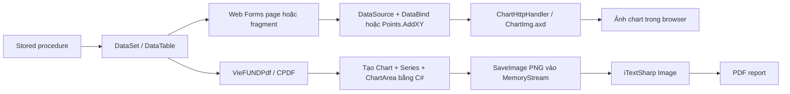

# Charts & Data Visualization — Web Forms và PDF

> Hướng dẫn đọc, sửa và debug biểu đồ VieFUND. Nội dung được đối chiếu trực tiếp với `WebApp`, `WebClient`, `UBClasses` và `VieFUNDPdf` ngày 2026-09-04. `VFCsvExport` không nằm trong phạm vi theo quyết định của user.

## 1. Kết luận nhanh

VieFUND dùng `System.Web.UI.DataVisualization.Charting` theo hai pipeline độc lập:



Các điểm cần nhớ:

- Web UI dùng `<asp:Chart>` trong page hoặc fragment `.aspx`; ảnh được phục vụ qua `ChartImg.axd` với storage theo Session.
- PDF không gọi `ChartImg.axd`. `CPDF` dựng chart server-side, raster hóa thành PNG trong memory rồi nhúng vào PDF.
- Kiểu chart active trong source là `Pie`, `Column`, `StackedColumn`, `FastLine` và `Point`. Không tìm thấy `ChartType="Bar"` hoặc `SeriesChartType.Bar` active.
- Các method/file có chữ `BarChart` phần lớn là tên legacy; implementation thật dùng vertical `Column`.
- Chart không tự truy cập DB và không tự enforce tenant. `DBID`, `DSID`, user và quyền phải được xử lý ở page/BLL/SP trước khi bind.
- EN/FR chủ yếu là hai fragment/page riêng; label, title và legend được hard-code trong markup hoặc truyền vào helper.
- Không tìm thấy một chart theme trung tâm theo `DSID`. Dữ liệu có thể tenant-scoped, nhưng style hiện phân tán theo page, fragment và helper.

## 2. Inventory source

### 2.1. Web UI

Quét tĩnh `WebApp/Main` và `WebClient/Main` cho kết quả:

| Project | File `.aspx` có `<asp:Chart>` | Khai báo chart tĩnh | Full page | Fragment không có Page directive |
|---|---:|---:|---:|---:|
| `WebApp` | 49 | 76 | 7 | 42 |
| `WebClient` | 22 | 22 | 2 | 20 |

Số liệu trên đếm source, không phải số chart duy nhất ở runtime: nhiều fragment EN/FR bị lặp và một fragment có thể được include vào nhiều page.

Các full page có chart:

- `WebApp/Main/Client.aspx`, `Client_FR.aspx`.
- `WebApp/Main/DashBoard.aspx`, `DashBoard_FR.aspx`, `DashBoard_FR_Old.aspx`.
- `WebApp/Main/DashBoardKYC.aspx`, `DashBoardKYC_FR.aspx`.
- `WebClient/Main/WebClient.aspx`, `WebClient_FR.aspx`.

Phần còn lại chủ yếu là reusable fragment như:

- `PlanRiskColumnChart*.aspx`, `RiskColumnChart*.aspx`, `SummaryRiskColumnChart*.aspx`.
- `PlanObjColumnChart*.aspx`, `ObjectiveColumnChart*.aspx`.
- `PlanAssetPieChart*.aspx`, `PlanInvObjPieChart*.aspx`.
- `ClientSummary*PieChart*.aspx`, `Summary*PieChart*.aspx`.
- `Client_PlanAllocation*.aspx`, `Client_FundAllocation*.aspx`, `FundSetupBody*.aspx`.

Trong 18 tên fragment chart tồn tại ở cả `WebApp/Main` và `WebClient/Main`, 17 cặp giống byte-for-byte. `SummaryRiskColumnChart.aspx` là cặp duy nhất khác nhau; xem finding ở mục 13.

### 2.2. Kiểu chart đang dùng

Số khai báo `ChartType` tĩnh trong markup của hai web project, kể cả các bản sao EN/FR và WebApp/WebClient:

| `ChartType` | Số khai báo | Dùng cho |
|---|---:|---|
| `Pie` | 44 | phân bổ plan/fund/asset/product/client summary |
| `StackedColumn` | 15 | dashboard theo plan/province và các nhóm market value |
| `Column` | 13 | risk, objective, KYC count, range/count |
| `FastLine` | 13 | fund price, exchange rate, calculator/time series |
| `Point` | 7 | series tiền đặt trên secondary Y axis trong dashboard |

Một số `Series` không khai báo `ChartType`, nên dùng default của control. Đây là số khai báo tĩnh, không phải số chart runtime.

### 2.3. Shared code và PDF

| Source | Vai trò |
|---|---|
| `UBClasses/CBase.cs` | `DisplayPieChart`; helper `DisplayBarChart2` cũ, hiện không có caller |
| `UBClasses/FundDef.cs` | `DisplayPriceChart` và `PriceChartInit` cho lịch sử giá fund |
| `UBClasses/Currency.cs` | `DisplayXRateChart` và `XRateChartInit` cho exchange rate |
| `UBClasses/Dashboard.cs` | Lấy các dataset dashboard từ stored procedure |
| `VieFUNDPdf/CPDF.cs` | Tạo Pie/Column/Line chart, raster hóa PNG và trả `iTextSharp.text.Image` |
| `VieFUNDPdf/ClientPerformance.cs` | Gọi chart helper cho performance report |
| `VieFUNDPdf/FamilyReport.cs` | Gọi chart helper cho family report |
| `VieFUNDPdf/CPortfolioFundFact.cs` | Chart trong portfolio/fund fact report |
| `VieFUNDPdf/CRiskAssessmentPdf.cs` | Risk/objective chart trong PDF assessment |

Ba project `WebApp`, `WebClient` và `VieFUNDPdf` đều reference `System.Web.DataVisualization`.

## 3. Cấu hình Web Forms

Cả `WebApp/Web.config` và `WebClient/Web.config` có bốn phần bắt buộc:

```xml
<appSettings>
  <add key="ChartImageHandler" value="storage=Session;timeout=20;" />
</appSettings>

<compilation>
  <assemblies>
    <add assembly="System.Web.DataVisualization, Version=4.0.0.0, ..." />
  </assemblies>
</compilation>

<pages>
  <controls>
    <add tagPrefix="asp"
         namespace="System.Web.UI.DataVisualization.Charting"
         assembly="System.Web.DataVisualization, Version=4.0.0.0, ..." />
  </controls>
</pages>
```

Handler được đăng ký hai lần cho hai IIS pipeline:

- `<system.web><httpHandlers>`: classic pipeline, path `ChartImg.axd`, verb `GET,HEAD,POST`, `validate="false"`.
- `<system.webServer><handlers>`: integrated pipeline, cùng path/type/verb.

`storage=Session` nghĩa là chart image được giữ trong ASP.NET Session; `timeout=20` cấu hình lifetime cho image. Source trong workspace không ghi đơn vị biểu diễn của literal này, nên guide không suy diễn thành phút/giây. API chính thức mô tả `Timeout` là một `TimeSpan` quyết định lifetime của chart image; xem [Microsoft Learn — ChartHttpHandlerSettings.Timeout](https://learn.microsoft.com/en-us/dotnet/api/system.web.ui.datavisualization.charting.charthttphandlersettings.timeout?view=netframework-4.8.1). Khi debug chart hiển thị ban đầu nhưng request ảnh trả lỗi, cần kiểm tra đồng thời:

1. Browser có giữ đúng session cookie không.
2. Request `ChartImg.axd` có đi tới cùng application/session store không.
3. Session có hết hạn hoặc bị mất khi chạy nhiều node không.
4. Handler có được đăng ký đúng với IIS pipeline của môi trường không.

Không áp dụng các bước này cho chart trong PDF vì pipeline PDF không dùng handler/session image.

## 4. Cách chart được ghép vào Web Forms

### 4.1. Fragment server-side include

Nhiều file có tên như page nhưng không có `<%@ Page %>` và không chạy độc lập. Chúng được chèn vào page cha bằng server-side include:

```aspx
<!-- #include file="PlanRiskColumnChart.aspx" -->
```

Hệ quả:

- Control trong fragment trở thành field của class page cha, không có code-behind riêng.
- Method expression như `SummaryRiskBarChartShow()` hoặc `GetChildRelation(...)` phải tồn tại trong page cha.
- ID chart phải duy nhất trong naming container sau khi include.
- Sửa fragment EN không tự đồng bộ fragment `_FR`; sửa bản trong `WebApp` không tự đồng bộ bản tương ứng ở `WebClient`.

Xem thêm kiến trúc include/page lifecycle trong [UI Patterns](ui-patterns.md).

### 4.2. Binding trực tiếp `DataTable`

Pattern phổ biến:

```csharp
if (ds.Tables.Contains("PlanRisk"))
    idPlanRiskColumnChart.DataSource = ds.Tables["PlanRisk"];

idPlanRiskColumnChart.DataBind();
```

Markup giữ data contract:

```aspx
<asp:Series Name="Plan"
    ChartType="Column"
    XValueMember="RiskName"
    YValueMembers="PlanRisk" />
```

Tên `DataTable` và tên cột là contract runtime. Compiler không phát hiện SP đổi `RiskName` thành tên khác; lỗi chỉ xuất hiện lúc bind.

### 4.3. Binding qua `DataRelation`

Client summary dùng repeater cha và relation con:

```csharp
ds.Relations.Add(
    "PlanRisk",
    ds.Tables[parent].Columns["ID"],
    ds.Tables["PlanRisk"].Columns["iPlanID"],
    false);
```

Fragment lấy rows con trực tiếp trong attribute:

```aspx
DataSource='<%# GetChildRelation(Container.DataItem, "PlanRisk") %>'
```

Vì vậy chart có thể không có lệnh `chart.DataSource = ...` rõ ràng trong code-behind. Khi chart con trống, phải kiểm tra đủ bốn điểm: bảng cha, bảng con, key `ID`/`iPlanID` và tên relation.

### 4.4. Thêm point bằng code

Time series không phải lúc nào cũng dùng `XValueMember`/`YValueMembers`. `FundDef.DisplayPriceChart` và `Currency.DisplayXRateChart`:

1. Xóa points cũ.
2. Parse ngày từ cột input.
3. Convert numeric value.
4. Gọi `Series[0].Points.AddXY(date, value)`.
5. Tính `AxisY.Minimum` từ giá trị nhỏ nhất đã làm tròn.

`PanelCalculator.aspx.cs` cũng tự thêm points và custom axis labels cho hai series `mMKVE` và `mPMTTotal`.

Với pattern này, chỉ gọi `DataBind()` không tạo dữ liệu; phải kiểm tra chính loop `Points.AddXY`.

## 5. Data contract theo nhóm biểu đồ

Đây là các contract được đọc từ markup/caller active, không phải schema chuẩn hóa dùng cho mọi report:

| Nhóm | X / category | Y series | Source/fragment tiêu biểu |
|---|---|---|---|
| Plan risk | `RiskName` | `PlanRisk`, `ActualRisk` | `PlanRiskColumnChart.aspx`, `RiskColumnChart.aspx` |
| Plan objective | `PrimaryObjName` | `fDefVal` hoặc `PlanObj`; `ActualObj` | `PlanObjColumnChart.aspx`, `ObjectiveColumnChart.aspx` |
| Plan asset allocation | `ClassName` | `Percentage` | `PlanAssetPieChart.aspx` |
| Investment objective | `PrimaryObjName` | `ActualObj` | `PlanInvObjPieChart.aspx` |
| Client summary by plan | `DescriptionShort` | `mMKV` | `ClientSummaryPlanPieChart.aspx` |
| Summary by plan | `PlanName` | `mMKVEnd` | `SummaryPlanPieChart.aspx` |
| Asset class summary | `ClassName` | `mValue` hoặc `mAmount` | `ClientSummaryAssetClassPieChart.aspx`, `SummaryAssetClassPieChart.aspx` |
| Fund allocation | `AllocDescription` | `AllocValue` | `FundSetupBody.aspx` |
| Plan allocation | `AllocDescription` | `AllocValueP` | `Client_PlanAllocation.aspx` |
| Fund price | `PriceDate` | `Price` hoặc `fPrice` | `FundDef.DisplayPriceChart` |
| Exchange rate | `EffectiveDate` | `Rate` | `Currency.DisplayXRateChart` |
| Retirement projection | `iIndex` | `mMKVE`, `mPMTTotal` | `PanelCalculator.aspx.cs` |
| Dashboard asset range | `Description` | Column `iCount`; Point `mMKV` trên secondary axis | `DashBoard.aspx` |
| Dashboard by plan type | `PlanType` | `mMKVC`, `mMKVN`, `mMKVI` | `DashBoard.aspx` |
| Dashboard by province | `Province` | `mMKVC`, `mMKVN`, `mMKVI` | `DashBoard.aspx` |
| Dashboard product type | `ProdType` | `fPercent` | `DashBoard.aspx` |
| Dashboard KYC | `DescriptionShort` | `iCount` | `DashBoardKYC.aspx` |

Tên gần giống nhau không đồng nghĩa cùng contract. Ví dụ asset chart có thể nhận `Percentage`, `mValue`, `mAmount`, `AllocValue` hoặc `AllocValueP` tùy màn hình. Không thay fragment/helper nếu chưa đối chiếu caller và result set của SP.

## 6. Luồng dữ liệu đại diện

### 6.1. Plan risk trong `Client`

```text
page lấy DBID/DSID/UserID và CurrentClient/Plan
  → business method trả DataSet có table PlanRisk
  → Client.aspx.cs gán table cho chart và repeater
  → markup bind RiskName / PlanRisk / ActualRisk
  → DataBind()
  → ChartImg.axd trả image cho browser session hiện tại
```

Chart và bảng chi tiết thường dùng cùng một `DataTable`; nếu bảng có dữ liệu nhưng chart trống, ưu tiên kiểm tra tên cột/series/visibility/handler thay vì đổ lỗi ngay cho SP.

### 6.2. Fund price

`FundDef.UpdatePriceList` lấy dữ liệu giá, bind cùng table cho repeater, sau đó gọi:

```csharp
DisplayPriceChart(idChart, dt, "PriceDate", "Price");
```

WebClient có một caller dùng cột `fPrice` thay cho `Price`. Đây là lý do helper nhận tên cột thay vì hard-code schema.

### 6.3. Dashboard

`UBClasses/Dashboard.cs` gọi nhóm SP `UBDashBoard...` và các SP name động như:

- `UBDashBoardAssetGet_Client`.
- `UBDashBoardAssetGet_PlanType`.
- `UBDashBoardAssetGet_ByProvince`.
- `UBDashBoardAssetGet_Product`.
- `UBDashBoardAssetGet_Family`.

Dataset được đổi `TableName` theo `RecType`; page chọn đúng table rồi bind nhiều series. Vì SP name và `RecType` cùng tham gia dispatch, debug phải kiểm tra cả procedure đã gọi lẫn tên bảng sau khi fill.

## 7. Pipeline chart trong PDF

### 7.1. Luồng render

Các helper trong `VieFUNDPdf/CPDF.cs` tạo `Chart`, `ChartArea`, `Series`, title, legend và axis hoàn toàn bằng C#. Kết quả cuối luôn theo pattern:

```csharp
using (var chartimage = new MemoryStream())
{
    chart.SaveImage(chartimage, ChartImageFormat.Png);
    return iTextSharp.text.Image.GetInstance(chartimage.ToArray());
}
```

Một số object đặt `ImageType = ChartImageType.Jpeg`, nhưng lời gọi `SaveImage` chỉ rõ `ChartImageFormat.Png`; bytes được nhúng thực tế là PNG.

### 7.2. Helper chính

| Helper | Output thực tế | Ghi chú |
|---|---|---|
| `CreateAssetPieChartObj(...)` | Pie PNG | Helper chuyên cho asset data |
| `CreatePieChartObj(...)` | Pie PNG | Có overload `DataTable` và `DataRow[]`; hỗ trợ legend/label/3D |
| `CreateBarChartObj(...)` | Column PNG | Một hoặc hai series; tên “Bar” là legacy |
| `CreateBarChartObj2(...)` | Column PNG | Wrapper hai series risk |
| `CreateLineChartObj2(...)` | Line PNG | Hai series, thường dùng market/book value theo thời gian |
| `AddLineChart2Cell(...)` | `PdfPCell` | Bọc line chart để đưa vào table PDF |
| `AddAssetChart2Cell(...)` | `PdfPCell` | Bọc asset chart |

### 7.3. Definition row cho chart

Nhiều PDF dataset trả thêm một row cấu hình chart. `CreatePieChartObj` đọc trực tiếp các cột:

| Cột option | Ý nghĩa |
|---|---|
| `ColumnIDX` | Một hoặc nhiều cột ghép làm category/legend text |
| `ColumnIDY` | Cột numeric |
| `iWidth`, `iHeight` | Kích thước raster |
| `bLegend` | Bật/tắt legend |
| `LegendHeader1`, `LegendHeader2`, `LegendHeader3` | Header các cột legend |
| `iLegendLineColor`, `iLegendBkColor` | Màu legend |
| `bLabel`, `bLabelOutSide` | Hiển thị/vị trí data label |
| `iLegendNumCol` | Số cột legend |

Các table definition/data tiêu biểu là `PlanPieChart` + `Plan`, `PlanBarChart` + `PlanBarData`, `AssetClassPieChart`, `AssetMixPieChart` + `AssetMixList`.

Các flag được truyền xuống report SP gồm `bPlanPieChart`, `bPlan3QBarChart`, `bPlanRiskChart`, `bFundPieChart`. Vì vậy việc chart có xuất hiện trong PDF có thể do option/report definition, không chỉ do data rỗng.

### 7.4. Axis và label

- `FindMax` đặt minimum maximum-axis là 100 cho non-percent chart có data; nếu giá trị lớn hơn 100 thì lấy khoảng 110% giá trị lớn nhất.
- `FindMaxP` khởi tạo ở 10 nên output thực tế tối thiểu là 30; sau đó nhảy qua 40, 50, 100, còn giá trị `>= 100` giữ nguyên maximum quan sát được.
- `FindMinP` xử lý percent âm theo các nấc âm; hiện có lỗi nhánh unreachable ở mục 13.
- `ChartRemoveSmallLabel`, `ChartRemoveSmallLabelValue`, `ChartRemoveZeroLabel` loại label khó đọc/zero.
- `ChartExplodeMax` explode slice lớn nhất rồi sort Pie series.
- `AdjustNewLine` thay `<br/>` bằng newline ngay trên input `DataTable`/`DataRow[]`; caller dùng lại data sau đó sẽ thấy giá trị đã bị mutate.
- Pie chart tự tăng height khi data có ít nhất 10 hoặc 15 rows.

### 7.5. Contract lỗi

Nhiều helper PDF catch mọi exception và trả `null`; caller thường bỏ chart hoặc trả `null` tiếp. Đồng thời một số field của `rChartOpt` và `tbData.Select()` được truy cập trước block `try`.

Hệ quả thực tế:

- Có lỗi bị biến thành “chart không xuất hiện” mà không có log.
- Có schema/null error lại thoát ra ngoài thay vì trả `null`, tùy lỗi xảy ra trước hay trong `try`.
- Khi sửa SP definition table, phải kiểm tra đủ column contract trước khi chạy report.

Đây là đặc tính vận hành cần xử lý khi debug; không nên giả định mọi lỗi chart đều được swallow thống nhất.

## 8. Tenant, quyền, localization và style

### 8.1. Tenant và quyền

Chart control chỉ nhận `DataTable`, `DataView` hoặc points. Nó không biết `DBID`, `DSID`, user, client hay plan hiện tại.

Security boundary nằm trước chart:

```text
Session/request
  → page validation + GetConnectionParam
  → BLL/SP lấy đúng tenant/entity
  → DataSet đã được scope
  → chart render
```

Không bind entity ID trực tiếp từ browser nếu BLL/SP chưa kiểm tra tenant/user scope. Xem [Database Access](database-access.md) và [Security](../topics/security/module-guide.md).

### 8.2. EN/FR

Localization hiện dùng ba cách:

- Fragment/page riêng `_FR.aspx` cho title, legend header và series name.
- Code-behind chọn string theo `Lg`.
- PDF nhận label/title từ definition row hoặc tham số helper.

Khi thêm/sửa chart, phải soát cả EN và FR. Không chỉ title: tooltip, currency/percent format, legend header, axis title và empty-state cũng cần đồng bộ.

### 8.3. Style

Các palette/màu thường thấy là `Excel`, `Pastel`, `GreenYellow`, `Orange`, gradient và chart area background cố định trong markup/helper. Không tìm thấy abstraction áp theme chart theo `DSID`; đừng ghi nhận “custom styling per dealer” nếu chưa có source hoặc cấu hình runtime bổ sung.

## 9. Cách thêm hoặc sửa Web chart

### 9.1. Checklist trước khi code

1. Xác định đây là full page hay fragment include.
2. Tìm bản EN/FR và bản tương ứng ở `WebApp`/`WebClient`.
3. Ghi rõ table name, X column, từng Y column, numeric type và đơn vị.
4. Xác định tenant/entity scope đã được enforce ở BLL/SP nào.
5. Chọn binding trực tiếp, `DataRelation` hay `Points.AddXY`.
6. Quyết định empty-state và visibility; không để chart rỗng chiếm layout.

### 9.2. Thực hiện

1. Khai báo `<asp:Chart>`, `Series`, `ChartArea`, axis và legend.
2. Gán `DataSource` trước `DataBind()` trong cùng refresh path.
3. Khi page có postback/UpdatePanel, xóa data/points cũ trước khi bind dataset mới.
4. Với nested repeater, tạo relation trước khi `DataBind()` parent.
5. Đồng bộ label và format EN/FR.
6. Kiểm tra request `ChartImg.axd` bằng đúng session.

### 9.3. Regression tối thiểu

- Dataset bình thường, một row, zero rows.
- Giá trị zero, âm, rất lớn và `DBNull` nếu SP cho phép.
- Label dài và dữ liệu >= 10/15 categories.
- Full page load, postback và partial update.
- EN và FR.
- Hai tenant/dealer có dữ liệu khác nhau để phát hiện leak scope.
- Web farm/sticky-session hoặc distributed session nếu production dùng nhiều node.

## 10. Cách thêm hoặc sửa PDF chart

1. Xác định report generator và dataset/SP tạo data.
2. Nếu dùng definition row, đối chiếu đủ column option trước khi gọi helper.
3. Không dựa vào tên `Bar`: đọc `SeriesChartType` trong implementation.
4. Guard `null`, table existence, row count và required columns ở boundary report.
5. Chọn width/height theo layout cell/page, lưu ý Pie tự tăng height theo row count.
6. Xác định helper có mutate label bằng `AdjustNewLine` không; copy table nếu caller còn dùng raw text.
7. Nếu helper trả `null`, log report type, table/column contract và exception ở boundary phù hợp.
8. Render PDF thật để kiểm tra chart, page break, clipping, font, legend và độ phân giải; unit test DataTable không đủ xác nhận layout.

Pipeline PDF tổng thể được mô tả tại [PDF Workflow](pdf/pdf-workflow.md).

## 11. Checklist debug

### Web chart trống hoặc broken image

- [ ] Page/fragment thực sự được include ở route đang mở.
- [ ] `Visible` expression trả `true`.
- [ ] Dataset có đúng `TableName`/`RecType`.
- [ ] X/Y column tồn tại và convert được sang kiểu series cần.
- [ ] `DataSource` được gán trước `DataBind()`.
- [ ] `DataRelation` có đúng parent/child key và relation name.
- [ ] Points cũ được clear ở lần refresh.
- [ ] Request `ChartImg.axd` không 404/500 và giữ đúng session.
- [ ] EN/FR/WebClient không đang dùng một fragment khác bản vừa sửa.

### Chart PDF không xuất hiện

- [ ] Flag report như `bPlanPieChart`/`bPlanRiskChart` bật.
- [ ] Definition table và data table tồn tại, có rows.
- [ ] `rChartOpt` có đủ các cột helper đọc.
- [ ] X/Y column sau `Select()` đúng tên và numeric conversion hợp lệ.
- [ ] Helper không trả `null` do exception bị swallow.
- [ ] Cell/table caller không bỏ qua image `null` hoặc bị page-break/layout che mất.
- [ ] PDF đã render để kiểm tra thực tế, không chỉ xác nhận byte array khác `null`.

## 12. Nguyên tắc bảo trì

- Xem table/column/definition row là API giữa SQL và renderer; thay đổi phải version hoặc regression test đồng thời.
- Không copy thêm fragment nếu có thể dùng một fragment chung mà không phá EN/FR và project boundary.
- Không thêm business query vào chart helper; helper chỉ nhận dữ liệu đã scope.
- Không dựa vào chart để thực thi quyền hoặc tenant filtering.
- Không sửa đồng loạt các file “BarChart” thành horizontal Bar chỉ vì tên file; UI/PDF hiện đang dùng Column.
- Khi sửa style, kiểm tra contrast, label collision, legend overflow và output PDF grayscale/print.
- Bổ sung logging ở report boundary trước khi refactor các `catch { return null; }`, để không làm thay đổi hàng loạt behavior mà thiếu telemetry.

## 13. Phát hiện khi đối chiếu source

### 13.1. Lỗi xác định minimum cho percent âm trong PDF

`VieFUNDPdf/CPDF.cs`, method `FindMinP`, có hai điều kiện liên tiếp giống nhau:

```csharp
else if (fMin > -40.0)
    fMin = -50;
else if (fMin > -40.0)
    fMin = -60;
```

Nhánh gán `-60` không bao giờ chạy. Với minimum `<= -40`, code rơi xuống `fMin = 0`; caller chỉ set `AxisY.Minimum` khi kết quả `< 0`, nên chart chuyển sang auto-scale thay vì nấc âm dự kiến. Đây là bug code xác định chắc chắn; ảnh hưởng layout cụ thể cần regression bằng dataset có giá trị quanh `-40` đến `-60` trước khi sửa.

### 13.2. Helper `DisplayBarChart2` bỏ qua dữ liệu đầu vào

`UBClasses/CBase.cs`, method `DisplayBarChart2`, nhận `DataTable Src` nhưng không đọc `Src`. Method luôn dựng sáu risk label và hai mảng sample hard-code rồi bind vào chart.

Quét source hiện tại chỉ tìm thấy declaration, không có caller active. Vì vậy đây là defect dormant/dead helper, chưa phải bằng chứng một màn hình production đang hiển thị sai. Không tái sử dụng helper này trước khi sửa contract và thêm test.

### 13.3. Lệch fragment `SummaryRiskColumnChart.aspx`

Trong 18 cặp fragment chart cùng tên giữa `WebApp` và `WebClient`, chỉ cặp này khác:

- WebApp dùng title `Risk Profile`.
- WebClient dùng title `Risk Tolerance`.
- WebClient khai báo thêm một `MajorGrid` thứ hai trong cả `AxisX` và `AxisY`.

Title có thể là quyết định nghiệp vụ theo channel nên chỉ ghi là điểm cần xác nhận, chưa kết luận bug. Hai `MajorGrid` trùng trong cùng axis là markup bất thường và cần kiểm tra parse/runtime của WebClient; source audit chưa có bằng chứng runtime để khẳng định mức ảnh hưởng.

## 14. Bản đồ source để bắt đầu

| Nhu cầu | Bắt đầu từ |
|---|---|
| Chart plan/client | `WebApp/Main/Client.aspx(.cs)`, `WebClient/Main/WebClient.aspx(.cs)` |
| Risk/objective popup | `WebApp/Main/PopupPlanApproval.aspx(.cs)`, `RiskAssessment.aspx(.cs)`, `RiskObjAssessment.aspx(.cs)` |
| Dashboard | `WebApp/Main/DashBoard*.aspx(.cs)`, `UBClasses/Dashboard.cs` |
| Fund allocation/price | `WebApp/Main/FundSetup*.aspx(.cs)`, `UBClasses/FundDef.cs` |
| Exchange rate | `UBClasses/Currency.cs` và page gọi `ExRateList` |
| Calculator line chart | `WebClient/Main/PanelCalculator.aspx(.cs)` |
| Shared Web helpers | `UBClasses/CBase.cs` |
| PDF chart renderer | `VieFUNDPdf/CPDF.cs` |
| PDF performance/family/risk caller | `VieFUNDPdf/ClientPerformance.cs`, `FamilyReport.cs`, `CRiskAssessmentPdf.cs` |
| Handler/session config | `WebApp/Web.config`, `WebClient/Web.config` |

## 15. Phạm vi xác minh

Đã xác minh bằng source tĩnh:

- Project references, Web.config handler và session storage.
- Inventory `<asp:Chart>`, Page directive, fragment trùng giữa WebApp/WebClient và `ChartType` declarations.
- Data binding trực tiếp, nested `DataRelation` và manual points.
- Data contract của các nhóm chart tiêu biểu.
- PDF chart creation, PNG conversion, option row, axis/label helpers và caller đại diện.
- Ba finding ở mục 13 và call-site status của `DisplayBarChart2`.

Chưa xác minh bằng runtime/IIS/production DB:

- Session topology, sticky session và behavior `ChartImg.axd` trên host thật.
- Stored procedure/result schema khác với SQL/source snapshot hiện tại.
- Parse/render thực tế của duplicate `MajorGrid` ở WebClient.
- Pixel/layout regression của mọi report PDF.
- Cấu hình theme chart ngoài workspace nếu được inject ở deployment.

Vì vậy guide mô tả chính xác source hiện có; các điểm phụ thuộc môi trường được ghi rõ là cần runtime verification, không suy đoán thành behavior production.
