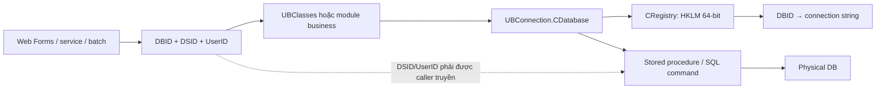

# Database Access — `CDatabase`, `CBase` và stored procedure contracts

> Hướng dẫn đọc, sửa và debug tầng truy cập dữ liệu VieFUND. Nội dung được đối chiếu trực tiếp với `UBConnection/CDatabase.cs`, `CRegistry.cs`, `UBClasses/CBase.cs`, các business class và SQL snapshot trong `ScriptDB` ngày 2026-09-04. `VFCsvExport` không nằm trong phạm vi theo quyết định của user.

## 1. Kết luận nhanh

VieFUND không dùng ORM, repository hay dependency injection cho database. Luồng phổ biến là business class tự tạo `CDatabase`, mở connection, chọn stored procedure, thêm từng parameter và đọc `SqlDataReader` hoặc `DataSet`.



Các điều cần nhớ:

- `DBID` chọn physical database/connection string; `DSID` chọn dealership bên trong database.
- `CDatabase` không giữ `DSID` và không tự thêm tenant predicate. Isolation theo `DSID` là contract của từng caller và stored procedure.
- API thực tế không có `ExecSP()`, `ExecSPDS()` hoặc `ExecSPDT()` như kế hoạch cũ. Pattern chính là `SetSP()` rồi `ExecuteSQL()` hoặc `FillDataSet()`.
- `ExecuteSQL()` dùng `ExecuteReader`, kể cả với nhiều stored procedure ghi dữ liệu; tên method dễ gây hiểu nhầm.
- Không tìm thấy `SqlTransaction`, `TransactionScope`, `BeginTransaction`, `Commit` hay `Rollback` trong application C# hiện tại.
- `CDatabase` không implement `IDisposable`; code phải đóng reader/connection bằng `ReadEnd()` và `Close()` trong `finally`.
- Error/return code không thống nhất toàn hệ thống; phải phân biệt lỗi DAL, `errorCode` của BLL và `Ret` nghiệp vụ do SP trả về.

## 2. Inventory source

| Thành phần | Source | Vai trò thực tế |
|---|---|---|
| `CDatabase` | `UBConnection/CDatabase.cs` — 2.820 dòng | Wrapper stateful quanh `SqlConnection`/`OdbcConnection`, command, reader, parameter và một số utility |
| `CRegistry` | `UBConnection/CRegistry.cs` | Resolve connection string theo `DBID` từ Windows Registry |
| `CBase` | `UBClasses/CBase.cs` — 8.357 dòng | Helper tĩnh cho Web Forms, session context, binding và nhiều thao tác DB dùng chung; không phải base repository |
| `CFunctions` | `UBStatic/CFunctions.cs` | Session namespace, convert/format và page lifecycle |
| Business classes | `UBClasses/*.cs` và các module khác | Tự khai báo SP contract, parameter, result mapping và business return code |
| SQL snapshot | `ScriptDB/000_4_CreateSP.sql` cùng các script khác | Definition stored procedure để đối chiếu parameter/result/transaction |

Quét toàn bộ file `.cs`, bỏ `Backup`, `obj` và phạm vi đã loại, cho thấy:

| Pattern | Occurrence | Số file |
|---|---:|---:|
| `new CDatabase(...)` | 2.472 | 270 |
| `.SetSP(...)` | 2.463 | 269 |
| `.ExecuteSQL(...)` | 1.352 | 226 |
| `.FillDataSet(...)` | 1.092 | 192 |
| `.ExecuteSP(...)` | 12 | 2 |

Ngoài `CDatabase.cs`, không tìm thấy code tạo trực tiếp `SqlConnection` hoặc `OdbcConnection` trong phạm vi trên. Tuy vậy, đây chỉ là một điểm truy cập kỹ thuật chung; schema mapping, tenant scope và business semantics vẫn phân tán ở caller/SP.

Quét source thô có 1.529 literal `SetSP("...")` duy nhất. Sau khi chuẩn hóa schema/bracket, 34 tên không có definition khớp trong snapshot 5.544 procedure; số này còn gồm code comment. [SP Catalog](../reference/sp-catalog/) quét lại source active và biểu thức tĩnh, ghi nhận 1.616 candidate, 1.583 tên khớp, 33 tên không khớp và 693 call site tên động. Chênh lệch là tín hiệu source/SQL snapshot cần kiểm tra, không phải bằng chứng production DB thiếu SP.

## 3. Resolve connection: `DBID` → Registry → connection string

### 3.1. Registry contract

`CRegistry` mở Registry 64-bit tại:

```text
HKEY_LOCAL_MACHINE\SOFTWARE\VieFund\Database
  ├─ DBID                         # default database ID
  └─ <DBID>\
       ├─ DBConnectionStr         # ưu tiên trước
       ├─ DBConnectionStrEnc      # fallback, giải mã bằng CEncryption8
       └─ DBConnectionStr<N>      # alternate connection theo iOptions
```

Hành vi đã xác minh:

1. `DBID` rỗng thì dùng giá trị default ở root.
2. Constructor chuẩn `CRegistry(DBID)` đọc `DBConnectionStr`; nếu rỗng mới đọc và giải mã `DBConnectionStrEnc`.
3. `CRegistry(DBID, iOptions)` ưu tiên `DBConnectionStr<iOptions>`, rồi fallback về chuỗi mặc định/encrypted.
4. `GetDBIDList()` trả một DBID nếu default được cấu hình khác `0/00/000/0000`; nếu không, nó lấy danh sách subkey để service lặp nhiều database.

Đây là machine-level deployment configuration, không nằm trong `Web.config`. `DBConnectionStrEnc` là reversible legacy encryption, không tương đương secret vault hay rotation mechanism hiện đại.

### 3.2. Hai constructor `CDatabase`

| Constructor | Ý nghĩa |
|---|---|
| `CDatabase(value, false, timeout)` | Xem `value` là DBID, resolve qua `CRegistry` |
| `CDatabase(connectionString, true, timeout)` | Dùng trực tiếp connection string, bỏ qua Registry |
| `CDatabase(DBID, iOptions)` | Chọn `DBConnectionStr<iOptions>` nếu có |

Constructor chuẩn cắt chuỗi dài hơn bốn ký tự bằng `Substring(1, 4)` trước khi lookup Registry. Đây là behavior legacy bắt buộc phải tính đến: không tự mở rộng format DBID nếu chưa kiểm tra toàn bộ caller và key thực tế.

Chế độ connection string trực tiếp đang xuất hiện ngoài DAL ở `VieFundDataExtractor` và một số luồng `UBFFImport`. Tên biến tại caller đôi khi vẫn là `DBIDStr`, vì vậy không thể đoán tham số là ID hay connection string chỉ từ tên biến; phải kiểm tra cờ boolean.

## 4. SQL Server, ODBC và timeout

`CDatabase` mặc định dùng `System.Data.SqlClient`. Nếu connection string chứa đúng literal hoa `DSN=`, constructor ba tham số chuyển sang `System.Data.Odbc`.

| Hành vi | SQL Server | ODBC |
|---|---|---|
| Connection | `SqlConnection` | `OdbcConnection` |
| Command | `SqlCommand` | `OdbcCommand` |
| Reader | `SqlDataReader` | `OdbcDataReader` |
| Parameter | Named trong code | Binding thực tế theo vị trí |
| Stored procedure text | `CommandType.StoredProcedure` + tên SP | Escape call `{CALL ...}` được tự ghép |

Các giới hạn cần biết:

- Phát hiện `DSN=` là case-sensitive.
- Constructor `CDatabase(DBID, iOptions)` không chạy bước phát hiện ODBC sau khi đọc connection string.
- `SetSP()` cho ODBC thêm `?,` cho mỗi parameter nhưng không bỏ dấu phẩy cuối trước `)`. Cần kiểm thử/sửa trước khi coi nhánh ODBC có parameter là đáng tin cậy.
- `timeout=0` được đổi thành 180 giây, nhưng với SQL Server nó chỉ thay `Connect Timeout=` nếu key này đã có và không nằm ở vị trí đầu chuỗi. Nếu connection string không có key, `SqlConnection.ConnectionTimeout` thường vẫn là default và được dùng luôn làm `CommandTimeout`.
- Timeout constructor điều chỉnh cả connection string và command theo cách legacy; không nên suy ra chắc chắn command timeout từ đối số nếu chưa log giá trị runtime.

Một report dài có truyền rõ `1000` giây (`VieFUNDPdf/QuarterAUA.cs`), cho thấy caller phải chủ động khi query dài.

## 5. Tenant context và data isolation

### 5.1. Ba định danh khác vai trò

| Giá trị | Nguồn phổ biến | Vai trò |
|---|---|---|
| `DBIDStr` | Session `TMPDBID`, service configuration | Chọn physical connection |
| `DSIDStr` | Session `TMPDSID` | Chọn dealership/tenant trong DB |
| `iUserID` | Session `TMPiMemberID` | Actor, permission/data scope/audit |

`CBase.GetConnectionParam()` lấy login ID từ hidden field `hdiLoginID` hoặc Session, rồi đọc ba giá trị trên từ session key có namespace theo login ID. Bản web-client dùng các key `TMPDBIDWC`, `TMPDSIDWC`, `TMPiClientIDWC`.

### 5.2. DAL không tự enforce `DSID`

`CDatabase` constructor chỉ nhận DBID/connection string. Nó không biết DSID hoặc user hiện tại. Caller thường phải làm rõ contract:

```csharp
db.SetSP("UBBankList");
db.AddParam("DSID", DSIDStr);
db.AddParam("UserID", UserID);
db.AddParam("Lg", Lg);
db.AddParam("Options", Options);
```

Không phải SP nào cũng có `@DSID`: có procedure cho dữ liệu toàn database, procedure suy ra dealership từ entity ID, và procedure tự fallback về record trong `UB_Dealership`. Vì vậy, quy tắc không phải “thêm DSID vào mọi SP”, mà là:

1. Xác định scope của operation.
2. Đối chiếu signature/body SP.
3. Xác minh entity ID thực sự thuộc tenant/user được phép.
4. Enforce ở server/SP; không tin `DSID` hay entity ID từ browser.

Mở đúng DBID không đủ để bảo vệ tenant khi nhiều DSID dùng chung một database.

## 6. Vòng đời chuẩn của một DB call

```text
resolve DBID/DSID/UserID
  → new CDatabase(DBID, false, timeout)
  → Open() == 0
  → ClearParameters()
  → SetSP(name)
  → AddParam(...)
  → ExecuteSQL() hoặc FillDataSet() hoặc ExecuteSP()
  → đọc/kiểm tra result contract
  → ReadEnd() nếu dùng reader
  → Close() trong finally
```

`ClearParameters()` cần được gọi trước mỗi SP khi tái sử dụng cùng `CDatabase`, vì command và parameter collection tồn tại trên object. `SetSP()` không tự clear parameter cũ.

### 6.1. Reader — list hoặc một result row

Pattern phổ biến nhất:

```csharp
CDatabase db = new CDatabase(DBIDStr, false, 0);
try
{
    if (db.Open() == 0)
    {
        db.ClearParameters();
        db.SetSP("UBBankList");
        db.AddParam("DSID", DSIDStr);
        db.AddParam("UserID", UserID);

        if (db.ExecuteSQL(0, ref errorMessage) == 1)
        {
            while (db.Read() == 1)
            {
                int id = db.GetInt32("ID", 0);
                string name = db.GetStr("Name", "");
            }
            db.ReadEnd();
        }
    }
}
finally
{
    if (db != null) db.Close();
}
```

`Options & 1` của `ExecuteSQL` bật `CommandBehavior.SingleRow`; nó không phải business option được tự truyền xuống SP.

### 6.2. `DataSet` — nhiều result set

```csharp
DataSet result = new DataSet();
db.ClearParameters();
db.SetSP("UBBankInfo");
db.AddParam("DSID", DSIDStr);
db.AddParam("iUserID", iUserID);
db.FillDataSet(result);
```

`SqlDataAdapter.Fill()` tạo một `DataTable` cho mỗi result set. Nhiều helper sau đó đổi `TableName` bằng cột `RecType` của dòng đầu:

```csharp
if (table.Rows.Count > 0)
    table.TableName = table.Rows[0]["RecType"].ToString();
```

Đây là contract runtime giữa SQL và C#. `RecType` có thể là tên business table (`TokenInfo`) hoặc thậm chí ID control Web Forms (`cb...`). Đổi/xóa cột này có thể làm code lookup `DataSet.Tables[name]` hoặc UI binding hỏng dù query vẫn chạy.

`FillDataSet()` trả số row adapter fill được, nhưng catch exception và cũng trả `0`. Do đó `0` có thể là result hợp lệ rỗng hoặc lỗi; method không cung cấp exception string. Caller phải kiểm tra cả `Tables`, schema/result contract và log/throw ở boundary phù hợp.

### 6.3. Non-query

`ExecuteSP()` gọi `ExecuteNonQuery()` và phù hợp cho SP không trả result set. Trong source hiện tại nó chỉ được dùng ở `UBClasses/MFDAReports.cs` và `VFQuickFix`.

Phần lớn business write vẫn gọi `ExecuteSQL()` vì SP trả một row như:

```text
Ret = business status
ID  = entity vừa tạo/cập nhật
```

Đừng đổi máy móc `ExecuteSQL()` thành `ExecuteSP()`: trước hết phải kiểm tra caller có đọc `Ret`, `ID`, warning hay result set nào không.

### 6.4. Output parameter

API có `AddParamOut()`, `SetParamDirection()`, `SetSize()` và `GetParameterValue()`/`GetInt32Out()`. Chỉ thấy một business class dùng `AddParamOut`: `UBClasses/Note.cs` với `UBNoteAdd`.

Với `SqlDataReader`, output parameter chỉ đáng tin sau khi reader đã đóng. Luồng thêm note hiện gọi `GetInt32Out("iNoteID")` ngay sau `ExecuteSQL()` và trước `ReadEnd()`; nhánh add cũng không đóng reader tại chỗ. Ngoài ra, `AddParamOut` đăng ký tên `@iNoteID`, còn `GetInt32Out` tra đúng chuỗi caller truyền mà không tự thêm `@` (khác `GetParameterValue`). Vì getter bắt exception rồi trả default, hai điểm này đều có thể làm `iNoteID` về `0` dù SP đã tạo note. Cần xác minh bằng test tích hợp và sửa bằng non-query/đóng reader trước khi đọc output, đồng thời dùng tên parameter nhất quán.

## 7. Parameter mapping

| C# overload | SQL type trong `SqlCommand` | Ghi chú |
|---|---|---|
| `AddParam(name, string)` | `VarChar`; dài hơn 8.000 → `Text` | Không hỗ trợ `null`: method bỏ hẳn parameter |
| `AddParamN(name, string)` | `NVarChar`; dài hơn 8.000 → `NText` | Chỉ thấy dùng cho FINTRAC `AddressInfo` |
| `int` / `long` | `Int` / `BigInt` | Named parameter |
| `DateTime` | `DateTime` | Không có nullable overload |
| `decimal` | `Money` | Không phải `Decimal`; cần chú ý precision/scale |
| `float` / `double` | `Real` / `Float` | Có thể không phù hợp dữ liệu tài chính |
| `bool` | `Bit` | Nhiều caller vẫn truyền `0/1` bằng overload int |
| `Stream` / `SqlBinary` | `VarBinary` | Stream được đọc toàn bộ vào memory |

Hệ quả:

- Không có `DBNull.Value` API tổng quát. Với string `null`, parameter bị bỏ; việc này chỉ an toàn nếu SP parameter có default phù hợp.
- Size/precision chủ yếu được suy ra từ value, không từ signature SP.
- `decimal` bị map cố định sang `money`; code mới cần đối chiếu SQL type thay vì chọn overload theo cảm tính.
- ODBC bind theo thứ tự thêm parameter, dù tên vẫn được ghi trong collection.
- Parameter hóa là pattern mặc định và phải được giữ; không nối user input vào SQL command text.

## 8. Result mapping và schema coupling

Reader getter gồm `GetInt32`, `GetInt16`, `GetStr`, `GetDbl`, `GetFloat`, `GetBool`, `GetDT`, `GetCurrency` và binary helpers. Hầu hết đều catch mọi exception rồi trả default.

Điều này giúp UI legacy không văng lỗi khi field null/thiếu, nhưng che giấu ba loại drift:

1. SP đổi alias hoặc bỏ column.
2. Giá trị SQL không convert được sang type mong đợi.
3. `DBNull` bị biến thành `0`, `false`, chuỗi rỗng hoặc `1900-01-01`.

Khi sửa SP/result:

- Tìm mọi getter/DataRow reference theo tên column.
- Không coi default value là bằng chứng column hợp lệ.
- Với contract quan trọng, kiểm tra `Columns.Contains`, `DBNull` và range rõ ràng ở boundary mới.
- Giữ `RecType`, `ID`, `Description`, `FSCode`, `Ret` và các alias được caller dùng.
- Test cả empty set, null, nhiều result set và lỗi convert.

## 9. Error và return-code conventions

Không có một enum lỗi dùng chung. Các tầng đang dùng nhiều kênh cùng lúc:

| Kênh | Ý nghĩa thường gặp | Cảnh báo |
|---|---|---|
| `Open()` | `0` thành công; `-1` connection string rỗng; `-2` không mở được | Exception gốc bị nuốt |
| `ExecuteSQL()` | `1` tạo được reader; `0` exception | Không cho biết SP business success |
| `Read()` | `1` có row; `0` hết row hoặc lỗi đọc | Hai trạng thái bị gộp |
| `ExecuteSP()` | Số row của `ExecuteNonQuery` | SQL exception có thể trả `0`; ODBC exception trả `-2` |
| `FillDataSet()` | Số row adapter fill | `0` cũng có thể là empty result hoặc exception |
| `errorCode` BLL | Thường `0` OK, `1` catch, `2` open/execute | Không nhất quán giữa class/method |
| `Ret` từ SP | Business outcome riêng từng procedure | Phải đọc comment/SP/UI mapping |

Ví dụ `Bank.Update()` trả `0` khi business thành công và `2` khi DAL thất bại, trong khi một số helper `CBase` vẫn trả `1` ở cuối dù `errorCode` cục bộ đã được gán. Không suy luận ý nghĩa chỉ từ kiểu `int` hoặc tên `Ret`.

Quy tắc cho code mới:

1. Tách `database execution failed` khỏi `SP executed but business rejected`.
2. Không bỏ qua `errorMessage` nếu method nhận `ref`.
3. Không coi DataSet rỗng là lỗi nếu contract cho phép zero record.
4. Ghi operation/SP và correlation ID, nhưng không log password, token, full connection string hay PII.
5. Với boundary mới, ưu tiên result type/exception rõ ràng thay vì thêm return code mơ hồ.

## 10. Resource management

`CDatabase` là object stateful chứa connection, command và active reader. Nó có finalizer gọi `Close()` nhưng không implement `IDisposable`; finalizer không bảo đảm đóng connection kịp thời.

Pattern an toàn trong code hiện tại:

- Khai báo `db = null`.
- Mở trong `try`.
- `ReadEnd()` ngay khi đọc xong reader.
- Luôn `Close()` trong `finally`, kể cả khi `Open()`/mapping lỗi.
- Không dùng cùng instance đồng thời giữa thread/request.
- Khi dùng lại connection cho nhiều SP, `ReadEnd()` và `ClearParameters()` trước call tiếp theo.

`Close()` nuốt exception và không dispose command/connection một cách explicit. Connection pooling của ADO.NET vẫn có thể hoạt động khi `Close()` được gọi, nhưng không thay thế cleanup có cấu trúc.

## 11. Transaction boundary

Quét application C# không tìm thấy transaction API. Dùng cùng một `CDatabase` cho nhiều SP chỉ tái sử dụng connection, không tạo transaction.

Ví dụ `PopupPlanAdd.OnOK()` mở một connection rồi lần lượt gọi:

```text
SaveInvestmentInfo(true)
  → SaveQuestions(true)
  → SaveUDF(true)
  → đóng connection
  → OnAdd(...)
```

Nếu các SP này ghi dữ liệu thật thay vì staging, lỗi giữa chuỗi có thể để lại partial state. Cần đọc từng SP để xác định `bCommit` là business flag hay transaction semantic; tên biến không tạo transaction ADO.NET.

Trong SQL snapshot có 12 câu `BEGIN TRAN` không bị comment và 12 `COMMIT TRAN`, tập trung ở:

- `UBFundAccountAdd`, `UBFundAccountPositionDelete`, `UBFundAccountUpdate`.
- `UBFundTrxICTAddOneShort`, `UBFundTrxSellBasket`, `UBFundTrxSwitchEdit`, `UBFundTrxSwitchShort`.
- Nhóm cấp ID: `UBSysID`, `UBSysID1912`, `UBSysIDCode`, `UBSysIDGICTrxCode`, `UBSysIDTrxCode`.

Không tìm thấy câu `ROLLBACK TRAN` không-comment hoặc `SET XACT_ABORT ON` trong snapshot. Đây là finding cần DBA review: runtime error giữa transaction có thể không đi qua một rollback rõ ràng và có thể ảnh hưởng connection pooling/lock. Không sửa hàng loạt nếu chưa regression-test các procedure trọng yếu.

Khi một use case cần atomicity qua nhiều SP, lựa chọn an toàn là:

1. Gom operation vào một stored procedure có `SET XACT_ABORT ON`, `TRY/CATCH`, `COMMIT`/`ROLLBACK` rõ ràng; hoặc
2. Mở rộng DAL để truyền cùng `SqlTransaction` cho mọi command, kèm test failure giữa từng bước.

Hiện `CDatabase` không expose connection/transaction theo cách đủ để làm lựa chọn 2 mà không thay đổi thư viện.

## 12. Raw SQL, logging và các finding cần theo dõi

### 12.1. Raw SQL public API còn tồn tại

`ExecuteSQL(string, ...)`, `FillDataSet2(string)` và `ExecuteSQLNoneQuery(string)` nhận command text. Call site active chủ yếu nằm ngay trong `CDatabase`; business code hiện thiên về `SetSP` + parameter.

Overload `CloseSysID(..., AccountID)` nối thẳng `SPName`, `SysID` và `AccountID` vào command text. Không tìm thấy caller active của overload có `AccountID`, nhưng vì đây là public API, không nên tái sử dụng nếu chưa parameter hóa/whitelist SP name.

### 12.2. Log file hard-coded

`WriteLog()` append plain text vào `C:\Out\VLogYYYYMMDD.txt`; overload tên file cũng ghi dưới `C:\Out`. Exception khi ghi log bị nuốt. `DumpTable()` ghi toàn bộ tên/value của từng column.

Hệ quả:

- Logging có thể âm thầm mất nếu folder/ACL không đúng.
- Không có cấu trúc level, correlation, retention hoặc redaction tập trung.
- `DumpTable` và log tùy ý có thể rò PII/credential/token.
- Không được log connection string vì có thể chứa DB credential.

### 12.3. Error bị biến thành default

`Open`, `Read`, `FillDataSet` và getter đều có nhánh catch nuốt exception hoặc trả default. Khi debug “không có dữ liệu”, phải kiểm tra cả connection, exception bị bỏ, alias drift và quyền tenant; không chỉ kiểm tra `Rows.Count`.

### 12.4. `IsPageValidWC(..., bCheckDB=true)`

Trong `CBase.IsPageValidWC`, code đặt `bRet=false`, mở DB và chuẩn bị `UBSessionExpired`, nhưng phần thêm parameter/thực thi/đọc result đang bị comment. Vì vậy nhánh `bCheckDB=true` đi tới invalid/redirect thay vì xác nhận session từ DB. Cần xác minh caller active trước khi sửa; đây là behavior source hiện tại, không phải cơ chế session DB đang hoạt động.

## 13. Checklist thêm hoặc sửa một DB method

- [ ] Xác định rõ `DBID`, `DSID`, user/client actor và access scope.
- [ ] Đọc definition SP hiện tại; không dựa vào tên method/SP.
- [ ] Kiểm tra parameter name, SQL type, default, output direction và null semantics.
- [ ] Dùng `ClearParameters()` trước `SetSP()`.
- [ ] Parameter hóa value; whitelist nếu SP name buộc phải động.
- [ ] Chọn `ExecuteSQL`, `FillDataSet` hay `ExecuteSP` theo result contract.
- [ ] Nếu dùng reader, gọi `ReadEnd()` trước output parameter/call tiếp theo.
- [ ] Kiểm tra mọi result set, `RecType`, column alias, `Ret`, `ID` và empty result.
- [ ] Phân biệt technical error với business rejection.
- [ ] Đóng connection trong `finally`.
- [ ] Xác định atomicity; không nhầm connection reuse với transaction.
- [ ] Test cùng tenant, khác tenant, user thiếu quyền, null/default và SQL timeout.
- [ ] Không log PII, password, token hoặc connection string.
- [ ] Cập nhật module guide/SP Catalog nếu contract thay đổi.

## 14. Debug theo triệu chứng

| Triệu chứng | Kiểm tra đầu tiên |
|---|---|
| `Open()` trả `-1` | DBID normalize thành gì, Registry value có rỗng không |
| `Open()` trả `-2` | Registry view 64-bit, key/ACL, connection string, network/SQL login; exception gốc hiện bị nuốt |
| Query trả rỗng bất ngờ | `FillDataSet=0` có phải lỗi bị nuốt, DSID/UserID đúng chưa, SP có zero-row hợp lệ không |
| Chỉ sai một dealership | DBID đúng nhưng DSID/entity scope sai hoặc SP thiếu tenant filter |
| `DataSet.Tables[name]` không có | SP thiếu/đổi `RecType`, result set rỗng nên table chưa được rename |
| Field luôn `0`/rỗng | Alias đổi, `DBNull`, convert lỗi hoặc getter đang trả default |
| Call thứ hai lỗi parameter | Chưa `ReadEnd()` hoặc `ClearParameters()` khi tái sử dụng db |
| Output ID bằng 0 | Reader chưa đóng, output parameter direction/type sai hoặc SP không set value |
| Timeout sớm hơn dự kiến | Connection string không có `Connect Timeout=`, command timeout runtime khác đối số constructor |
| Import chỉ lỗi ODBC | `DSN=` casing, positional order và `{CALL ...}` có trailing comma |
| Dữ liệu cập nhật một phần | Chuỗi nhiều SP không có transaction hoặc SP transaction thiếu rollback |
| Không thấy log | `C:\Out`/ACL, log exception bị nuốt hoặc đang xem sai machine |

## 15. Thứ tự đọc source đề xuất

1. `UBConnection/CDatabase.cs` dòng constructor/open/close, `SetSP`, `AddParam`, `ExecuteSQL`, `FillDataSet`.
2. `UBConnection/CRegistry.cs` để hiểu Registry, default DBID và alternate connection.
3. `UBClasses/CBase.cs`: `GetConnectionParam*`, dropdown/result-set binding và `IsPageValid*`.
4. `UBClasses/Bank.cs`: ví dụ gọn cho list, DataSet và write trả `Ret`/`ID`.
5. `UBClasses/Note.cs`: output parameter edge case.
6. `WebApp/Main/PopupPlanAdd.aspx.cs`: nhiều DB step dùng chung connection nhưng không có transaction.
7. `UBClasses/MFDAReports.cs`: số ít caller dùng `ExecuteSP()` non-query.
8. `ScriptDB/000_4_CreateSP.sql`: đối chiếu signature, result aliases, tenant scope và transaction thật.

## 16. Tài liệu liên quan

- [Data Dictionary](../reference/data-dictionary.md)
- [SP Catalog](../reference/sp-catalog/README.md)
- [Authentication & Authorization](auth.md)
- [UI Patterns](ui-patterns.md)
- [Multi-tenancy](multitenancy.md)
- [Security Module Guide](../topics/security/module-guide.md)
- [System Map](../getting-started/system-map.md)

Database Access guide mô tả cơ chế gọi DB; Data Dictionary mô tả bảng; SP Catalog quản lý inventory/cross-reference procedure chi tiết. Khi ba nguồn khác nhau, ưu tiên behavior source + SQL definition hiện tại và ghi rõ chênh lệch snapshot.
