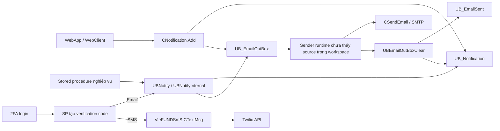

# Email & Notifications — notification nội bộ, outbox, SMTP và SMS

> Hướng dẫn đọc, sửa và debug các kênh thông báo của VieFUND. Nội dung được đối chiếu trực tiếp với `WebApp`, `WebClient`, `VFOnBoarding`, `UBClasses`, `UBStatic`, `VieFUNDSmS`, `VFTwilio` và SQL snapshot trong `ScriptDB` ngày 2026-09-04. `VFCsvExport` không nằm trong phạm vi theo quyết định của user.

## 1. Kết luận nhanh

VieFUND có ba kênh liên quan nhưng không đồng nghĩa với nhau:

1. **Notification nội bộ** lưu ở `UB_Notification`, hiển thị trong WebApp/WebClient và có thể tồn tại mà không gửi email.
2. **Email bất đồng bộ** lưu ở `UB_EmailOutBox`; sender lấy queue, gọi SMTP rồi báo kết quả để chuyển email thành công sang `UB_EmailSent` hoặc đánh dấu lỗi.
3. **SMS Twilio** đang được WebApp, WebClient và `VFOnBoarding` gửi đồng bộ bằng `VieFUNDSmS.CTextMsg`, chủ yếu trong luồng 2FA.



Các điểm bắt buộc phải nhớ:

- Web page tạo notification **không gọi SMTP trực tiếp**. `UBNotifyAdd`/`UBNotifyInternal` ghi notification và, nếu cần email, thêm outbox.
- `CSendEmail.SendEmailOne` được gọi trực tiếp trong source hiện có chỉ tại màn hình test SMTP. Không tìm thấy host/worker gọi `UBEmailOutBox`, `UBEmailOutBoxClear` và transport để gửi queue.
- `UB_EmailTemplate` mới là kho template email EN/FR. `UBStatic/CMSG.cs` là catalog message UI/business dùng trong alert/validation, không phải template engine của outbox.
- `VFTwilio` là project độc lập, không tìm thấy reference/caller từ project ứng dụng. Luồng active dùng `VieFUNDSmS/CTextMsgs.cs`.
- `DBID` chọn physical database. Nhiều API notification/email không truyền hoặc không dùng `DSID`; không được giả định DAL tự enforce tenant.

## 2. Bản đồ source

| Thành phần | Source chính | Vai trò đã xác minh |
|---|---|---|
| Notification BLL | `UBClasses/Notification.cs` | Add/list/info/reply/resend/remove và popup báo tin mới |
| Email template BLL | `UBClasses/EmailTemplate.cs` | CRUD template EN/FR theo loại và member group |
| SMTP transport | `UBStatic/SendEmail.cs` | Chọn SMTP server, chuẩn hóa message, attachment, gửi đồng bộ |
| SMTP helper cũ | `UBStatic/CFunctions.cs`, `UBClasses/CBase.cs` | Implementation SMTP trùng lặp và helper đọc cấu hình legacy |
| Message UI | `UBStatic/CMSG.cs` | Chuỗi alert/validation EN/FR dùng trong code-behind |
| SMS active | `VieFUNDSmS/CTextMsgs.cs` | Gửi SMS qua Twilio Programmable Messaging |
| SMS/Verify không có caller | `VFTwilio/CTwilioText.cs`, `CTwilio2FA.cs` | Implementation Twilio riêng; chưa thấy được application reference |
| UI notification WebApp | `NotificationView.aspx(.cs)`, `PopupNotificationAdd.aspx(.cs)`, `PopupNotification.aspx(.cs)` | Tìm kiếm, tạo, xem, reply, resend và xóa |
| UI notification WebClient | `PopupNotificationAdd.aspx(.cs)`, `PanelNotificationAdd.aspx(.cs)` cùng các fragment body/reply | Client gửi/đọc message |
| Setup | `PopupMiscellaneousSetting.aspx(.cs)`, `PopupSetupDealerEmail.aspx(.cs)` | Template, SMTP server và Twilio settings |
| SQL notification | `UBNotifyAdd`, `UBNotify`, `UBNotifyInternal`, `UBNotifyList*`, `UBNotifyInfo`, `UBNotificationCheck`, `UBNotifyResendEmail`, `UBNotifyRemove` | Rule, persistence, list/read/resend/delete |
| SQL outbox | `UBEmailOutBox`, `UBEmailOutBoxAdd`, `UBEmailOutBoxClear`, `UBEmailOutBoxRefresh` | Claim batch, lấy attachment, nhận kết quả và retry |

Không dùng file `.bak` làm bằng chứng cho luồng active.

## 3. Mô hình dữ liệu

### 3.1. Các bảng lõi

| Bảng | Vai trò | Trường quan trọng |
|---|---|---|
| `UB_Notification` | Bản ghi message/audit dùng cho UI | source/destination, subject/body, liên kết client/plan/trx/report, `iEmailStatus`, `dtSend`, read/delete flags |
| `UB_EmailOutBox` | Queue email đang chờ hoặc lỗi | from/to/cc/bcc, subject/body, priority, format, attachment reference, `iStatus`, `iNotificationID` |
| `UB_EmailOutBoxAtt` | Attachment bổ sung của một outbox row | outbox ID, document/object type, name/MIME/size/data |
| `UB_EmailSent` | Lịch sử email gửi thành công | snapshot nội dung outbox, original outbox ID, `dtCreated` |
| `UB_EmailTemplate` | Nội dung template EN/FR | `iType`, `iStatus`, `iMemberGroupID`, subject/content EN/FR |
| `UB_DealershipEmailExtra` | Danh sách SMTP endpoint và chính sách From | server/user/password/port/SSL, purpose, From, enforcement |
| `UB_DealerTwilio` | Twilio account/config | service name, account SID, access token, sender phone |
| `UB_EmailTask` | Theo dõi một số tác vụ/report email | trạng thái task/email, khoảng ngày, file và người nhận |

Các bảng định nghĩa liên quan gồm `UB_Def_EmailStatus`, `UB_Def_EmailTemplateType`, `UB_Def_EmailSubjectType`, `UB_Def_NotificationSourceType`, `UB_Def_NotificationDestType` và `UB_Def_NotificationMSGType`. Tên hiển thị phải đọc từ lookup của database môi trường; không hard-code lại từ phỏng đoán.

### 3.2. Hai state machine khác nhau

`UB_Notification.iEmailStatus` và `UB_EmailOutBox.iStatus` không dùng cùng ý nghĩa:

| Nơi lưu | Giá trị thấy trong source | Ý nghĩa vận hành đã xác minh |
|---|---:|---|
| `UB_Notification.iEmailStatus` | `1` | Email đã gửi; `UBEmailOutBoxClear` đồng thời ghi `dtSend` |
| | `2` | Cần gửi/đang chờ email |
| | `3` | Không áp dụng/không có địa chỉ/được yêu cầu không email |
| `UB_EmailOutBox.iStatus` | `0` | Sẵn sàng lấy từ queue |
| | `1` | Đã được `UBEmailOutBox` claim để xử lý |
| | `2` | Lỗi có thể được đưa về queue để thử lại |
| | `3` | Lỗi được `UBEmailOutBoxRefresh` thử lại có giới hạn |
| | `4` | Nhóm lỗi thứ ba mà `UBEmailOutBoxClear` giữ lại; snapshot không có label đủ để đặt tên nghiệp vụ chắc chắn |

Không lấy mô tả chung “Status” của schema inventory làm định nghĩa nghiệp vụ. `GetEmailStatusStr` tra `UB_Def_EmailStatus`; outbox status được suy ra trực tiếp từ logic claim/clear/refresh.

### 3.3. Địa chỉ và nội dung là snapshot

`UB_Notification` giữ `ToEmail`, `EmailContent`, subject và display name tại lúc tạo. Sau khi địa chỉ master của client thay đổi, notification cũ không tự thay đổi. Luồng resend là ngoại lệ: `UBNotifyResendEmail` cập nhật `ToEmail` của notification và có thể cập nhật `UB_Phone.EmailAddress` kèm audit.

## 4. Luồng notification thủ công

### 4.1. Khởi tạo dialog

Page gọi `CNotification.InitDlg` → `UBNotifyInitDlg`. `strType` quyết định ngữ cảnh, ví dụ:

- `0`: reply notification cũ.
- `1`: user gửi client thủ công.
- `2`: user-to-user gắn plan.
- `4`–`6`: các ngữ cảnh compliance/trade/GIC.
- `11`: client gửi advisor, dùng ở WebClient.

SP trả tên/email người gửi-người nhận, subject/body mặc định và các foreign key liên quan. UI vẫn phải validate destination, email và attachment trước khi gọi Add.

### 4.2. Ghi dữ liệu

Ba caller active của `CNotification.Add`:

- `WebApp/Main/PopupNotificationAdd.aspx.cs`.
- `WebClient/Main/PopupNotificationAdd.aspx.cs`.
- `WebClient/Main/PanelNotificationAdd.aspx.cs`.

`CNotification.Add` map sang `UBNotifyAdd`. Contract có bốn nhóm:

| Nhóm | Tham số |
|---|---|
| Message | effective date, message type, priority, creation/status, subject, content, format |
| Participants | from/to type và ID, display name, destination email, reply email |
| Business context | client, plan, fund account/position/trx, GIC account/trx, report, dealer/rep code |
| Conversation/file | old notification, include original, temp upload session, attachment flags, broadcast mode |

`UBNotifyAdd` thực hiện:

1. Xử lý reply và có thể nối nội dung notification cũ.
2. Resolve danh sách nhận: một người, client search list, favorite list, all clients/advisors/managers/admin hoặc head office.
3. Chuyển attachment tạm sang document storage qua `UBDocAddInternal`.
4. Thay placeholder client/advisor trong nội dung.
5. Thêm một `UB_Notification` cho mỗi người nhận.
6. Nếu có email và `bNoEmail` không bật, thêm `UB_EmailOutBox` với `iStatus=0`.

Broadcast là fan-out vật lý: mỗi destination có notification/outbox riêng. Khi thay đổi logic này phải kiểm tra số bản ghi, transaction behavior và tác động gửi trùng.

### 4.3. Source/destination code

SQL hiện dùng hai bộ code không hoàn toàn đối xứng:

| Ngữ cảnh | Code | Nghĩa |
|---|---:|---|
| Destination | `1` | internal user |
| Destination | `2` | dealer/head office |
| Destination | `10` | client |
| Source trong generated notification | `1` | system |
| Source trong generated notification | `2` | user |
| Source trong generated notification | `3` | client |

Các pseudo destination `11` (client search list) và `12` (favorite list) được `UBNotifyAdd` fan-out rồi chuẩn hóa thành `10`.

## 5. Notification tự động từ nghiệp vụ

Stored procedure nghiệp vụ thường gọi wrapper `UBNotify`, rồi wrapper gọi `UBNotifyInternal`. Quét SQL snapshot thấy 36 lệnh gọi `UBNotify`, `UBNotifyInternal` hoặc `UBNotifyAdd` trong 35 stored procedure chứa call; một procedure là chính wrapper `UBNotify`, còn lại 34 producer nghiệp vụ.

Các producer tiêu biểu:

| Nhóm nghiệp vụ | Stored procedure caller |
|---|---|
| 2FA | `UB2FAGetCode4User`, `UB2FAGetCode4Client`, `UBMemberLogin`, `UBClientLogin` |
| Address change | `UBClientAddressPhoneRequestAdd`, `UBClientAddressRequestApproveOne`, `UBClientAddressRequestDeclineOne` |
| Document/report | `UBDocAddInternal`, `UBDocDescriptionSet`, `UBReportClientPdfObjApprove`, `UBReportPdfObjApprove*`, `UBReportPdfObjReleaseTagged` |
| KYC | `UBKYCExpiredNotify` |
| GIC/trade confirmation | `UBGICConfirmationDeliverItem`, `UBTrxConfirmationDeliverItem*` |
| Tax/year-end | `UBNR4SlipRelease`, `UBRL16/18/2/3SlipRelease`, `UBT3/T4A/T4FHSA/T4RIF/T4RSP/T5008/T5SlipRelease`, `UBTaxReceiptRelease` |
| Onboarding | `UBOBItemReject` |

Comment trong `UBNotify` liệt kê message type `1`–`23`. Các loại đã thấy rõ gồm report approved, account/trade deficiency/approved, address change, document posted, trade confirmation, tax receipt, password change, user/client 2FA và KYC expiry. Lookup DB mới là nguồn label chính thức.

### 5.1. Template và ngôn ngữ trong `UBNotifyInternal`

Đối với client, SP đọc `UB_Customer.Language` và có thể đổi `Lg` sang EN (`0`) hoặc FR (`1`). Template được chọn bằng:

```text
GetEmailTemplateID(iMessageType, iStatus=0, iMemberGroupID)
```

UDF ưu tiên template active đúng member group, sau đó fallback sang template active cùng type không ràng group. `UBNotifyInternal` dùng template DB cho các type như statement/report, client registration, address change, document/trade confirmation, tax receipt, KYC và 2FA; nhiều nhánh có fallback text hard-code nếu template trống.

Các placeholder thực sự được replace trong SQL gồm:

- Client/login: `<%Salutation%>`, `<%FirstName%>`, `<%LastName%>`, `<%FileID%>`, `<%LoginID%>`.
- Advisor: `<%RepName%>`, `<%RepFName%>`, `<%RepLName%>`, địa chỉ, province/postal/country, phone/business phone/ext và email.
- Nghiệp vụ: `<%PlanDescription%>`, `<%ReportType%>`, `<%VerificationCode%>`.

Không có generic template renderer. Mỗi nhánh SP tự replace token; thêm token vào DB template mà không thêm `REPLACE` tương ứng sẽ gửi nguyên placeholder.

## 6. Đọc, popup báo tin và xóa

### 6.1. List và info

- WebApp dùng `CNotification.GetList` → `UBNotifyList`, hỗ trợ paging và filter source/destination/message/email status/priority/date/dealer/rep/name.
- WebClient dùng `GetListWC` → `UBNotifyListWC`, scope theo `iClientID`.
- `CNotification.Info` → `UBNotifyInfo`, trả `NotificationInfo` và đánh dấu `bView`/`dtView` khi người nhận là internal user đang mở record.
- `CNotification.CanReply` hiện cho reply khi `iFromID > 0`; email pending không chặn reply vì check cũ đã bị comment.

`UBNotifyList` phân quyền admin hoặc xây danh sách member accessible bằng `UBMemberAccessMemberList`. Tuy nhiên BLL không truyền `DSID`; tham số này trong SP chủ yếu được dùng khi format mô tả plan, không phải predicate tenant trực tiếp.

### 6.2. Popup báo notification mới

Nhiều page gọi `CNotification.NotificationBox`. Method lấy session context rồi chạy `UBNotificationCheck`:

1. Chọn notification gửi trực tiếp tới user (`iToIDType=1`) có `iNotified=0`.
2. Đếm và cập nhật ngay `iNotified=1`.
3. Nếu count > 0, mở `Message.aspx` ở góc dưới phải bằng `ShowDlgBoxBottomRight`.

`iNotified` chỉ nghĩa là đã kích hoạt popup check, không phải đã đọc. Read state nằm ở `bView`/`dtView`.

`UBNotificationCheck` không lọc `dtEffective`, nên notification được hẹn cho tương lai vẫn có thể bị đánh dấu `iNotified=1` và kích hoạt popup trước ngày hiệu lực. Email tương ứng vẫn chờ `dtEffective` ở outbox.

### 6.3. Xóa

`UBNotifyRemove` dùng soft-delete hai phía qua `bFromDeleted` và `bToDeleted`. Khi cả hai phía đã xóa và user có quyền delete, record mới bị xóa vật lý. Attachment document chỉ bị xóa khi không còn notification nào tham chiếu link đó.

## 7. Outbox lifecycle và sender contract

### 7.1. Enqueue

Outbox có thể được tạo cùng notification qua `UBNotifyAdd`/`UBNotifyInternal`, hoặc trực tiếp qua `UBEmailOutBoxAdd`. Record mới dùng `iStatus=0` và `dtEffective` để trì hoãn.

### 7.2. Claim batch — `UBEmailOutBox`

SP chọn tối đa 10 record ready (`iStatus=0`, effective trước hiện tại, có To và body), ưu tiên `iPriority` cao. `iOptions=3` chỉ lấy priority `3`. Các ID được cập nhật thành `iStatus=1` trước khi trả về.

Result-set contract:

| `RecType` | Nội dung |
|---|---|
| `MailServer` | Các row `UB_DealershipEmailExtra` để sender chọn SMTP |
| `List` | Email cùng main attachment nếu có |
| `ListAtt` | Attachment bổ sung của cùng outbox row |

Main attachment type đã thấy:

- `0`: document file link hoặc raw outbox attachment.
- `1`: Fund Facts object.
- `2`: trade confirmation PDF object.
- `3`: GIC confirmation PDF object.
- `4`: raw data từ `UB_EmailOutBoxAtt` ở nhánh main record.

`ListAtt` hiện trả Fund Facts (`1`) và trade confirmation (`2`) từ bảng attachment.

### 7.3. Hoàn tất — `UBEmailOutBoxClear`

Sender phải gửi bốn CSV ID list:

- thành công: copy sang `UB_EmailSent`, cập nhật notification `iEmailStatus=1`/`dtSend`, cập nhật trạng thái Fund Facts/trade confirmation và xóa outbox + attachment;
- failed group 2/3/4: giữ row và đặt `UB_EmailOutBox.iStatus` tương ứng.

`UBEmailOutBoxRefresh` chỉ reset lỗi gần đây: status `2` về ready khi queue có ít hơn 10 row; nếu queue vẫn ít thì reset tối đa 499 row status `3` trong tám ngày gần nhất.

### 7.4. Ranh giới chưa có source

Không tìm thấy application/service source nào gọi ba SP `UBEmailOutBox`, `UBEmailOutBoxClear`, `UBEmailOutBoxRefresh`, hoặc nối result set của chúng với `CSendEmail.SendEmail/SendEmailX`. Vì vậy chỉ có thể xác minh **database queue contract và SMTP library**, chưa thể khẳng định:

- executable/service nào chạy sender;
- polling interval, concurrency và service identity;
- mapping return code transport vào ba failed list;
- monitoring, dead-letter, log path và deployment topology thực tế.

Đây là phần cần lấy thêm runtime/service package hoặc deployment documentation, không được điền bằng suy đoán.

## 8. SMTP configuration và transport

### 8.1. Hai lớp cấu hình

Code còn hai cơ chế:

1. `UB_DealershipEmailExtra`: danh sách SMTP server hiện được setup qua `PopupSetupDealerEmail` và trả cho outbox sender.
2. Các cột SMTP legacy trên `UB_Dealership`: đọc/ghi qua `CBase.SmtpGetServerParams`/`SmtpSetServerParams` và `UBEmailServerInfo*`.

Search không tìm thấy caller active của `CBase.SendEmailPage`, `SmtpGetServerParams` hoặc `SmtpSetServerParams`. Màn hình setup hiện dùng `Dealer.DealerEmailList/Update` với bảng extra.

`Dealer.DealerEmailUpdate` mã hóa SMTP password bằng `CEncryption8.GetEncPW("Smtp", ...)`; khi load UI và trước khi gửi, code giải mã lại. Đây là reversible legacy encryption, không phải hashing hoặc secret vault.

### 8.2. Chọn server

`CSendEmail.SendEmail(DataTable, iEmailType, ...)` thử theo thứ tự:

1. server có `FromEmail` khớp chính xác `sFrom`;
2. server có `iPrimaryPurpose` khớp email type;
3. server còn lại.

Trong từng nhóm, code thử tuần tự đến khi return `0`. `iFromEmailEnforced` có thể ép dùng From mặc định hoặc ép khi domain không khớp. `SendEmailX` nhiều attachment chỉ ưu tiên purpose rồi fallback toàn bộ, không có bước exact From như overload đơn attachment.

### 8.3. Tạo và gửi message

`SendEmailOne`/`SendEmailOneX` dùng `System.Net.Mail`:

- port `0` fallback `587`;
- `EnableSsl` lấy từ DB;
- có username thì dùng `NetworkCredential`, nếu không dùng default credentials;
- To hỗ trợ chuỗi phân tách `;` hoặc `,`;
- subject loại newline, trim và cắt tối đa 168 ký tự;
- body/subject UTF-8;
- priority `1=Low`, `>=3=High`, còn lại `Normal` trong single-attachment path;
- `iMailFormat=0` là HTML, `1` là text;
- Reply-To chỉ thêm nếu khác From và là email hợp lệ;
- `SendEmailOne` gắn một attachment trong memory; `SendEmailOneX` gắn nhiều attachment và cố chia email thành nhiều phần nếu SMTP báo quá kích thước.

Bcc/CC được chuyển `;` thành `,` nhưng sau đó truyền cả chuỗi vào một `MailAddress`; nhiều địa chỉ trong một chuỗi có thể gây `FormatException`. Khác với To, code không lặp từng địa chỉ Bcc/CC.

### 8.4. Return code transport

| Code | Ý nghĩa thực tế trong `CSendEmail` |
|---:|---|
| `0` | Gửi thành công |
| `2` | Lỗi mặc định/có thể retry |
| `3` | Lỗi được phân loại riêng theo text exception, ví dụ mailbox/format/timeout hoặc attachment quá lớn |
| `4` | From hoặc To rỗng/không hợp lệ để gửi |
| `98` | Không tìm được email server phù hợp |
| `99` | Thiếu server table/không khởi tạo được kết quả |

Phân loại dựa trên substring tiếng Anh của exception nên phụ thuộc provider/framework message. Sender runtime phải lưu cả code và `errMSG`; chỉ giữ code sẽ mất nguyên nhân.

## 9. Resend email

`PopupNotification.aspx.cs` chỉ hiện Resend khi notification chưa sent và effective date cho phép. UI validate địa chỉ rồi gọi `CNotification.ResendEmail` với `bUpdate=true`.

`UBNotifyResendEmail`:

1. Tìm outbox row theo `iNotificationID`, hoặc tạo lại từ snapshot notification.
2. Nếu được yêu cầu và destination là client, cập nhật `UB_Phone.EmailAddress` cùng audit trail.
3. Cập nhật outbox `sTo`, reset `iStatus=0`.
4. Cập nhật `UB_Notification.ToEmail`.

Resend chỉ **đặt lại vào outbox**; message “placed in OutBox” của UI phản ánh đúng behavior, không có nghĩa SMTP đã gửi thành công.

## 10. Email template và `CMSG`

### 10.1. `UB_EmailTemplate`

`PopupMiscellaneousSetting.aspx.cs` gọi `CEmailTemplate` để quản lý template:

- Add/update: `UBEmailTemplateAdd`/`UBEmailTemplateUpdate`.
- List: `UBEmailTemplateList`, mặc định chỉ lấy active của member group.
- Info: `UBEmailTemplateInfo`.

Mỗi template có type, active/inactive status, member group, description, subject/content EN và FR. Khi update một template thành active, SP tự inactive template active khác cùng type + member group. Khi add active trùng, SP trả `iRet=3`.

### 10.2. `CMSG.cs` không phải email template store

`CMSG` có hàng trăm array/method static kiểu `MSG_ValEmpty(Lg)` hoặc `MSG_RecordUpdated(Lg)`. Mỗi array thường chứa hai phần tử EN/FR và được page/BLL dùng cho alert, validation, error hoặc confirmation.

Khác biệt quan trọng:

| `CMSG` | `UB_EmailTemplate` |
|---|---|
| Compile cùng code | Thay đổi bằng UI/DB |
| Dùng cho UI/business message ngắn | Subject/body outbound email |
| Thường chọn bằng index `Lg` | Chọn theo type + member group + language |
| Không tạo outbox | Được `UBNotifyInternal` dùng trước khi enqueue |

Khi sửa câu chữ email gửi khách hàng, phải xác định nội dung đến từ DB template hay fallback hard-code trong SP; sửa `CMSG` thường không thay đổi email đó.

## 11. SMS và 2FA

### 11.1. Luồng active

Các caller active của `VieFUNDSmS.CTextMsg`:

- `WebApp/Default.aspx.cs`: 2FA internal user.
- `WebClient/Default.aspx.cs`: 2FA client.
- `VFOnBoarding/VieFUNDOnBoarding.cs`: 2FA onboarding service.
- `WebApp/Main/PopupSetupDealerEmail.aspx.cs`: test Twilio configuration.

Login flow gọi `CMember.GetNew2FACode` hoặc `CCustomer.GetNew2FACode`. Dataset có:

| Table | Trường dùng |
|---|---|
| `TwoFAInfo` | `EmailAddress`, `PhoneNumber`, `Msg2Send` |
| `TwilioInfo` | `AccountServiceID`, `AccessToken`, `TwilioPhoneNumber`, `ServiceName` |

Nếu chọn email, SP tạo notification type `15` (user) hoặc `16` (client), dùng priority cao và enqueue email. Nếu chọn SMS, page gọi Twilio đồng bộ rồi mới hiển thị thành công/thất bại.

### 11.2. `CTextMsg` làm gì

1. `TextMsgInit` giữ SID/token/sender/service name.
2. `GetSid` init Twilio, đọc tối đa 20 Verify Service theo friendly name và tạo service nếu chưa có.
3. `SendSms` chuẩn hóa destination sang E.164 gần đúng cho Canada/US và gọi `MessageResource.Create`.
4. Lỗi được map qua `CErrors` và cố append vào `C:\Out\VFTwilioLogs.txt`.

Điểm lạ: Programmable Messaging call không dùng `m_ServiceID`, nhưng `SendSms` vẫn bắt buộc `GetSid` thành công. Vì vậy lỗi/quyền của Verify Service có thể chặn SMS dù API gửi message không cần Verify SID.

### 11.3. Cấu hình Twilio

`PopupSetupDealerEmail` gọi `Dealer.DealerTwilioInfo/Update` → `UBTwilioInfo/UBTwilioUpdate` → `UB_DealerTwilio`. Trong source hiện tại:

- BLL không truyền `DSID`/`iUserID` dù SP khai báo hai tham số này.
- SP đọc/update record DB-wide, không có predicate theo `DSID`.
- `AccessToken` được lưu và trả về dạng plaintext; không có `CEncryption8` như SMTP password.

Do đây là credential có quyền gọi Twilio, cần hạn chế quyền DB/UI, tránh log/dump dataset và ưu tiên chuyển sang secret store/rotation khi có kế hoạch remediation.

### 11.4. `VFTwilio` chưa phải luồng active

`VFTwilio` có `CTwilioText`, `CTwilio2FA` và Verify API send/check, nhưng không có project ứng dụng nào reference assembly này và không tìm thấy caller ngoài chính project. Không dùng nó làm mô tả runtime hiện tại nếu chưa có binary/deployment evidence bổ sung.

## 12. Tenant, quyền và dữ liệu nhạy cảm

- `UB_Notification` không có cột `DSID`; scope dựa vào physical DB, user access, destination và các entity/dealer/rep code liên quan.
- `CNotification.Add`, `GetList`, `Info`, `InitDlg`, `ResendEmail` không truyền `DSID` vào SP dù một số SP khai báo hoặc dùng tham số này.
- `UBNotifyList` có role/access filtering, nhưng `UBNotifyInfo` và `UBNotifyResendEmail` query trực tiếp theo notification ID. Hiện page lấy ID qua session; vẫn cần audit toàn bộ đường set `TMPNotificationID` để xác minh không thể truy cập ID ngoài quyền.
- Subject/body có thể chứa PII, verification code và business document context. `UB_EmailOutBox`, `UB_EmailSent`, application logs và backup đều phải được xem là dữ liệu nhạy cảm.
- SMTP password là reversible ciphertext; Twilio access token là plaintext trong DB snapshot.
- HTML template được lưu ở DB và gửi với `IsBodyHtml`; phải kiểm soát quyền sửa template và validate/sanitize theo trust model trước khi cho thêm nguồn input không tin cậy.

## 13. Checklist thêm hoặc sửa notification

### 13.1. Thêm automated notification type

1. Thêm/kiểm tra row trong các lookup message/template type.
2. Xác định source/destination code và entity IDs phải gắn.
3. Bổ sung nhánh `UBNotifyInternal`; không chỉ sửa C#.
4. Chọn ngôn ngữ từ recipient, không mặc định theo user thao tác.
5. Khai báo mọi placeholder và `REPLACE` tương ứng.
6. Quyết định có fallback hard-code khi thiếu template hay dừng gửi.
7. Quyết định `bEmail`, priority, effective date và attachment type.
8. Test cả có/không có email address, EN/FR, member group mặc định/riêng.
9. Kiểm tra một notification/outbox được tạo đúng một lần khi nghiệp vụ retry.
10. Xác nhận sender nhận đúng result sets và `UBEmailOutBoxClear` cập nhật trạng thái.

### 13.2. Thêm notification thủ công/UI

1. Dùng `InitDlg` để lấy destination/context nếu phù hợp.
2. Dùng `CNotification.Add`; truyền đủ business foreign keys để UI deep-link đúng.
3. Nếu có file, upload theo session và đặt đúng `bAttached`/`bNoAttachmentInEmail`.
4. Không tin email/name từ client request; resolve/validate server-side.
5. Kiểm tra broadcast permission và số recipient trước khi fan-out.
6. Test reply/include-original, soft delete hai phía, read state và popup state.

### 13.3. Thay SMTP/Twilio configuration

1. Xác nhận đang sửa physical DB nào và cấu hình DB-wide hay dealer-specific thực tế.
2. Test bằng account ít quyền và địa chỉ/số điện thoại test được phê duyệt.
3. Không chụp màn hình/log password, token, verification code hoặc body chứa PII.
4. Với SMTP, kiểm tra purpose, From enforcement, port, TLS, recipient và attachment.
5. Với Twilio, kiểm tra cả quyền Messaging lẫn Verify Service vì implementation active phụ thuộc cả hai.
6. Sau test, kiểm tra provider log, outbox/sent status và UI message; không dựa riêng vào alert thành công.

## 14. Checklist debug production

### Email không xuất hiện trong outbox

- Có `UB_Notification` chưa?
- `iEmailStatus` là `2` hay đã thành `3` do thiếu email/`bNoEmail`?
- Client/user có active và destination ID/type đúng không?
- Template/fallback có tạo subject/body không?
- Nghiệp vụ có return sớm trước nhánh insert không?

### Outbox tồn tại nhưng không gửi

- `dtEffective < GETDATE()`, `sTo` khác rỗng và `sBody` khác null chưa?
- `iStatus` đang `0`, `1`, `2`, `3` hay `4`?
- Sender service có chạy và dùng đúng physical DB không?
- `MailServer` result set có endpoint/purpose/From phù hợp không?
- Row `iStatus=1` có bị kẹt sau worker crash không?

### Gửi lỗi hoặc gửi trùng

- Đối chiếu provider log với `errMSG`, không chỉ return code.
- Kiểm tra sender có claim batch cạnh tranh và clear đúng ID list không.
- Kiểm tra retry của status `2`/`3`, thời gian effective và duplicate business call.
- Kiểm tra From enforcement/domain, Bcc/CC list format và attachment size.

### Notification không hiện trong UI

- Kiểm tra `iToIDType`, `iToID`, `bToDeleted`, `bView`, `iNotified`.
- Với WebApp, kiểm tra `UBMemberAccessMemberList` và quyền admin.
- Với WebClient, kiểm tra `iClientID` truyền vào `UBNotifyListWC`.
- Phân biệt “popup đã báo” (`iNotified`) với “message đã mở” (`bView`).

### SMS 2FA lỗi

- Dataset có đủ `TwoFAInfo` và `TwilioInfo` không?
- Phone đã chuẩn hóa hợp lệ theo E.164 chưa?
- Twilio SID/token/sender có đúng account và quyền không?
- Verify Service lookup/create có được phép không?
- Host có quyền ghi `C:\Out` không; nếu không, logger hiện nuốt exception nên thiếu log local.

## 15. Findings cần theo dõi

### 15.1. Đã xác minh từ source

1. **`CNotification.ResendEmail` có nhánh false-success dormant.** Dòng `if (bEmailUpdate)` đứng ngay trước `if (db.ExecuteSQL(...))`, nên toàn bộ execute bị phụ thuộc flag. Khi `false`, SP không chạy nhưng method trả default `0`. Caller active duy nhất hiện truyền `true`, nên bug chưa kích hoạt ở flow đang thấy.
2. **BLL notification không truyền `DSID` vào các SP có contract `DSID`.** Đặc biệt `CNotification.Add` không có tham số DSID, trong khi `UBNotifyAdd` dùng DSID cho restriction và dealer-specific branch. Manual notification có thể bỏ qua behavior riêng theo dealer.
3. **`UBEmailOutBox` bỏ qua `@iMaxRow`.** Query hard-code `ROW_NUMBER ... < 11`, nên caller không thể đổi batch size bằng parameter công bố.
4. **`UBEmailOutBox` ghi đè input `@DSID` bằng một `SELECT` không có `WHERE`; `@DealerEmail` cũng không được gán trong select đó.** Nếu database có nhiều dealership row, dealer name/special DSID branch có thể phụ thuộc row cuối/arbitrary thay vì tenant caller.
5. **`UBNotifyAdd` cũng đọc dealership name/email bằng `SELECT` không có `WHERE D.ID=@DSID`.** Điều này làm From identity không được ràng buộc trực tiếp với DSID truyền vào.
6. **DOCTYPE normalization không tác động body gửi.** `SendEmailOne` và `SendEmailOneX` gán `mailObj.Body=sBody` trước, rồi sửa biến local `sBody` nhưng không gán lại `mailObj.Body`.
7. **Return code attachment quá lớn bị ghi đè.** Trong catch của `SendEmailOneX` và `SendEmailOneXPart`, nhánh một attachment đặt `iRet=3`, sau đó code chung đặt lại `iRet=2` nếu text exception không khớp các nhánh sau.
8. **SMTP cho phép protocol legacy.** `CSendEmail` bật đồng thời TLS 1.0, TLS 1.1, TLS 1.2 và SSL3. Cần cấu hình chỉ protocol được hạ tầng hỗ trợ/phê duyệt; hiện không có bằng chứng code ép TLS 1.2-only.
9. **Twilio token lưu plaintext và scope parameter không được dùng.** `DealerTwilioUpdate/Info` không truyền DSID/user; `UBTwilioUpdate/Info` thao tác record DB-wide, không mã hóa `AccessToken`.
10. **`TextMsgInit` không normalize sender phone như ý định.** Ba lệnh `TwilioPhoneNumber.Replace(...)` không gán kết quả trở lại string.
11. **Batch SMS trả `true` dù từng row lỗi.** Overload `SendSms(DataRow[])` ghi lỗi vào row nhưng luôn return true sau vòng lặp. Không tìm thấy caller active của overload này, nên hiện là defect dormant.
12. **WebClient mask sai email trong message 2FA.** `WebClient/Default.aspx.cs` gọi `MaskPhone(EmailAddress)` ở nhánh email; WebApp dùng đúng `MaskEmail`.
13. **Thông báo 2FA tiếng Pháp không nối masked phone ở một số caller.** Do precedence của toán tử ternary, phần `+ MaskPhone(...)` chỉ thuộc nhánh tiếng Anh trong WebApp/WebClient/VFOnBoarding.
14. **Duplicate check của SMTP setup có typo.** `UBDealerEmailAdd` so `SmtpUser = @SmtpServer` thay vì `SmtpUser = @SmtpUser`, nên có thể không phát hiện cấu hình trùng như ý định.
15. **Popup notification không tôn trọng effective date.** `UBNotificationCheck` lọc recipient và `iNotified=0` nhưng không lọc `dtEffective`; scheduled notification có thể hiện sớm hơn email.

### 15.2. Cần runtime/deployment evidence

1. Sender service thực tế, schedule, concurrency, retry mapping và log/monitoring.
2. Giá trị lookup thật của notification/email status và message/template type trong từng environment.
3. Physical DB có một hay nhiều `UB_Dealership` row và tác động thực tế của các query không filter DSID.
4. Khả năng sửa `TMPNotificationID` để gọi `UBNotifyInfo`/resend ngoài access scope.
5. Provider SMTP có chấp nhận multi-address Bcc/CC string hiện tại hay không.

## 16. Phạm vi kiểm chứng

Tài liệu này đã đối chiếu:

- API và caller của `CNotification`, `CEmailTemplate`, `CSendEmail`, `CTextMsg`.
- Ba manual add caller, SMTP test caller và bốn nhóm SMS caller active.
- SQL notification/outbox/template/config cùng schema snapshot.
- 36 lệnh gọi notification trong 35 stored procedure chứa call: 34 producer nghiệp vụ và wrapper `UBNotify`.
- Project references để phân biệt `VieFUNDSmS` active với `VFTwilio` chưa có caller.

Tài liệu không khẳng định runtime behavior của binary/service không có source, dữ liệu lookup/config production, provider policy hoặc deployment topology. Các điểm đó được giữ riêng ở mục “Cần runtime/deployment evidence”.
