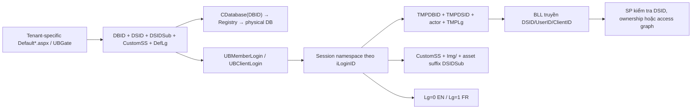

# Multi-tenancy & Localization — DBID, DSID, branding và EN/FR

> Hướng dẫn hiểu và thay đổi tenant context của VieFUND. Nội dung được đối chiếu trực tiếp với `CRegistry`, `CDatabase`, login/session WebApp và WebClient, BLL, Web Forms, asset cùng SQL snapshot trong `ScriptDB` ngày 2026-09-04. `VFCsvExport` không nằm trong phạm vi theo quyết định của user.

## 1. Kết luận nhanh

VieFUND không dùng một cơ chế multi-tenancy duy nhất. Boundary thực tế là tổ hợp của bốn lớp:

1. **`DBID` chọn physical database** qua Windows Registry.
2. **`DSID` mang ngữ cảnh dealership** trong database đã chọn, nhưng không được DAL tự động enforce.
3. **Quan hệ entity và access-list** giới hạn dữ liệu qua `iDealershipID`, Dealer/Branch/Rep/Client/Plan và quyền của user.
4. **`DSIDSub` trong source hiện có chủ yếu là hậu tố customization**, không có bằng chứng là khóa cô lập dữ liệu hoặc mapping trực tiếp tới `UB_DealerSubBranch`.



Điểm quan trọng nhất: **mở đúng DBID chưa đủ để bảo vệ tenant** nếu database chứa nhiều dealership. Cũng không được đánh đồng “có tham số `@DSID`” với “đã cách ly dữ liệu”; phải đọc mọi nhánh của stored procedure.

## 2. Bản đồ source

| Thành phần | Source chính | Vai trò đã xác minh |
|---|---|---|
| Registry resolver | `UBConnection/CRegistry.cs` | Map DBID sang connection string tại `HKLM\SOFTWARE\VieFund\Database` |
| DAL | `UBConnection/CDatabase.cs` | Mở SQL Server/ODBC theo DBID hoặc connection string; không giữ DSID |
| Session/context | `UBClasses/CBase.cs`, `UBStatic/CFunctions.cs` | Đọc/ghi tenant context, validate session và dựng custom path |
| WebApp login | `WebApp/Default*.aspx`, `WebApp/Default.aspx.cs`, `UBClasses/Member.cs` | Chọn tenant từ entry page, gọi `UBMemberLogin`, tạo session nội bộ |
| WebClient login | `WebClient/Default*.aspx`, `WebClient/Default.aspx.cs`, `UBClasses/Customer.cs` | Chọn tenant, gọi `UBClientLogin`, tạo session client |
| Gateway | `WebApp/Main/UBGate.aspx(.cs)` | Nhận DBID/DSID/DSIDSub/CustomSS qua query rồi đi qua login chung |
| Tenant master/access | `UB_Dealership`, `UB_DealerCode`, `UB_DealerBranch`, `UB_DealerSubBranch`, `UB_Member`, `UB_Customer`, `UB_Plan` | Ownership và hierarchy bên trong DB |
| Cấu hình | `UB_Settings`, `UB_CompSetting` và các bảng/provider setup | Cấu hình theo DSID, user hoặc toàn DB tùy contract |
| Branding | `WebApp/Css`, `WebClient/Css`, `WebApp/Img`, `WebClient/Img`, các include header | CSS title, logo/banner và style switcher |
| Localization mới | `VFStatic/Language.cs`, `CodeExpressionBuilder.cs`, `WebApp/App_GlobalResources` | Cookie `DefLg`, resource EN/FR và expression `MultiLg` |
| Localization legacy | Cặp `*.aspx`/`*_FR.aspx`, `PageLg`, `CMSG`, BLL và SQL `@Lg` | Markup, message và dữ liệu song ngữ |

Không dùng file `.bak`, `Backup/` hoặc output trong `obj/` làm bằng chứng cho luồng active.

## 3. Ba định danh không đồng nghĩa

| Giá trị | Ví dụ | Vai trò | Không nên hiểu là |
|---|---|---|---|
| `DBID` | `1001`, `IPG` | Khóa tra connection string/physical DB | DSID hoặc tên database SQL bắt buộc |
| `DSID` | `1001`, `1911`, `11911` | Dealership context; đôi khi gồm member-group prefix | Predicate tự động của DAL |
| `DSIDSub` | rỗng, ví dụ test `0001` | Hậu tố tùy chọn trong session/custom asset path | `UB_DealerSubBranch.ID` đã được chứng minh |

`DealerCode`, `iDealershipID`, branch ID, rep ID và member-group ID là các khóa khác. Không thay thế lẫn nhau dù một số deployment có thể vô tình dùng cùng con số.

## 4. DBID — chọn physical database

### 4.1. Registry contract

`CRegistry` đọc registry 64-bit tại:

```text
HKLM\SOFTWARE\VieFund\Database
```

- Value `DBID` ở root là default DBID.
- Subkey `<DBID>` chứa `DBConnectionStr`.
- Nếu chuỗi thường trống, code thử `DBConnectionStrEnc` và giải mã bằng key suy ra từ DBID.
- Constructor có `iOptions` thử `DBConnectionStr<N>` trước rồi fallback về chuỗi mặc định.
- `GetDBIDList()` trả default duy nhất nếu root DBID khác `0/00/000/0000`; nếu không, nó liệt kê các subkey.

DBID là chuỗi opaque: source login có cả số bốn chữ số và `IPG`. `CDatabase(DBID, false, timeout)` còn có convention legacy: nếu chuỗi dài hơn bốn ký tự, nó bỏ ký tự đầu rồi lấy bốn ký tự tiếp theo trước khi tra Registry. Không đưa DBID dài mới vào production nếu chưa kiểm thử convention này.

### 4.2. Hai chế độ constructor

```csharp
new CDatabase(DBIDStr, false, 0); // resolve DBID qua Registry
new CDatabase(connectionString, true, 0); // dùng chuỗi kết nối trực tiếp
```

DAL chỉ nhận giá trị trên. Nó không nhận `DSID`, user hay client, vì vậy không thể tự thêm tenant predicate.

## 5. DSID — dealership context và data scope

### 5.1. DSID đi vào hệ thống

Các trang login `Default*.aspx` chứa server-side hidden input cho `DBID`, `DSID`, `DSIDSub`, `hdCustomSS` và `DefLg`; phần lớn cùng dùng code-behind `Default.aspx.cs`. Snapshot hiện có 72 entry page WebApp và 4 entry page WebClient có DSID.

Luồng login nội bộ:

```text
Default*.aspx
  → WebApp/Default.aspx.cs
  → CMember.SessionLoginX(DBID, DSID, DSIDSub, Lg, CustomSS)
  → new CDatabase(DBID, false, 0)
  → UBMemberLogin(@DSID, login/password/...)
  → Session: TMPDBID, TMPDSID, TMPDSIDSub, TMPiMemberID, TMPLg, permission flags
```

WebClient tương tự qua `CCustomer.SessionLoginX`/`UBClientLogin` và dùng namespace `iLoginIDWC`, `TMPDBIDWC`, `TMPDSIDWC`, `TMPDSIDSubWC`, `TMPiClientIDWC`, `TMPLgWC`.

Sau login, page nghiệp vụ lấy context bằng `CBase.GetConnectionParam*`; không nên lấy DBID/DSID mới từ query string hoặc hidden field của request nghiệp vụ.

### 5.2. Bốn pattern scope trong database

Schema snapshot có 1.127 bảng nhưng chỉ năm bảng có cột tên chính xác `DSID`: `UB_Def_UserDef`, `UB_Plan`, `UB_Settings`, `UB_CompSetting`, `UB_CompSettingARC`. Điều này không có nghĩa các bảng còn lại là global.

| Pattern | Ví dụ | Cách scope |
|---|---|---|
| Cột DSID trực tiếp | `UB_Plan`, `UB_Settings`, `UB_CompSetting` | `WHERE DSID=@DSID` khi contract yêu cầu |
| Ownership trực tiếp | `UB_Member.iDealershipID`, `UB_Customer.iDealershipID`, `UB_DealerCode.iDealershipID` | Join entity về dealership |
| Ownership bắc cầu | account/position/trx → plan → client/rep/dealer | Validate entity ID qua chuỗi FK/business key |
| Access graph | `UB_MemberRepAccess`, branch/manager/assistant và `UBMemberAccessMemberList*` | Tạo tập member/rep/client user được xem |

Vì vậy một SP không có `@DSID` vẫn có thể an toàn nếu nó bắt đầu từ ID đã được ownership-check. Ngược lại, SP nhận `@DSID` nhưng không dùng trong query vẫn có thể sai scope.

### 5.3. DSID dạng ghép

Một số DSID lớn hơn 10.000 mã hóa member group ở phần đầu:

```text
memberGroup = DSID / 10000
baseDealer  = DSID % 10000
```

`GetMemberGroupIDFromDSID` thực hiện phép chia trên; `UBSettingList` khi nhận DSID ghép ưu tiên setting đúng DSID đầy đủ rồi fallback sang base dealer. Ví dụ source có `11911`, `11216`, `21216`.

Không normalize `% 10000` ở entry point theo thói quen:

- Có logic cần **DSID đầy đủ** để phân biệt member group/site.
- Có logic cần **base DSID** để lấy policy chung của dealer.
- Source đang normalize không đồng nhất theo từng function/SP.

Mỗi API phải ghi rõ nhận DSID đầy đủ hay base DSID. Khi sửa một nhánh, test cả hai giá trị nếu deployment dùng group prefix.

### 5.4. Default DSID là convention nguy hiểm

Nhiều SP có pattern:

```sql
IF (@DSID = 0)
    SELECT @DSID = ID FROM UB_Dealership WITH (NOLOCK);
```

Không có `TOP 1`/`ORDER BY` ở nhiều chỗ. Pattern này chỉ ổn định khi physical DB thực tế có đúng một dealership phù hợp. Với DB multi-dealer, caller phải truyền DSID rõ ràng và không dựa vào row “bất kỳ”.

## 6. DSIDSub — điều source thực sự chứng minh

`DSIDSub` được truyền từ login/gateway, lưu trong session, đọc lúc logout và dùng bởi `CFunctions.GetCustomPath`. Path được dựng như sau:

```text
<Type>/<DSID>/<Prefix>_<DSID>[_<DSIDSub>].<ext>
```

Ví dụ helper test tạo `Img/1001/SMLogo_1001_0001.gif`.

Trong source active đã quét:

- Không có `DSIDSub` trong SQL snapshot.
- Không có BLL nghiệp vụ dùng nó để filter record.
- Tất cả hidden `DSIDSub` trong các `Default*.aspx` hiện đều rỗng.
- Asset `SMLogo_1001_0001.gif` và CSS `UBStyle_1001_0001.css` cho thấy convention suffix từng/đang được chuẩn bị cho customization.

Do đó, **không mô tả `DSIDSub` là tenant security boundary**. `UB_DealerSubBranch` là entity database riêng, liên kết bằng `iDealershipID`; chưa thấy mapping từ session `DSIDSub` sang bảng này.

## 7. Session context

### 7.1. Namespace

Phần lớn key được lưu dưới dạng:

```text
<iLoginID>_<Key>
```

WebApp và WebClient dùng hai bộ key khác nhau. `CustomSS`/`CustomSSWC` và login ID gốc được lưu ở scope session chung để header/style switcher đọc.

| WebApp | WebClient | Nghĩa |
|---|---|---|
| `iLoginID` | `iLoginIDWC` | Namespace phiên login |
| `TMPDBID` | `TMPDBIDWC` | Physical DB key |
| `TMPDSID` | `TMPDSIDWC` | Dealership context |
| `TMPDSIDSub` | `TMPDSIDSubWC` | Custom sub-site suffix |
| `TMPiMemberID` | `TMPiClientIDWC` | Actor |
| `TMPLg` | `TMPLgWC` | `0=EN`, `1=FR` |

`CBase.GetConnectionParam`/`GetConnectionParam2` dành cho WebApp; các bản `WC` đọc bộ key WebClient. Nếu trộn hai họ method, code thường trả `false` hoặc lấy sai context.

### 7.2. Settings được nạp lúc login

WebApp gọi `CBase.Session_Load` sau khi set DBID/DSID/member ID. Method gọi `UBGetSettings` với key `SessionVariables1`, parse XML thành cặp `CtrlStr`/`ValStr`, rồi đẩy vào namespace session.

Đây là cấu hình user/session, không phải bằng chứng tenant isolation. SQL hiện có các điểm bỏ qua DSID được ghi ở mục finding.

## 8. Cấu hình theo tenant

Không có một “tenant config service” duy nhất. Các nhóm chính gồm:

| Phạm vi | Ví dụ | Cơ chế |
|---|---|---|
| Physical DB | connection, một số head-office setting | DBID/Registry hoặc bảng một-row trong DB |
| Dealer | `UB_Settings`, `UB_CompSetting`, dealership/provider setup | DSID trực tiếp hoặc bảng liên kết dealership |
| Member group/site | setting DSID đầy đủ > 10000 | exact match rồi có nơi fallback `%10000` |
| User | `UB_Settings.UserID` | preference/session XML theo user |
| Entity | DealerCode/Branch/Rep/Client/Plan | khóa sở hữu và access list |

Khi đọc setting, phải xác minh chính stored procedure được gọi:

- `UBSettingList` có behavior exact DSID → fallback base DSID cho giá trị ghép.
- `UBSettingValue` thường filter DSID/UserID, nhưng một số special key lại query không có DSID.
- `UBGetSettings`/`UBSaveSettings` hiện không enforce DSID đúng như signature gợi ý.
- Nhiều feature dùng UDF riêng (`GetPWPolicy`, `GetWebAppMode`, `IsETFEnable`, v.v.) và có thể normalize DSID theo rule khác.

## 9. Branding và CSS

### 9.1. Login page

Branding login chủ yếu là cấu hình tĩnh theo file:

- Mỗi `Default<tenant>.aspx` hard-code DBID, DSID, `CS_<id>`, CSS và logo/banner.
- Phần lớn page dùng chung `Default.aspx.cs` nhưng markup khác nhau.
- Snapshot có 76 file `UBStyle*.css` trong WebApp và 69 trong WebClient, gồm cả file base/legacy/variant.
- WebApp có 66 thư mục ảnh mang tên số; WebClient chỉ có thư mục `Img/1001`, trong khi các login page WebClient khác tham chiếu ảnh qua path tương ứng của chính ứng dụng/deployment.

`WebApp/Default.aspx` mới là ngoại lệ: nó dùng `UBStyleX_1001.css`, resource `MultiLg` và có thể nạp `TopLogo<DSID>`, `RightLogo<DSID>` cùng carousel `Img/<DSID>/LeftBanner/` nếu file tồn tại.

### 9.2. Sau login

Các include `PageHeader`, `PageHeaderFull`, `PopupHeader` và bản WebClient khai báo hàng chục stylesheet dạng `rel="alternate stylesheet"`. JavaScript đọc `CustomSS`/`CustomSSWC` rồi `setActiveStyleSheet(title)` để chỉ bật title phù hợp.

Đây là danh sách compile-time, không tự discovery file CSS. Khi thêm tenant/style mới phải đồng bộ:

1. File `UBStyle_<id>.css` ở cả application cần dùng.
2. `<link title="CS_<id>">` trong các header/list/popup liên quan.
3. `hdCustomSS` ở login/gateway.
4. Logo/banner đúng path và đúng hoa/thường của deployment.
5. Luồng đổi mật khẩu `CreateNewPW.aspx`, vì trang này cũng mang danh sách stylesheet riêng.

`GetCustomCssPath` tồn tại nhưng các caller page nghiệp vụ tìm thấy đều bị comment. Không coi helper này là cơ chế theme active chính. `GetCustomImagePath` cũng chỉ có caller login/helper test; đa số logo được hard-code hoặc lấy bằng logic riêng.

## 10. Localization EN/FR

`Lg` được dùng thống nhất về ý nghĩa số:

| Giá trị | Ngôn ngữ | Culture thường gặp |
|---:|---|---|
| `0` | English | `en-US` |
| `1` | French | `fr-CA` |

Nhưng implementation có bốn lớp song song.

### 10.1. Cặp Web Forms EN/FR

Pattern legacy phổ biến:

```text
YearEnd.aspx      → culture="en-US", PageLg=0
YearEnd_FR.aspx   → culture="fr-CA", PageLg=1
                   cùng Inherits/code-behind
```

`szFileName_ME`, menu JavaScript và các handler đổi trang qua lại giữa hai file. Inventory ngày 2026-09-04:

- `WebApp/Main`: 465 file `_FR.aspx`; 461 có base cùng tên.
- `WebClient/Main`: 22 file `_FR.aspx`; cả 22 có base cùng tên.

Bốn file `_FR.aspx` WebApp không có base cùng tên có thể là fragment/legacy naming; phải kiểm tra caller trước khi xóa hoặc tạo bản đối ứng.

### 10.2. Resource trên login mới

`WebApp/Default.aspx` dùng:

```aspx
<%$ MultiLg: VFStatic.Language.getString("key") %>
```

`CodeExpressionBuilder` đưa expression C# vào generated page. `Language.getString` đọc cookie `DefLg`, map `0→EN`, `1→FR`, rồi đọc `WebApp.App_GlobalResources.Language`.

Hiện chỉ tìm thấy một file active dùng expression `MultiLg`: `WebApp/Default.aspx`. Resource snapshot có 123 key EN và 124 key FR nhưng tập key không trùng hoàn toàn; xem finding ở mục 13.

### 10.3. Message và code-behind

`CMSG` trả message theo `Lg`; ngoài ra BLL/page có nhiều ternary/if hard-code EN/FR. Quét source active thấy hàng trăm nhánh kiểu `Lg == 1`, nên sửa wording thường phải tìm cả markup, C#, JavaScript và SQL.

### 10.4. Database

Lookup/master data thường có cặp `NameEN`/`NameFR` hoặc `DescriptionEN`/`DescriptionFR`. Snapshot schema có 315 bảng mang ít nhất một trong các cột song ngữ/common language đã quét. SQL dùng phổ biến:

```sql
CASE @Lg WHEN 1 THEN NameFR ELSE NameEN END
```

Notification/email còn có template EN/FR và đôi khi lấy ngôn ngữ từ `UB_Customer.Language`. Xem [Email & Notifications](email-notifications.md) để hiểu precedence cụ thể.

## 11. Checklist thêm một dealership/site

### 11.1. Tenant routing

- [ ] Xác định physical DB đã tồn tại hay cần DBID/Registry subkey mới.
- [ ] Xác định DSID đầy đủ, base DSID và member-group prefix nếu có.
- [ ] Tạo/kiểm tra `UB_Dealership` và ownership của DealerCode/Branch/Member/Customer.
- [ ] Chọn entry page; xác minh DBID–DSID–CustomSS là bộ hợp lệ.
- [ ] Test login nội bộ, client, đổi mật khẩu, 2FA, logout và gateway/SSO nếu dùng.
- [ ] Không dùng `DSIDSub` làm security filter nếu chưa bổ sung contract DB rõ ràng.

### 11.2. Data isolation

- [ ] Test user cùng tenant, khác tenant, admin, advisor, assistant và client.
- [ ] Với từng ID từ browser, join ngược về ownership thay vì chỉ tin DSID session.
- [ ] Kiểm tra đủ SELECT/UPDATE/DELETE, nhánh `iOptions` và dynamic SQL.
- [ ] Kiểm tra SP fallback `@DSID=0`, `GetDealershipID()` và `%10000`.
- [ ] Kiểm tra setting/provider/email/e-signature/onboarding theo DSID.
- [ ] Chạy cùng test trên database thực sự có nhiều `UB_Dealership` row.

### 11.3. Branding và ngôn ngữ

- [ ] Thêm CSS vào mọi header/popup/change-password surface cần dùng.
- [ ] Kiểm tra logo, report logo, mobile logo, banner, favicon và ảnh EN/FR.
- [ ] Test cả `Default<id>.aspx` và màn hình sau login.
- [ ] Với mọi screen sửa text, kiểm tra cặp `_FR`, `PageLg`, CMSG/resource và SQL `@Lg`.
- [ ] So sánh key EN/FR và test missing-resource behavior.
- [ ] Kiểm tra format ngày/số/tiền với `en-US` và `fr-CA`, không chỉ dịch label.

## 12. Checklist review/debug tenant

| Triệu chứng | Điểm kiểm tra đầu tiên |
|---|---|
| Mở nhầm dữ liệu/customer | DBID session, DSID session, actor ID, ownership join và access-list SP |
| Chỉ sai một dealer | DSID đầy đủ/base DSID, hard-code theo DSID, setting/provider config |
| Setting “nhảy” giữa dealer | SP có thật sự dùng DSID trong lookup/update không; key/user có trùng không |
| Login đúng nhưng theme sai | entry page `hdCustomSS`, alternate stylesheet title, asset path |
| Chỉ popup/change-password sai màu | danh sách `<link>` của include/trang đó chưa có style mới |
| Chỉ tiếng Pháp sai | đang ở `_FR.aspx` chưa, `PageLg=1`, `@Lg` đã truyền, key FR có tồn tại |
| WebClient thiếu session setting | kiểm tra method `Session_Load`/họ `GetConnectionParam*WC` |
| DSID >10000 hoạt động khác | function có `%10000` hay giữ DSID đầy đủ; group fallback có đúng không |

## 13. Phát hiện cần theo dõi

Các finding dưới đây được ghi từ source; chưa sửa application/SQL trong deliverable tài liệu này.

### 13.1. Cao — settings nhận DSID nhưng bỏ qua trong lookup/update

- `UBGetSettings` có predicate `DSID=@DSID` bị comment và thực tế chọn theo `UserID + KeyStr`.
- `UBSaveSettings` tìm row theo `UserID + KeyStr`, hoặc chỉ `KeyStr` khi `UserID=0`; không dùng DSID trước khi update.
- `UBSettingValue` có các special key đọc setting/dealership không filter DSID.
- `UBSettingList` còn chuyển toàn bộ row `DSID=0` sang DSID hiện tại ngay trong read path.

Nếu một physical DB chứa nhiều dealership có cùng key/user convention, cấu hình có thể bị đọc hoặc ghi chéo tenant. Cần lập test DB multi-dealer, sửa unique key/lookup contract và tách migration khỏi read path.

### 13.2. Cao, có điều kiện — login không bind trực tiếp account với DSID

`UBMemberLogin` và `UBClientLogin` tìm login/account trong physical DB mà không so `UB_Member.iDealershipID` hoặc `UB_Customer.iDealershipID` trực tiếp với input `@DSID`. DSID chủ yếu điều khiển policy/dealer metadata; WebClient chỉ enforce member group cho dealer có `IsEnforceMemberGroup=1` (hiện function trả true cho base dealer 1911).

Chưa đủ bằng chứng để kết luận có thể đọc chéo dữ liệu, vì downstream còn access graph và entity ownership. Tuy nhiên entry page/gateway có thể tạo session với cặp account–DSID không khớp; cần kiểm thử và bind server-side trước khi coi routing field là tin cậy.

### 13.3. Trung bình — WebClient gọi loader session của WebApp

`CCustomer.SessionLoginX` đã set bộ key `...WC` nhưng gọi `CBase.Session_Load`. Method này dùng `GetConnectionParam2`, đọc `iLoginID`, `TMPDBID`, `TMPDSID`, `TMPiMemberID`; không có overload `Session_LoadWC`. Trong WebClient session bình thường, call có khả năng return sớm và không nạp `SessionVariables1` như tên call gợi ý.

### 13.4. Trung bình — entry page WebClient 2393 đang trỏ tenant 2392

`WebClient/DefaultWC2393.aspx` hiện giống byte-for-byte `DefaultWC2392.aspx`: DBID, DSID, CSS title/path và logo đều là 2392. Trong workspace vẫn có `WebClient/Css/UBStyle_2393.css` và WebApp có asset/login 2393. Ngoài ra `WebClient/Img` không chứa thư mục 2392/2393/2394 dù ba entry page tương ứng tham chiếu các path này; cần kiểm tra asset của gói deploy. Xác nhận đây là alias có chủ đích hay copy/paste/deployment defect trước khi sửa.

### 13.5. Thấp — cookie ngôn ngữ server không nhận expiry 360 ngày

`VFStatic.Language` gọi `languagecookie.Expires.AddDays(360)` nhưng không gán giá trị trả về cho `Expires`. Vì `DateTime` immutable, cookie do server tạo có thể chỉ là session cookie thay vì persistent cookie 360 ngày. JavaScript legacy tạo cookie ba ngày ở nhiều login page, nên behavior còn phụ thuộc entry page.

### 13.6. Thấp — resource EN/FR bị lệch key

`Language.EN.resx` có 123 key, `Language.FR.resx` có 124 key. Hai tập key lệch nhau: EN-only `browser`, `msgTrxDateErr01`, `unit`; FR-only `browserDesc`, `msgMaxUnitExceeded`, `msgMinimumUnit`, `msgTrxDateBusErr`. Cần xác nhận key caller và đồng bộ để tránh fallback/null text.

### 13.7. Bảo trì — hard-code tenant phân tán

Ngoài CSS/login page, WebApp code-behind có hàng trăm nhánh so DSID trực tiếp; SQL cũng có nhiều rule đặc thù. Thêm dealer bằng cách copy page/CSS không đảm bảo đủ behavior. Nên lập tenant capability/config matrix trước khi gom dần hard-code về setting/UDF có contract và test.

## 14. Ranh giới xác minh

Đã xác minh bằng static source và SQL snapshot, chưa chạy IIS/database của một deployment cụ thể. Vì vậy tài liệu không khẳng định:

- registry key/connection string nào đang có trên production;
- một physical DB production thực tế chứa bao nhiêu dealership;
- alias `DefaultWC2393 → 2392` có chủ đích hay không;
- deployment có copy thêm asset ngoài repository hay không;
- bốn file `_FR.aspx` không có base cùng tên còn được gọi ở runtime hay chỉ là fragment/legacy.

## 15. Tài liệu liên quan

- [Database Access](database-access.md): constructor, Registry, parameter/result/error contract.
- [Auth](auth.md): login, session namespace, 2FA và permission.
- [UI Patterns](ui-patterns.md): page/panel/popup, include và navigation EN/FR.
- [Email & Notifications](email-notifications.md): template/language và các finding DSID ở notification/outbox.
- [Data Dictionary](../reference/data-dictionary.md): schema inventory và ownership graph.
- [Security](../topics/security/module-guide.md): checklist authorization, input và tenant boundary.
