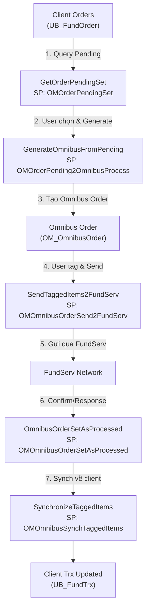

# Kiến trúc VFOmnibus

## 1. Cấu trúc Project

```
VFOmnibus/
├── Omnibus.sln           # Solution file (VS 2017+)
├── VFOmnibus.csproj      # .NET Framework 4.5, Output = Library
├── Omnibus.cs            # 2577 lines — class COmnibus (partial)
│                         #   Order lifecycle, Dividend, REV, FundServ integration
├── AccountCompare.cs     # 402 lines — class COmnibusCompareList
│                         #   Đối soát unit omnibus vs client (multi-threaded)
├── Conversion.cs         # 407 lines — class CPortfolioConversion
│                         #   Fund-to-fund conversion
├── Switch.cs             # 207 lines — class CPortfolioSwitch
│                         #   Đổi model portfolio
├── OMReport.cs           # 1210 lines — class COMReport
│                         #   Báo cáo weekly/monthly
├── Transfer.cs           # 354 lines — class CPortfolioTransfer
│                         #   Chuyển tiền giữa plans
└── Properties/
    └── AssemblyInfo.cs
```

**Tổng cộng**: ~5,157 dòng C# code.

## 2. Luồng xử lý chính (Order Lifecycle)



### Giải thích từng bước

| Step | Method | Stored Procedure | Mô tả |
|------|--------|-----------------|-------|
| 1 | `GetOrderPendingSet` | `OMOrderPendingSet` | Load danh sách lệnh client pending, lọc theo dealer/rep/fund/status |
| 2 | `GenerateOmnibusFromPending` | `OMOrderPending2OmnibusProcess` | Gộp nhiều lệnh client cùng fund → 1 omnibus order |
| 3 | `GetOmnibusOrderPendingSet` | `OMOmnibusOrderPendingSet` | Xem danh sách omnibus orders đã gộp |
| 4 | `SendTaggedItems2FundServ` | `OMOmnibusOrderSend2FundServ` | Đánh dấu các lệnh được chọn và gửi qua FundServ |
| 5 | — | — | FundServ network xử lý (external) |
| 6 | `OmnibusOrderSetAsProcessed` | `OMOmnibusOrderSetAsProcessed` | Cập nhật status sau khi nhận confirm từ FundServ |
| 7 | `SynchronizeTaggedItems` | `OMOmnibusSynchTaggedItems` | Phân bổ kết quả omnibus về từng client transaction |

## 3. Database Pattern — "RecType" DataSet

**Pattern quan trọng nhất** trong toàn bộ module: mọi method trả về `DataSet` đều có cùng pattern đặt tên table dựa trên cột `RecType`:

```csharp
// Pattern lặp lại ở MỌI method
int tbCount = Result.Tables.Count;
for (int i = 0; i < tbCount; i++)
{
    DataTable tb = Result.Tables[i];
    if (tb.Rows.Count > 0)
        tb.TableName = tb.Rows[0]["RecType"].ToString();
}
```

**Ý nghĩa**: Mỗi result set từ SP chứa một cột `RecType` ở row đầu tiên, giá trị này trở thành tên của `DataTable`. UI code truy cập bằng tên:

```csharp
// Ví dụ ở OmnibusView.aspx.cs
if (ds.Tables.Contains("OrderList"))    tbData = ds.Tables["OrderList"];
if (ds.Tables.Contains("Summary"))      drSummary = ds.Tables["Summary"].Rows[0];
if (ds.Tables.Contains("SelectList"))   tbCheck = ds.Tables["SelectList"];
```

### Các RecType phổ biến

| RecType | Mô tả |
|---------|-------|
| `OrderList` | Danh sách lệnh |
| `Summary` | TotalCount, NumPage, iPage, TotalStr |
| `SelectList` | Danh sách các item đã được chọn (checkbox state) |
| `DetailList` | Chi tiết từng client trong omnibus order |
| `HeaderS`, `HeaderD` | Header cho summary/detail (dùng cho Excel export) |
| `PosList` | Danh sách fund account positions |
| `Header`, `List` | Header và data cho Account Compare |

## 4. Database Access Pattern

Mọi method đều dùng cùng pattern:

```csharp
public static DataSet MethodName(string DBIDStr, string DSIDStr, int iUserID, ...)
{
    CDatabase db = null;
    DataSet Result = new DataSet();
    Result.Tables.Clear();
    db = new CDatabase(DBIDStr, false, 0);
    try
    {
        if (db.Open() == 0)
        {
            db.ClearParameters();
            db.SetSP("SPName");
            db.AddParam("iUserID", iUserID);
            // ... thêm params
            db.FillDataSet(Result);  // hoặc db.ExecuteSQL() cho write operations
        }
    }
    catch (Exception ex)
    {
        errorMessage = ex.Message;
        errorCode = 1;
    }
    finally
    {
        if (db != null) db.Close();
    }
    db = null;
    // RecType naming pattern...
    return Result;
}
```

### Hai loại operation:

| Loại | Method | Return |
|------|--------|--------|
| **Read** (query) | `db.FillDataSet(Result)` | `DataSet` — nhiều tables |
| **Write** (execute) | `db.ExecuteSQL(0, ref errorMessage)` → `db.Read()` → `db.GetInt32("iRet", 0)` | `int` — 0=success, >0=error |

## 5. Xử lý Đặc biệt

### 5.1. Account Compare — Multi-threaded

`COmnibusCompareList` là class **duy nhất không static** trong project, sử dụng `System.Threading.Thread` để chạy background:

```csharp
public void StartProcess()
{
    m_Thread = new Thread(new ThreadStart(GenerateReport));
    m_Thread.Priority = ThreadPriority.Highest;
    m_Thread.Start();
}

public void GenerateReport()
{
    // Step 1: Init (SP: OMAccountCompareStep1)
    iRet = OmnibusCompareListStep(0, ...);
    
    // Step 2: Loop cho đến khi hoàn tất (SP: OMAccountCompareStep2)
    while (iDoneCount < iTotal && !bDone)
    {
        iRet = OmnibusCompareListStep(1, ...);
        // Progress callback: m_InfoCallback("45%");
    }
    
    // Step 3: Lấy kết quả (SP: OMAccountCompareStep3)
    // Gọi riêng từ OmnibusCompareListSet()
}
```

**Callbacks**:
- `FinishCallback(int iStatus)` — hoàn tất
- `ErrorCallback(Exception ex)` — lỗi
- `InfoCallback(string Str)` — progress (dạng "45%")

### 5.2. Dividend Processing

Phức tạp nhất trong module, hỗ trợ 2 phương pháp:

```csharp
// Method 1: Theo DividendRate (fDividendRate)
// Method 2: Theo khoảng thời gian (DateFrom, DateTo, iTrxTypeOpt)
if (iMethod == 2)
{
    db.AddParam("DateFrom", DateFrom);
    db.AddParam("DateTo", DateTo);
    db.AddParam("iTrxTypeOpt", iTrxTypeOpt);
}
```

**Luồng Dividend**:
1. `OMDividendTrxProcess` — Tính toán phân bổ cổ tức
2. `OMDividendTrxProcessUndo` — Hoàn tác nếu sai
3. `OMDividendTrxProcessSynch` — Đồng bộ về client transactions
4. `OMDividendTrxInfo` / `OMDividendTrxInfoX` — Xem thông tin chi tiết

### 5.3. Reversal (REV)

Hỗ trợ nhiều loại reversal:

```
1. OmnibusREVAddFromTrxList    → Thêm reversal pending từ danh sách trx
2. OmnibusREVProcessPendingFromTrxList → Xử lý reversal pending
3. REVTrxProcessOneItem        → Process từng item
4. REVTrxProcessAll             → Process tất cả trong một header
5. REVTrxStatusUpdate           → Cập nhật status (TradeDate, Price, Units, Amount)
6. REVTrxStatusUpdateA          → Cập nhật adjusted values
7. OmnibusREVSynch              → Đồng bộ reversal action về DB
```

### 5.4. Selection Pattern (Tag/Untag)

Nhiều chức năng dùng pattern "tag items → process tagged":

```csharp
// 1. User chọn/bỏ chọn items trên UI
OrderPendingSelectionUpdate()          // SP: UBOrderSelectionUpdateOmnibus
OmnibusOrderPendingSelectionUpdate()   // SP: OMOrderSelectionUpdate
OmnibusOrderHistorySelectionUpdate()   // SP: OMOmnibusTrxSelectionUpdate
OmnibusTrxRevolvingSelectionUpdate()   // SP: OMOmnibusTrxRevolvingSelectionUpdate

// 2. Process tất cả items đã tag
ProcessTaggedItems()                   // SP: OMOmnibusProcessTaggedItems
SynchronizeTaggedItems()               // SP: OMOmnibusSynchTaggedItems
```

### 5.5. Excel Export

Pattern export to Excel qua `CBase.TableToExcel()`:

```csharp
// Lấy data
DataSet ds = GetSomeDataSet(..., iOptions: 3);  // iOptions=3 → export mode
DataTable tbHeader = ds.Tables["Header"];
DataTable tbData = ds.Tables["DetailList"];

// Convert → CSV string
string ContentStr = CBase.TableToExcel(tbData, tbHeader, ",", true);

// Gửi response
CBase.TextToExcel(page, "", ContentStr, "filename.csv");
```

> **Lưu ý**: `iOptions = 3` thường được dùng cho export mode (không phân trang, lấy toàn bộ data).

## 6. Stored Procedure Mapping

### COmnibus (Omnibus.cs)

| Method | Stored Procedure | Loại |
|--------|-----------------|------|
| `GetOrderPendingSet` | `OMOrderPendingSet` | Read |
| `GetOmnibusOrderPendingSet` | `OMOmnibusOrderPendingSet` | Read |
| `GetOmnibusOrderSet` | `OMOmnibusOrderSet` | Read |
| `GetOmnibusDividendSet` | `OMOmnibusDividendSet` | Read |
| `OmnibusOrderSetAsProcessed` | `OMOmnibusOrderSetAsProcessed` | Write |
| `DetachOmnibusOrderPendingDetail` | `OMOmnibusOrderPendingDetach` | Write |
| `RemoveOmnibusOrderPending` | `OMOmnibusOrderRemove` | Write |
| `GetOmnibusOrderDetailSet` | `OMOmnibusOrderDetailSet` | Read |
| `GetOmnibusTrxDetailSet` | `OMOmnibusTrxDetailSet` | Read |
| `GetOmnibusFundPosList` | `OMFundAccountPositionList` | Read |
| `OrderPendingSelectionUpdate` | `UBOrderSelectionUpdateOmnibus` | Read |
| `OmnibusOrderPendingSelectionUpdate` | `OMOrderSelectionUpdate` | Read |
| `OmnibusOrderHistorySelectionUpdate` | `OMOmnibusTrxSelectionUpdate` | Read |
| `OmnibusTrxRevolvingSelectionUpdate` | `OMOmnibusTrxRevolvingSelectionUpdate` | Read |
| `GenerateOmnibusFromPending` | `OMOrderPending2OmnibusProcess` | Write |
| `OmnibusOrderAdd` | `OMOmnibusOrderAdd` | Write |
| `SendTaggedItems2FundServ` | `OMOmnibusOrderSend2FundServ` | Write |
| `ProcessTaggedItems` | `OMOmnibusProcessTaggedItems` | Write |
| `SynchronizeSelectedItem` | `OMOmnibusSynchSelectedItem` | Write |
| `SynchronizeTaggedItems` | `OMOmnibusSynchTaggedItems` | Write |
| `SynchronizeDividendTaggedItems` | `OMDividendTrxSynchTagged` | Write |
| `OMDividendTrxProcess` | `OMDividendTrxProcess` | Write |
| `OMDividendTrxProcessUndo` | `OMDividendTrxProcessUndo` | Write |
| `OMDividendTrxProcessSynch` | `OMDividendTrxProcessSynch` | Write |
| `OmnibusDividendTrxInfo` | `OMDividendTrxInfo` | Read |
| `OmnibusDividendTrxInfoX` | `OMDividendTrxInfo` | Read |
| `ClientTrxListByPlanIDTradeDate` | `OMTrxListByPlanIDTradeDateSet` | Read |
| `OmnibusREVClientPendingCount` | `OmnibusREVClientPendingCount` | Write |
| `OmnibusREVClientPendingList` | `OmnibusREVClientPendingList` | Read |
| `OmnibusREVAddFromTrxList` | `OmnibusREVAddFromTrxList` | Write |
| `GetOmnibusREVFromTrxList` | `OmnibusREVPendingOmniFromTrxList` | Read |
| `OmnibusREVProcessPendingFromTrxList` | `OmnibusREVProcessPendingOmniFromTrxList` | Write |
| `OmnibusREVHeaderRemove` | `OMOmnibusREVRemove` | Write |
| `GetOmnibusREVActionList` | `OMOmnibusREVSet` | Read |
| `GetOmnibusREVActionDetailList` | `OMOmnibusREVDetailSet` | Read |
| `GetOmnibusREVActionDetailListAdjusted` | `OMOmnibusREVDetailSetAdjusted` | Read |
| `GetOmnibusREVActionDetailSet` | `OMOmnibusREVDetailInfo` | Read |
| `REVTrxProcessOneItem` | `OMREVTrxProcessOneItem` | Write |
| `REVTrxProcessAll` | `OMREVTrxProcess` | Write |
| `REVTrxStatusUpdate` | `OMREVTrxStatusUpdate` | Write |
| `REVTrxStatusUpdateA` | `OMREVTrxAdjustedUpdate` | Write |
| `OmnibusREVEditTrxUpdate` | `OmnibusREVOmnibusTrxUpdate` | Write |
| `OmnibusREVSynch` | `OmnibusREVActionSynch` | Write |
| `CashTrxStatusUpdate` | `OMCashTrxStatusUpdate` | Write |
| `OmnibusTrxMergeLOI` | `OMOmnibusMergeTrxOneDay` | Read |
| `NonPortfolioFundAccountList` | `OMReportNonPortfolioFundAccountList` | Read |
| `NonPortfolioFundAccountSelectionUpdate` | `OMNonPortfolioFundAccountSelectionUpdate` | Read |
| `NonPortfolioFundAccountSell` | `OMReportNonPortfolioFundAccountSell` | Read |
| `OmnibusOrderMerge` | `OMOmnibusMergeTrxOneDay` | Write |

### COmnibusCompareList (AccountCompare.cs)

| Method | Stored Procedure | Loại |
|--------|-----------------|------|
| `OmnibusCompareListStep` (step=0) | `OMAccountCompareStep1` | Write |
| `OmnibusCompareListStep` (step=1) | `OMAccountCompareStep2` | Write |
| `OmnibusCompareListSet` | `OMAccountCompareStep3` | Read |
| `OmnibusCompareClientListSet` | `OMAccountCompareClientList` | Read |

### CPortfolioConversion (Conversion.cs)

| Method | Stored Procedure | Loại |
|--------|-----------------|------|
| `GetTrxFromSet` | `OMConversionTrxFromSet` | Read |
| `GetTrxToSet` | `OMConversionTrxToSet` | Read |
| `GetSummaryPendingSet` | `OMConversionAddRefresh` | Read |
| `ConversionHeaderSet` | `OMConversionHeaderSet` | Read |
| `ConversionDetailSet` | `OMConversionDetailSet` | Read |
| `ProcessItem` | `OMConversionProcess` | Write |
| `SynchItem` | `OMConversionSynch` | Write |
| `RemoveItem` | `OMConversionRemove` | Write |

### CPortfolioSwitch (Switch.cs)

| Method | Stored Procedure | Loại |
|--------|-----------------|------|
| `SwitchTMPSet` | `OMPlanSwitchPortfolio` | Read |
| `GetClientSwitchSet` | `OMSwitchList1Client` | Read |
| `Remove` | `OMSwitchRemove` | Write |
| `SwitchScanSelected` | `OMSwitchRescan` | Write |

### CPortfolioTransfer (Transfer.cs)

| Method | Stored Procedure | Loại |
|--------|-----------------|------|
| `Add` | `OMTransferAdd` | Write |
| `Remove` | `OMTransferRemove` | Write |
| `CreateOrder` | `OMTransferProcess` | Write |
| `ScanOutStanding` | `OMTransferScanOutStanding` | Write |
| `GetTransferSet` | `OMTransferList` | Read |
| `GetTransferDetailSet` | `OMTransferDetailList` | Read |
| `GetClientTransferSet` | `OMTransferList1Client` | Read |

### COMReport (OMReport.cs)

| Method | Stored Procedure | Loại |
|--------|-----------------|------|
| `WeeklyList` | `OMWeekDatesList` | Read |
| `MonthlyList` | `OMMonthList` | Read |
| `WeeklyCalculate` | `OMReportWeeklyCalc` | Write |
| `WeeklyViewHeaderSet_TBD` | `OMReportWeeklyHeaderList` | Read |
| `ReportViewHeaderSet` | `OMReportHeaderList` | Read |
| `WeeklyViewDetailByAdvisorSet` | `OMReportWeeklyDetailByAdvisorList` | Read |
| `WeeklyViewDetailByBranchSet` | `OMReportWeeklyDetailByBranchList` | Read |
| `WeeklyViewDetailByPortfolioSet` | `OMReportWeeklyDetailByPortfolioList` | Read |
| `WeeklyViewDetailByPortfolioRepSet` | `OMReportWeeklyDetailByPortfolioRepList` | Read |
| `WeeklyViewDetailByFundSet` | `OMReportWeeklyDetailByFundList` | Read |
| `WeeklySummarySet` | `OMReportWeeklyHeaderSummary` | Read |
| `MonthlyViewDetailSet` | `OMReportMonthlyDAVDetailList` | Read |
| `MonthlyDAVCalculate` | `OMReportDAVPortfolioCalc` | Write |
| `ReportMonthlyShareholderSet` | `OMReportShareholderMonthly` | Read |
| `MonthlyShareHolderRecalc` | `OMReportShareholderMonthlyRecalc` | Write |
| `OmnibusAccountRecalc` | `OMOmnibusShareBalanceRecalc` | Write |
| `ReportAdvisorSaleSet` | `OMReportSaleByAdvisor` | Read |
| `ReportAssetByProvSet` | `OMReportAssetByProvince` | Read |
